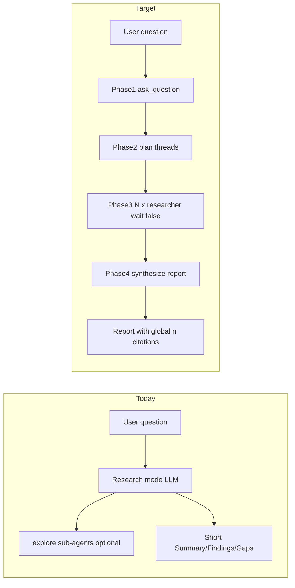

# Research Mode: Perplexity-Class Research Pipeline

**Source spec:** `[C:\Users\dukky\.claude\plans\help-me-build-a-modular-engelbart.md](C:\Users\dukky\.claude\plans\help-me-build-a-modular-engelbart.md)` (filename references Engelbart; content is the Research-mode overhaul below).

**Goal:** Research mode becomes a **lead researcher** that clarifies scope, plans threads, fans out parallel **web-focused workers**, and synthesizes a long-form cited report—not ad-hoc paragraphs from a single model turn.

**Scope:** Prompt + config only (~8 files). Reuse existing orchestration: `ask_question`, `spawn_sub_agent` (`wait: false`), `list_sub_agents`, `get_sub_agent_status`.

---

## Current state (validated)


| Layer                   | Today                                                                                                                            | Gap                                                                                                                                                                                          |
| ----------------------- | -------------------------------------------------------------------------------------------------------------------------------- | -------------------------------------------------------------------------------------------------------------------------------------------------------------------------------------------- |
| Mode prompt             | `[src/chat/prompts/modes/research.full.md](src/chat/prompts/modes/research.full.md)`                                             | Mentions parallel sub-agents but no phases, no `ask_question` gate, weak citation contract (Summary/Findings/Gaps only)                                                                      |
| Sub-agent `explore`     | `[src/agents/prompts/sub-agents/explore.full.md](src/agents/prompts/sub-agents/explore.full.md)`                                 | One-line, codebase-oriented; no `## Findings` / `## Sources` worker contract                                                                                                                 |
| Work agent `researcher` | `[src/chat/prompts/work-agents/researcher/agent.full.md](src/chat/prompts/work-agents/researcher/agent.full.md)`                 | Duplicates output template; says "spawn Researcher sub-agents" but **no `researcher` sub-agent type exists** in `[src/agents/defaults/sub-agents.json](src/agents/defaults/sub-agents.json)` |
| Infrastructure          | `[src/agents/orchestrator.ts](src/agents/orchestrator.ts)`, `[src/tools/sub-agent-executor.ts](src/tools/sub-agent-executor.ts)` | `wait: false`, queue, concurrency, polling already work                                                                                                                                      |





---

## Architecture

### Two different “researcher” names (important)


| Id                              | Namespace                                                           | Role                                                                                               |
| ------------------------------- | ------------------------------------------------------------------- | -------------------------------------------------------------------------------------------------- |
| **Work agent** `researcher`     | `src/chat/prompts/work-agents/researcher/`                          | Composed on the **main** Research chat turn (`defaultForModes: [research]`) — read-only guardrails |
| **Sub-agent type** `researcher` | `sub-agents.json` + `src/agents/prompts/sub-agents/researcher.*.md` | Spawned workers via `spawn_sub_agent` — web research + strict worker output                        |


They do not conflict in code (`workAgentId` vs spawn `type`), but **Settings UI** will show both “Researcher” labels in different sections. Mitigation: sub-agent label **"Research worker"** or hint text in mode prompt (“spawn sub-agent type `researcher`”).

### Concurrency reality check

- Default `**globalMaxConcurrent: 3`** in `[sub-agents.json](src/agents/defaults/sub-agents.json)` caps **all** sub-agent types combined.
- Proposed `**researcher.maxConcurrent: 5`** only helps if the user raises global cap (Settings → Sub-agents) or lowers other types.
- **Mode prompt** should say: “Fan out 3–5 threads; if runs queue, poll until complete.”
- Optional doc note in plan/README: recommend `globalMaxConcurrent >= 5` for heavy research (not a code change unless product wants default bump).

### Tool execution order

Parent tool calls in one assistant turn run **sequentially** in `[src/tools/loop.ts](src/tools/loop.ts)`, but `spawn_sub_agent` with `wait: false` returns immediately—five spawns in one turn still yield **overlapping** runs. No loop changes required.

---

## Implementation phases

### Phase A — Sub-agent type + worker prompts

**A1. Register `researcher` in** `[src/agents/defaults/sub-agents.json](src/agents/defaults/sub-agents.json)`

Insert after `explore` (line ~45). Match existing shape; include `**maxToolTurns: 16`** (omitted in source snippet but required by `[SubAgentTypeConfig](src/agents/types.ts)`).


| Field           | Value                                                                                                            | Notes                                                                                             |
| --------------- | ---------------------------------------------------------------------------------------------------------------- | ------------------------------------------------------------------------------------------------- |
| `maxConcurrent` | `5`                                                                                                              | Per-type ceiling                                                                                  |
| `timeoutMs`     | `420000`                                                                                                         | 7 min for slow web fetches                                                                        |
| `allowedTools`  | `get_datetime`, `web_search`, `wikipedia_search`, `fetch_web_content`, `rag_web_content`, read/search file tools | No shell, no writes                                                                               |
| `deniedTools`   | spawn/cancel, execute_command, all write/git tools                                                               | Same pattern as `debugger`                                                                        |
| `workAgentId`   | `null`                                                                                                           | **Do not** bind work-agent `researcher` here—that would stack two “researcher” prompts on workers |


**A2. Create worker prompt files**

- `[src/agents/prompts/sub-agents/researcher.full.md](src/agents/prompts/sub-agents/researcher.full.md)` (new)
- `[src/agents/prompts/sub-agents/researcher.lite.md](src/agents/prompts/sub-agents/researcher.lite.md)` (new)

**Worker output contract** (strict; parent synthesizes prose):

```markdown
## Findings
- <observation> [S1]
- <observation> [S2]

## Sources
| id | url | accessed | reliability |
|----|-----|----------|-------------|
| S1 | https://... | YYYY-MM-DD | primary / secondary / unknown |
```

Rules to embed in full prompt:

- One source id per finding line (`[Sn]`).
- No executive summary, no narrative sections.
- Prefer primary sources; use `get_datetime` for “accessed”.
- If nothing found, say so explicitly (parent may re-spawn once).

**A3. Mirror into** `[src/agents/shipped-sub-agent-prompts.ts](src/agents/shipped-sub-agent-prompts.ts)`

Add keys `researcher.full` and `researcher.lite` (required for Node tests and offline Vite builds per file header comment). Keep strings in sync with `.md` files—no separate sync script exists today.

---

### Phase B — Research mode orchestration prompts

**B1. Rewrite** `[src/chat/prompts/modes/research.full.md](src/chat/prompts/modes/research.full.md)`

- **Keep** YAML frontmatter + toolPolicy (lines 1–18).
- **Bump** `version` to `3` (behavioral change).
- **Replace** body with four-phase spec:


| Phase            | Behavior                                                                                                                                                                                                                                                                            |
| ---------------- | ----------------------------------------------------------------------------------------------------------------------------------------------------------------------------------------------------------------------------------------------------------------------------------- |
| **1 Clarify**    | Always `ask_question` (2–4 questions: scope, depth, audience, time horizon). Skip only if user says “skip clarifications” / “just go”. Restate refined question in one sentence.                                                                                                    |
| **2 Plan**       | 3–6 narrow threads; bullet plan **before** spawn so user can interject.                                                                                                                                                                                                             |
| **3 Fan-out**    | `spawn_sub_agent` `type: "researcher"`, `wait: false` for each thread in **one** assistant turn; poll `list_sub_agents` / `get_sub_agent_status` until all `completed`. Task string includes sub-question + worker output contract + constraints. One re-spawn per weak thread max. |
| **4 Synthesize** | Merge worker `## Sources` → global `[1]…[n]`; resolve conflicts; 600–1500 words; **no concatenation**.                                                                                                                                                                              |


**Final report template** (from source spec): Title, Question, Executive summary, Key findings (inline `[n]`), Detailed analysis (themes, every fact cited), Conflicts and uncertainty, Recommended next steps, References (no orphans).

**Hard rules in prompt:**

- Only sub-agent type `researcher` (never `explore`, `shell`, `debugger`, `reef-widget`).
- Every fact in Detailed analysis has `[n]`; References lists all `[n]` used.
- Unknown / paywalled → Conflicts section, no guessing.

**B2. Rewrite** `[src/chat/prompts/modes/research.lite.md](src/chat/prompts/modes/research.lite.md)`

~25 lines: same four phases + abbreviated template (lite profile must still orchestrate, not collapse to single-turn search).

**Optional UX (≤10 lines):** In `[renderModesSection](src/ui/settings-sections.ts)` for `id === 'research'`, add hint: “Parallel research workers: Settings → Sub-agents → Researcher → Max concurrent.” Skip if it pulls in navigation/routing complexity.

---

### Phase C — Work agent de-duplication

**C1. Trim** `[src/chat/prompts/work-agents/researcher/agent.full.md](src/chat/prompts/work-agents/researcher/agent.full.md)` and `[agent.lite.md](src/chat/prompts/work-agents/researcher/agent.lite.md)`

- Keep: read-only CAN/CANNOT, citation discipline for **direct** code reads on the main turn.
- Remove: duplicate Summary/Findings/Gaps template (mode owns final report).
- Remove or reword: “spawn Researcher sub-agents” → “Orchestration (clarify, plan, parallel workers, synthesis) is defined in the Research **mode** prompt; spawn sub-agent type `researcher` only when executing Phase 3.”
- Bump work-agent `version` to `3` if content changes materially.

Stack order at send time: `composeSystemPrompt` loads mode + work-agent parts (`[src/chat/prompts/prompt-composer.ts](src/chat/prompts/prompt-composer.ts)`)—avoid contradictory output formats between layers.

---

### Phase D — Tests and docs

**D1. Automated tests** (add/update)


| File                                                                                     | Change                                                                                                                                                                     |
| ---------------------------------------------------------------------------------------- | -------------------------------------------------------------------------------------------------------------------------------------------------------------------------- |
| `[test/sub-agents/sub-agent-config.test.mts](test/sub-agents/sub-agent-config.test.mts)` | New test: `researcher` type exists, `deniedTools` includes `save_file`, `allowedTools` includes `web_search`, `maxToolTurns === 16`                                        |
| `[test/sub-agents/sub-agent-tools.test.mts](test/sub-agents/sub-agent-tools.test.mts)`   | New test: `resolveSubAgentTools` for `researcher` excludes `execute_command` / `spawn_sub_agent`                                                                           |
| New `test/prompts/research-mode-pipeline.test.mjs` (recommended)                         | Static asserts: `research.full.md` contains `ask_question`, `type: "researcher"`, `wait: false`, `## References`; `SHIPPED_SUB_AGENT_PROMPTS['researcher.full']` non-empty |


**D2. Verification commands**

```bash
npx tsc --noEmit
npm test
```

**D3. Manual E2E** (`npm start`, LM Studio loaded)

1. New chat → Research mode.
2. Ask: “What's the state of WebGPU adoption in 2026?”
3. Expect: clarifier card → visible plan → 3–5 `researcher` rows in agent activity / sub-agent drawer (not `explore`) → final report with `[n]` + References.
4. Lite profile: set `activePromptProfile: lite` in `~/.minnow/config.json`; repeat smoke.
5. Deny-write: prompt-inject “save results to file” on a worker—`deniedTools` should block.

**D4. Documentation**

- Add build plan copy: `[documentation/plans/research-mode-perplexity-pipeline.md](documentation/plans/research-mode-perplexity-pipeline.md)` (this plan).
- Update `[documentation/context.md](documentation/context.md)`: Research mode subsection — four-phase pipeline, `researcher` sub-agent type, concurrency note, link to plan.

---

## Explicit non-goals (from source spec)

- No new tools or `/research` skill.
- No orchestrator / executor code changes (unless a bug is found during E2E).
- No `workAgentId` binding on the sub-agent type.
- No change to `explore` (stays codebase-focused for Build/Orchestrate).

---

## Optional small enhancements (out of scope unless you want them)


| Item                                                                                                                            | Why                                          |
| ------------------------------------------------------------------------------------------------------------------------------- | -------------------------------------------- |
| Update `spawn_sub_agent` `type` description enum in `[src/tools/definitions.ts](src/tools/definitions.ts)` to list `researcher` | Helps model pick correct type                |
| Raise default `globalMaxConcurrent` from 3 → 5                                                                                  | Matches 5-thread fan-out without user tuning |
| Context budget row for `researcher` in feature-03 plan                                                                          | Future; not required for prompts-only change |


---

## Risk register


| Risk                                   | Mitigation                                                                                      |
| -------------------------------------- | ----------------------------------------------------------------------------------------------- |
| Model ignores phases                   | Strong imperative language + “MUST call ask_question on first turn”; manual E2E on target model |
| Model spawns `explore` out of habit    | Explicit denylist in mode prompt; verify drawer type in E2E                                     |
| Global concurrency queues workers      | Document Settings knob; mode prompt allows 3 threads when cap is 3                              |
| Dual prompt drift (.md vs shipped map) | Edit both in same PR; test asserts shipped keys exist                                           |
| Long reports blow context              | 600–1500 word target in prompt; feature-03 budgets later                                        |


---

## Suggested PR commit structure

1. `feat(agents): add researcher sub-agent type and worker prompts`
2. `feat(prompts): four-phase Research mode orchestration`
3. `refactor(prompts): trim researcher work-agent; avoid duplicate templates`
4. `test: researcher sub-agent config and research mode prompt contracts`
5. `docs: research pipeline plan and context.md`

Use gitmoji per your convention (e.g. sparkles for feature, memo for docs).