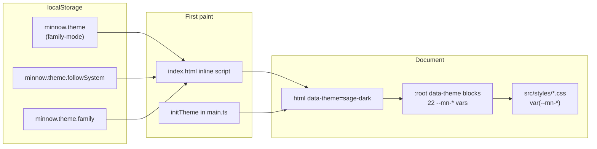

# Token-based 8-theme system

## Current state (differs from spec)


| Spec assumption                                                       | Actual repo                                                                                          |
| --------------------------------------------------------------------- | ---------------------------------------------------------------------------------------------------- |
| `[src/style.css](src/style.css)`                                      | Modular `[src/styles/*.css](src/styles/)` imported from `[src/main.ts](src/main.ts)`                 |
| `[src/app.ts](src/app.ts)` + `[src/components/*.ts](src/components/)` | `[src/main.ts](src/main.ts)` + `[src/ui/*.ts](src/ui/)` — **no hex colors in `.ts` today**           |
| New `src/theme.ts`                                                    | Existing `[src/ui/theme.ts](src/ui/theme.ts)` + `[src/ui/theme-resolve.ts](src/ui/theme-resolve.ts)` |
| `data-theme="light|dark"`                                             | Same attribute; `[src/styles/tokens.css](src/styles/tokens.css)` holds OKLCH + `[data-theme="dark"]` |
| `minnow.theme` = `light|dark|system`                                  | `[THEME_STORAGE_KEY](src/constants.ts)` already `minnow.theme`                                       |


Reef widgets, sub-agent prompts, and convention tests already require `var(--*)` tokens (`[src/agents/prompts/sub-agents/reef-widget.full.md](src/agents/prompts/sub-agents/reef-widget.full.md)`, `[test/chat/reef/widget-*-conventions.test.mjs](test/chat/reef/)`). The tired “electric green” is mainly `[--user-bg](src/styles/tokens.css)` (high-chroma OKLCH), not literal `#00ff00`.

**Your choices:** full `--mn-`* rename everywhere; `minnow.theme` + `minnow.theme.followSystem` + `minnow.theme.family` for system follow.




---

## Phase 1 — Core theme module and CSS palettes

### 1.1 Create `[src/theme.ts](src/theme.ts)` (registry + persistence)

Implement the spec API (types, `THEME_FAMILIES`, `getStoredTheme`, `applyTheme`, `getFamily`, `getMode`, `initTheme`) with these extensions:

- **Storage keys**
  - `minnow.theme` — `ThemeId` (`sage-dark`, etc.) when **not** following system
  - `minnow.theme.followSystem` — `'1'` when following OS
  - `minnow.theme.family` — `ThemeFamily` (used when follow-system is on)
- `**getStoredTheme(): ThemeId`**
  - If `followSystem === '1'`: `family` from `minnow.theme.family` (default `sage`) + mode from `matchMedia('(prefers-color-scheme: light)')` → `sage-light` / `sage-dark`
  - Else: validate `minnow.theme` regex; on miss, **default `sage-dark`** (not legacy `light`)
- `**applyTheme(id)**` — `document.documentElement.setAttribute('data-theme', id)`; set `color-scheme` from mode; persist non-system state; update `theme-color` meta from computed `--mn-bg`
- `**setThemeFamily` / `setThemeMode` / `setFollowSystem(bool)**` — helpers used by Settings (compose `applyTheme`)
- **Migration** (one-time in `getStoredTheme`): `light` → `sage-light`, `dark` → `sage-dark`, `system` → set `followSystem` + `family=sage`, remove legacy value
- **Dev hook** (in `initTheme` when `import.meta.env.DEV`): `window.__setTheme = applyTheme` + extend `[src/window-globals.d.ts](src/window-globals.d.ts)`

### 1.2 Replace `[src/styles/tokens.css](src/styles/tokens.css)`

- Paste the **8 theme blocks** from the spec at the top (`:root[data-theme="sage-dark"]` … `coral-light`) defining exactly the **22 `--mn-`* keys** (hex/rgba allowed **only** here).
- Add global base rules from spec:

```css
html, body { background: var(--mn-bg); color: var(--mn-fg); }
*, *::before, *::after { border-color: var(--mn-border); }
:focus-visible { outline: 2px solid var(--mn-focus-ring); outline-offset: 2px; }
```

- **Remove** old `:root` / `[data-theme="dark"]` OKLCH blocks.
- Re-declare **non-palette** layout tokens that stay theme-agnostic (`--radius-`*, `--font-*`, `--bp-*`, `--topbar-h`, etc.) on `:root` once.
- Rebuild **extended semantic tokens** per theme using `--mn-`* only (no raw color literals), e.g.:


| Legacy (remove)               | New derivation (per theme block)                                                                       |
| ----------------------------- | ------------------------------------------------------------------------------------------------------ |
| `--user-bg`                   | `--mn-accent-soft`                                                                                     |
| `--user-bdr`                  | `--mn-accent-border`                                                                                   |
| `--send-btn-fg` / icon stroke | `--mn-fg-on-accent`                                                                                    |
| `--tool-call-status-ok-*`     | `--mn-success-soft` / `--mn-success-border` / `--mn-success-ink`                                       |
| `--danger`, overlays, shadows | `color-mix` / `var(--mn-shadow)` patterns — tune per family so tool panels and banners remain readable |


Keep **legacy alias names temporarily** only if needed for a single PR boundary (you chose full rename — **do not** keep `--bg` aliases in final state).

### 1.3 FOUC script in `[index.html](index.html)`

Replace the existing boot script (lines 7–24) to mirror `getStoredTheme()` logic (including `followSystem` + `family` + migration). Update critical loader CSS (lines 33–67) to use `var(--mn-bg)` / `var(--mn-fg)` instead of hard-coded `oklch(...)`, with a minimal fallback if `data-theme` is unset.

Set `meta[name=theme-color]` from resolved dark/light **family bg** (read from a small inline map or first sage theme defaults).

---

## Phase 2 — Full CSS rename (`--mn-`*)

### 2.1 Mechanical migration across `[src/styles/](src/styles/)`

Run a controlled rename map (≈30 files, ~800+ `var(--*)` references per grep):


| Old token                                                        | New token                                                                                                                            |
| ---------------------------------------------------------------- | ------------------------------------------------------------------------------------------------------------------------------------ |
| `--bg`                                                           | `--mn-bg`                                                                                                                            |
| `--surface`, `--surface-1` concept                               | `--mn-surface-1`                                                                                                                     |
| `--surface-0` / recessed (terminal, inputs)                      | `--mn-surface-0`                                                                                                                     |
| `--surface-2`, `--surface-elevated` (elevated rows)              | `--mn-surface-2` (audit each usage; elevated veils may become `color-mix(in srgb, var(--mn-fg) 8%, transparent)` where needed)       |
| `--border`, `--border-strong`, `--border2`                       | `--mn-border`, `--mn-border-strong`                                                                                                  |
| `--text`, `--muted`, `--text-muted`, `--text-dim`, `--ink-muted` | `--mn-fg`, `--mn-fg-muted`, `--mn-fg-subtle`                                                                                         |
| `--accent`, `--cyan*`                                            | `--mn-accent`                                                                                                                        |
| `--accent-subtle`, `--user-bg`                                   | `--mn-accent-soft`                                                                                                                   |
| `--success` / greens in chrome                                   | `--mn-success` or semantic extended vars built from success tokens                                                                   |
| `--warning`, `--danger`                                          | `--mn-warning` + keep `--mn-danger` as **new extended token** derived per theme (not in the 22, but required by stats/tool-approval) |
| `--text-hover`, `--elevated-fg`                                  | `--mn-fg-on-accent` or `--mn-fg` depending on context                                                                                |


**Selector fixes**

- `[src/styles/context-usage.css](src/styles/context-usage.css)`: replace `html[data-theme='dark']` with `html[data-theme$='-dark']` (works for all dark families).
- Scan for any other `data-theme="dark"` / `="light"` attribute selectors.

**Residual literals**

- Grep `src/styles` for `oklch(`, `#[0-9a-f]`, `rgb(` — allowlist only `tokens.css` theme blocks.
- Fix stragglers in `[global-bugs-page.css](src/styles/global-bugs-page.css)`, `[messages.css](src/styles/messages.css)`, `[benchmark-page.css](src/styles/benchmark-page.css)`, etc.

### 2.2 Runtime consumers


| File                                                       | Change                                                                                                                                                                                         |
| ---------------------------------------------------------- | ---------------------------------------------------------------------------------------------------------------------------------------------------------------------------------------------- |
| `[src/ui/theme.ts](src/ui/theme.ts)`                       | Thin wrapper: import from `src/theme.ts`; keep hljs dark stylesheet toggle keyed off `getMode(id) === 'dark'`; `refreshXtermTheme` reads `--mn-fg`, `--mn-bg`, `--mn-accent`, `--mn-surface-0` |
| `[src/ui/codemirror-theme.ts](src/ui/codemirror-theme.ts)` | Point `--cm-`* at `--mn-*-based vars from tokens                                                                                                                                               |
| `[src/ui/terminal-xterm.ts](src/ui/terminal-xterm.ts)`     | Same variable renames                                                                                                                                                                          |
| `[src/constants.ts](src/constants.ts)`                     | Replace `ThemePreference` with exports from `src/theme.ts` or deprecate                                                                                                                        |


### 2.3 Theme transitions (`[src/styles/motion.css](src/styles/motion.css)` or new `theme-transitions.css`)

```css
html.theme-ready:not(.theme-no-transition) body * {
  transition: background-color 160ms ease, color 160ms ease, border-color 160ms ease;
}
@media (prefers-reduced-motion: reduce) { … disable … }
```

- `html` starts with `theme-no-transition`; `initTheme()` removes it after first `applyTheme` (requestAnimationFrame double-tick to avoid load jank).

---

## Phase 3 — Settings UI

Replace `appendAppearanceControls` in `[src/ui/settings-sections.ts](src/ui/settings-sections.ts)` (General section ~line 248) with a dedicated module e.g. `[src/ui/settings-theme.ts](src/ui/settings-theme.ts)`:

1. **Family** — vertical list / segmented control: 4 rows from `THEME_FAMILIES`, each with name + blurb + **5-chip swatch** inside `<div data-theme="{family}-{currentMode}" class="settings-theme-preview">` (chips use `background: var(--mn-accent)` etc. — **no hex in TS**).
2. **Mode** — Dark / Light pill toggle (disabled or labeled when follow-system is on).
3. **Follow system** — checkbox/toggle; when enabled, persist `followSystem` + `family`, resolve mode live.
4. Selection chrome: `outline: 2px solid var(--mn-border-strong)` + check SVG on active family/mode.
5. Live preview: any change calls `applyTheme` immediately.

Styles in `[src/styles/settings-page.css](src/styles/settings-page.css)` (replace `.settings-appearance`* rules with `.settings-theme*`).

---

## Phase 4 — Reef + prompts + tests

### 4.1 `[src/chat/reef/theme-forward.ts](src/chat/reef/theme-forward.ts)`

Update `REEF_THEME_TOKEN_NAMES` to the **mn** set forwarded into iframes:

`--mn-bg`, `--mn-surface-1`, `--mn-surface-2`, `--mn-fg`, `--mn-fg-muted`, `--mn-border`, `--mn-border-strong`, `--mn-accent`, `--mn-accent-soft`, `--radius-sm/md/lg`, `--font-ui`, `--font-mono`

(Widget templates use old names today — update all `[src/chat/reef/widgets/*.md](src/chat/reef/widgets/)` and snippet docs: `var(--text)` → `var(--mn-fg)`, etc.)

### 4.2 Prompts

- `[src/agents/prompts/sub-agents/reef-widget.full.md](src/agents/prompts/sub-agents/reef-widget.full.md)` + `.lite.md`
- `[src/chat/prompts/modes/reef.full.md](src/chat/prompts/modes/reef.full.md)` / `reef.lite.md`
- `[src/chat/reef/widget-error-ui.ts](src/chat/reef/widget-error-ui.ts)` copy

Document: use `**--mn-`* only**; JSX `style={{ color: 'var(--mn-fg)' }}`.

### 4.3 Tests


| Test                                                                             | Update                                                                                                                                                                                   |
| -------------------------------------------------------------------------------- | ---------------------------------------------------------------------------------------------------------------------------------------------------------------------------------------- |
| `[test/ui/theme-resolve.test.mts](test/ui/theme-resolve.test.mts)`               | Move/rename to `test/theme.test.mts` — cover migration, followSystem, default `sage-dark`, regex validation                                                                              |
| `[test/chat/reef/theme-forward.test.mts](test/chat/reef/theme-forward.test.mts)` | `data-theme="sage-dark"` / `sage-light`; assert `--mn-bg` in snapshot                                                                                                                    |
| Widget convention tests                                                          | Accept `var(--mn-`                                                                                                                                                                       |
| **New** `test/theme-contrast.test.mts`                                           | For each `ThemeId`, load tokens (jsdom + inject CSS or static table from spec hex), assert WCAG AA for `--mn-fg` on `--mn-bg` and `--mn-fg` on `--mn-surface-1` (contrast ratio ≥ 4.5:1) |


### 4.4 Acceptance grep

```bash
rg -E '#[0-9a-f]{3,8}|rgb\(|rgba\(' src --glob '*.ts'   # expect 0
rg -E '#[0-9a-f]{3,8}|oklch\(|rgb\(' src/styles --glob '*.css'  # expect matches only in tokens.css theme blocks
rg 'var\(--(bg|text|accent|surface)\b' src   # expect 0 after rename
```

---

## Phase 5 — Docs and design alignment

- Update `[documentation/context.md](documentation/context.md)` — theme section, storage keys, 8 palettes, reef token names.
- Update `[DESIGN.md](DESIGN.md)` — replace “ink black / bench green” rules with palette-family guidance; reference PDF exploration as design source.
- Save implementation plan copy: `[documentation/plans/token-theme-system.md](documentation/plans/token-theme-system.md)` (this plan + todos).

**PDF** (`[Minnow — Color Scheme Exploration.pdf](file:///c:/Users/dukky/Downloads/Minnow/Minnow%20%E2%80%94%20Color%20Scheme%20Exploration.pdf)`): use during Phase 1.2 to validate extended tokens (danger, overlays) per family if any contrast issues appear in QA.

---

## Verification checklist (manual)

1. Settings → General: switch all 4 families × 2 modes; SUCCESS pill, send button, status dot, user bubble, TTFT/gen timers recolor.
2. Toggle Follow system; change OS appearance; family stays fixed.
3. Hard refresh: no flash of wrong theme (loader + app).
4. Reef widget in chat: iframe receives updated tokens on theme change (`themeUpdated` bridge already in `[widget-bridge.ts](src/chat/reef/widget-bridge.ts)`).
5. `npm test` + `npx tsc --noEmit`.

---

## Risk notes

- **Largest risk:** full rename touch count — use codemod + grep gates; land tokens + rename in one branch to avoid half-migrated state.
- `**color-mix(in oklch, var(--mn-accent) …)`** in reef heatmap templates may need `srgb` after move to hex-based mn tokens — test one chart widget per family.
- **hljs** remains github / github-dark by effective mode; unrelated to family hue (acceptable).
- **PWA manifest** static colors can stay; runtime `theme-color` meta is authoritative.

