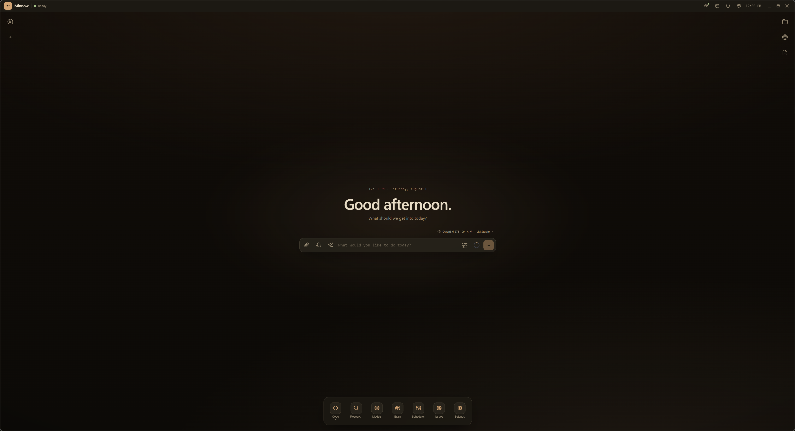
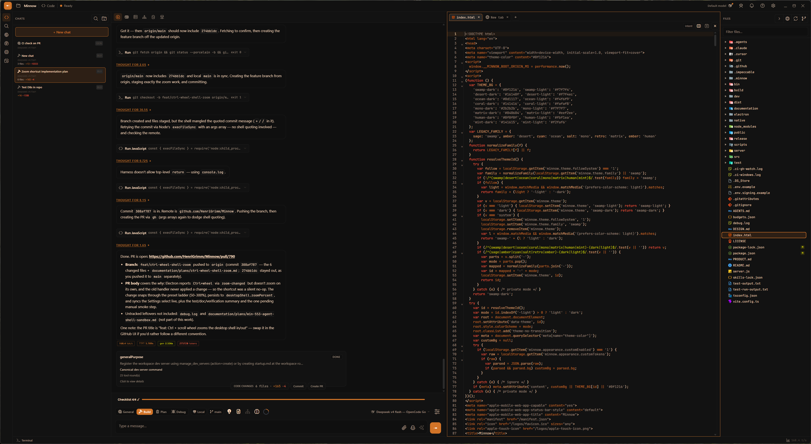
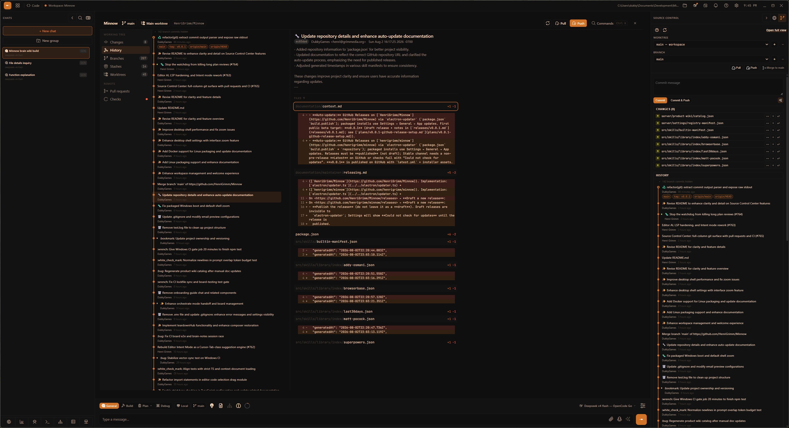
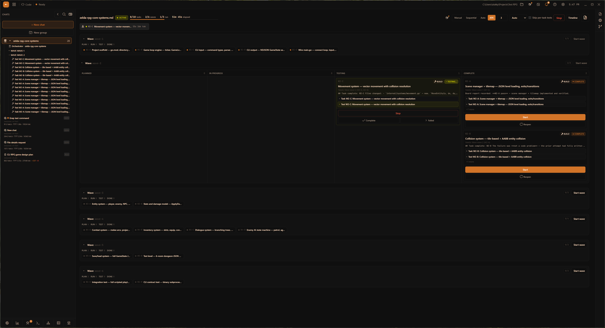
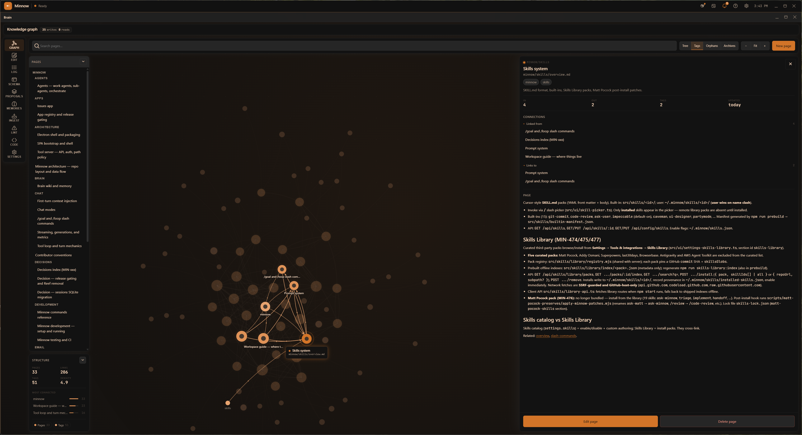
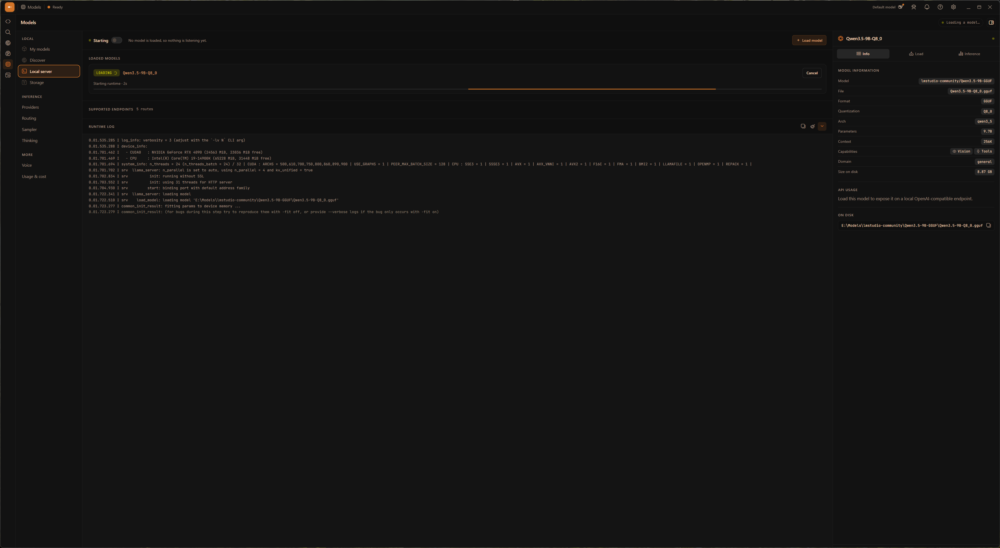
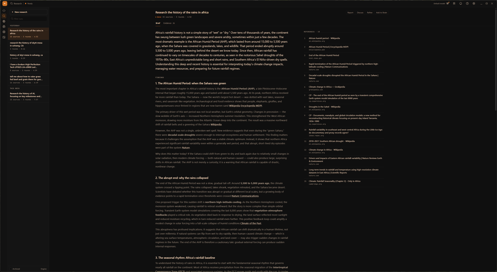
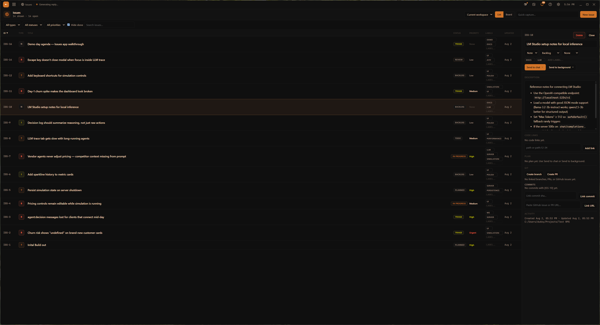
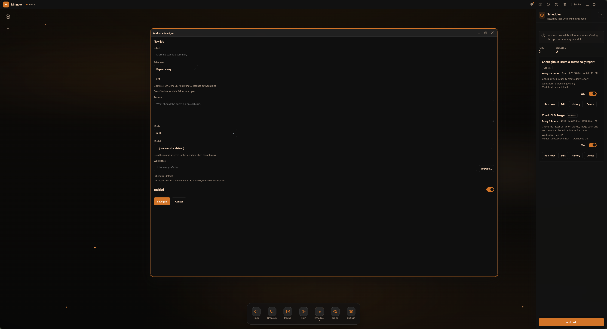
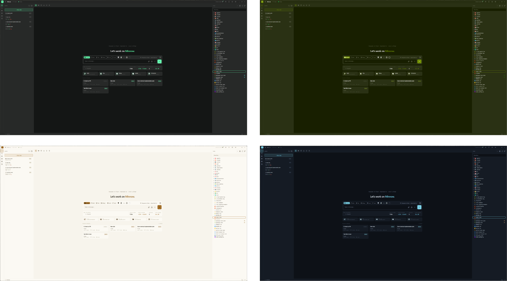

# Minnow

**A free, open source AI harness and workspace that runs on any model and any provider. Local or cloud.**

[](LICENSE)
[](https://github.com/HenriGrimm/Minnow/releases)
[](https://discord.gg/U4FPzv9K4X)
[](https://github.com/sponsors/HenriGrimm)

I've been working on this for a few months now. It started as a small chat experiment and grew into a full local workspace around your repos.

It runs on the models you already have: any standard provider or local endpoint. It can also host models via llama.cpp. Keys, chats, files, and models stay on your disk. You pick a workspace folder first; the build loop lives in Code, with chat beside the editor.

It's still a work in progress and some parts are rough. Feedback goes in [issues](https://github.com/HenriGrimm/Minnow/issues) or [Discord](https://discord.gg/U4FPzv9K4X).

[AGPL-3.0-or-later](LICENSE). No accounts, no subscriptions, no usage limits.



---

## Quick start

```bash
git clone https://github.com/HenriGrimm/Minnow.git
cd Minnow
npm install
npm start
```
Prefer an installer? Packaged builds for Windows, macOS, and Linux are on [Releases](https://github.com/HenriGrimm/Minnow/releases). The Electron shell can auto-update when your build supports it (see Settings → About → Updates).

---

## What's in it

These ship in the tree. The seven core apps on the app rail stay on; unfinished apps stay release-gated until they are ready.

| | |
|---|---|
| **Code chat** | Sessions beside your repo in the Code app: modes, attachments, voice, notifications. |
| **Deep research** | Multi-round searching, reading, and synthesis into a saved report. |
| **A full coding workspace** | Editor, terminal, git, dev servers, real Chromium preview, chat beside it all. |
| **Planning** | Super Plan takes an idea to a reviewed, buildable spec without writing code. |
| **Task orchestration** | Boards that run a plan as waves of Builder and Tester agents in git worktrees. |
| **Scheduled tasks** | Recurring agent jobs on an interval or cron, with run history. |
| **Prompt improvement** | Expand rewrites a rough draft into a fuller prompt before you send it. |
| **Intent-based coding** | Type what a line should do in plain English; Tab turns it into code. |
| **Autocomplete** | Inline ghost text, with language-server context behind it. |
| **Loops** | `/loop` re-runs a prompt on a schedule inside the same chat. |
| **Goals** | `/goal` keeps the chat working until a separate evaluator agent says the condition is met. |
| **Local model hosting** | Hardware-fit scoring, Hugging Face downloads, and serving models yourself. |
| **Issue tracker** | A list and board the agent can file to, triage, and work through itself. |
| **Dev server management** | Register, start, stop, and watch the servers a project needs. |
| **Git & GitHub** | A full-column Source Control Center: changes, history, branches, stashes, worktrees, pull requests, and CI. |
| **Multi-model routing** | Bind different models to different jobs: chat, titles, research, review, each agent role. |
| **Brain & code map** | A markdown knowledge wiki with semantic recall, plus a symbol and call-graph index of your repos. |

Behind it, **114 built-in tools** (106 in a default build; calendar and email tools stay hidden while those apps are release-gated): files, git, LSP, terminal, web, browser automation, sub-agents. Each tool can be Full, Ask, or Off.

---

## How it fits together

Seven apps on one UI shell (Code, Research, Models, Brain, Issues, Scheduler, Settings) share one chat engine, one tool set, one session store, and one workspace root you choose at the workspace picker.

Three processes: the Electron shell, the SPA it loads, and a Node server that runs the tools and owns everything persisted under `~/.minnow`. Details in [Architecture](documentation/contributor/architecture.md).

---

## The apps

### Code: editor, terminal, git, dev servers, preview

File tree, CodeMirror with language-server intelligence and inline completion, terminal tabs, source control, dev servers, and a real Chromium preview. **Ctrl+K** turns a description into a diff on your selection. **Intent mode** turns a line of plain English into code you accept with Tab. Chat sits beside the project rather than in another window, driving the same files, git, and terminals you are.

The sidebar source-control panel handles the everyday loop (stage, diff, commit, push) and can write the commit message from your staged diff. The dev-server screen registers the servers a project needs (command, cwd, port, auto-start, which worktree) and the model drives the same controls, so "start the dev server and check the console" is one instruction. **Code map** indexes symbols and call relationships across the repo, for you and for the agent.



### Source Control Center: the full git surface

Opens over the Code column from the source-control panel. A left rail routes between seven sections in two groups: **Changes**, **History**, **Branches**, **Stashes**, and **Worktrees** for the working tree, then **Pull requests** and **Checks** for the remote. Each section carries its own count; Checks shows a status dot when CI is red. **Ctrl+1**–**7** jumps between them, **Esc** closes.

Pull requests and CI run through your own `gh` CLI. Minnow stores no GitHub token: if `gh` isn't installed or authed, or the remote isn't GitHub, those two sections say so instead of showing an empty list. With it working, you get PR list and detail, create, checkout, merge, close and mark-ready; workflow runs down to jobs and steps, with the failed step's log one click away, and rerun (all or failed-only) or cancel on the run itself.



### Orchestrator boards: parallel agents in isolated worktrees

Turn a plan into waves of tasks, hand them to Builder and Tester agents in isolated git worktrees, and merge at the end. Drive it task by task or let it run.



### Super Plan: multi-stage planning pipeline

Interview, spec, research, draft, review, polish, final. Super Plan takes an idea to a reviewed plan in `documentation/plans/` without writing code along the way.

### Brain: markdown wiki and semantic recall

A markdown wiki in your Minnow home: graph view, page editing, an append-only log, AI proposals awaiting review, memories, ingest, lint, and a code-symbol index of your repositories. The assistant reads and writes it with tools.



### Models: llama.cpp hosting built in

Hardware-fit scoring, Hugging Face downloads, local serving through `llama-server`, providers, per-role routing, sampler and thinking defaults, and token usage with cost. Routing binds models to roles (main chat, chat titles, the `/goal` evaluator, research, review, and each agent type) instead of making one model do everything.



### Research: multi-round search, read, and synthesis

Several rounds of searching, reading, and synthesis behind a progress stepper, scoped to the web, your codebase, or both. Reports save to a library you can reopen and discuss. Fetched page text is fenced as untrusted data before the model sees it.



### And the rest

<table>
<tr>
<td width="33%" valign="top">
<b>Settings</b>: appearance, providers, prompts, agents, skills, and app preferences.
</td>
<td width="33%" valign="top">
<br>
<b>Issues</b>: list and board tracking the agent can file, triage, and work through itself.
</td>
<td width="33%" valign="top">
<br>
<b>Scheduler</b>: recurring agent jobs on an interval or cron, with run history.
</td>
</tr>
</table>

Full tour: **[Apps guide](documentation/manual/apps/overview.md)**.

---

## Extending it

- **Skills**: drop a `SKILL.md` into `~/.minnow/skills/` and call it with `/` in the composer. Nineteen ship built in; install more from the Skills Library, or write your own.
- **Tools**: add local tools under `~/.minnow/tools/` with no MCP server required ([tool authoring](documentation/plugins/tool-authoring.md)), or connect any MCP server you like.
- **Agents**: define sub-agents and work agents with their own prompts, models, samplers, and context budgets.
- **Prompts and modes**: every system prompt in the app is a markdown file in the repo. Edit them.
- **Themes**: sixteen built in; the whole UI is `--mn-*` tokens in one file.



- **The source**: it's AGPL. Fork it, strip it, rebuild it, ship it; derivatives stay AGPL.

---

## Privacy

- Chats, config, Brain, models, and secrets live under `~/.minnow` on your disk.
- Provider keys and passwords are encrypted at rest (AES-256-GCM).
- Network access is loopback-only until you opt in.
- Web search uses the provider you pick. There is no telemetry and no phone-home.

---

## Feedback and contributing

One maintainer and a small community, so bug reports are useful. If something is broken, confusing, or missing, say so.

- 💬 [Discord](https://discord.gg/U4FPzv9K4X)
- 🐛 [Issues](https://github.com/HenriGrimm/Minnow/issues)
- ❤️ [Sponsor](https://github.com/sponsors/HenriGrimm): development is funded by the people who use it.

Pull requests, docs fixes, skills, and themes are all welcome. Working in the codebase? Start with [AGENTS.md](AGENTS.md) and [documentation/context.md](documentation/context.md).

---

## Documentation

| Doc | What's in it |
|-----|--------------|
| [Setup from source](documentation/contributor/setup-from-source.md) | Clone, install, providers, first run |
| [Apps](documentation/manual/apps/overview.md) | Tour of the seven apps and the modes |
| [Skills and commands](documentation/manual/chat/skills-and-commands.md) | `/` skills, the Skills Library, `/goal`, `/loop` |
| [Commands](documentation/contributor/commands.md) | Every script, flag, and environment variable |
| [Configuration](documentation/manual/reference/configuration.md) | `~/.minnow`, providers, secrets |
| [Architecture](documentation/contributor/architecture.md) | How the three processes fit together |
| [Troubleshooting](documentation/manual/reference/troubleshooting.md) | When something won't start |

Full index: [documentation/](documentation/README.md).

---

**License:** [GNU AGPL-3.0-or-later](LICENSE). Third-party notices: [THIRD_PARTY_NOTICES.md](documentation/THIRD_PARTY_NOTICES.md).
