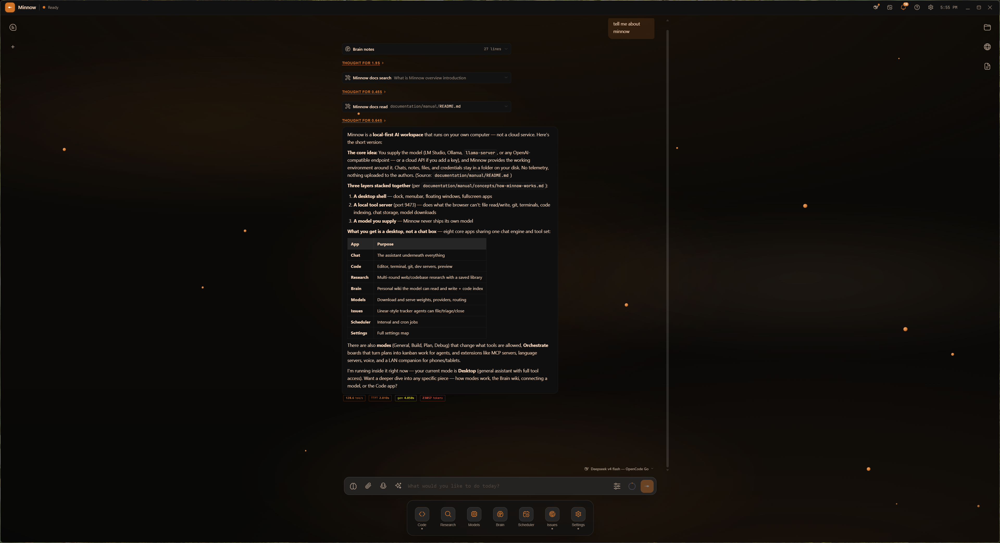

# Minnow

**A free, open source AI harness and workspace that runs on any model and any provider. Local or cloud.**

[](LICENSE)
[](https://github.com/HenriGrimm/Minnow/releases)
[](https://discord.gg/U4FPzv9K4X)
[](https://github.com/sponsors/HenriGrimm)

I've been working on this for a few months now. It started as a little chat app and kind of spiraled into a lot more.

Minnow runs on the models you already have — [LM Studio](https://lmstudio.ai/), Ollama, llama.cpp, or any OpenAI-compatible endpoint — and it can host models itself. Your keys, chats, files, and models stay on your disk. Nothing goes anywhere you didn't configure yourself.

It's still a work in progress and some parts are rough. Feedback is genuinely appreciated — [issues](https://github.com/HenriGrimm/Minnow/issues) or [Discord](https://discord.gg/U4FPzv9K4X).

> **The mission:** put a complete AI workspace in the hands of everyone who builds, as free and open source software.
>
> Minnow is [AGPL-3.0-or-later](LICENSE). Free to use, study, change, and share — for any purpose, forever. No accounts, no subscriptions, no usage gates, no cloud you have to trust.


---

## Quick start

```bash
git clone https://github.com/HenriGrimm/Minnow.git
cd Minnow
npm install
npm start
```

Load a model in LM Studio (or point Minnow at your provider), and the desktop window opens on `http://localhost:9473`. Full walkthrough: **[Setup from source](documentation/contributor/setup-from-source.md)**.

Prefer an installer? Packaged builds for Windows, macOS, and Linux are on [Releases](https://github.com/HenriGrimm/Minnow/releases), and they update themselves.

---

## What's in it

Everything below is built in and always on. No app store, no tiers, nothing to unlock.

| | |
|---|---|
| **Chat** | The desktop surface. Sessions, modes, attachments, voice, notifications. |
| **Deep research** | Multi-round searching, reading, and synthesis into a saved report. |
| **A full coding workspace** | Editor, terminal, git, dev servers, real Chromium preview, chat beside it all. |
| **Planning** | Super Plan takes an idea to a reviewed, buildable spec without writing code. |
| **Task orchestration** | Boards that run a plan as waves of Builder and Tester agents in git worktrees. |
| **Scheduled tasks** | Recurring agent jobs on an interval or cron, with run history. |
| **Prompt improvement** | Write a rough draft, hit Expand, get the prompt you meant to write. |
| **Intent-based coding** | Type what a line should do in plain English; Tab turns it into code. |
| **Autocomplete** | Inline ghost text with real language-server intelligence behind it. |
| **Loops** | `/loop` re-runs a prompt on a schedule inside the same chat. |
| **Goals** | `/goal` keeps the chat working until a condition is actually true, judged by a separate evaluator. |
| **Local model hosting** | Hardware-fit scoring, Hugging Face downloads, and serving models yourself. |
| **Issue tracker** | A list and board the agent can file to, triage, and work through itself. |
| **Dev server management** | Register, start, stop, and watch the servers a project needs. |
| **Git & GitHub** | Status, stage, diff, commit, branch, pull, push, merge-to-main, and PRs through your own `gh`. |
| **Multi-model routing** | Bind different models to different jobs — chat, titles, research, review, each agent role. |
| **Brain & code map** | A markdown knowledge wiki with semantic recall, plus a symbol and call-graph index of your repos. |

And **114 built-in tools** behind it — files, git, LSP, terminal, web, browser automation, sub-agents — each one set to Full, Ask, or Off by you.

---

## Why it's shaped this way

Most local-AI tools give you a chat box next to a model. I wanted the whole loop — think it through, build it, delegate it, and keep what you learned — on one desktop, sharing one chat engine, one tool set, one session store, and one workspace.

- **It's a workspace, not a chat window.** Eight apps on one shell: Chat, Code, Research, Models, Brain, Issues, Scheduler, Settings.
- **It builds, it doesn't just suggest.** The tools are real and the permissions are yours.
- **It delegates.** Boards run agents in parallel in isolated worktrees and merge at the end.
- **It remembers.** Brain is a markdown wiki your agents read and write — not a context window that forgets you tomorrow.
- **It's yours.** Every prompt is an editable markdown file, every skill is a `SKILL.md`, every theme is a token set, and the whole thing is AGPL.

---

## The apps

### Code — the build workspace

File tree, CodeMirror with language-server intelligence and inline completion, terminal tabs, source control, dev servers, and a real Chromium preview. Two things the usual editor doesn't have: **Ctrl+K** turns a description into a diff on your selection, and **Intent mode** turns a line of plain English into code you accept with Tab. Chat sits beside the project instead of in another window, driving the same files, git, and terminals you are.

The source-control panel does status, stage, diff, commit, branch, pull, push, and merge-to-main, and it can write the commit message from your staged diff. Issues and boards open pull requests through your own `gh` CLI — Minnow never holds a GitHub token. The dev-server screen registers the servers a project needs (command, cwd, port, auto-start, which worktree) and the model drives the same controls, so "start the dev server and check the console" is one instruction. **Code map** indexes symbols and call relationships across the repo, for you and for the agent.


### Orchestrator boards — a plan becomes a delivery line

Turn a plan into waves of tasks, hand them to Builder and Tester agents in isolated git worktrees, and merge at the end. Drive it task by task or let it run.


### Super Plan — from idea to a buildable spec

Interview, spec, research, draft, review, polish, final. Super Plan walks an idea all the way to a reviewed plan in `documentation/plans/` without writing a line of code along the way.

### Brain — Deep knowledge trees with Semantic recall

A markdown wiki in your Minnow home: graph view, page editing, an append-only log, AI proposals awaiting review, memories, ingest, lint, and a code-symbol index of your repositories. The assistant reads and writes it with tools.


### Models — Llama.cpp hosting built in

Hardware-fit scoring, Hugging Face downloads, local serving, providers, per-role routing, sampler and thinking defaults, and token usage with cost. Routing is the one worth setting up: a 3B model is fine at naming a chat, and you don't want it judging whether your `/goal` is met.


### Research — send an agent to dig

Multi-round searching, reading, and synthesis behind a progress stepper, scoped to the web, your codebase, or both. Reports save to a library you can reopen and discuss. Fetched page text is fenced as untrusted data before the model sees it.


### And the rest

<table>
<tr>
<td width="33%" valign="top">
<br>
<b>Chat</b> — the desktop surface. Composer, session rail, workspace panel, notifications.
</td>
<td width="33%" valign="top">
<br>
<b>Issues</b> — list and board tracking the agent can file, triage, and work through itself.
</td>
<td width="33%" valign="top">
<br>
<b>Scheduler</b> — recurring agent jobs on an interval or cron, with run history.
</td>
</tr>
</table>

Full tour: **[Apps guide](documentation/manual/apps/overview.md)**.

---

## Make it yours

Minnow is meant to be taken apart. Everything the app does, you can extend without asking anyone:

- **Skills** — drop a `SKILL.md` into `~/.minnow/skills/` and call it with `/` in the composer. Fifteen ship built in; install more from the Skills Library, or write your own.
- **Tools** — add local tools under `~/.minnow/tools/` with no MCP server required ([tool authoring](documentation/plugins/tool-authoring.md)), or connect any MCP server you like.
- **Agents** — define sub-agents and work agents with their own prompts, models, samplers, and context budgets.
- **Prompts and modes** — every system prompt in the app is a markdown file in the repo. Edit them.
- **Themes** — sixteen built in; the whole UI is `--mn-*` tokens in one file.


- **The whole thing** — it's AGPL. Fork it, strip it, rebuild it, ship it. Just keep it free for the next person.

---

## Privacy

- Chats, config, Brain, models, and secrets live under `~/.minnow` on your disk.
- Provider keys and passwords are encrypted at rest (AES-256-GCM).
- Network access is loopback-only until you opt in.
- Web search uses the provider you pick. There is no telemetry and no phone-home.

---

## Feedback and contributing

This is a work in progress built by one maintainer and a small community, and some parts are rough. If something is broken, confusing, or missing, I want to hear it — that's most of what shapes what gets built next.

- 💬 [Discord](https://discord.gg/U4FPzv9K4X)
- 🐛 [Issues](https://github.com/HenriGrimm/Minnow/issues)
- ❤️ [Sponsor](https://github.com/sponsors/HenriGrimm) — development is funded by the people who use it, which is what keeps it free for everyone else.

Pull requests, docs fixes, skills, and themes are all welcome, and a first-time contribution is as good as a feature. Working in the codebase? Start with [AGENTS.md](AGENTS.md) and [documentation/context.md](documentation/context.md).

---

## Documentation

| Doc | What's in it |
|-----|--------------|
| [Setup from source](documentation/contributor/setup-from-source.md) | Clone, install, providers, first run |
| [Apps](documentation/manual/apps/overview.md) | Tour of the eight apps and the modes |
| [Skills and commands](documentation/manual/chat/skills-and-commands.md) | `/` skills, the Skills Library, `/goal`, `/loop` |
| [Commands](documentation/contributor/commands.md) | Every script, flag, and environment variable |
| [Configuration](documentation/manual/reference/configuration.md) | `~/.minnow`, providers, secrets |
| [Architecture](documentation/contributor/architecture.md) | How the three processes fit together |
| [Troubleshooting](documentation/manual/reference/troubleshooting.md) | When something won't start |

Full index: [documentation/](documentation/README.md).

---

**License:** [GNU AGPL-3.0-or-later](LICENSE). Third-party notices: [THIRD_PARTY_NOTICES.md](documentation/THIRD_PARTY_NOTICES.md).
