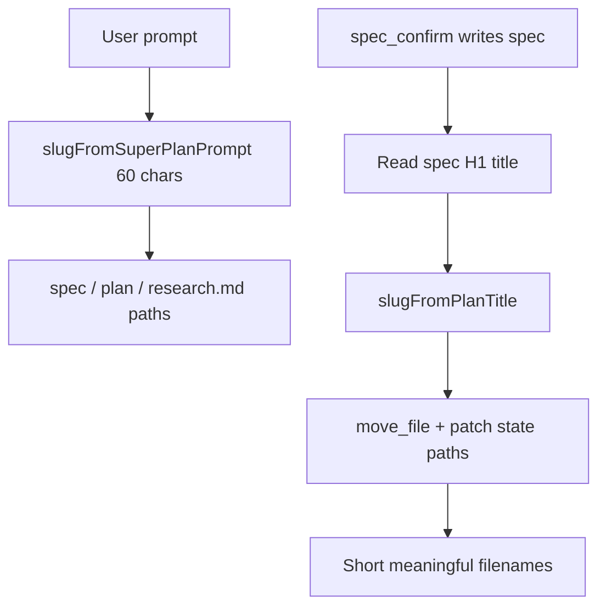

# Better names for plans and briefs

## Problem

### Super Plan — **on-disk filenames** (primary ask)

[`createSuperPlanState`](src/chat/super-plan/state.ts) sets `slug` via [`slugFromSuperPlanPrompt`](src/chat/super-plan/state.ts): the **entire prompt** is lowercased, non-alphanumerics → `-`, trimmed to **60 characters**. That slug becomes:

- `documentation/plans/<slug>.md` (executable plan)
- `documentation/plans/references/<slug>-spec.md`
- `documentation/plans/references/<slug>-research.md`

So long prompts produce long, unreadable filenames that are still essentially the prompt.

### Super Plan — UI labels

[`plan-library.ts`](src/chat/super-plan/plan-library.ts) and [`super-plan-page.ts`](src/ui/super-plan-page.ts) also show the **full prompt** in the rail and run header (`titleFromPrompt` / `paintHead`).

### Research — UI labels (not JSON filenames)

Standalone Deep Research persists `~/.minnow/research/<id>.json` with opaque ids. Rows and headers use **`query`** today. The plan adds a **display `title`** from the report markdown; it does **not** rename JSON files on disk.

Super Plan’s **`*-research.md`** reference file **does** follow the Super Plan slug — fixed by the slug reconciliation below.

## Super Plan — filename strategy (deterministic)

### 1. Title → slug helpers

Add in [`src/chat/super-plan/state.ts`](src/chat/super-plan/state.ts) (or `plan-slug.ts`):

- **`extractPlanMarkdownTitle(markdown, fallback)`** — first `# ` line, strip template placeholders; reject generic headings (reuse ideas from [`isGenericReportHeading`](server/research/visual-report.js) where useful, e.g. “Build spec”, “Plan template”).
- **`slugFromPlanTitle(title)`** — kebab-case, max ~50 chars, no leading/trailing hyphens; **not** fed the full prompt.
- **`ensureUniquePlanSlug(candidate, excludePaths?)`** — if `documentation/plans/<slug>.md` already exists (and is not one of this run’s paths), append `-2`, `-3`, … via `find_files` / `get_file_metadata` (same server tools Super Plan already uses).

**Bootstrap slug before spec exists:** use a **neutral interim slug**, not the prompt:

- e.g. `plan-<shortId>` from existing [`random-id`](src/lib/random-id.ts) or first 8 chars of chat id — stable for the grill stage only.
- Stage instructions still use `state.specPath` / `planPath` from state; user never depends on interim name for long.

*(Alternative if interim names feel too ugly: first rename immediately after spec write — spec file may briefly use interim `-spec.md` then move; acceptable.)*

### 2. Reconcile slug after build spec

Add **`reconcileSuperPlanSlugFromSpec(chat)`** in [`state.ts`](src/chat/super-plan/state.ts):

1. Read `state.specPath` ( [`readFileOrEmpty`](src/chat/super-plan/stages.ts) pattern).
2. `title = extractPlanMarkdownTitle(spec, '')`; if empty, **skip** (keep interim slug).
3. `nextSlug = ensureUniquePlanSlug(slugFromPlanTitle(title))`.
4. If `nextSlug === state.slug`, return.
5. Compute new `specPath`, `researchPath`, `planPath` via existing `superPlanSpecPath` / `superPlanResearchPath` / `superPlanPlanPath`.
6. For each path that **exists on disk**, `move_file` old → new ([`move_file` tool](src/tools/definitions.ts)); update [`SuperPlanState`](src/chat/super-plan/types.ts) (`slug`, paths). Optional `displayTitle` = human title.
7. **Orchestrate binding:** if [`resolveEffectiveOrchestratePlanPath`](src/chat/orchestrate/plan-path.ts) / `chat.orchestratePlanPath` / board group still points at the **old** plan path, rewrite to the new plan path ([`plan-path-sync`](src/chat/orchestrate/plan-path-sync.ts) patterns).

**When to call:** [`controller.ts`](src/chat/super-plan/controller.ts) after **`spec_confirm`** stage completes successfully (`outcome.kind === 'done'`), **before** advancing to **research** — so research and all later stages write to the final paths.

**Second pass (optional, same function):** after **`draft1` / `finalize`** if plan file H1 is a better title than spec (and slug still interim or spec title was generic). Prefer **one** reconcile at spec; only re-run from plan if spec title was generic.

### 3. Deprecate prompt-based slug

- Remove or restrict **`slugFromSuperPlanPrompt`** to tests only; **`createSuperPlanState`** uses interim slug + paths.
- Audit any callers assuming prompt-derived slug in tests/fixtures.

### 4. Display titles (UI, aligned with files)

- **`resolveSuperPlanDisplayTitle(sp, path?)`**: `displayTitle` → `titleFromPlanPath(current path)` → `'Untitled plan'` (never full prompt).
- [`collectSuperPlanRuns`](src/chat/super-plan/plan-library.ts), [`super-plan-page.ts`](src/ui/super-plan-page.ts) `paintHead`; keep **Show full prompt** for `sp.prompt`.

After reconcile, `titleFromPlanPath(planPath)` should match what the user expects on disk.

## Research briefs (display only)

Unchanged from prior plan:

- Persist **`title`** on finalize via **`extractReportTitle`** in [`server/research/store.js`](server/research/store.js); backfill on library list from `result`.
- Client **`researchDisplayTitle`** in [`library.ts`](src/research/library.ts) + [`panel.ts`](src/research/panel.ts).

## Tests

- **Slug:** `slugFromPlanTitle`, `ensureUniquePlanSlug` collision, `reconcileSuperPlanSlugFromSpec` with mocked `executeTool` / `move_file` ([`test/super-plan/`](test/super-plan/)).
- **Integration:** spec fixture with `# Real Feature Name` → state paths end with `real-feature-name.md`.
- **UI:** `collectSuperPlanRuns` title from path, not prompt.
- **Research:** library API + rail prefer `title` over `query`.

## Docs

Update [`documentation/context.md`](documentation/context.md) and [`documentation/manual/orchestrate/super-plan.md`](documentation/manual/orchestrate/super-plan.md): artifact basename comes from the **build spec title** (then plan title if needed), not the opening prompt; reference file naming follows `<slug>-spec.md` / `-research.md`.

## Out of scope

- LLM-generated titles for slugs or in-flight runs.
- Renaming `~/.minnow/research/*.json` files.
- Auto-renaming plans the user created manually outside Super Plan.

## Copy to repo

When implementing, copy this plan to [`documentation/plans/`](documentation/plans/) per project convention (filename from this plan title).
