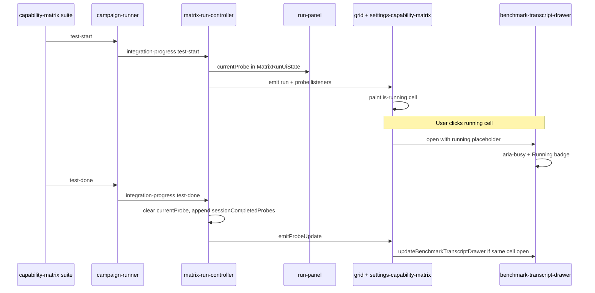

# Capability matrix in-progress view

## Surface and scope

The **models capabilities test** is the **Settings → Advanced → Capability matrix** workbench ([`src/ui/settings-capability-matrix.ts`](../../src/ui/settings-capability-matrix.ts)), not the Models app or the hidden Bench app. **Running state + auto-refresh** (Bench-style), not token-level streaming.

**Primary user action:** While a sweep runs, instantly see which cell is active and click it to watch the probe finish, then read the transcript without reopening.

**Design direction:** Restrained product instrumentation — accent tint on the active cell, mono status copy in the run dock, `role="status"` / `aria-live="polite"` on the drawer running state. Reuse Bench running-card patterns ([`src/styles/benchmark-page.css`](../../src/styles/benchmark-page.css) `.benchmark-test-card.is-running`) adapted to grid cells. No new palette; respect `prefers-reduced-motion` (no pulse if reduced).

---

## Implementation todos

- [x] Add `currentProbe` to `matrix-run-controller`: handle `test-start` / `test-done`, export getter, unit tests
- [x] Show active probe label in run-panel with `aria-live` while running
- [x] Highlight running cell in `grid.ts` + CSS; subscribe to run state in `settings-capability-matrix.ts`
- [x] Add running placeholder + `updateBenchmarkTranscriptDrawer`; wire cell-transcript auto-refresh on probe complete
- [x] Update `documentation/context.md`

---

## Architecture

---

## Key states

| State | Grid cell | Run panel | Drawer (if open on that cell) |
|-------|-----------|-----------|-------------------------------|
| Idle | Normal glyphs | Hidden progress | N/A |
| Sweep running, probe A active | A highlighted `is-running` | “Running: A” + N/M | Running badge + spinner copy |
| Probe A completes | A shows new verdict glyph | Advances to next probe or N/M | Auto-updates to full transcript |
| User clicks completed cell | `is-open` selection | Unchanged | Static transcript (existing) |
| Stop mid-probe | Running highlight clears | “Cancelled” | Stopped message if still open |
| Untested, not running | Opens manual editor | — | Empty + editor (existing) |

---

## Testing

- **Unit:** [`test/benchmark/matrix-run-controller.test.mts`](../../test/benchmark/matrix-run-controller.test.mts) — `test-start` sets `currentProbe`, `test-done` clears it, abort clears it, completed probes still persist after abort.
- **Manual:** Start a small roster (1 model, 1 group), run matrix, confirm active cell highlight tracks probes, click running cell → spinner → auto-fill transcript on completion; Stop mid-probe shows cancelled copy; `prefers-reduced-motion` has no pulse.
