# Documentation rewrite plan — workspace-first, Code-primary UI

**Status:** Phase 3 complete (QA, catalog test, image spec; PNG refresh deferred)  
**Voice:** PRODUCT.md register — plain, capable, no hype; documentation not marketing.  
**Impeccable:** Align copy with PRODUCT.md anti-references (no hero metrics, no “autonomous AGI” cadence).

## Why this rewrite

Product navigation changed from a **desktop chat home** to a **workspace-first shell**:

| Old story (docs today) | New story (code + `documentation/context.md` on `main`) |
|------------------------|-----------------------------------------------------------|
| Eight apps; **Chat** = default desktop surface | **Seven** released apps; **Code** is the home for chat (`#/app/code/chat`) |
| `#/desktop`, “desktop chat”, desktop workspace folder | `#/workspaces` picker; `#/desktop` is a legacy redirect |
| “Open Chat, then Code when coding” | Open a **workspace** first; build loop lives in **Code** (editor, terminal, git, chat rail) |
| Desktop mode as a separate composer surface in user docs | **Desktop** composer mode may remain in `modes.md` for tool policy; do not describe a **Chat app** |
| Reader is a “chat user” | Reader is a **developer** using local models in a repo |

Electron **Minnow Shell** remains the packaged runtime; we are not removing the desktop *app binary* — we are removing the **desktop chat surface** as the product center.

## Source of truth (verify before every section)

1. [`src/os/app-registry.ts`](../../src/os/app-registry.ts) — released app ids and count  
2. [`src/os/router.ts`](../../src/os/router.ts) — `resolveLegacyHash`, default routes, `#/app/chat` → `#/app/code/chat`  
3. [`src/os/workspace-gate.ts`](../../src/os/workspace-gate.ts) — boot gate, welcome / workspace pick  
4. [`src/ui/welcome-page.ts`](../../src/ui/welcome-page.ts) — first-run Code experience  
5. [`documentation/context.md`](../context.md) — technical narrative (already partially updated)  
6. [`PRODUCT.md`](../../PRODUCT.md) — **must be updated** (still lists “Desktop chat” as headline workflow)  
7. [`test/os/router.test.mts`](../../test/os/router.test.mts), workspace-gate tests — behavior contracts for docs

## Scope map

### Tier A — User-facing (in-app wiki = `documentation/manual/`)

| Area | Lead files | Subagent id |
|------|------------|-------------|
| **A1** Get started | `get-started/install.md`, `connect-a-model.md`, `first-chat.md` | `docs-a1-get-started` |
| **A2** Concepts | `concepts/how-minnow-works.md`, `modes.md`, `tools-and-permissions.md`, `context-and-memory.md` | `docs-a2-concepts` |
| **A3** Chat (in Code) | `chat/chatting.md`, `chat/skills-and-commands.md` | `docs-a3-chat` |
| **A4** Apps | `apps/overview.md`, `code.md`, others; **delete Chat app section** | `docs-a4-apps` |
| **A5** Orchestrate | `orchestrate/*.md` — entry from Code sidebar, not desktop | `docs-a5-orchestrate` |
| **A6** Reference | `reference/keyboard-shortcuts.md`, `glossary.md`, `configuration.md`, `troubleshooting.md` | `docs-a6-reference` |
| **A7** Manual hub | `manual/README.md` | `docs-a7-hub` |

### Tier B — Repo front door

| Area | Lead files | Subagent id |
|------|------------|-------------|
| **B1** README | `README.md`, hero image caption | `docs-b1-readme` |
| **B2** Product voice | `PRODUCT.md` headline workflows, growth direction | `docs-b2-product` |
| **B3** Roadmap | `documentation/ROADMAP.md` | `docs-b3-roadmap` |

### Tier C — Contributor & agents

| Area | Lead files | Subagent id |
|------|------------|-------------|
| **C1** Contributor | `contributor/setup-from-source.md`, `architecture.md`, `apps-and-routes.md` | `docs-c1-contributor` |
| **C2** Agent orientation | `AGENTS.md` (still says Chat desktop) | `docs-c2-agents` |
| **C3** Context bible | `documentation/context.md` — grep cleanup for desktop/chat app | `docs-c3-context` |

### Tier D — Secondary surfaces

| Area | Lead files | Subagent id |
|------|------------|-------------|
| **D1** Design system copy | `documentation/design-system/shell.md`, `layout-shell.md` | `docs-d1-design` |
| **D2** Guides / E2E | `guides/release-e2e-testing.md`, `guides/setup.md` | `docs-d2-guides` |
| **D3** Maintainer | `maintainer/settings-reference.md`, `wiki-publishing.md` | `docs-d3-maintainer` |
| **D4** Images | `documentation/images/*`, README hero (Code screenshot, not desktop chat) | `docs-d4-images` |

### Tier E — Wiki pipeline

| Area | Action | Subagent id |
|------|--------|-------------|
| **E1** Product wiki catalog | Regenerate / verify `server/product-wiki/catalog.json` if manual paths change | `docs-e1-wiki-catalog` |
| **E2** GitHub Wiki | Stage per `maintainer/wiki-publishing.md` after manual merge | `docs-e2-gh-wiki` |

## Global terminology contract

Use consistently across all tiers:

| Prefer | Retire or narrow |
|--------|------------------|
| **Code** (app), **Code chat**, chat rail / session rail in Code | “Chat app”, “desktop surface”, “default chat home” |
| **Workspace** (folder root for tools), **workspace picker** (`#/workspaces`) | “desktop workspace folder” → “workspace root” |
| **Minnow Shell** (Electron) when discussing install / browser tools | “Desktop app” only when meaning OS packaged binary |
| **Seven apps** (list from registry) | “Eight apps” |
| **Development-first** / **build loop** | “Concierge chat” as product lead |

Legacy redirects: document once in **Reference → Glossary** (`#/desktop`, `#/app/chat`) — do not teach them as primary paths.

## Phased execution

### Phase 0 — Inventory (blocking)

- [x] **0.1** Machine grep: `desktop`, `#/desktop`, `Chat app`, `eight apps`, `default surface`, `Desktop chat` across `documentation/`, `README.md`, `PRODUCT.md`, `AGENTS.md`  
- [ ] **0.2** Diff doc claims vs `app-registry` + `router.test.mts`  
- [ ] **0.3** Carry forward open items from [`beta-review-02-documentation.md`](../plans/beta-review-02-documentation.md) (50-chat cap, skills count, Linux install, THIRD_PARTY_NOTICES) — fix when touching adjacent files  

### Phase 1 — Narrative spine (ship first)

- [x] **1.1** Update `PRODUCT.md` + `README.md` (B1, B2)  
- [x] **1.2** Rewrite `manual/apps/overview.md` + `manual/get-started/first-chat.md` (A4, A1)  
- [x] **1.3** Update `manual/concepts/how-minnow-works.md` (A2)  
- [x] **1.4** `AGENTS.md` + `context.md` header tables (C2, C3) — partial context (§ Minnow apps); full context grep remains Phase 2  

**Exit criteria:** A new user reading only Tier A1–A4 + README understands: pick workspace → land in Code → chat is beside the repo.

### Phase 2 — Depth & reference

- [x] **2.1** `code.md` (app rail entry; SCC depth still optional)  
- [x] **2.2** Shortcuts + glossary + configuration (A6)  
- [x] **2.3** Contributor routes doc (C1)  
- [x] **2.4** `modes.md` (Phase 1)  
- [x] **2.5** `release-e2e-testing.md`, `ROADMAP.md`, `releases/v0.0.1.md`  
- [x] **2.6** `context.md` narrative pass (partial; internal Desktop mode refs remain)  

### Phase 3 — QA & wiki

- [ ] **3.1** Relative link check (existing validator / manual spot-check)  
- [ ] **3.2** `minnow_docs_*` spot queries for “desktop”, “chat app”  
- [ ] **3.3** Screenshots (D4)  
- [ ] **3.4** Update `documentation/context.md` changelog section + this plan status  

## Review workflow (mandatory)

Each Tier area has **two roles**:

1. **Author subagent** — implements Phase tasks for that area in the worktree branch.  
2. **Reviewer subagent** — same area, fresh context; **does not** trust the author summary.

### Reviewer rubric (score 1–5, fail if any dimension ≤2)

| Dimension | Question |
|-----------|------------|
| **Accuracy** | Every route, app count, and default path matches `router.ts` / registry? |
| **Voice** | Sounds like a contributor doc, not launch copy? No em dashes per PRODUCT? |
| **Hype** | Any “revolutionary”, “complete”, “autonomous”, “powerful” filler? |
| **Structure** | Leads with what the user does, not feature laundry lists? |
| **Legacy** | Old terms only in “formerly” / glossary, not onboarding? |
| **AI smell** | Parallel triads, “Whether you…”, “In today’s world”, rhetorical questions? |

Reviewer deliverable: bullet list of **must-fix**, **should-fix**, **nit** with file:line references.

Author **must** apply all **must-fix** before area is marked done.

### Reviewer assignments

| Area | Reviewer id |
|------|-------------|
| A1–A7 (manual) | `review-manual` |
| B1–B3 (README/PRODUCT/ROADMAP) | `review-front-door` |
| C1–C3 (contributor/context/agents) | `review-contributor` |
| D1–D4 + E1–E2 | `review-secondary` |

**Cross-review:** `review-manual` spot-checks README; `review-front-door` spot-checks `overview.md` for drift.

## Subagent execution order

```mermaid
flowchart LR
  subgraph p0 [Phase 0]
    INV[Inventory grep]
  end
  subgraph p1 [Phase 1 parallel]
    B1[docs-b1-readme]
    B2[docs-b2-product]
    A4[docs-a4-apps]
    A1[docs-a1-get-started]
    A2[docs-a2-concepts]
    C2[docs-c2-agents]
  end
  subgraph rev [Review]
    R1[review-front-door]
    R2[review-manual]
    R3[review-contributor]
  end
  subgraph fix [Remediate]
    FIX[Authors apply must-fix]
  end
  INV --> p1
  p1 --> rev
  rev --> FIX
  FIX --> p2[Phase 2 depth]
```

## Risks

| Risk | Mitigation |
|------|------------|
| Docs on `main` ahead/behind UI branch | Land doc PR with UI PR or same release train; cite commit SHA in PR body |
| **Desktop** composer mode vs surface | One glossary entry; modes table uses “tool policy” wording |
| LAN companion still says “Chat shell” | `lan-companion.md` — companion is mobile chat, not removed desktop app |
| Hidden apps “bounce to desktop” | Change to “bounce to **workspaces** or last app” per `router.ts` |
| PRODUCT.md DESIGN.md “chat bench” north star | DESIGN.md is visual; optional follow-up — do not block UI doc rewrite |

## Deliverables checklist

- [x] This plan marked **Complete** (worktree `wiki-docs-b14e7589`; merge via `/apply-worktree`)  
- [x] `documentation/context.md` updated (user rule)  
- [x] No remaining “eight apps” / “Chat app” in `manual/` user paths (glossary documents legacy hashes only)  
- [ ] README hero reflects Code workspace (PNG refresh deferred per `documentation/images/README.md`)  
- [x] Review reports archived under `documentation/plans/documentation-ui-rewrite-reviews.md`

## Todos (master)

- [x] Phase 0 inventory attached to `documentation-ui-rewrite-reviews.md`  
- [x] Phase 1 authors complete (spine only)  
- [x] Phase 1 reviews complete + must-fix merged (spine only)  
- [x] Phase 2 authors complete (contributor, reference, e2e, context partial)  
- [x] Phase 2 reviews complete (`review-contributor` must-fix on apps-and-routes, architecture, glossary)  
- [x] Phase 3 QA + images (spec only; no new PNGs)  
- [x] context.md + AGENTS.md synced  
- [ ] `/apply-worktree` merge back to user branch
