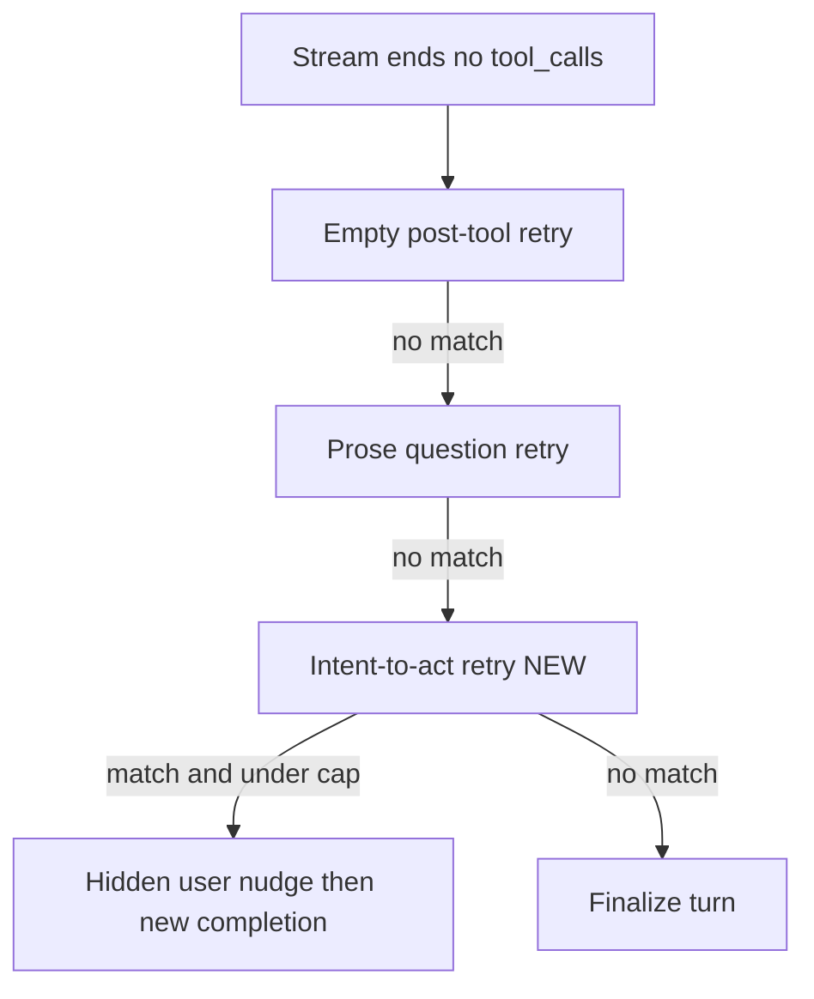

# Silent retry for announce-then-stop turns

## Problem

The GET-9 stall was a completed stream (`finish_reason: stop`, no `tool_calls`, no error). MTPLX had rejected a `todo_write` Qwen envelope (`unwrapped parameter text`) and stripped the markup. Minnow’s loop then **finalized**, because product chat only auto-retries empty post-tool replies and prose multiple-choice — not “I announced the next tool and stopped.”

Fix both layers in Minnow. Do **not** turn `nudgeToolUse` back on for chat (that forces tools on every prose-only first answer). Do **not** special-case MTPLX stats.

## Todos

- [x] Add `looksLikeIntentToAct` detector + tests (GET-9 line, closers, wait-for-user)
- [x] Wire one hidden inner-loop retry in `sub-agent-runner` + turn-continuation constants; drop the nudge in `chat-transcript-store`
- [x] `runTurn` test: chat-shaped announce-then-stop retries once and still skips the generic tool-use nudge
- [x] Recover unwrapped JSON inside Qwen `<function=name>` as tool arguments + xml-tool-calls tests
- [x] Update `documentation/context.md` and `server/runner/README.md`

## Layer 1 — one hidden retry (this is the GET-9 fix)

Mirror the existing prose-question path in [`server/runner/sub-agent-runner.js`](../../server/runner/sub-agent-runner.js) (the inner loop `runTurn` already uses). After the prose-question check, before `nudgeToolUse`:

- If `input.tools.length > 0`, this round has **no** tool calls, prose is non-empty, and `looksLikeIntentToAct(prose)` is true, retry once.
- Push the assistant preamble (keep it visible) plus a **hidden** user control row, same as `PROSE_QUESTION_RETRY_INSTRUCTION`.
- Cap: `MAX_INTENT_TO_ACT_RETRIES = 1` in [`server/runner/turn-continuation.js`](../../server/runner/turn-continuation.js).
- Instruction, exact string (must match the transcript drop-list): the previous reply already announced a next action but did not call a tool; do not repeat it; call those tools now.

**Detector** — new [`server/runner/intent-to-act-detect.js`](../../server/runner/intent-to-act-detect.js) (+ `.d.ts`, re-export [`src/tools/intent-to-act-detect.ts`](../../src/tools/intent-to-act-detect.ts)). Score the **last sentence** (not the whole bubble):

- Match: `Let me …`, `I'll …`, `I will …`, `I'm going to …`, `Now I'll …`, `Next I'll …` announcing work (inspect, read, check, set up, write, build, verify, generate, wire).
- Reject closers: `let me know`, `I'll wait`, questions to the user, “Task complete” / report closings, long answers whose last line is “Let me know if you want tests.”
- Fixture the GET-9 line verbatim: `The user wants the **status-bar Tray only**. Let me set up my task list and inspect the existing icon asset and available image tooling before building.`

Hide the nudge in [`src/chat/chat-transcript-store.ts`](../../src/chat/chat-transcript-store.ts) `INNER_LOOP_CONTROL_USER_CONTENT` (and the existing store test).

This runs **even when** `nudgeToolUse: false`, so Code chat gets it. Truncation (`finish_reason: length`) stays on the existing truncated-Continue path.

## Layer 2 — recover unwrapped Qwen JSON (mlx-lm / llama.cpp / visible XML)

Does **not** fix GET-9 (MTPLX stripped the envelope). Stops the same payload from becoming an empty `todo_write` when markup **is** in `delta.content`.

In [`server/runner/xml-tool-calls.js`](../../server/runner/xml-tool-calls.js) `parseQwenXmlFunctionPayload`: if there are no `<parameter=key>` tags, parse a balanced `{…}` after `<function=name>` as the arguments object (only when it is not already a `{name, arguments}` tool envelope — that path stays on `parseJsonToolCallPayload`).

Cover:

- `<function=todo_write>\n{"todos":[{"text":"a","status":"in_progress"}]}\n</function>`
- Same inside `<tool_call>…</tool_call>`
- Unchanged: proper `<parameter=path>` envelopes; JSON `{name,arguments}` blocks; missing close tags

## Tests

- [`test/tools/intent-to-act-detect.test.mjs`](../../test/tools/intent-to-act-detect.test.mjs) — GET-9 positive; “Let me know if you need anything”; “I'll wait for your answer”; task-complete closer; “Let me look at the renderer…” as last sentence.
- [`test/runner/run-turn.test.mjs`](../../test/runner/run-turn.test.mjs) — chat-shaped `nudgeToolUse: false`: announce-then-stop SSE then a tool-call SSE; assert a second completion and that the control user row is the new instruction. Negative: plain “Done.” does not retry. Existing `nudgeToolUse false: prose with tools does not inject the sub-agent nudge` still passes.
- [`test/providers/xml-tool-calls.test.mts`](../../test/providers/xml-tool-calls.test.mts) — unwrapped `todo_write` JSON; empty-args regression must not remain.
- [`test/chat/chat-transcript-store.test.mts`](../../test/chat/chat-transcript-store.test.mts) — new instruction is dropped from persist.

## Out of scope

- Changing MTPLX / `omlx_style` (take the parse-fallback finding upstream separately).
- Re-enabling `nudgeToolUse` for chat.
- A new visible Continue chip (failed/truncated already have one; this path should not look like a failure).
- Reading `mtplx_stats.tool_parse_fallback` (provider-coupled; the detector covers the user-visible case).
