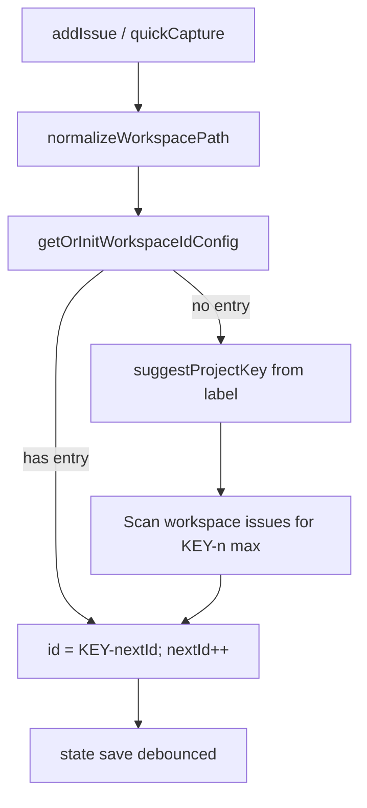

# Issues project key and custom ID schema

## Design brief (confirmed)

### Feature summary

Solo builders triaging in the Issues app and agents filing via `issue_*` tools need ticket ids that read like their project (`MIN-12`), not a generic `ISS-12`. Each **workspace** gets its own **project key** (2–10 uppercase letters/digits) and **numeric counter**; new issues allocate `{KEY}-{n}`. Existing `ISS-*` cards are never rewritten. Settings → Issues gains a small **Issue IDs** block above taxonomy so the key is discoverable and overridable without a separate onboarding flow.

### Primary user action

Glance at a list or commit message and know which project an id belongs to; optionally set or fix the key once per repo in Settings.

### Design direction

- **Color strategy:** Restrained (matches [DESIGN.md](DESIGN.md) and existing Settings → Issues taxonomy tables).
- **Scene:** A developer at a desk in a dim room, scanning a dense Issues list beside Code; ids are read in mono at small size, like branch names, not marketing chrome.
- **Anchors:** Linear issue keys, GitHub issue numbers in repo context, Minnow’s existing taxonomy settings tables (`settings-issues.css`).

**Image gate:** Skipped (shape-only / no native image probes in this harness).

### Scope

- **Fidelity:** Production-ready settings + allocation behavior.
- **Breadth:** Settings block, store/API, list sort, tool hints, user manual; no bulk rename UI.
- **Interactivity:** Shipped-quality validation and save, inline preview of next id.

### Layout strategy (Settings → Issues)

Add one **Issue IDs** group at the **top** of [src/ui/settings-issues.ts](src/ui/settings-issues.ts) (before Types/Statuses/Priorities):

```text
[Issue IDs]
  Workspace: Minnow                    (muted, from getWorkspaceLabel())
  Project key   [ MIN        ]           (mono input, uppercase as typed)
  Next issue    MIN-7                    (read-only preview, tabular nums)
  Note: Applies to this workspace only. Existing issue ids are not changed.
```

- Reuse `appendSettingsGroup`, field row patterns from taxonomy tables, `settings-section-note` for the intro (same offline hint pattern as taxonomy when not on server).
- No modal: inline validation error under the field (danger token + short sentence).
- **Confirm on key change** only when the normalized key differs from saved and at least one issue in this workspace already exists: `appConfirm` — “New issues will use {KEY}-n. Existing ids stay the same.”

### Key states

| State | Behavior |
|--------|----------|
| **First issue in workspace (no saved config)** | Lazy-init: derive suggested key from workspace folder **basename** (see algorithm below), `nextId` = 1 or max existing `{KEY}-n` in that workspace + 1. |
| **Workspace with legacy `ISS-*` only** | Those rows unchanged; first **new** issue uses suggested key (e.g. `MIN-1`), not `ISS-n`. Global `ISS` counter in state remains for any code path that still allocates `ISS` (diagnostics `bug-crash-*` unchanged). |
| **User edits key** | Save per-workspace config; recompute `nextId` from issues in that workspace matching new prefix; preview updates. |
| **Invalid key** | Block save: empty, &lt;2 chars, &gt;10 chars, non-alphanumeric, or lowercase (normalize to uppercase on input). |
| **Duplicate key across two workspace paths** | Allow (Linear does per-team); optional muted note only if we detect another path with same key in config map (low priority). |
| **Empty suggested key** | Fallback `ISS` for that workspace only until user sets a key (edge case: basename with no alphanumerics). |

### Interaction model

- Settings save: same persistence path as taxonomy (`detectConfigServer` / `~/.minnow`).
- Issues list/board/detail: continue rendering `issue.id` as stored (no visual change except ids on new cards).
- Quick capture / New issue: call updated `allocateIssueId(workspacePath)` (or equivalent) so preview in UI matches allocation.
- [src/ui/issue-link-from-editor.ts](src/ui/issue-link-from-editor.ts): placeholder and hint use **current workspace** key + `-`, not hardcoded `ISS-`.

### Content (microcopy)

- Group title: **Issue IDs**
- Field label: **Project key**
- Preview label: **Next issue**
- Validation: `Use 2–10 letters or numbers.`
- Intro sentence: `New issues in this workspace use your project key (for example MIN-12). Git branches and commit search use the id on each card.`

### Anti-goals

- No migration wizard or bulk rename of `ISS-*`.
- No regex/pattern builder UI (padding, year, etc.) in v1.
- No modal-first “pick your key” on first dock open.

---

## Technical approach

### Data model

Extend persisted issues state in [src/types.ts](src/types.ts) and [src/state/issues-store.ts](src/state/issues-store.ts):

```ts
// IssuesState version bump 1 → 2 (parse v1 by adding empty workspaces map + keep nextId for ISS legacy)
interface IssuesWorkspaceIdConfig {
  projectKey: string; // uppercase A-Z0-9, 2-10
  nextId: number;     // next integer to assign for this workspace + key
}

interface IssuesState {
  version: 2;
  /** Legacy global counter for ISS-n and reconcile; retained for v1 compat */
  nextId: number;
  issues: IssueCard[];
  /** Key: normalizeWorkspacePath(absolute path) */
  workspaces?: Record<string, IssuesWorkspaceIdConfig>;
}
```

Mirror validation in [server/config/validators.js](server/config/validators.js) `validateIssuesState`.

**Persistence file:** still [server/config/paths.js](server/config/paths.js) `issues/state.json`; single global file, workspace-scoped **config map** (same pattern as global issue list with per-card `workspacePath`).

### Project key suggestion (shared util)

New module e.g. [src/issues/project-key.ts](src/issues/project-key.ts) (and test file):

1. Input: workspace folder basename (from `getWorkspaceLabel()` / `workspaceLabel()` — same string users see).
2. Split on `-`, `_`, `.`, spaces; if camelCase segments detected, split on capital boundaries.
3. **Multi-segment:** initials of segments → uppercase, max 10 chars (e.g. `my-cool-app` → `MCA`).
4. **Single segment:** take leading alphanumeric run, uppercase, length `min(4, max(2, len))` capped at 10 (e.g. `Minnow` → `MINN` or `MIN` — prefer **3–4 chars** for single word: `Minnow` → `MIN` matches Linear-style TLA).
5. Strip non `A-Z0-9`; if result length &lt; 2, fallback `ISS`.

**Locked rule for implementation:** single-word basename → first **3** uppercase letters if length ≥ 3, else whole word up to 10; multi-word → initials concatenated up to 10.

### Allocation flow



- Replace hardcoded `ISS-${state.nextId}` in `allocateIssueId()` with workspace-aware logic.
- When user passes explicit `issue_id` to `addIssue`, bump workspace `nextId` if id matches `/^KEY-(\d+)$/i` for that workspace’s current key (generalize existing ISS bump logic).
- **Diagnostics** [src/boot/diagnostics.ts](src/boot/diagnostics.ts): keep `bug-crash-*` explicit ids; no change.

### Settings API

- **Option A (recommended):** Read/write workspace id config through the same `GET/PUT /api/config/issues` payload (version 2 state). Settings UI calls existing issues store helpers after load.
- Add store helpers: `getWorkspaceIdConfig(path)`, `setWorkspaceProjectKey(path, key)`, `getNextIssueIdPreview(path)`.
- Register settings manifest key if needed (e.g. `apps.issues.projectKey`) in [server/settings/registry-manifest.json](server/settings/registry-manifest.json) only if overlay/catalog requires it; otherwise document as part of issues state (like `nextId` today).

### Sorting and tooling

- [src/ui/issues-list-sort.ts](src/ui/issues-list-sort.ts): replace `ISS-only` regex with generic `^([A-Z0-9]+)-(\d+)$` for numeric suffix; tie-break with full id string (fixes `MIN-10` vs `MIN-2` via existing `localeCompare` numeric).
- [server/config/validators.js](server/config/validators.js): when reconciling counters, scan each workspace’s configured key + all `ISS-n` for global `nextId`.
- [src/tools/definitions.ts](src/tools/definitions.ts) / [src/tools/issue-tools.ts](src/tools/issue-tools.ts): describe ids as `{projectKey}-n`; `issue_get_state` include `workspaceProjectKey` and `nextIssuePreview` for active workspace.
- Git helpers [src/chat/issues/git-helpers.ts](src/chat/issues/git-helpers.ts): already use `issue.id` — update comments/tooltips in [src/ui/issues-detail.ts](src/ui/issues-detail.ts) to say `issue/<id>-<slug>` generically.

### Documentation

- [documentation/context.md](documentation/context.md): Issues row (IDs per workspace, settings).
- [documentation/manual/apps/issues.md](documentation/manual/apps/issues.md): replace `ISS-12` examples with `MIN-12` + Settings → Issue IDs section.
- Save this plan under [documentation/plans/issues-project-id-schema.md](documentation/plans/issues-project-id-schema.md) when implementing.

### Tests

- `test/issues/project-key.test.mts` — suggestion matrix (Minnow, my-app, A, empty).
- `test/state/issues-store.test.mts` — per-workspace allocation, lazy init, legacy ISS coexistence, key change.
- `test/ui/issues-list-sort.test.mts` — `MIN-2` vs `MIN-10`, mixed prefixes.
- Update router/issues-app tests that assume only `ISS-n` if they assert allocation.

---

## Implementation todos
