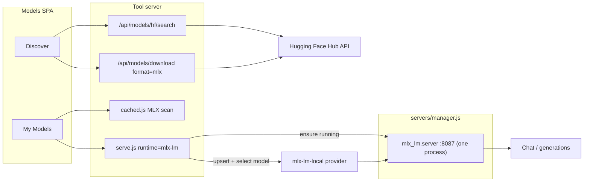

# MLX on macOS — as built

Status: implemented. This records the shipped design and, at the end, the places
where implementation contradicted the original plan.

## What it adds

On an Apple Silicon Mac, a user searches the Hugging Face Hub from Discover,
downloads an `mlx-community` repo, and loads it from My Models with the same flow
as GGUF. On every other platform nothing changes except that Hub search also
works for GGUF.

The scoring layer already understood MLX — [`src/models/quant.ts`](../../src/models/quant.ts)
and `nativeQuant` in [`src/models/fit.ts`](../../src/models/fit.ts) score
`mlx-4bit` / `mlx-6bit` / `mlx-8bit` — but nothing was wired to a runtime.

## Architecture

`mlx_lm.server` is a model **host**, not a per-model process: `--model` defaults
to `None` and `ModelProvider.load()` loads whatever each request's `model` field
names. So it runs once, and "Load model" is provider model-selection. Switching
models costs a request instead of a process restart, and the prompt cache
survives.

## Components

| Area | File | Notes |
|---|---|---|
| Runtime validation | [`server/models/validate.js`](../../server/models/validate.js) | `mlx-lm` added to `RUNTIME_RE` and the error string |
| Snapshot filtering | [`server/models/hf-client.js`](../../server/models/hf-client.js) | opt-in `include`/`exclude` globs, `MLX_SNAPSHOT_EXCLUDE` |
| Managed server | [`server/servers/mlx-lm.js`](../../server/servers/mlx-lm.js) | provision, install status, spawn spec, uninstall |
| Catalog entry | [`server/servers/catalog.js`](../../server/servers/catalog.js) | `python-venv`, port **8087**, autostart off, health `/v1/models` |
| Serve lifecycle | [`server/models/serve.js`](../../server/models/serve.js) | `validateServeModelTarget`, `upsertMlxLmProvider` |
| Download | [`server/models/download.js`](../../server/models/download.js) | `format: 'gguf' \| 'mlx'`, `cleanupJobArtifacts` |
| Library scan | [`server/models/cached.js`](../../server/models/cached.js) | `detectMlxRepo`, `scanMlxArtifacts` |
| Hub search | [`server/models/hf-search.js`](../../server/models/hf-search.js) | one `expand[]` call, VLM + platform filters |
| Discover UI | [`src/ui/models/discover-panel.ts`](../../src/ui/models/discover-panel.ts) | Catalog ⁄ Hugging Face source toggle |
| Install prompt | [`src/ui/models/runtime-install-prompt.ts`](../../src/ui/models/runtime-install-prompt.ts) | one dialog for llama.cpp and mlx-lm |

## Load-bearing decisions

**No `--model` in the spawn args.** Pinning one would turn every model switch
back into a 60s process restart. Guarded by a test.

**`--allowed-origins` passed explicitly.** Upstream defaults it to `*` and states
the server "is not recommended for production as it only implements basic
security checks", so the `127.0.0.1` bind is load-bearing. `--trust-remote-code`
stays off.

**The platform gate is ours, not pip's.** `pip install mlx-lm` *succeeds* on
Linux and Windows because `mlx` is declared `platform_system == "Darwin"` — pip
quietly drops the one dependency that matters and the failure surfaces later as
an ImportError. `isMlxSupported()` is the single source of truth, shared by
`provision()`, the download route, and Hub search.

**MLX detection keys on the `quantization` block, not on file extensions.**
`config.json` + `*.safetensors` describes every transformers repo; a loose
heuristic would list a cached fp16 Llama as servable MLX. Detection order:
`quantization: {group_size, bits}` (what `mlx_lm.convert` writes) →
`quantization_config` with `bits` and no foreign `quant_method` (GPTQ/AWQ/
bitsandbytes always name themselves) → repo id matching `mlx`.

Minnow deliberately does **not** copy `mlx_lm.server`'s own `/v1/models`
heuristic, which requires `model.safetensors.index.json` — that file only exists
for sharded models, so every single-shard small model is invisible to it.

**The model key is the directory path, not the repo id.** Minnow downloads MLX
repos to `~/.minnow/models/artifacts/<org>--<name>`, which is not an HF cache
layout. Passing the repo id would send `mlx_lm.server` to the Hub instead of the
copy already on disk.

**My Models gates MLX rows on `hardware.backend === 'metal'`,** not on the
mlx-lm runtime probe. Hardware is in store state when the table first paints
while the probe resolves later, so gating on the probe would make rows appear and
the list visibly reorder. Whether the runtime is *installed* is the Load button's
problem.

## Discover: one toggle, two sources

Catalog and Hugging Face are separate sources behind a segmented control rather
than one merged list, because only catalog rows can carry a fit level and a
tok/s estimate. Merging would mean inventing those numbers for Hub rows.

- Switching to Hugging Face fetches top-downloaded results immediately — no
  empty "type to search" screen.
- The control row swaps with the source. Context slider, "Only what fits", use
  case, and quant disappear because the Hub DTO cannot answer them.
- The format control (MLX ⁄ GGUF) renders only on Metal hardware. Elsewhere
  there is one format, so no control is shown at all.
- The search term persists across the toggle.
- Hub results repaint into their own node rather than through a full `render()`.
  Results arrive after the keystroke that asked for them; a full rebuild would
  drop the caret. Refetches dim the existing list to 0.55 opacity with
  `aria-busy` instead of flashing skeletons.

## Testing

40 tests across five suites, all passing on Windows:

- `test/models/mlx-repo-detect.test.mjs` — MLX positives and, more importantly,
  plain transformers and GPTQ negatives.
- `test/servers/mlx-lm-provisioner.test.mjs` — spawn args, catalog shape, the
  platform gate, and the venv-without-marker install-status guard.
- `test/models/mlx-serve.test.mjs` — directory target, no background run, shared
  provider, second model without a restart.
- `test/models/hf-search.test.mjs` — DTO mapping, VLM filter, id validation.
- `test/models/mlx-download-cleanup.test.mjs` — the recursive-removal guard.

Real MLX inference still needs an Apple Silicon Mac. Unverified there:
provisioning, spawn, `/v1/models` health, streaming, and the model-switch timing
claim.

## Corrections to the original plan

Found while building, all verified against source or the live API.

1. **`safetensors.total` is not a byte count.** The plan used it as `sizeBytes`.
   It is a count of *stored elements*, and on some repos it does not even match
   the sum of the per-dtype counts. For an 8B 4-bit MLX repo it reports
   1,280,062,464 — which as bytes would advertise a 4.3 GB download as 1.2 GB.
   Size is now computed as `Σ(count × dtype width)`, which reproduces real repo
   sizes exactly (verified: 8B-8bit is precisely 2× the 8B-4bit; 35B-8bit lands
   at 35.13 GB).

2. **`safetensors` element counts are not parameter counts either,** for the same
   packing reason — MLX stores 4-bit weights in U32 words. Params come from the
   repo name, which is the publisher's own statement of size and survives
   quantization.

3. **The default snapshot excludes would have broken voice.** The plan made
   `**/*.pth` and `**/*.bin` default excludes on `downloadHfSnapshot`, calling it
   a win for voice. Voice downloads Kokoro-style repos where those files *are*
   the weights. Filtering is opt-in; MLX passes `MLX_SNAPSHOT_EXCLUDE` itself.

4. **`scanInstalledArtifacts` was not extended.** It is a per-*file* view that
   powers `/api/models/installed`; an MLX repo is a directory, so reshaping it
   would have meant inventing a filename and changing that endpoint's contract.
   `scanMlxArtifacts` in `cached.js` walks the artifacts root instead.

5. **`quantization_config` needed a `quant_method` check.** The plan read `bits`
   unconditionally, which would flag every GPTQ and AWQ repo as MLX. The live
   API also showed real MLX repos reporting a bare `{"bits": 4}` with no
   `quant_method`, so absence is treated as MLX and a foreign method as a
   definite no.

6. **The route-level MLX rejection was redundant.** `startDownload` throws the
   shared message and the route already returns it as a 400.

## Out of scope

`mlx_lm.convert` from arbitrary weights; MLX-VLM (actively filtered out of search
so it cannot be downloaded by mistake); Intel Mac; merging Hub results into
`rankModels` (the catalog MLX skip at `fit.ts` is untouched).

A native `mlx-swift` binary is the eventual end state — it would drop the venv
and the shared standalone Python and ship in `vendor/` exactly like
`llama-server`, at the cost of building and notarizing on a Mac CI runner. The
Python venv is the stepping stone, not the destination.
