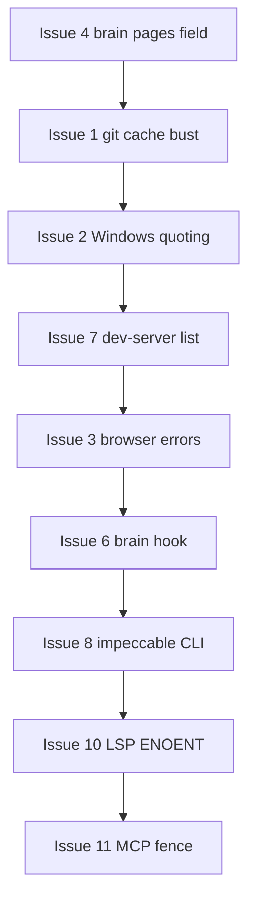

# Tool audit remediation plan (2026-08-06)

Source: black-box tool audit run from an external workspace (Business Simulator) against Minnow/0.0.2 on Windows + Electron. Six parallel codebase investigations were run in the Minnow repo to validate root causes and propose fixes.

## Executive summary

| Priority | Count | Theme |
|----------|-------|--------|
| P0 — ship first | 2 | Stale `git_status` cache; Windows shell quoting |
| P1 — high UX | 3 | Browser errors; `brain_ingest_source` message; dev-server list state |
| P2 — polish | 4 | Brain post-commit hook noise; `run_impeccable` timeout; LSP ENOENT; MCP fence label |
| Out of scope | 3 | Test project failure (#5); expected cmd quirks (#9); aesthetics placeholder content (#12) |

Estimated effort: **~3–5 dev days** for P0+P1 with tests; **+1 day** for P2.

---

## Investigation map (sub-agents)

| Issue | Agent focus | Verdict |
|-------|-------------|---------|
| 1 `git_status` | [Result cache invalidation](6cce24fc-9f9c-4561-9679-82a1897c7bd3) | **Confirmed bug** — client `result-cache.ts` does not bust git reads on file mutations |
| 2 `execute_command` quotes | [One-shot spawn / `shell: true`](2fe9152c-ce48-4790-bd15-a984dd9e2e25) | **Partially mitigated** (MIN-427 `cmd.exe /d /s /c`); quoting still breaks for cmd semantics and `shell: true` fallthrough |
| 3 Browser tools | [Allowlist gate + screenshot upload](584ffaf5-62d2-4a29-9b8e-a209cd9209d8) | **UX / error-mapping** — not necessarily “backend missing”; misleading aggregate error |
| 4 `brain_ingest_source` | [Tool reads `paths` not `pages`](b58c0710-f8ad-47da-b64c-946b515f0501) | **Confirmed one-line bug** in `server/tools/brain-tools.js` |
| 6 + 7 Hook + dev servers | [Post-commit hook + lifecycle state](2b900be0-fc9d-4f54-9214-23dcfc6cbcbd) | **Confirmed** — hook lacks token/dev-host; idle `error` sticks on dev-server rows |
| 8 + 10 + 11 Impeccable/LSP/MCP | [Spawn path + untrusted wrap](6d9dbb3f-f6db-4257-8a25-dc8257d7d3cc) | **Confirmed** — `npx` from workspace cwd; ENOENT message; wrong `^mcp_` strip |

---

## P0 — Correctness (agents rely on these daily)

### Issue 1 — `git_status` stale untracked files

**Symptom:** New files from `save_file` / shell do not show as `??` in `git_status` until `git_add` / `git_commit`. Raw `git status --porcelain` is correct.

**Root cause:** `git_status` is session-cached (`tool-cache-policy.ts`: `cacheable: true`, `ttlMs: 0`). `INVALIDATION_MAP` busts git reads only on `git_add`, `git_commit`, `git_checkout` — not on file writes (`saveFileInvalidation` only targets file-read tools).

**Files:**
- `src/tools/result-cache.ts` — `saveFileInvalidation`, `move_file`, `copy_file`, `delete_path`, `FILE_TREE_MUTATING_TOOLS` fallback
- `test/tools/result-cache.test.mts` — add regression tests

**Fix:**
1. Extend file-mutation invalidation to include `GIT_READ_INVALIDATION_TARGETS` (`git_status`, `git_diff`, `git_log`).
2. Optionally bust git reads after successful `execute_command` (broad) or document that shell-only file changes need `git_status` with cache bypass — prefer invalidation on file tools first.
3. Add tests: `save_file` clears cached `git_status`; optional repo-wide `git_diff {}` bust.

**Acceptance:** After `save_file` of a new path, next `git_status` shows `??` without any git write tool.

---

### Issue 2 — Windows quoted arguments (`execute_command`, background, dev servers)

**Symptom:** `node -e "console.log('hello')"` fails; quoted dev-server commands exit immediately.

**Root cause:** Combination of (a) Node `spawn` with `shell: true` when one-shot resolution is skipped (`args.length > 0`), (b) `cmd.exe /s /c` quoting limits for nested double-quotes, (c) redundant `shell: true` at call sites despite `resolveOneShotSpawn` returning `shell: false`.

**Files:**
- `server/terminal/one-shot-spawn.js`
- `server/runtime/tools-middleware.js` (`toolExecuteCommand`)
- `server/dev-server/manager.js`
- `src/tools/client.ts` (streaming terminal path)
- `server/terminal/middleware.js` (pass `shellProfile` for parity)

**Fix (phased):**
1. **Phase A:** Remove redundant `shell: true` on Windows when `args` is empty; treat resolved spawn target as authoritative (`shell: false` after one-shot).
2. **Phase B:** Optional smart rewrite: detect `node -e <script>` (and `python -c`) → spawn with argv (`node`, `['-e', script]`, `shell: false`) — mirror `run_javascript`.
3. **Phase C:** Windows integration test for quoted `node -e` via `executeCommandBlocking` (skip on non-win32).
4. **Docs/prompts:** Steer agents to `run_javascript` for inline Node on Windows when strings are complex.

**Acceptance:** Audit repro command succeeds on win32; dev-server start with typical `npm run dev` (no broken quotes) runs until stopped.

---

## P1 — High UX impact

### Issue 3 — Browser tools unavailable / confusing errors

**Symptom:** `browser_navigate` → “Could not verify browser allowlist (is Minnow running locally?)”; `browser_screenshot` → `dataBase64 is required`.

**Root cause:**
- Allowlist: `checkBrowserNavigationAllowed` returns `null` for any non-OK fetch (401, 500, network, invalid URL → server 500). Message blames “local server” for all cases.
- Screenshot: empty `capturePage` still POSTs to API; server validation error leaks to user instead of “no preview page / guest unavailable”.

**Files:**
- `src/tools/browser-navigation-gate.ts`, `src/config/browser-meta.ts`
- `server/browser-allowlist-middleware.js`
- `src/tools/browser-preview-tools.ts`
- `server/browser-screenshot-middleware.js`
- `test/tools/browser-preview-tools.test.mts`

**Fix:**
1. Structured allowlist check result (`reason`: auth | network | invalid_url | denied).
2. Try/catch on `originFromUrl` in allowlist middleware → 400 not 500.
3. Screenshot: preflight `getInfo`; if empty base64, return friendly message before upload; optionally reveal preview panel like navigate.
4. When preview guest missing, consistent copy: “Preview browser not available — use Minnow desktop shell.”

**Acceptance:** Audit scenarios get actionable errors; screenshot with no tab never shows `dataBase64 is required`.

**Note:** If audit ran with server ping OK but allowlist 401, fix token path in gate messaging. Electron guest availability remains a separate check (`isPreviewAutomationReady`).

---

### Issue 4 — `brain_ingest_source` misleading success text

**Symptom:** Pages created; tool says “no wiki pages were created.”

**Root cause:** `ingestSource` returns `{ sourcePath, pages }`; `toolBrainIngestSource` reads `result.paths`.

**Files:**
- `server/tools/brain-tools.js` (~216–226)
- New test: mock `ingestSource` or handler unit test

**Fix:** Use `result.pages` (optional fallback `result.paths` for compatibility).

**Acceptance:** Success string lists paths when `pages.length > 0`.

---

### Issue 7 — `manage_dev_servers` list shows stale error / wrong port

**Symptom:** Idle primary entry `status=error`, “Health check timed out”; command/port disagree with `startup.md`.

**Root cause:**
- After health timeout, `status` stays `error` with no `runId`; `reconcileRow` does not demote idle `error` → `stopped`.
- List prefers persisted `row.command` / `row.port` over live effective guide.

**Files:**
- `server/dev-server/manager.js` — `reconcileRow`, `getDevServerStatusById`, stop early path
- `test/workspace/dev-server-manager.test.js`
- `documentation/templates/startup.md` — clarify template vs Minnow’s own `npm start` / 9473

**Fix:**
1. If `!runId` and `status === 'error'`, set `stopped` and move message to `lastError` (or clear `error` on list).
2. When not running, expose command/port/health from `effectiveGuide` / registry, not stale `row.*`.
3. Template doc: “user app” defaults vs Minnow repo dev.

**Acceptance:** List after failed start + stop shows `stopped`, not `error`; command matches current `startup.md` when idle.

---

## P2 — Polish and noise reduction

### Issue 6 — `git_commit` stderr `[minnow-brain-hook] fetch failed`

**Root cause:** Optional `post-commit` hook (`scripts/brain-git-post-commit.mjs`) calls cascade API without session token / dev-host resolution; failures exit 1 and appear in `git_commit` stderr via `formatProcessOutput`.

**Fix:**
1. Mirror `scripts/wait-for-minnow-dev.mjs`: `readDevHostState`, `readSessionTokenFile`, `X-Minnow-Token`.
2. Best-effort: connection/auth failure → exit 0, log only if `MINNOW_DEBUG=1`.
3. Prefer `MINNOW_PORT` / dev-host over polluted `PORT` env.

**Acceptance:** Commit succeeds with clean tool output when Minnow is down and hook is installed.

---

### Issue 8 — `run_impeccable detect` 60s timeout

**Root cause:** `runNpxImpeccable` uses `npx impeccable` with `cwd: projectRoot` (user workspace), not Minnow `appRoot` — can hang on package resolve/download.

**Fix:** Invoke bundled CLI: `node <appRoot>/node_modules/impeccable/cli/bin/cli.js detect …` with `IMPECCABLE_CONTEXT_DIR=projectRoot`; drop `npx` + Windows `shell: true` where possible.

**Files:** `server/impeccable/run-impeccable.js`, `test/impeccable/run-impeccable.test.mjs`

**Acceptance:** `detect` completes in Minnow repo and external workspace without network fetch to npm.

---

### Issue 10 — `get_lsp_diagnostics` missing file

**Root cause:** `getLspDiagnostics` returns `Error: ${err.message}` on read failure.

**Fix:** Branch `err.code === 'ENOENT'` → `Error: File not found: <workspace-relative path>`.

**Files:** `server/lsp/manager.js`, test in `test/lsp/`

---

### Issue 11 — MCP untrusted fence label `mcp:_fixture__echo`

**Root cause:** `wrapServerToolResult` uses `toolName.replace(/^mcp_/, '')` but MCP tools are `mcp__server__tool`.

**Fix:** Use `parseNamespacedName` from `server/mcp/bridge.js` → label e.g. `mcp:fixture/echo`.

**Files:** `server/security/untrusted.js`, new test `test/security/untrusted.test.mjs` or extend MCP tests.

---

## Out of scope (audit items)

| # | Item | Action |
|---|------|--------|
| 5 | Business Simulator `npm test` failure | Fix in user project (`SimulationOrchestrator` / `start()`), not Minnow |
| 9 | `pwd` not in cmd; CRLF warnings on `git add` | Document in tool descriptions or Windows shell prompt; no code change required |
| 12 | `load_aesthetics_reference` TODO bodies | Product/content task; track separately from tool bugs |

---

## Suggested implementation order

Issue 4 is a **5-minute fix** and should land first for quick win. Issues 1 and 2 are the highest agent impact.

---

## Test plan (CI)

| Change | Test |
|--------|------|
| Git cache | `test/tools/result-cache.test.mts` |
| Windows quotes | `test/server/windows-execute-command-quotes.test.mjs` (win32) |
| Brain ingest | `test/brain/` or brain-tools handler test |
| Dev servers | `test/workspace/dev-server-manager.test.js` |
| Browser | `test/tools/browser-preview-tools.test.mts` |
| Impeccable | `test/impeccable/run-impeccable.test.mjs` |
| Untrusted MCP | new security test |
| LSP | agent-diagnostics missing path |

Run: `npm test` scoped suites per `package.json` after each PR slice.

---

## Documentation updates

After implementation, update `documentation/context.md`:
- Tool result cache invalidates git read tools on filesystem mutations.
- Windows `execute_command` quoting / `run_javascript` guidance.
- Browser allowlist requires authenticated local API; preview requires Electron.
- Brain post-commit hook is best-effort optional.

---

## Todos

- [x] **P0-1** Extend `result-cache.ts` file mutations to invalidate `git_status` / `git_diff` / `git_log`; add tests
- [x] **P0-2a** Remove redundant Windows `shell: true` on one-shot spawn call sites
- [x] **P0-2b** Add `node -e` argv rewrite or document + Windows quote integration test
- [x] **P0-2c** Pass `shellProfile` in terminal middleware for streaming `execute_command`
- [x] **P1-3a** Structured allowlist errors in `browser-meta.ts` + gate
- [x] **P1-3b** Screenshot preflight and friendly empty-capture message
- [x] **P1-4** Fix `toolBrainIngestSource` to use `result.pages` + test
- [x] **P1-7a** Idle dev-server `error` → `stopped` reconciliation
- [x] **P1-7b** List API prefers effective guide when not running
- [x] **P2-6** Brain post-commit hook: token + dev-host + best-effort exit
- [x] **P2-8** Bundled impeccable CLI from `appRoot` instead of `npx`
- [x] **P2-10** Friendly ENOENT in `getLspDiagnostics`
- [x] **P2-11** MCP fence label via `parseNamespacedName`
- [x] **Docs** Refresh `documentation/context.md` for cache, shell, browser, hook behavior
