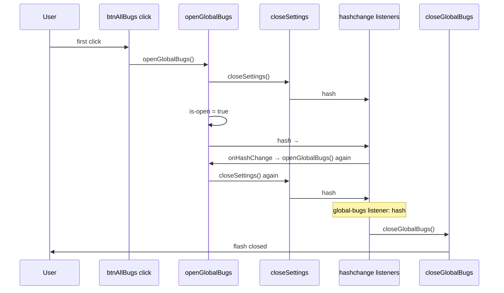

# BUG-001 — All bugs view closes immediately on first open

**Bug hunt ref:** [`documentation/bug-hunt-session-2026-05-24.md`](../../bug-hunt-session-2026-05-24.md) — BUG-001  
**Architecture ref:** [`documentation/context.md`](../../context.md) — Bug tracker (MIN-16), shell routing  
**Product plan:** [`documentation/plans/min-16-global-bugs.md`](../min-16-global-bugs.md)

---

## Summary

The sidebar **All bugs** button (`#btnAllBugs`) and `#/bugs` hash route should open the global bug Kanban (`#globalBugsView`) and keep it visible until the user navigates away or clicks **Back**. On the **first** interaction after load, the view **flashes open then closes**; a **second** click is reliable. The failure is almost certainly a **hash-routing race** in `src/ui/global-bugs-page.ts`, not bad bug data or Kanban render logic.

---

## Repro

1. Start Minnow with `npm start` (or `npm run dev` for UI-only repro of routing; Kanban data needs server for full QA).
2. Land on the main chat UI with the bugs view **not** open (`#globalBugsView` without `.is-open`).
3. Note `window.location.hash` (often `''`, `#`, or `#/` depending on browser and prior navigation).
4. Click **All bugs** in the chat sidebar footer **once**.
5. **Observe:** bugs page appears briefly, then chat shell returns (flash).
6. Click **All bugs** again.
7. **Observe:** bugs page opens and **stays** open.

**Expected:** Step 5 matches step 7 — stable open on first click.

**Actual:** First click open → immediate close; second click OK.

**Extra repro cases (for verification after fix):**

- Deep link: load app with `#/bugs` in URL (boot `initGlobalBugsPage()` should stay open).
- Open bugs from `#/benchmark` or `#/settings/general` (overlay handoff).
- **Back** (`#btnGlobalBugsBack`) then first open again.
- Mobile: sidebar open + tap **All bugs** (ensure backdrop / focus does not steal the route).

---

## Root cause hypothesis

### Primary: `openGlobalBugs()` + `closeSettings()` hash stomp and re-entrant `hashchange`

`openGlobalBugs()` always calls `closeSettings()` first:

```132:149:src/ui/global-bugs-page.ts
export function openGlobalBugs(): void {
  const root = getGlobalBugsRoot();
  const shell = getChatShell();
  if (!root || !shell) return;

  closeSettings();
  root.classList.add('is-open');
  shell.classList.add('hidden');
  // ...
  const nextHash = '#/bugs';
  if (window.location.hash !== nextHash) {
    window.location.hash = nextHash;
  }
}
```

`closeSettings()` **always** assigns `window.location.hash = '#/'`, even when settings is not open:

```221:228:src/ui/settings-page.ts
export function closeSettings(): void {
  // ...
  window.location.hash = '#/';
}
```

The global bugs router closes whenever the hash is **not** `#/bugs` but the page **is** open:

```190:197:src/ui/global-bugs-page.ts
function onHashChange(): void {
  if (window.location.hash.startsWith('#/bugs')) {
    openGlobalBugs();
    return;
  }
  if (isGlobalBugsPageOpen()) {
    closeGlobalBugs();
  }
}
```

**Failure sequence (re-entrancy):**



When `hash` becomes `#/bugs`, `onHashChange` calls `openGlobalBugs()` **again**. The second call runs `closeSettings()`, which sets `#/` **while** `.is-open` is already true. The global-bugs listener then sees `hash !== '#/bugs'` + `isGlobalBugsPageOpen()` → **`closeGlobalBugs()`**.

This matches “first click flaky, second click OK” if the first attempt leaves `hash` at `#/` and the second click sometimes avoids the nested `#/bugs` → `#/` stomp (e.g. when `closeSettings()` is a no-op because hash is already `#/`). Repro should be confirmed with logging; the logic above is the leading hypothesis.

### Contributing factors

| Factor | Location | Why it matters |
|--------|----------|----------------|
| Three competing `hashchange` listeners | `settings-page.ts`, `benchmark-page.ts`, `global-bugs-page.ts` | Init order in `main.ts`: settings → benchmark → global-bugs. Any intermediate `#/` navigation can close benchmark or fight bugs. |
| No “quiet” settings close | `closeSettings()` | Overlay pages need DOM teardown without resetting hash when opening another route. |
| `openGlobalBugs` not idempotent | `global-bugs-page.ts` | Re-entry from `hashchange` repeats the full open path including `closeSettings()`. |
| Full-page overlay pattern | `global-bugs-page.ts`, `settings-page.ts`, `benchmark-page.ts` | Same hide-`#appBody` pattern; bugs are the only route that calls `closeSettings()` on every open. |
| `#btnAllBugs` inside hidden shell | `index.html` — footer under `#appBody` | After open, the button is hidden; not the root cause of close, but relevant for focus/mobile QA. |

### Ruled out (low probability)

- Kanban mount/render throwing (would likely persist on second click).
- `bug_*` tools or store events closing the page (no close path in store).
- `dismissOpenLayers()` / Escape (user repro is single click).

---

## Affected files (paths)

| Path | Role |
|------|------|
| [`src/ui/global-bugs-page.ts`](../../../src/ui/global-bugs-page.ts) | **Primary** — `openGlobalBugs`, `closeGlobalBugs`, `onHashChange`, `#btnAllBugs` binding |
| [`src/ui/settings-page.ts`](../../../src/ui/settings-page.ts) | `closeSettings()` unconditional `hash = '#/'`; `#/bugs` branch in `onHashChange` |
| [`src/ui/benchmark-page.ts`](../../../src/ui/benchmark-page.ts) | Closes benchmark on non-benchmark hash; no `closeGlobalBugs` on open |
| [`src/ui/bug-board.ts`](../../../src/ui/bug-board.ts) | Kanban mount; `closeGlobalBugs` from pipeline actions only |
| [`src/main.ts`](../../../src/main.ts) | Init order: `initSettingsPage` → `initBenchmarkPage` → `initGlobalBugsPage` |
| [`index.html`](../../../index.html) | `#globalBugsView`, `#btnAllBugs`, `#appBody` structure |
| [`src/styles/global-bugs-page.css`](../../../src/styles/global-bugs-page.css) | `.global-bugs-page.is-open` visibility |
| [`src/tools/bug-board-tools.ts`](../../../src/tools/bug-board-tools.ts) | `isGlobalBugsPageOpen()` gate for `bug_*` tools (regression: must stay in sync) |
| [`test/state/global-bugs.test.mts`](../../../test/state/global-bugs.test.mts) | Data aggregation only — **no** routing tests today |

**Docs (after fix):** [`documentation/context.md`](../../context.md), bug-hunt session summary.

---

## Implementation steps

### 1. Confirm repro and instrument (pre-code)

- Add temporary `console.debug` in `openGlobalBugs`, `closeGlobalBugs`, and `onHashChange` with `hash` + `is-open` (remove before merge or guard with `import.meta.env.DEV`).
- Record hash before first click: `''`, `#/`, `#/benchmark`, `#/settings/general`.

### 2. Stop hash reset when opening bugs (recommended fix)

**Option A (preferred):** Add `closeSettingsWithoutHashChange()` (or optional param on `closeSettings({ updateHash?: boolean })`) that:

- Removes `.is-open` from `#settingsView`, restores `#appBody` / topbar if settings was open.
- Does **not** set `location.hash` when called from `openGlobalBugs()`.

Keep hash updates only in explicit user actions (Back, closing settings via UI).

**Option B:** In `openGlobalBugs()`, replace `closeSettings()` with:

- If settings page is open: `closeSettings()` **or** only DOM close without hash.
- If settings closed: **no-op** (do not set `#/`).

**Option C:** Navigation guard:

```ts
let globalBugsRouteLock = false;
// Set true around open path; onHashChange skips close branch while locked
```

Use only if A/B are insufficient; document the flag lifecycle.

### 3. Make `openGlobalBugs()` idempotent

Early return when already open **and** hash is `#/bugs`:

- Still refresh filters/kanban (`renderGlobalBugsList()`).
- Skip `closeSettings()` hash side effects and redundant hash write.

When opened via `hashchange` with hash already `#/bugs`, avoid calling `closeSettings()` entirely.

### 4. Harden `onHashChange`

- Close bugs only when navigating to a **known other route** (`#/settings`, `#/benchmark`, or explicit home `#/`) **and** not during an in-flight open.
- Consider a single `src/ui/hash-router.ts` module for overlay routes (bugs, settings, benchmark) to replace three listeners — **optional** stretch; not required for minimal fix.

### 5. Align overlay mutual exclusion

- Mirror `openSettings()` pattern: async `import('./global-bugs-page')` then `closeGlobalBugs()` when opening settings/benchmark — already partially present.
- When opening bugs from benchmark, ensure `closeBenchmark()` does not leave hash in a state that re-triggers close (today benchmark sets `#/` on close).

### 6. POLISH coordination (no scope creep)

- **POLISH-015** (keep topbar on `#/bugs`): re-test BUG-001 after topbar layout changes.
- **POLISH-014** (file panel visible on bugs): layout refactor may move `#globalBugsView`; retest routing after DOM move.

### 7. Cleanup

- Remove debug logs.
- Update `documentation/context.md` bug tracker bullet with “hash routing” note.
- Mark BUG-001 resolved in `documentation/bug-hunt-session-2026-05-24.md`.

---

## Tests

### New automated tests (required)

Add [`test/ui/global-bugs-page.test.mts`](../../../test/ui/global-bugs-page.test.mts) using the project’s jsdom/DOM test pattern (see other `test/ui/*.test.mts` if present, or minimal `node:test` + linkedom/jsdom per repo convention):

| Case | Setup | Action | Assert |
|------|--------|--------|--------|
| First open from `#/` | `hash = '#/'`, mount minimal DOM (`globalBugsView`, `appBody`, `btnAllBugs`) | `openGlobalBugs()` or click handler | `is-open` remains; `hash === '#/bugs'` |
| Hashchange re-entry | `hash = '#/bugs'`, call `openGlobalBugs()` twice | simulate `hashchange` | Still open; not `closeGlobalBugs` |
| Close on navigate away | open bugs | `hash = '#/'` via `onHashChange` | `is-open` false |
| Settings quiet close | settings `is-open`, open bugs | open path | settings closed, bugs open, hash `#/bugs` without intermediate close |

Export small test hooks only if necessary (`setGlobalBugsPageOpenForTests` already exists on tools; prefer testing public `open`/`close`/`isGlobalBugsPageOpen`).

### Existing suites (must stay green)

- `npm run test` — `test/state/global-bugs.test.mts`, `test/tools/bug-board-tools.test.mts`, `test/state/bug-board-store.test.mts`
- `npx tsc --noEmit`

### Manual test plan

- [ ] First click **All bugs** from cold load (`hash` empty and `#/`).
- [ ] Open from `#/benchmark`, then from `#/settings/tools`.
- [ ] Refresh on `#/bugs` — page stays open.
- [ ] **Back** → chat; first open again.
- [ ] **Investigate** on a card → switches chat and closes bugs (`openGlobalBugInChat`).
- [ ] `bug_add` in chat fails with screen closed; succeeds with screen open.

---

## Related bugs

| ID | Relationship |
|----|----------------|
| **POLISH-010** | Layout/copy on bugs page — independent of open/close race |
| **POLISH-014** | File panel + bugs layout — retest routing after shell move |
| **POLISH-015** | Topbar visibility on `#/bugs` — explicitly notes BUG-001 is separate; re-verify after either fix |
| **POLISH-023** | Bug detail view — depends on stable `#/bugs` |
| **BUG-002**–**BUG-009** | Benchmark suite failures — same `hashchange` multi-listener pattern; no direct overlap except shared routing hygiene |

---

## Todos checklist

- [ ] Reproduce with hash instrumentation (`confirm-repro`)
- [ ] Implement quiet settings close / remove `#/` stomp from `openGlobalBugs` (`close-settings-quiet`, `fix-open-path`)
- [ ] Harden `onHashChange` / optional route lock (`fix-hash-handler`)
- [ ] Audit settings + benchmark listeners (`align-benchmark-settings`)
- [ ] Add `test/ui/global-bugs-page.test.mts` (`unit-tests-routing`)
- [ ] Manual QA matrix (`manual-verify`)
- [ ] Update `documentation/context.md` + bug-hunt doc (`docs-context`)

---

## Verification (APPROVED)

**Date:** 2026-05-24

**Notes:** Cited paths verified in repo: `openGlobalBugs()` calls `closeSettings()` before setting `#/bugs` (`src/ui/global-bugs-page.ts` 132–149); `closeSettings()` unconditionally sets `window.location.hash = '#/'` (`src/ui/settings-page.ts` 221–228); `onHashChange` closes when hash is not `#/bugs` but view is open (190–197). Re-entrant sequence matches bug-hunt repro (first-click flash, second click OK). Fix options are actionable and scoped.

**Linear:** [MIN-98](https://linear.app/minnowai/issue/MIN-98/bug-001-all-bugs-view-closes-on-first-open)
