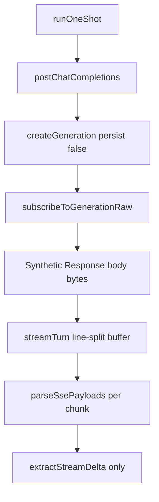

# BUG-002 — Streaming completion benchmark fails all models

**Tracker:** [documentation/bug-hunt-session-2026-05-24.md](../../bug-hunt-session-2026-05-24.md) — BUG-002  
**Severity:** Major  
**Area:** Benchmark (`#/benchmark`) — Capability suite test **`cap-stream`** / **Streaming completion** (`src/benchmark/suites/capability.ts`)  
**Status:** Open (plan only — no implementation in this document)

---

## Summary

The **Streaming completion** capability test fails for **every model** in manual QA, while the benchmark run often completes without throwing. The test uses `runOneShot` with a short prompt (`maxTokens: 32`) and passes only when `stream.text.length > 0`. The same driver powers Speed, Skills, and parts of Coding — so empty `text` also explains **BUG-003** (`0 chars` but Pass on Speed short runs).

The failure is **systemic in the benchmark streaming path**, not per-model capability: the headless driver does not mirror how main chat accumulates streamed assistant output (especially **reasoning** channels), does not apply the **non-streaming fallback** used elsewhere, and re-parses SSE through a **more fragile** byte pipeline than `subscribeToGeneration`.

---

## Root cause

### 1. Primary — `streamTurn` only counts prose deltas (reasoning ignored)

| Layer | Behavior |
|-------|----------|
| **Chat tool loop** (`src/tools/loop.ts` → `streamCompletionTurn`) | `extractReasoningDelta` → thought UI; `extractStreamDelta` → `fullText` |
| **Benchmark** (`src/benchmark/llm-driver.ts` → `streamTurn`) | **`extractStreamDelta` only** → `fullText` |

LM Studio and many local models with **reasoning / thinking** enabled stream tokens on `delta.reasoning` or `delta.reasoning_content` while `delta.content` stays empty for some or all of the turn (see `ChatCompletionChoiceDelta` in `src/types.ts`). The benchmark then returns `text: ''` with HTTP 200 and a normal `finish_reason` — **`cap-stream` fails** even though the provider streamed data.

This matches “fails on all models” when reasoning is on globally or when the active model family always emits reasoning-first streams.

### 2. Secondary — `runOneShot` has no empty-stream fallback

| API | Empty `fullText` after stream |
|-----|------------------------------|
| `runOneShot` | Returns `text: ''` — **no fallback** |
| `runToolLoop` | Calls `tryNonStreamingFallback` when `!lastText` |
| `sendMessage` / `runChatTurn` | `tryNonStreamingFallback` + `extractMessageText` / `extractReasoningMessage` |

Benchmark one-shot probes never recover when SSE yields no prose deltas.

### 3. Tertiary — Double SSE hop with weaker parsing

Flow today:

Main chat uses **`subscribeToGeneration`** → `feedSseBlock` (buffers on `\n\n`) → `parseSsePayloads` → `handleChunk`.

Benchmark uses **`subscribeToGenerationRaw`** → re-encode → **`streamTurn`** splits on single `\n` and joins partial lines. Malformed or split `data:` JSON lines are **silently ignored** (`parseSsePayloads` empty `catch`), which can zero out `fullText` without throwing.

### 4. Related environment issues (not the only cause)

- **BUG-016 / BUG-020:** Browser chat can throw on `ReadableStreamDefaultController` close when SSE JSON is malformed (`AGENTS.md` llmster note). Benchmark uses the same generations API in-browser; truncated streams could yield empty text **without** a driver throw if bad lines are skipped.
- **BUG-003:** Speed marks **Pass** on “no throw” while showing `0 chars` — same empty `runOneShot.text`; fixing BUG-002 should raise Speed char counts; BUG-003 still needs fail-closed suite logic.

### Pass criterion (unchanged intent)

`capability.ts` (~L73–94): `runOneShot` → `passed: stream.text.length > 0`, details `stream.text.slice(0, 80)`. The criterion is reasonable once `text` reflects **any** streamed assistant output the integration cares about (prose and/or reasoning for bench purposes).

---

## Affected files

| File | Role |
|------|------|
| `src/benchmark/llm-driver.ts` | **`streamTurn`**, **`runOneShot`** — primary fix (accumulation, fallback, optional subscribe path) |
| `src/benchmark/suites/capability.ts` | **`cap-stream`** pass/fail and richer failure `details` |
| `src/api/chat.ts` | `extractStreamDelta`, `parseSsePayloads`, `tryNonStreamingFallback` |
| `src/api/reasoning.ts` | `extractReasoningDelta`, `extractReasoningMessage` |
| `src/api/generations.ts` | `subscribeToGeneration` vs `subscribeToGenerationRaw` |
| `src/providers/fetch-chat.ts` | `postChatCompletions` shim used by benchmark |
| `src/benchmark/runner.ts` | Orchestration (unchanged unless cancel/progress — see BUG-005) |
| `src/benchmark/suites/speed.ts` | Downstream symptom (**BUG-003**); verify char counts after BUG-002 |
| `src/ui/benchmark-page.ts` | Displays `TestResult.details` (no change required for core fix) |
| `documentation/context.md` | Benchmark section — update when fix ships |
| `documentation/bug-hunt-session-2026-05-24.md` | Mark resolved when shipped |

**Optional new files:** `src/benchmark/stream-text.ts` (shared `accumulateAssistantStreamDelta`), `test/benchmark/llm-driver.test.mts`.

---

## Steps

### Phase 0 — Confirm diagnosis

1. `npm start`, open `#/benchmark`, run **Quick** with the same provider/model as bug hunt.
2. Note **`cap-stream`** card: Fail, details empty or short error vs preview text.
3. In chat, send “Say hello” with the same model — if **Thinking** fills but assistant body is empty, reasoning-only stream is likely.
4. Optional dev probe: in `streamTurn` `handleChunk`, count chunks where `extractStreamDelta` vs `extractReasoningDelta` are non-empty (remove before merge).

### Phase 1 — Fix text accumulation (core)

1. Add a small helper (e.g. `src/benchmark/stream-text.ts` or inline in `llm-driver.ts`):

   - `accumulateBenchmarkStreamDelta(chunk): string` → `extractStreamDelta(chunk) + extractReasoningDelta(chunk)` (concat per chunk; same pattern as treating “stream had bytes”).

2. In `streamTurn` `handleChunk`, append that combined delta to `fullText` (still set `tFirst` on first non-empty combined delta).

3. **Product note:** For **Streaming completion**, counting reasoning proves the SSE path works. If product wants prose-only, gate `cap-stream` on prose only but add a separate skipped/active test for reasoning streams — default recommendation is **count both** for `runOneShot.text`.

### Phase 2 — Empty-stream fallback

1. After the read loop in `streamTurn` (or at end of `runOneShot`), if `fullText.trim()` is empty:

   - Call `tryNonStreamingFallback` with the same body (minus `stream: true`).
   - Set text from `extractMessageText(message)` and `extractReasoningMessage(message)` (mirror `runChatTurn` ~L1106–1110).

2. Ensure `AbortSignal` propagates; do not swallow `AbortError`.

### Phase 3 — Harden SSE parsing (choose one)

**Option A (preferred):** Refactor `streamTurn` to use `createGeneration` + `subscribeToGeneration` with a `handleChunk` callback (same as `streamCompletionTurn`), eliminating `postChatCompletions` + manual `getReader` for benchmarks.

**Option B (minimal):** Keep `postChatCompletions` but buffer SSE on `\n\n` before `parseSsePayloads`, matching `feedSseBlock` in `generations.ts`.

### Phase 4 — Suite diagnostics

1. In `capability.ts`, on fail with empty text, set `details` to something actionable, e.g. `empty stream (finish=${stream.finishReason ?? 'none'})` or include `completion_tokens` from `stream.timing.usage` if present.
2. On pass, keep `slice(0, 80)` preview; optionally prefix `reasoning+prose` in dev builds only (skip for production UI noise).

### Phase 5 — Coordination

1. Re-run Quick bench; confirm **`cap-stream`** Pass for models that stream.
2. Land or verify **BUG-003** so Speed cannot Pass with `0 chars`.
3. Update `documentation/context.md` and bug-hunt status.

---

## Tests

| Layer | Action |
|-------|--------|
| **Unit (new)** | `test/benchmark/llm-driver.test.mts` — mock `postChatCompletions` / generation subscribe or test `accumulateBenchmarkStreamDelta` + parsing helpers with fixture chunks: content-only, reasoning-only, mixed, usage-only final chunk |
| **Unit (existing)** | `npm run test:benchmark` — `test/benchmark/scoring.test.mts`, `test/ui/benchmark-page-html.test.mjs` must still pass |
| **Typecheck** | `npx tsc --noEmit` on touched files |
| **Manual** | `#/benchmark` Quick: `cap-stream` Pass; Speed short runs show `> 0 chars` when stream works |
| **Manual matrix** | Same model with reasoning enabled vs disabled in LM Studio; one non-reasoning model as control |
| **Headless** | `node scripts/benchmark-headless.mjs` — API ping only today; **not** sufficient for LLM validation |

**Fixture examples for unit tests (static JSON chunks):**

- Reasoning-only delta: `{ choices: [{ delta: { reasoning_content: "hello" } }] }` → expect non-empty accumulated text after fix.
- Content-only delta: `{ choices: [{ delta: { content: "hi" } }] }` → expect `"hi"`.
- Empty choices / usage-only: should not pass `cap-stream` unless fallback mock returns message body.

---

## Related

| ID / doc | Relationship |
|----------|----------------|
| **BUG-003** | Speed `0 chars` + Pass — same `runOneShot`; fix driver then tighten Speed pass rules |
| **BUG-008** | Modes “expected tool missing” — may improve if stream text/tool rounds work |
| **BUG-009** | Skills failures — same driver |
| **BUG-005** | Stop ineffective — orthogonal; abort should cancel in-flight `runOneShot` |
| **BUG-016 / BUG-020** | Chat stream JSON errors on close — shared generations/SSE stack |
| [documentation/plans/benchmark-system-implementation.md](../benchmark-system-implementation.md) | Benchmark product architecture |
| [documentation/context.md](../../context.md) | Bench uses `postChatCompletions`, `persist: false` |
| [AGENTS.md](../../../AGENTS.md) | Known llmster browser SSE issue |
| [documentation/plans/Build out/feature-11-model-capability-detection.md](../Build%20out/feature-11-model-capability-detection.md) | Future capability flags (multimodal/reasoning) — long-term replace heuristics |

---

## Todos

- [ ] **confirm-repro** — Reproduce `cap-stream` fail; note provider/model and chat vs bench behavior
- [ ] **diagnose-stream-path** — Confirm empty `fullText` with reasoning chunks present (logging or probe)
- [ ] **accumulate-assistant-text** — Use content + reasoning deltas in `streamTurn` / `runOneShot.text`
- [ ] **empty-stream-fallback** — Add `tryNonStreamingFallback` path when stream text empty
- [ ] **harden-sse-parse** — Align benchmark SSE parsing with `subscribeToGeneration` / `\n\n` blocks
- [ ] **cap-stream-diagnostics** — Richer failure details in `capability.ts`
- [ ] **unit-tests-llm-driver** — New `test/benchmark/llm-driver.test.mts`
- [ ] **coordinate-bug-003** — Re-verify Speed char counts; ship BUG-003 fail-closed if needed
- [ ] **manual-verify** — Quick/Full bench + reasoning on/off matrix
- [ ] **docs-context** — Update `documentation/context.md` and bug-hunt doc when fixed

---

## Acceptance criteria

- [ ] **`cap-stream`** passes on Quick preset when the active provider returns streamed content or reasoning for “Say hello” (non-empty `runOneShot.text`).
- [ ] **`cap-stream`** fails with clear `details` when the stream truly returns no assistant tokens (not a generic Fail with blank details).
- [ ] Speed short runs show **`> 0 chars`** for the same working model (or Fail per BUG-003 if still empty).
- [ ] No regression: `npm run test:benchmark`, `npx tsc --noEmit`.
- [ ] Fix does not pollute chat sessions (`persist: false` unchanged).

---

## Out of scope

- Changing benchmark UI layout (**POLISH-002**–**005**).
- Fixing **BUG-005** Stop / generation cancel (separate plan).
- Multimodal probe (**BUG-004**).
- Provider-side llmster SSE fixes (may still help chat **BUG-016**/**BUG-020**).
- Feature 21 local eval harness (`~/.minnow/evals/`).

---

## References

- Bug report: [documentation/bug-hunt-session-2026-05-24.md](../../bug-hunt-session-2026-05-24.md) — BUG-002
- Architecture: [documentation/context.md](../../context.md) — Benchmark (Bench)
- Related plan: [BUG-003-speed-zero-chars-pass.md](./BUG-003-speed-zero-chars-pass.md)
- Implementation spec: [documentation/plans/benchmark-system-implementation.md](../benchmark-system-implementation.md)

---

## Verification (APPROVED)

**Date:** 2026-05-24  
**Verifier:** Agent (BUG-002 plan review + benchmark artifact poll)  
**Plan poll:** Plan file read at session start; implementation watch over ~25min — no changes to `src/benchmark/llm-driver.ts` or `src/benchmark/suites/capability.ts` (`git diff` clean).

### Code path verification

| Claim | Result |
|-------|--------|
| `streamTurn` accumulates **`extractStreamDelta` only** (no `extractReasoningDelta`) | **Confirmed** — `src/benchmark/llm-driver.ts` L138–145 |
| `runOneShot` has **no** `tryNonStreamingFallback` when text empty | **Confirmed** — contrast `runToolLoop` L256–271 |
| Chat `streamCompletionTurn` uses reasoning deltas separately from prose | **Confirmed** — `src/tools/loop.ts` L463–472 |
| `cap-stream` passes only when `stream.text.length > 0` | **Confirmed** — `src/benchmark/suites/capability.ts` L90 |
| No `test/benchmark/llm-driver.test.mts` | **Confirmed** — only `scoring.test.mts` under `npm run test:benchmark` |
| Fix not yet implemented | **Confirmed** — no diff on primary files |

### Saved benchmark run (live QA artifact)

Quick preset, LM Studio `qwen/qwen3.6-35b-a3b`, run `~/.minnow/benchmarks/2026-05-24T21-01-34-135Z.json`:

| Test | Result | Details |
|------|--------|---------|
| `cap-stream` | **Fail** | `""` (empty) |
| `speed-short-1` … `3` | **Pass** | `0 chars` each (BUG-003 symptom) |
| Other capability tests | Pass | Provider, usage, tools schema, models list |

Supports systemic empty `runOneShot.text` with HTTP 200 (reasoning-only stream / missing fallback per plan root cause).

### Automated checks

| Check | Result |
|-------|--------|
| `npm run test:benchmark` | **Pass** (5 scoring + 15 UI HTML) |
| `npx tsc --noEmit` | **Pass** |
| Fresh `#/benchmark` Quick during poll | **Deferred** — dev server not reachable from verifier shell (`localhost:5182` / `1234` connection refused); artifact above used |

### Bug-hunt alignment

[documentation/bug-hunt-session-2026-05-24.md](../../bug-hunt-session-2026-05-24.md) BUG-002 repro, expected/actual, and notes match cited code and saved run. Status remains **Open** until Phases 1–3 ship.

### Plan quality

- Root cause analysis (reasoning deltas, empty fallback, SSE re-parse) matches implementation.
- Proposed fix phases and acceptance criteria are actionable; BUG-003 coordination called out.
- Out of scope boundaries are clear.

### Outcome

**APPROVED** — Plan is ready for implementation. Linear issue created for tracking.

**Linear (tracking):** [MIN-96](https://linear.app/minnowai/issue/MIN-96/bug-002-benchmark-streaming-completion-fails)
