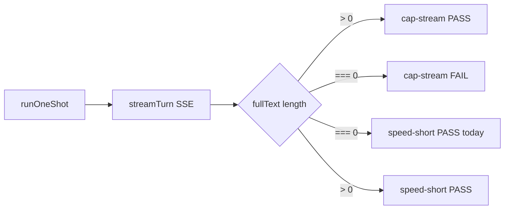

# BUG-003 — Speed benchmark reports 0 chars but passes

**Tracker:** [documentation/bug-hunt-session-2026-05-24.md](../../bug-hunt-session-2026-05-24.md) — BUG-003  
**Severity:** Major  
**Area:** Benchmark — **Speed** suite (`src/benchmark/suites/speed.ts`), tests `speed-short-1` … `speed-short-3`, `speed-long-1`  
**Status:** Fixed (MIN-63, 2026-05-25)

---

## Summary

Speed benchmark cards show **`0 chars`** in the result **details** while the test is marked **passed**. Users interpret a green checkmark as a successful generation, but the suite never validates that the model returned non-empty completion text. This is misleading UX and inconsistent with the **Capability** suite’s **Streaming completion** test (`cap-stream`), which requires `stream.text.length > 0`.

---

## Problem statement

| | |
|---|---|
| **Expected** | Short runs **pass** only when `runOneShot` returns non-empty text **or** **fail** (with clear details) when completion text is empty. |
| **Actual** | `runOneShot` resolves without throwing; `passed: true` and `details: "0 chars"`. |
| **Impact** | False positives in Speed suite; headline TTFT/tok/s metrics may be computed from timing-only “success” with no tokens in `fullText`. |

---

## Current state

### Benchmark architecture (from `documentation/context.md`)

- Full-page **Benchmark** at `#/benchmark`; **Quick** preset includes **capability + speed + modes**.
- Suites live under `src/benchmark/`; completions use `runOneShot` in `llm-driver.ts` (`postChatCompletions`, `persist: false`).
- UI: `src/ui/benchmark-page.ts` renders per-test cards from `TestResult` (`details`, `passed`, metrics).

### Speed suite behavior (`src/benchmark/suites/speed.ts`)

| Test ID | Label | Pass today | Details |
|---------|-------|------------|---------|
| `speed-short-1` … `3` | Short run 1–3 | `true` if `runOneShot` does not throw | `` `${out.text.length} chars` `` |
| `speed-long-1` | Sustained throughput | `true` if no throw | *(none on success)* |

Short-run loop (lines ~27–51): always sets `passed: true` and `score: 1` on success path — **no** `out.text.length` check.

Long run (lines ~67–92): same unconditional pass on success; no char count in details.

Headline metrics (`headlineTtftMs`, `headlineTokPerSec`) still aggregate `out.timing` samples even when `out.text` is empty.

### Capability suite contrast (`src/benchmark/suites/capability.ts`)

`cap-stream` (**Streaming completion**) uses the same `runOneShot` driver but passes only when:

```ts
stream.text.length > 0
```

Details preview: `stream.text.slice(0, 80)`.

### LLM driver (`src/benchmark/llm-driver.ts`)

- `runOneShot` → `streamTurn` → accumulates `fullText` from SSE deltas; returns `text: turn.fullText.trim()`.
- **No** non-streaming fallback in `runOneShot` (fallback exists only in `runToolLoop` when `!lastText`).
- Empty stream can complete “successfully” (HTTP 200, no throw) with `text === ''`.

### Tests today

- `npm run test:benchmark` → `test/benchmark/scoring.test.mts` (scoring helpers only).
- **No** suite-level tests for `runSpeedSuite` pass/fail logic.

---

## Root cause analysis

1. **Primary (suite logic):** Speed short runs treat “no exception” as pass. Displaying `0 chars` is accurate reporting of `out.text.length` but contradicts the pass badge.
2. **Secondary (shared stream path):** Empty `fullText` without error is plausible when streaming/parser/provider returns no content deltas — same class of issue as **BUG-002** (capability streaming test fails or empty text).
3. **Inconsistency:** Capability enforces non-empty text; Speed does not, so the same broken stream can fail **cap-stream** while **speed-short-*** still pass (or all fail in BUG-002 depending on environment).



---

## Proposed fix (recommended)

### A. Suite-level pass criteria (required for BUG-003)

Treat Speed completions like Capability streaming:

- **Pass:** `out.text.length > 0` after successful `runOneShot`.
- **Fail:** `score: 0`, `passed: false`, `details` e.g. `empty completion (0 chars)` or include `finishReason` if present.
- **Pass details:** Keep `` `${out.text.length} chars` `` or add short preview `` `${len} chars — ${out.text.slice(0, 80)}` `` (truncate for UI).

Apply to **all** Speed tests that depend on model text (`speed-short-*` and `speed-long-1`).

### B. Shared helper (optional, low scope)

Add e.g. `src/benchmark/completion-valid.ts`:

```ts
export function hasNonEmptyCompletion(text: string): boolean {
  return text.trim().length > 0;
}
```

Use in `capability.ts` (`cap-stream`) and `speed.ts` to avoid drift.

### C. Driver / BUG-002 (out of scope unless coordinated)

Fixing empty streams in `runOneShot` (parser, provider proxy, non-streaming fallback) is **BUG-002** territory. BUG-003 should still land **fail-closed** suite logic so empty text never shows as Pass even if the stream bug persists.

**Decision point:** Implement BUG-003 first (fast, correct semantics) vs block on BUG-002 (might still show all Speed fails until stream works).

---

## Acceptance criteria

- [ ] **Short run 1–3:** `passed === true` only when `out.text.length > 0`; `passed === false` when text is empty (no throw required).
- [ ] **Sustained throughput (`speed-long-1`):** Same non-empty rule; failure includes actionable `details`.
- [ ] **UI:** `#/benchmark` cards never show **Pass** alongside **`0 chars`** without an explicit skip reason.
- [ ] **Suite aggregates:** `suite.passed` / `suite.failed` counts reflect failed empty completions; `score` is 0 on those tests.
- [ ] **Headline metrics:** Document or code comment whether TTFT/tok/s samples from failed-empty runs are excluded (recommend: only push samples when `out.text.length > 0` for consistency).
- [ ] **Tests:** New `test/benchmark/speed-suite.test.mts` covers empty vs non-empty mocked `runOneShot` outcomes without live LLM.
- [ ] **Regression:** `npm run test:benchmark` passes; `npx tsc --noEmit` clean for touched files.

---

## Implementation plan

### Phase 1 — Pass criteria (core fix)

1. In `src/benchmark/suites/speed.ts`, after each successful `runOneShot`:
   - `const ok = out.text.length > 0`
   - `passed: ok`, `score: ok ? 1 : 0`
   - `details` for fail: `empty completion (0 chars)`; for pass: existing char count (optional preview).
2. Mirror for `speed-long-1`.
3. Optionally gate `ttftSamples` / `tpsSamples` pushes on `ok` so headlines are not skewed by empty runs.

### Phase 2 — Consistency and tests

1. Extract shared `hasNonEmptyCompletion` if touching `capability.ts` is acceptable in same PR; otherwise duplicate one-liner and add TODO link to helper in follow-up.
2. Add `test/benchmark/speed-suite.test.mts`:
   - Mock `../llm-driver.ts` `runOneShot` to return `{ text: '', timing: { ... } }` → expect fail.
   - Mock non-empty text → expect pass and details contain char count.
3. Run `npm run test:benchmark` and full `npm test` if CI expects it.

### Phase 3 — Verification and docs

1. Manual: `npm start`, `#/benchmark`, Quick preset with known-good model → Short runs show **> 0 chars** + Pass.
2. Manual: reproduce empty stream (same env as bug hunt) → Short runs **Fail** with empty message, not Pass.
3. Update `documentation/bug-hunt-session-2026-05-24.md` BUG-003 status when shipped.
4. Update `documentation/context.md` Benchmark bullet if pass semantics are documented there.

---

## Files to touch

| File | Change |
|------|--------|
| `src/benchmark/suites/speed.ts` | Pass criteria, details, optional sample gating |
| `src/benchmark/suites/capability.ts` | Optional shared helper import |
| `src/benchmark/completion-valid.ts` | Optional new helper |
| `test/benchmark/speed-suite.test.mts` | New unit tests |
| `documentation/bug-hunt-session-2026-05-24.md` | Status when fixed |
| `documentation/context.md` | Note Speed pass requires non-empty completion |

**Not required for BUG-003 alone:** `src/ui/benchmark-page.ts` (already shows `details` + pass state from `TestResult`).

---

## Testing strategy

| Layer | Action |
|-------|--------|
| **Unit** | Mock `runOneShot`; assert `TestResult.passed` / `score` / `details` for empty vs non-empty |
| **Integration** | Existing `scoring.test.mts` unchanged |
| **Manual** | Quick bench on active model; confirm no Pass + `0 chars` |
| **Headless** | Optional: `node scripts/benchmark-headless.mjs` after stream fix — not blocking suite-logic fix |

---

## Risks and open questions

1. **All Speed tests fail until BUG-002 is fixed** — Acceptable if empty stream is the real environment; otherwise users see red Speed rows but honest state. Prefer fixing BUG-002 in same release if bench is unusable.
2. **Timing-only tests** — Speed is labeled timing-focused; confirm product intent: *timing without tokens* should **fail**, not pass with `0 chars`.
3. **`speed-long-1` without char details on pass** — Consider adding char count for parity with short runs.
4. **lmster / known streaming issue** — `AGENTS.md` notes browser streaming issues; bench uses server `postChatCompletions`. Capture provider when reproducing.

### Questions for product / QA alignment

- Should empty completion **fail** the whole Speed suite score or only individual tests? *(Proposed: per-test fail, suite `failed` count increments.)*
- Should we **skip** Speed tests when `cap-stream` fails in the same run? *(Proposed: no — independent tests; optional enhancement.)*
- Fix BUG-002 and BUG-003 in one PR or sequential? *(Proposed: BUG-003 first for correct semantics; BUG-002 for root stream fix.)*

---

## Out of scope

- Changing benchmark UI layout or card animations.
- Non-streaming fallback inside `runOneShot` (unless explicitly bundled with BUG-002).
- Multimodal / tools / other suites (see BUG-004, BUG-006 in bug-hunt doc).
- Feature 21 local eval harness.

---

## References

- Bug report: [documentation/bug-hunt-session-2026-05-24.md](../../bug-hunt-session-2026-05-24.md) — BUG-003
- Architecture: [documentation/context.md](../../context.md) — Benchmark (Bench)
- System plan: [documentation/plans/benchmark-system-implementation.md](../benchmark-system-implementation.md)
- Related bug: BUG-002 — Streaming completion / empty `runOneShot` text

---

## Verification (APPROVED)

**Date:** 2026-05-24  
**Verifier:** Agent (BUG-003 plan review)  
**Plan poll:** Plan file present at session start (no 25min wait required).

### Code path verification

| Claim | Result |
|-------|--------|
| `speed-short-*` sets `passed: true` when `runOneShot` succeeds without checking `out.text.length` | **Confirmed** — `src/benchmark/suites/speed.ts` L40–51 |
| Details show `` `${out.text.length} chars` `` (can be `0 chars`) | **Confirmed** — L50 |
| `speed-long-1` passes unconditionally on success; no char details | **Confirmed** — L83–92 |
| `cap-stream` requires `stream.text.length > 0` | **Confirmed** — `src/benchmark/suites/capability.ts` L90 |
| No `test/benchmark/speed-suite.test.mts` | **Confirmed** — only `scoring.test.mts` runs under `npm run test:benchmark` |
| Fix not yet implemented | **Confirmed** — `git diff` clean on `speed.ts` |

### Bug-hunt alignment

[documentation/bug-hunt-session-2026-05-24.md](../../bug-hunt-session-2026-05-24.md) BUG-003 repro steps, expected/actual, and notes match the cited code. Status remains **Open** until Phase 1 ships.

### Plan quality

- Root cause (suite logic vs stream path) is accurate; BUG-002 coordination called out appropriately.
- Proposed fail-closed pass criteria align with `cap-stream` semantics.
- Acceptance criteria and file list are actionable.
- `npm run test:benchmark` passes (5 scoring + 15 UI HTML tests); no regression from plan-only state.

### Outcome

**APPROVED** — Plan is ready for implementation. Linear issue created for tracking.

**Linear (tracking):** [MIN-63](https://linear.app/minnowai/issue/MIN-63/bug-003-speed-benchmark-0-chars-pass)
