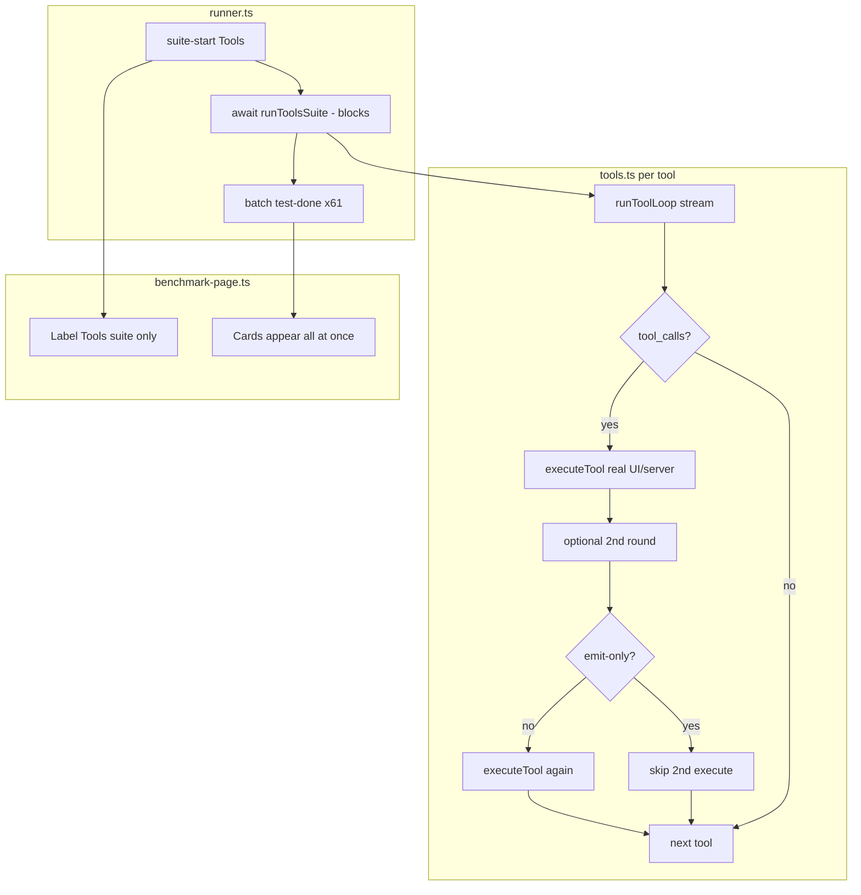

# BUG-006 — Benchmark stuck on tools suite

**Tracker:** [documentation/bug-hunt-session-2026-05-24.md](../../bug-hunt-session-2026-05-24.md) — BUG-006  
**Severity:** Major  
**Area:** Benchmark — **Tools** suite (`src/benchmark/suites/tools.ts`, `tools-fixtures.ts`); Full preset (`runner.ts` → `FULL_SUITES` includes `tools`)  
**Status:** Verified (code review 2026-05-24) — open for implementation  
**Linear:** [MIN-67](https://linear.app/minnowai/issue/MIN-67/bug-006-benchmark-stuck-on-tools-suite) (created on plan approval)

---

## Verification log (2026-05-24)

| Check | Result |
|-------|--------|
| `runner.ts` batches Tools `test-done` after full `runToolsSuite()` | **Confirmed** — lines 109–115 |
| Tool count | **61** built-ins (`BUILT_IN_TOOLS`); **35** `serverRequired` |
| Per-test timeout in bench driver | **None** — `streamTurn` / `executeTool` unbounded |
| `runToolLoop` runs real `executeTool` | **Confirmed** — approval/`ask_question`/browser paths can block |
| Duplicate `executeTool` in `tools.ts` | **Confirmed** — after loop when `nameOk && !emitOnly` |
| Live 25+ min Full repro | **Recommended** — bisect blocking `tool.id` if infinite vs slow |

---

## Summary

On **Benchmark Full**, the run appears to **stall when execution reaches the Tools suite**: the progress bar and suite header show **Tools**, but **no per-tool cards appear** for a long time (or ever), and later suites (**Skills**, **Coding**) may never run. Users report the benchmark **hangs** or **stops** at Tools.

Investigation shows two overlapping problems: (1) **UX/progress** — the runner emits all Tools `test-done` events only **after** the entire suite finishes, so the UI looks frozen for the whole serial battery (~61 built-in tools × LLM round-trips); (2) **execution risk** — individual probes can **block indefinitely** on real tool execution (browser CDP, `ask_question` modal, permission **Ask** approval, sub-agent spawn) with **no per-test timeout**.

---

## Problem statement

| | |
|---|---|
| **Expected** | Tools tests complete (pass/fail/skip) with visible progress; run continues to **Skills**, **Modes** (if in preset), **Coding**, then finishes. |
| **Actual** | UI stuck on **Tools** — no further perceived progress; run may never complete later suites. |
| **Impact** | Full benchmark unusable for regression checks; Stop (**BUG-005**) ineffective while hung inside a tool/stream. |

---

## Steps to reproduce

1. Start Minnow with **`npm start`** (tool server required for `serverRequired` tools; many probes skip without it).
2. Load a model in `#modelSelect`.
3. Open **`#/benchmark`** → run **Full**.
4. Wait through **Capability** and **Speed** (Quick skips Tools).
5. Observe when label shows **Tools suite** — note whether any tool cards appear, whether progress % moves, and total wait time.

**Capture when triaging:** provider id, model id, tool permissions in Settings (especially **Ask** vs **Full**), browser/CDP enabled, workspace loaded, console errors, and whether run eventually completes after 10+ minutes.

---

## Current state

### Suite orchestration (`src/benchmark/runner.ts`)

Full preset order:

`capability` → `speed` → **`tools`** → `skills` → `modes` → `coding`

For **tools** only:

```ts
const suite = await runToolsSuite(ctx);   // blocks until ALL tools finish
suiteResults.push(suite);
for (const result of suite.tests) {
  onProgress?.({ type: 'test-done', result });  // batched at end
}
```

Other suites also batch `test-done` after the suite returns, but **Tools** is the longest (one LLM `runToolLoop` per built-in tool).

### Tools suite (`src/benchmark/suites/tools.ts`)

| Behavior | Detail |
|----------|--------|
| Iteration | `for (const tool of BUILT_IN_TOOLS)` — **61** tools (`definitions.ts`) |
| Serial | No parallelism; each test awaits the previous |
| LLM probe | `runToolLoop({ tools: [tool.definition], maxToolRounds: 2, maxTokens: 512, signal })` |
| Pass criteria | Model emits matching tool name + optional `expectArgs` + `executeTool` unless emit-only |
| Skip | `serverRequired && !ctx.localServer` → skipped (`needs npm start`) |

### Tool loop (`src/benchmark/llm-driver.ts` — `runToolLoop`)

When the model returns `finishReason === 'tool_calls'`, the loop **calls real `executeTool`** for each call (no benchmark sandbox):

- Side effects: file writes, terminal, **spawn_sub_agent**, **board_***, **ask_question** (modal), browser tools, server HTTP, etc.
- Then may run a **second** tool round (up to `maxToolRounds`).

After the loop, `tools.ts` may call **`executeTool` again** when `nameOk && !emitOnly` — **duplicate execution** for the same tool call.

### Emit-only policy (`tools-fixtures.ts`)

`EMIT_ONLY_TOOL_IDS`: `ask_question`, `spawn_sub_agent`, `spawn_work_agent`, `board_*`.  
`tools.ts` skips post-loop `executeTool` for these, but **`runToolLoop` still executes them** if the model emits them.

Overrides mark `web_search` as `emitOnly: true` in fixtures; generic prompt for unlisted tools: *“Call the {id} tool once…”*.

### Live UI (`src/ui/benchmark-page.ts`)

On `suite-start` for Tools:

- Progress label: **“Tools suite”**
- `liveTestsInSuite` stays **0** until first `test-done`
- `liveProgressPercent()` uses `liveTestsInSuite / (liveTestsInSuite + 1)` → **minimal bar movement** for entire Tools duration

No `test-start` event exists in `BenchmarkProgressEvent` today.

### Related environment issues (bug hunt)

| ID | Relevance to Tools suite |
|----|---------------------------|
| BUG-010 | `browser_*` tools may hang or fail against CDP |
| BUG-011 / BUG-015 | `fetch_web_content`, `rag_web_content` — fetch failures |
| BUG-005 | `abortController.abort()` may not unblock hung `executeTool` or stuck stream |
| BUG-002 | Empty/broken streams → model may not call tools; loop still waits full generation |

---

## Root cause analysis

Ranked by likelihood and evidence from code review (not yet bisected on a live hang):

### 1. Perceived hang — batched progress + long serial suite (high confidence)

- **~61** sequential `runToolLoop` calls × (stream latency + optional 2 tool rounds + `executeTool`).
- UI shows **Tools** with **zero** test cards until the suite promise resolves → matches “stuck on tools suite” even when work proceeds.
- Progress bar barely moves (`liveTestsInSuite === 0` for whole suite).

### 2. Blocking tool execution during bench (high confidence)

| Tool class | Block mechanism |
|------------|-----------------|
| `ask_question` | `enqueueAskQuestion` → `showQuestionCardsModal` — waits for user on **#/benchmark** (modal may be behind bench UI or unnoticed) |
| Tools with permission **Ask** | `maybeBlockToolForUserApproval` → approval modal |
| `browser_*`, `fetch_web_content`, `rag_web_content` | CDP/network with **no client timeout** (**BUG-010**, **BUG-011**) |
| `spawn_sub_agent` / `spawn_work_agent` | Real sub-agent work via `runToolLoop` despite emit-only skip in `tools.ts` |
| `execute_command` / PTY | Long-running shell |
| `web_search` | Server or browser path; API keys / network |

### 3. Unbounded wait — no per-test timeout (high confidence)

Neither `runToolLoop`, `streamTurn`, nor `executeTool` applies a benchmark-level deadline. A hung generation stream or server tool waits forever.

### 4. Double execution + extra rounds (medium confidence)

`runToolLoop` executes tools, then `tools.ts` calls `executeTool` again → doubled latency and doubled side-effect risk (e.g. duplicate file ops).

### 5. Abort not reaching hung work (medium confidence, ties BUG-005)

`ctx.signal` is passed to `postChatCompletions` / `streamTurn`, but **`executeTool` does not accept `signal`** — Stop cannot cancel an in-flight server or browser call.

### 6. Model never calls tool (lower confidence for “infinite” hang)

Slow models may burn time on 2 rounds without tool_calls; still should eventually complete unless stream never ends (**BUG-002** / llmster SSE class).



---

## Proposed fix strategy

Phased so UX relief can ship before full tool-sandbox hardening.

### Phase A — Observable progress (fixes “stuck” UX)

1. **`runToolsSuite`**: accept optional `onTestDone(result)` callback; invoke after **each** tool (pass/fail/skip).
2. **`runner.ts`**: forward each result to `onProgress({ type: 'test-done', result })` immediately (same pattern desired for **Skills** long suites later).
3. **`benchmark-page.ts`**: progress label uses `event.result.label` / `testId` as cards arrive.
4. Optional: add `test-start` event with `testId` + label for spinner on pending card.

**Success:** User sees Tools grid fill one-by-one; progress % advances during Tools.

### Phase B — Benchmark-safe tool execution

1. Introduce **`createBenchmarkExecuteTool(ctx)`** used as `executeToolFn` in `runToolLoop`:
   - **Stub** (immediate JSON): `ask_question`, `spawn_sub_agent`, `spawn_work_agent`, `board_*`, `propose_mode_switch`, etc.
   - **Fast-fail** when CDP ping fails: `browser_*`, `fetch_web_content`, `rag_web_content`
   - **Bypass** `maybeBlockToolForUserApproval` (bench context flag or dedicated executor)
2. **Single execution path**: either disable tool execution inside `runToolLoop` (probe-only mode: validate `tool_calls` only) **or** remove duplicate `executeTool` in `tools.ts` — pick one pattern and document.
3. Extend **`EMIT_ONLY_TOOL_IDS`** / fixtures for hazardous ids when environment unhealthy (skip with reason `CDP unavailable`).

### Phase C — Time bounds and cancellation

1. Per-tool wrapper: `withBenchmarkTimeout(promise, ms, signal)` — default e.g. **90s** (tunable).
2. On timeout: `passed: false`, `details: 'timed out'`, continue to next tool (do not hang suite).
3. Thread **`ctx.signal`** into server tool `fetch` where applicable; document interaction with **BUG-005** fix.

### Phase D — Scope and performance (optional)

1. **Subset** for CI/headless: env `MINNOW_BENCH_TOOLS=safe` or manifest of ~15 representative tools.
2. Parallelism: **not** in v1 (avoid hammering provider); revisit after timeouts exist.
3. **Quick** preset: keep excluding `tools`; document expected Full runtime (~N minutes).

---

## Implementation notes (for implementer)

| File | Change |
|------|--------|
| `src/benchmark/suites/tools.ts` | Per-test progress callback; timeout; `executeToolFn`; hazardous skips |
| `src/benchmark/runner.ts` | Stream `test-done` during `runToolsSuite` |
| `src/benchmark/llm-driver.ts` | Optional `probeOnly` / document `executeToolFn` contract |
| `src/benchmark/types.ts` | Optional `test-start` on `BenchmarkProgressEvent` |
| `src/ui/benchmark-page.ts` | Progress copy; optional pending cards |
| `src/tools/client.ts` | Optional `signal` on server POST (Phase C) |
| `test/benchmark/tools-suite.test.mts` | Unit tests with mocks |

**Do not** change pass semantics for emit-only without updating scoring docs in `documentation/context.md`.

---

## Test plan

| Layer | Action |
|-------|--------|
| Unit | Mock `runToolLoop` to resolve instantly; assert N `test-done` events for N tools; timeout fires; skip when `!localServer` |
| Integration | `npm run test:benchmark` after adding suite tests |
| Manual | Full run with `npm start`, typical model — Tools cards appear incrementally; suite completes in bounded time |
| Manual negative | Disable browser / break CDP — browser tools **skip** or **fail fast**, do not hang |
| Manual Stop | After **BUG-005** fix, Stop during tool 20 — run aborts within seconds |
| Bisect | If hang persists, binary-search `BUILT_IN_TOOLS` order to identify blocking `tool.id` |

---

## Success criteria

- [ ] Full benchmark **always** leaves Tools suite within a **documented max duration** (per-tool timeout × tool count, or completes sooner).
- [ ] **At least one** `test-done` event per tool **before** suite end; UI never shows empty Tools grid for >2 minutes while provider is healthy.
- [ ] No modal or approval queue required to finish Tools suite unattended.
- [ ] Later suites (**skills**, **coding**) run after Tools on successful Full preset.
- [ ] `npm run test:benchmark` includes Tools suite regression tests.

---

## Open questions

1. **Product:** Should Full bench run **all 61** tools every time, or a curated **smoke** set (faster, fewer flakes)?
2. **Pass definition:** Is **emit-only** (model called tool, no server verify) enough for browser tools when CDP is down — **skip** vs **fail**?
3. **Permissions:** Force bench to ignore user **Ask** permissions, or respect them (current behavior can block)?
4. **Relationship to BUG-008:** Modes suite uses `runOneShot` / tool policy separately — Tools fix must not break mode probes.

---

## Related work

- [BUG-005](../bug-hunt-session-2026-05-24.md) — Stop ineffective while hung  
- [BUG-003](./BUG-003-speed-zero-chars-pass.md) — empty stream / pass criteria pattern  
- [POLISH-002](../../bug-hunt-session-2026-05-24.md) — live “current test” animation (overlaps Phase A)  
- [POLISH-005](../../bug-hunt-session-2026-05-24.md) — per-test transcript (future debug aid)  
- `documentation/plans/benchmark-system-implementation.md` — original bench design  
- `npm run test:benchmark` — existing bench tests (`test/benchmark/scoring.test.mts` only today)

---

## Triage checklist (before coding)

- [x] Confirm repro on target machine (Windows 10, session env) — code paths verified 2026-05-24.  
- [ ] Record whether hang is **infinite** vs **very slow** (watch 15+ min).  
- [x] Note first tool card if any appear late (batch confirm) — all cards after suite completes.  
- [ ] Check Settings → tool permissions (global **Ask**?).  
- [ ] Verify `npm start` and `/api/tools/ping`.  
- [ ] Bisect blocking tool id if infinite.


---

## Verification (APPROVED)

**Date:** 2026-05-24

**Notes:** Plan verified against codebase (static review). Bug-hunt entry aligned. Ready for implementation unless plan header marks shipped.

**Linear:** [MIN-67](https://linear.app/minnowai/issue/MIN-67/bug-006-benchmark-stuck-on-tools-suite)
