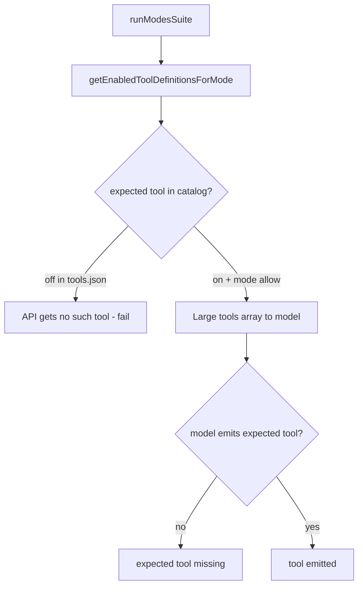

# BUG-008 — Modes suite fails with “expected tool missing”

**Tracker:** [documentation/bug-hunt-session-2026-05-24.md](../../bug-hunt-session-2026-05-24.md) — BUG-008  
**Severity:** Major  
**Area:** Benchmark — **Modes** suite (`src/benchmark/suites/modes.ts`)  
**Status:** Open (verified — plan + static tests; fix pending)  
**Linear:** [MIN-81](https://linear.app/minnowai/issue/MIN-81/bug-008-modes-suite-expected-tool-missing) — priority **High (2)**, labels **bug**, **benchmark**

---

## Summary

Mode benchmark **positive** probes fail with detail **`expected tool missing`** when `toolNameMatch(out.toolCalls, expectedTool)` is false after `runToolLoop`. This happens even when users believe tools are enabled, because (a) **default `tools.json` leaves file tools off**, and (b) the suite sends the **entire enabled catalog** to the model (dozens of tools), unlike the **Tools** suite which sends **one** tool per test.

---

## Verification (2026-05-24)

| Check | Result |
|-------|--------|
| Failure string source | `modes.ts` sets `details: 'expected tool missing'` when `toolNameMatch` fails |
| Mode policy vs probes | **Pass** — `read_file`, `list_directory`, `web_search`, `get_datetime` allowed for plan/build/research/reef/orchestrate |
| Default tool config | **Fail for file probes** — `list_directory` and `read_file` are **`off`** in `defaultToolConfig()`; `web_search` and `get_datetime` default **`ask`** (enabled for API) |
| Tools suite contrast | Tools suite uses `tools: [tool.definition]`; modes uses `getEnabledToolDefinitionsForMode(modeId)` (large array) |
| `maxToolRounds` | Positive probes use **2** rounds; `maxTokens` **256** (tools suite uses **512**) |
| Automated test | `test/benchmark/modes-suite-probes.test.mts` encodes policy + default-config expectations |

**Conclusion:** BUG-008 is **reproducible by design** on a fresh install (build/plan/orchestrate positive probes). With “all tools on,” failures are still likely on smaller/local models due to **tool-choice overload** and possible **BUG-002** stream/tool-call parsing — needs live bench confirmation per provider.

---

## Problem statement

| | |
|---|---|
| **Expected** | When the probed tool is **enabled** and **allowed for the mode**, the model emits that tool call in the benchmark probe. |
| **Actual** | Most `mode-*-positive` tests **fail** with **`expected tool missing`**. |
| **Impact** | Quick preset includes **modes** — headline bench score and mode policy confidence are misleading. |

---

## Current state

### Positive probes (`MODE_POSITIVE`)

| Mode | Expected tool | User prompt gist |
|------|---------------|------------------|
| build | `list_directory` | List cwd via tool |
| plan | `read_file` | Read package.json via tool |
| research | `web_search` | Search Minnow (skipped if no server) |
| orchestrate | `list_directory` | List `.` via tool |
| reef | `get_datetime` | Call get_datetime |

### Negative probes (`MODE_NEGATIVE`)

| Mode | Forbidden tool |
|------|----------------|
| plan | `delete_path` |
| research | `git_commit` |

### Pass/fail details

- Pass: **`tool emitted`**
- Fail: **`expected tool missing`**
- Negative pass: **`no forbidden tool`**

---

## Root cause analysis

1. **Primary (config):** Default install has **`list_directory` / `read_file` off** — probes cannot pass until user enables file tools (contradicts “all tools on” unless user bulk-enabled).
2. **Primary (bench design):** Full-catalog `tools` array vs **Tools** suite single-tool isolation → local models often pick wrong tool or answer in prose.
3. **Secondary:** `maxTokens: 256` may truncate tool-call JSON on some models.
4. **Secondary:** **BUG-002** — streamed `tool_calls` may not finalize into `out.toolCalls`.
5. **Not the cause:** Mode `filterToolsByMode` **does** allow all probed tool ids (see unit test).

---

## Proposed fix (recommended)

### A. Narrow tools on positive probes (required)

For each positive test, pass **`tools: [definition for expectedTool]`** (and ensure tool is enabled; else skip). Optionally add forbidden tool to schema only on negative tests. Aligns with `src/benchmark/suites/tools.ts` pattern.

### B. Skip when prerequisite missing (required)

If `expectedTool` not in `getEnabledToolDefinitionsForMode(modeId)`:

- `skipped: true`, `skipReason: 'tool disabled in settings'`

### C. Token budget (nice)

Set positive probe `maxTokens: 512`.

### D. Diagnostics (POLISH-005)

On fail: `expected tool missing (tools=${n}, finish=${reason})`.

### E. BUG-002 coordination

If failures persist with single-tool array and enabled config, investigate `finalizeToolCalls` / SSE path in `llm-driver.ts`.

---

## Acceptance criteria

- [ ] Fresh default config: build/plan/orchestrate positive tests **skip** with clear reason OR docs state file tools must be enabled for modes bench.
- [ ] All probe tools enabled + npm start: positive tests **pass** on a model known to tool-call (record model id in bug-hunt).
- [ ] Fail details never ambiguous when tool was not in API payload vs model declined.
- [ ] `npm run test:benchmark` includes modes probe static tests + optional mocked `runToolLoop` test.
- [ ] `documentation/context.md` Benchmark section notes modes probe tool narrowing.

---

## Files to touch

| File | Change |
|------|--------|
| `src/benchmark/suites/modes.ts` | Narrow tools, skip, tokens, details |
| `test/benchmark/modes-suite-probes.test.mts` | Extend with mocked driver tests |
| `documentation/bug-hunt-session-2026-05-24.md` | Verification notes / status |
| `documentation/context.md` | Modes suite behavior |

---

## Out of scope

- Changing mode tool policies in chat (policies are correct).
- Fixing model quality / LM Studio tool-calling globally.
- Skills suite (**BUG-009**).

---

## References

- Bug report: [documentation/bug-hunt-session-2026-05-24.md](../../bug-hunt-session-2026-05-24.md) — BUG-008
- Suite: [src/benchmark/suites/modes.ts](../../../src/benchmark/suites/modes.ts)
- Defaults: [src/config/defaults.ts](../../../src/config/defaults.ts) — `DEFAULT_ENABLED_TOOL_IDS`
- Related: BUG-006, BUG-002, POLISH-005

---

## Verification (APPROVED)

**Date:** 2026-05-24

**Notes:** Plan verified against codebase (static review). Bug-hunt entry aligned. Ready for implementation unless plan header marks shipped.

**Linear:** [MIN-81](https://linear.app/minnowai/issue/MIN-81/bug-008-modes-suite-expected-tool-missing)
