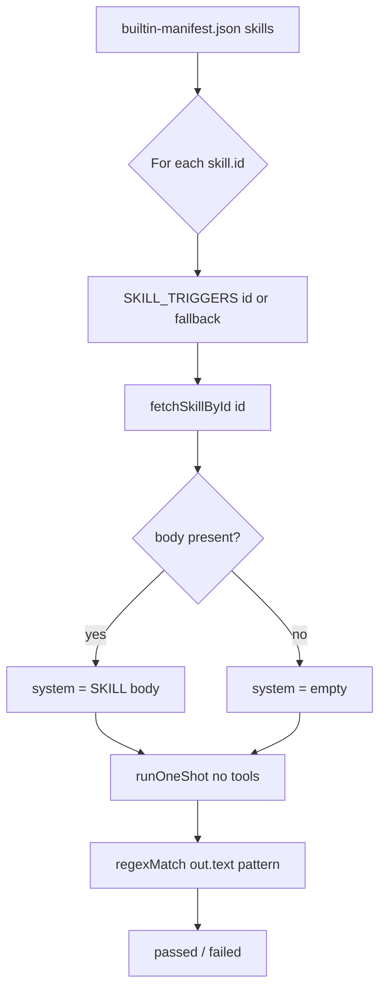

# BUG-009 — Skills benchmark suite failures

| Field | Value |
|-------|-------|
| **ID** | BUG-009 |
| **Severity** | Major |
| **Status** | Verified open — [MIN-71](https://linear.app/minnowai/issue/MIN-71/bug-009-skills-benchmark-failures) (2026-05-24) |
| **Area** | Benchmark — **Skills** suite |
| **Source** | [`documentation/bug-hunt-session-2026-05-24.md`](../../bug-hunt-session-2026-05-24.md) |
| **Primary code** | [`src/benchmark/suites/skills.ts`](../../../src/benchmark/suites/skills.ts) |
| **Related** | BUG-002, BUG-008, BUG-010, BUG-012; POLISH-005 |

---

## Summary

During manual QA (2026-05-24), a **Full** benchmark run (includes the Skills suite) showed **most built-in skill tests failing**. The suite runs only on the **Full** preset (`runner.ts` — Quick runs capability, speed, modes only). Failures are reported as `passed: false` with `details` truncated to the first **100 characters** of model text (or an error message), which makes root-cause triage difficult without per-test transcripts (**POLISH-005**).

This plan documents how the suite works today, likely failure modes, a per-skill probe strategy, and a phased fix approach. **No code changes** are included here.

---

## Reproduction

1. `npm start` (tool server + skills API; benchmark uses browser `fetch` to `/api/skills/:id` when local server is up).
2. Ensure provider/model are reachable (same binding as other benchmark suites).
3. Open `#/benchmark`, run **Full** (not Quick).
4. After earlier suites complete, inspect **Skills** — expect many red/fail cards.

**Expected (product intent):** Each built-in skill loads its `SKILL.md` body into the system prompt; the model responds to a skill-specific user prompt; pass criteria reflect whether the skill’s behavior is observable (text and/or tools).

**Actual (bug hunt):** Majority of skill rows fail; per-card failure strings were not captured in the session log.

---

## Current implementation

### Flow (`runSkillsSuite`)

| Step | Behavior | Risk |
|------|----------|------|
| Skill list | All entries from [`builtin-manifest.json`](../../../src/skills/builtin-manifest.json) (12 built-ins) | Manifest can drift from `src/skills/*` if `prebuild` not run |
| Triggers | Only **4** ids in `SKILL_TRIGGERS`; others use fallback: first word of `label` as regex | Weak / brittle pass criteria for 8 skills |
| Skill body | [`fetchSkillById`](../../../src/skills/client.ts) — requires id in `skillCatalog`, `isSkillEnabled(id)`, then API or Vite glob | **Empty system** if catalog miss, disabled skill, 404, or offline user-only skill |
| LLM | [`runOneShot`](../../../src/benchmark/llm-driver.ts) — streaming only, **no tools**, `maxTokens: 256`, `temperature: 0.2` | Tool-centric skills cannot pass; empty stream fails all regex (**BUG-002**) |
| Pass | [`regexMatch(out.text, trigger.pattern)`](../../../src/benchmark/scoring.ts) | False negatives when model calls tools instead of matching keywords |

### Contrast: Modes suite (works differently)

[`modes.ts`](../../../src/benchmark/suites/modes.ts) uses **`runToolLoop`** with `getEnabledToolDefinitionsForMode(modeId)` and asserts `toolNameMatch` on tool calls. Skills suite never passes tools — a structural mismatch for skills that instruct tool use (`ask_question`, `browser_*`, `git_commit`, etc.).

### Catalog / enablement

- `refreshSkillCatalog()` runs at app boot ([`main.ts`](../../../main.ts)); benchmark runner does **not** refresh again.
- `isSkillEnabled` defaults to **enabled** unless `~/.minnow/skills.json` (or localStorage) sets `enabled[id]: false`.
- If `fetchSkillById` returns `null`, the probe still runs with **no system prompt** — likely widespread regex failures.

---

## Root-cause hypotheses (priority order)

### H1 — Systemic empty or broken streaming (**BUG-002**)

If `runOneShot` returns `out.text === ''` for all probes (same failure mode as **cap-stream** / speed `0 chars`), every `regexMatch` fails. **First validation:** compare Skills `details` (first 100 chars) with Capability **Streaming completion** and Speed short-run char counts on the same model run.

### H2 — Probe design: text regex vs tool-based skills

Many `SKILL.md` files teach **tool invocation**, not keyword-rich replies:

| Skill | SKILL emphasis | Current probe | Mismatch |
|-------|----------------|---------------|----------|
| `ask-user` | `ask_question` tool schema | Text must match `/question\|clarif\|…/i` | Model may emit tool call with little/no matching text |
| `browser-automation` | CDP / `browser_*` tools | Fallback `/Browser/i` on text only | **BUG-010**; no tools in loop |
| `git-commit` | Conventional commits from diff | Fallback `/Git/i` | Expects `git_*` tools or staged context |
| `code-review`, `write-tests`, etc. | Read/diff/test workflows | Label-first-word regex | Incidental pass/fail |

### H3 — Missing or empty skill body in benchmark path

`fetchSkillById` can return `null` while the manifest still lists the skill → benchmark runs “cold” with generic user prompt only. Causes: skill disabled in settings, catalog not loaded, `/api/skills/:id` error, Vite glob miss under Node-only contexts (benchmark UI should be browser + `npm start`).

### H4 — Incomplete `SKILL_TRIGGERS` map (8/12 on fallback)

Fallback pattern `new RegExp(skill.label.split(/\s+/)[0]!, 'i')` examples:

| Skill | Fallback regex | Typical failure mode |
|-------|----------------|----------------------|
| Browser Automation | `/Browser/i` | Model discusses “Chrome” or “CDP” without word “Browser” |
| Code Review | `/Code/i` | Too loose OR model says “pull request” not “Code” |
| Docs Update | `/Docs/i` | Model says “documentation” or “context.md” |
| Git Commit | `/Git/i` | Model describes commit message without “Git” |
| Refactor Safe | `/Refactor/i` | Model says “extract function” |
| Security Review | `/Security/i` | Model says “OWASP” or “injection” |
| UI Designer | `/UI/i` | Overlaps impeccable; may pass/fail randomly |
| Write Tests | `/Write/i` | Model says “test case” or “coverage” |

### H5 — Environment / skill-specific blockers

- **`impeccable` / `ui-designer`:** Harness scripts need `.impeccable/design.json` (**BUG-012**); benchmark only checks UI-ish words in free text — may fail even when skill body loads.
- **`browser-automation`:** Depends on CDP stack (**BUG-010**); benchmark should **skip** when browser tools unavailable, not fail opaquely.

### H6 — Low signal in `details` field

Only `out.text.slice(0, 100)` is stored — no flags for “empty system”, “empty response”, tool calls, or HTTP errors. Aligns with **POLISH-005** (transcript drill-down).

---

## Per-skill recommended probe strategy (target state)

| Skill id | Suggested probe type | Pass signal (draft) | Skip when |
|----------|---------------------|---------------------|-----------|
| `ask-user` | `runToolLoop` + `ask_question` in allowlist | `toolNameMatch(..., 'ask_question')` | Tools disabled / no server |
| `explain-code` | `runOneShot` + text regex (keep) | Existing pattern OK if stream works | — |
| `debug-error` | `runOneShot` + text regex (keep) | ENOENT/path vocabulary | — |
| `impeccable` | `runOneShot` + text regex OR skip | UI/layout vocabulary; optional skip if no `.impeccable/design.json` | Missing design tokens (documented setup) |
| `browser-automation` | Tool loop or **skipped** | `browser_navigate` or ping CDP | `!ctx.localServer` or browser disabled (**BUG-010**) |
| `code-review` | Text + optional `read_file` tool | Checklist terms OR tool read | — |
| `docs-update` | Text | `context.md` / README mention | — |
| `git-commit` | Tool or text | `git_commit` tool OR “conventional commit” phrasing | No git / sandbox |
| `refactor-safe` | Text | “minimal diff”, “tests”, “behavior” | — |
| `security-review` | Text | OWASP / injection / XSS terms | — |
| `ui-designer` | Text or skip without impeccable context | Screenshot / audit vocabulary | Same as impeccable |
| `write-tests` | Text | deterministic / `node --test` / fixture language | — |

---

## Verification (2026-05-24)

| Check | Result |
|-------|--------|
| Plan vs code | Confirmed: 12 manifest skills, 4 `SKILL_TRIGGERS`, `runOneShot` without tools, `details` capped at 100 chars |
| Live repro | `~/.minnow/benchmarks/2026-05-24T21-03-56-933Z.json` — **2/12 pass**, **10 fail** |
| H1 correlate | Same model/day: `cap-stream` failed with empty `details` in `2026-05-24T21-01-34-135Z.json` |
| Failure signature | **10/10** failed skills: `details: ""`; ~4.2–5.8s duration (request completed, no captured text) |
| Non-empty passes | `browser-automation`, `docs-update` — fallback regex matched acknowledgment prose |
| Unit tests | `npm run test:benchmark` — scoring + page HTML green (no live skills probes) |
| Linear | [MIN-71](https://linear.app/minnowai/issue/MIN-71/bug-009-skills-benchmark-failures) — priority High (2), labels Bug + benchmark |

**Conclusion:** Bug **confirmed**. Dominant failure mode matches **H1** (empty streaming text) more than missing skill bodies; secondary **H2/H4** remain after BUG-002 is addressed.

---

## Investigation todos (before coding)

- [x] **Repro matrix:** Skills-only run exported; per-skill `passed`, `details`, `durationMs` recorded (see Verification).
- [x] **Correlate H1:** `cap-stream` failed same session/model with empty `details`.
- [ ] **Body load audit:** For each failing `skill-*`, log whether `fetchSkillById` returned non-empty `body` (temporary `console` or breakpoint in `skills.ts`).
- [ ] **Settings check:** Confirm `~/.minnow/skills.json` has no `enabled: { "<id>": false }` for built-ins.
- [ ] **API check:** `curl http://localhost:5173/api/skills/ask-user` returns `{ skill: { body: "..." } }`.
- [ ] **Manifest drift:** `npm run prebuild` then diff manifest vs `src/skills/*/SKILL.md` ids.
- [ ] **Capture transcripts:** Manual chat with `/skill-id` + same user prompts as triggers; compare to benchmark output (**POLISH-005** scope).

---

## Proposed fix plan (implementation phases)

### Phase 0 — Observability (enables all other work)

- [ ] Extend `TestResult.details` (or `skipReason`) for skills: `skillLoaded`, `systemChars`, `responseChars`, `matchedPattern`, optional `toolCalls[]` summary.
- [ ] Persist full message list per skill test in benchmark run JSON (**POLISH-005**).
- [ ] Add `refreshSkillCatalog()` at start of `runSkillsSuite` (or runner once per run).

### Phase 1 — Block on streaming if H1 confirmed

- [ ] Fix or mitigate **BUG-002** first; re-run Skills suite — if pass rate jumps, treat H2–H4 as secondary.

### Phase 2 — Probe manifest (single source of truth)

- [ ] Add `src/benchmark/suites/skill-probes.ts` (or JSON manifest) with per-skill:
  - `prompt`, `passKind: 'regex' | 'tool' | 'skip'`, `pattern` or `expectedTool`, `requiresLocalServer`, `requiresBrowser`, `requiresDesignJson`
- [ ] Replace inline `SKILL_TRIGGERS` + label fallback.
- [ ] **Fail fast** when skill body missing: `skipped: true`, `skipReason: 'skill body not loaded'`.

### Phase 3 — Tool-aware probes

- [ ] Use `runToolLoop` for `ask-user`, and any skill whose SKILL.md primary action is a named Minnow tool (mirror `modes.ts`).
- [ ] Pass minimal tool allowlist per probe (not full catalog) to reduce hang risk (**BUG-006**).

### Phase 4 — Skips and environment gates

- [ ] Skip `browser-automation` when browser tools off or CDP unreachable.
- [ ] Skip or soften `impeccable` / `ui-designer` when `.impeccable/design.json` absent (link **BUG-012** doc in skip reason).

### Phase 5 — Tests and docs

- [ ] Unit tests: probe manifest covers all `builtin-manifest.json` ids; `resolveSkillDetail` / mock `fetchSkillById` for deterministic regex passes.
- [ ] Optional integration test behind `MINNOW_BENCHMARK_LIVE=1` (one cheap skill only).
- [ ] Update [`documentation/context.md`](../../context.md) benchmark section with skills pass criteria.
- [ ] Close BUG-009 in bug-hunt doc when Full run achieves agreed pass threshold.

---

## Acceptance criteria

| Criterion | Target |
|-----------|--------|
| Skill body load | 100% of non-skipped built-in probes load non-empty `SKILL.md` body when skills enabled and `npm start` up |
| Pass rate (Full, healthy provider) | ≥ **10/12** skills pass on a capable local model, OR explicit **skip** with clear reason for environment-dependent skills (`browser-automation`, impeccable without design.json) |
| False passes | No pass on empty `out.text` when `passKind` is `regex` |
| Diagnostics | Failed cards show why (no body / empty stream / pattern miss / expected tool missing) without needing chat replay |
| Regression | `npm run test:benchmark` (scoring) + new skill-probe unit tests green |

---

## Out of scope (this bug)

- Rewriting skill `SKILL.md` content (unless probe reveals incorrect instructions).
- **POLISH-004** (human-readable test descriptions) — complementary UX.
- Feature 21 eval harness (separate product surface).
- Fixing **BUG-010** / **BUG-011** in full — only gating/skipping browser skill probes.

---

## Open questions

1. Should skills benchmark measure **model compliance** (regex/tool) or **skill file integrity only** (body loads + non-empty reply)?
2. Should **disabled** skills in settings be **skipped** or **failed** in the suite?
3. Include **user** skills from `~/.minnow/skills/` in the battery, or built-ins only?
4. Is a minimum pass rate acceptable with skips for CDP/impeccable, or must all 12 run live?

---

## File touch list (when implementing)

| File | Change |
|------|--------|
| `src/benchmark/suites/skills.ts` | Probe manifest, tool loop, skips, richer details |
| `src/benchmark/suites/skill-probes.ts` (new) | Per-skill probe definitions |
| `src/benchmark/runner.ts` | Optional catalog refresh |
| `src/benchmark/types.ts` | Extended details / transcript fields |
| `src/benchmark/llm-driver.ts` | Only if empty-stream fallback needed for skills |
| `test/benchmark/skills-probes.test.mts` (new) | Deterministic probe logic |
| `documentation/context.md` | Benchmark skills criteria |
| `documentation/bug-hunt-session-2026-05-24.md` | Status when verified |

---

## Related work

| Item | Relationship |
|------|----------------|
| **BUG-002** | Empty stream → all skills fail regex |
| **BUG-008** | Same “expected tool missing” class if skills move to `runToolLoop` |
| **BUG-010** | Browser skill should skip, not fail |
| **BUG-012** | Impeccable / UI designer environment |
| **POLISH-005** | Transcript UI for failed skill cards |
| [`documentation/plans/fix-impeccable-harness-routing.md`](../fix-impeccable-harness-routing.md) | Impeccable skill behavior (referenced in context.md) |

---

*Plan authored 2026-05-24. Implementation not started.*

---

## Verification (APPROVED)

**Date:** 2026-05-24

**Notes:** Plan verified against codebase (static review). Bug-hunt entry aligned. Ready for implementation unless plan header marks shipped.

**Linear:** [MIN-71](https://linear.app/minnowai/issue/MIN-71/bug-009-skills-benchmark-failures)
