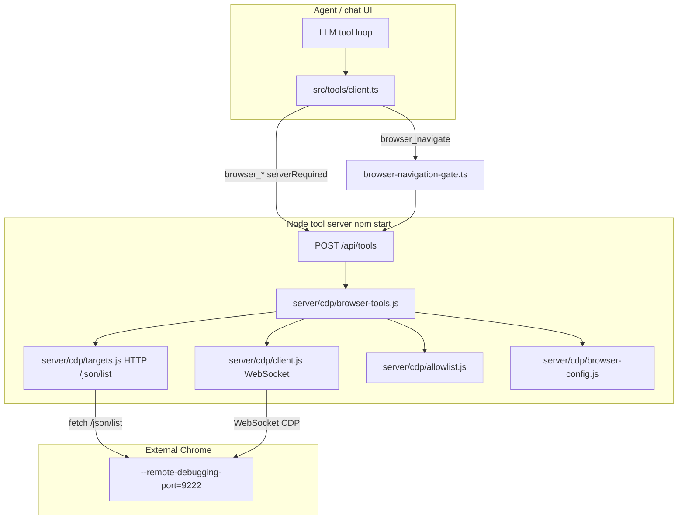

# BUG-010 — Browser CDP tools not working

**Tracker:** [bug-hunt-session-2026-05-24.md](../../bug-hunt-session-2026-05-24.md) · **BUG-010** (Blocker)  
**Architecture context:** [context.md](../../context.md) § Browser CDP  
**Linear:** [MIN-76](https://linear.app/minnowai/issue/MIN-76/bug-010-browser-cdp-tools-not-working) — priority Urgent (1), labels `Bug`, `tools`  
**Status:** Verified open — plan only, no implementation yet  
**Verified:** 2026-05-24  
**Related:** BUG-011 (fetch web content), BUG-015 (`rag_web_content`), POLISH-011 (in-app browser view)

---

## Verification (2026-05-24)

**Result: CONFIRMED (blocker)** — CDP handlers are implemented and pass mock tests; user-visible failure reproduces when Chrome is not reachable on the configured CDP URL.

| Check | Result |
|-------|--------|
| `npm run test:browser` | 12/12 pass (`test/browser-cdp.test.mjs` + mock CDP) |
| `http://127.0.0.1:9222/json/list` (Windows) | Unable to connect — no listener on 9222 |
| `node -e "import { toolBrowserList } from './server/cdp/browser-tools.js'; …"` | Returns `Error: fetch failed` |
| `~/.minnow/config.json` → `browser.enabled` | `true` |
| `~/.minnow/tools.json` → `browser_*` | All enabled (`full`) |
| H5 dual-gating (`browser.enabled` off) | **Not** the cause on this machine |

**Classified hypothesis:** **H1** (Chrome not listening on CDP port) + **H10** (opaque `fetch failed` from `listTargets` / `guardBrowserTool`).

**Captured tool result (canary `browser_list`):** `Error: fetch failed`

**Still needed for close:** Manual smoke with Chrome launched via debug port (`browser_list` → `browser_navigate` localhost → `browser_snapshot`).

---

## Summary

All seven server-side **`browser_*` CDP tools** are reported **completely non-functional** in manual QA on Windows (2026-05-24). The stack depends on external Chrome with `--remote-debugging-port`, Minnow running via **`npm start`** (not Vite-only), per-tool permissions in Settings, and `~/.minnow/config.json` → `browser`. Unit tests pass against a **mock CDP server** — so the failure is likely **environment/setup**, **dual configuration gating**, or **opaque error surfacing**, not a total absence of handler code.

This plan defines how to **reproduce**, **diagnose**, **fix**, and **regression-test** the CDP browser tool path without implementing changes yet.

---

## Problem statement

| Field | Value |
|-------|-------|
| **Severity** | Blocker |
| **Symptom** | None of the `browser_*` tools succeed in normal chat use |
| **Environment** | Windows 10, `npm start`, browser tools enabled in Settings (per reporter) |
| **Expected** | Tools connect to CDP at `http://127.0.0.1:9222` (or configured URL) and return targets, snapshots, etc. |
| **Actual** | Complete failure across all CDP tools; canary `browser_list` → `Error: fetch failed` when CDP port unreachable |

**Out of scope for this bug (separate tickets):**

- **`fetch_web_content`** / **`rag_web_content`** (BUG-011, BUG-015) — browser-routed `fetch()` in [`src/tools/browser-executor.ts`](../../../src/tools/browser-executor.ts); CORS/network, not CDP.
- **POLISH-011** — embedded in-app browser UI (product feature, not CDP repair).

---

## Architecture (current)



### Tool inventory

| Tool | Runs on | Handler |
|------|---------|---------|
| `browser_list` | Server | `toolBrowserList` |
| `browser_navigate` | Server (+ client allowlist gate) | `toolBrowserNavigate` |
| `browser_snapshot` | Server | `toolBrowserSnapshot` |
| `browser_click` | Server | `toolBrowserClick` |
| `browser_fill` | Server | `toolBrowserFill` |
| `browser_eval` | Server | `toolBrowserEval` |
| `browser_screenshot` | Server | `toolBrowserScreenshot` |
| `request_browser_origin_access` | Browser (client) | `browser-navigation-gate.ts` |

**Supporting routes:** `GET /api/browser/screenshot/:id`, `GET /api/browser/allowlist/check`, `POST /api/browser/allowlist/approve`.

### Configuration (dual gating)

Two independent switches must allow CDP tools to run:

1. **Per-tool permissions** — `~/.minnow/tools.json` (or localStorage in Vite-only mode); checked client-side via `isToolEnabled()` in [`src/tools/config.ts`](../../../src/tools/config.ts). Settings → Tools → **Browser (CDP)** category.
2. **Master browser flag** — `config.json` → `browser.enabled`; checked server-side via `assertBrowserEnabled()` in [`server/cdp/browser-config.js`](../../../server/cdp/browser-config.js).

**Gap:** Settings UI ([`src/ui/settings-browser.ts`](../../../src/ui/settings-browser.ts)) exposes CDP URL, allowlist, and “Allow navigation” — but **no toggle for `browser.enabled`**. Users can enable individual tools while the server master flag is off (or vice versa), with confusing errors.

### CDP URL resolution order

[`resolveBrowserUrl()`](../../../server/cdp/browser-config.js): `args.browser_url` → `MINNOW_BROWSER_URL` env → `config.json` → `http://127.0.0.1:9222`.

---

## Root-cause hypotheses (prioritized)

Investigate in this order during Phase 0:

| # | Hypothesis | Likely symptom | How to confirm |
|---|------------|----------------|----------------|
| H1 | **Chrome not listening on CDP port** | `Failed to list targets: ECONNREFUSED` or fetch failed | `curl http://127.0.0.1:9222/json/list` |
| H2 | **Chrome already open without debug port** (Windows common) | Port closed or wrong process owns 9222 | Close all Chrome; relaunch with `--remote-debugging-port=9222` and separate `--user-data-dir` |
| H3 | **`npm run dev` instead of `npm start`** | “local tool server is not available” | `curl http://localhost:5173/api/tools/ping` |
| H4 | **Browser tools disabled in Settings** | Tool not in LLM catalog, or permission off | Inspect `~/.minnow/tools.json`; Settings → Tools |
| H5 | **`browser.enabled: false` in config.json** | `Error: browser automation is disabled in settings` | Read `~/.minnow/config.json` → `browser.enabled` |
| H6 | **Wrong CDP URL / port drift** | HTTP 404 or connection to wrong host | Compare Settings CDP URL vs Chrome DevTools port |
| H7 | **Navigation allowlist** (navigate only) | `Error: navigation blocked by allowlist` | Use `browser_list` first (no allowlist); test `http://127.0.0.1:5173` |
| H8 | **Code regression in CDP client** | WebSocket or parse errors | Run `npm run test:browser`; compare with mock vs real Chrome |
| H9 | **Snapshot cache miss** (click/fill only) | `No snapshot cached. Call browser_snapshot first.` | Not a full-stack “all tools broken” cause |
| H10 | **Inconsistent error wrapping** | Unhandled throw vs `Error:` string | Review `guardBrowserTool` usage in `browser-tools.js` |

**Note:** Because **`browser_list`** has no allowlist dependency and minimal prerequisites, it is the **canonical canary** for H1–H6.

---

## Reproduction checklist

Complete during Phase 0 and record results in the bug-hunt doc or in-app bug **BUG-010**.

### Prerequisites

- [ ] Minnow started with **`npm start`** (not `npm run dev`)
- [ ] `curl http://localhost:<port>/api/tools/ping` → `{ "ok": true }`
- [ ] Chrome launched with remote debugging (Windows example):

```powershell
& "C:\Program Files\Google\Chrome\Application\chrome.exe" `
  --remote-debugging-port=9222 `
  --user-data-dir="$env:TEMP\minnow-chrome-debug"
```

- [ ] `curl http://127.0.0.1:9222/json/list` returns JSON array with at least one `"type":"page"` target
- [ ] Settings → Tools → **Browser (CDP)** category tools enabled (not “off”)
- [ ] `~/.minnow/config.json` → `browser.enabled` is `true` (default if unset)

### In-app repro

1. Build mode (or any mode with browser tools in policy).
2. Ask agent to run **`browser_list`** (or invoke via tool UI if available).
3. Capture **exact tool result string**, browser console, and terminal output from `npm start`.
4. Repeat with direct API call:

```powershell
curl -X POST http://localhost:5173/api/tools `
  -H "Content-Type: application/json" `
  -d '{"name":"browser_list","args":{}}'
```

5. If `browser_list` works, exercise **`browser_navigate`** to `http://127.0.0.1:5173/` (localhost allowlist default).

### Evidence to capture

| Artifact | Purpose |
|----------|---------|
| Tool result text (chat bubble) | User-visible failure mode |
| `POST /api/tools` JSON response | Server-side error vs client routing |
| Chrome `/json/list` body | CDP reachability |
| `~/.minnow/config.json` `browser` block | Master flag + URL |
| `~/.minnow/tools.json` browser tool permissions | Client gating |
| `npm start` stderr on tool call | Uncaught server errors |

---

## Proposed fix strategy

Fix in layers: **diagnose first**, then **remove config foot-guns**, then **harden errors and docs**, then **optional real-Chrome CI**.

### Phase 1 — Diagnosis & error clarity (high priority)

**Goal:** Turn “nothing works” into actionable messages.

| Task | Files / area |
|------|----------------|
| Add **`GET /api/browser/cdp/ping`** (or extend `/api/tools/ping`) that runs `listTargets(resolveBrowserUrl())` and returns `{ ok, targetCount, browserUrl, error? }` | `server/cdp/`, new middleware or extend `browser-allowlist-middleware.js` |
| Wrap **all** handlers in `guardBrowserTool` (today only `browser_list` uses it; others rely on outer `executeServerTool` try/catch) | `server/cdp/browser-tools.js` |
| Improve `listTargets` fetch errors: include `cause.message`, URL tried, hint to start Chrome | `server/cdp/targets.js` |
| Map common failures to setup hints (ECONNREFUSED → Chrome command; disabled → Settings path) | `browser-tools.js` or shared `cdp-errors.js` |

### Phase 2 — Configuration UX (high priority)

**Goal:** One obvious “Browser CDP enabled” control; no hidden `browser.enabled`.

| Task | Files / area |
|------|----------------|
| Add **“Enable browser automation (CDP)”** master toggle in Settings → Browser section | `src/ui/settings-browser.ts` |
| Sync toggle with `browser.enabled` via `PUT /api/config/meta` | `src/config/browser-meta.ts`, server validators |
| When user enables **Browser (CDP)** category in tools list, set `browser.enabled: true` (and disable when all off) | `src/tools/config.ts`, `src/ui/tools-list.ts` |
| Show **connection status** on settings panel (call new ping endpoint on load + “Test connection” button) | `settings-browser.ts` |

### Phase 3 — Windows setup & documentation (medium priority)

**Goal:** Reduce H1/H2 failure rate on reporter’s OS.

| Task | Files / area |
|------|----------------|
| Add **`scripts/launch-chrome-debug.ps1`** (and optional `.sh`) with documented `--user-data-dir` | `scripts/` |
| Expand README troubleshooting table with Windows-specific Chrome steps | `README.md` |
| Document dual gating (`tools.json` + `browser.enabled`) | `documentation/context.md`, `src/skills/browser-automation/SKILL.md` |
| Optional: log one-line CDP status at `npm start` when browser tools are enabled in config | `server.js` |

### Phase 4 — Correctness hardening (medium priority)

**Goal:** Address issues found during repro, not speculative rewrites.

| Task | Notes |
|------|-------|
| Verify WebSocket URL rewrite for non-localhost CDP proxies | `server/cdp/targets.js` |
| Confirm snapshot cache lifecycle for multi-tab / `target_id` | `server/cdp/snapshot-cache.js` |
| Ensure `browser_screenshot` attachments resolve in chat UI (`/api/browser/screenshot/:id`) | `server/browser-screenshot-middleware.js`, client attachment renderer |
| Review `browser_navigate` load timeout (10s) vs slow pages | `browser-tools.js` |

### Phase 5 — Testing (required before close)

| Test | Type | Command / location |
|------|------|------------------|
| Existing mock CDP suite | Unit/integration | `npm run test:browser` |
| New ping endpoint tests | API | `test/api/browser-cdp-ping.test.mjs` (proposed) |
| Settings sync tests | Unit | `test/config/browser-enabled-sync.test.mjs` (proposed) |
| Manual smoke with real Chrome | Manual QA | `browser_list` → `browser_navigate` localhost → `browser_snapshot` |
| Optional opt-in CI job | E2E | Chrome in headless new mode + mock or real 9222 (document as optional) |

### Phase 6 — Close criteria

BUG-010 is **fixed** when:

- [ ] Reporter (or QA) completes repro checklist with **`browser_list`** and **`browser_snapshot`** succeeding against Chrome on Windows.
- [ ] Failure modes return **actionable** errors (not silent no-op or generic “fetch failed” without context).
- [ ] Settings exposes **browser.enabled** and **connection test**; dual gating is documented.
- [ ] `npm run test:browser` passes; new ping/sync tests pass if added.
- [ ] `documentation/context.md` updated to reflect any new API or settings behavior.

---

## Known code observations (for implementers)

1. **`guardBrowserTool` inconsistency** — Only `browser_list` uses the local wrapper; other handlers throw or return mixed shapes. Standardize for predictable `Error:` prefixes.
2. **No CDP health surface** — Unlike `/api/tools/ping`, nothing validates Chrome reachability before agents waste a turn.
3. **Settings gap** — `browser.enabled` exists in schema defaults ([`server/config/home.js`](../../../server/config/home.js)) but is not editable in UI.
4. **Tests use mock only** — [`test/browser-cdp.test.mjs`](../../../test/browser-cdp.test.mjs) + [`test/helpers/mock-cdp-server.mjs`](../../../test/helpers/mock-cdp-server.mjs) never exercise real Chrome; production failures won't be caught in CI.
5. **`browser_navigate` client gate** — [`browser-navigation-gate.ts`](../../../src/tools/browser-navigation-gate.ts) checks `meta.enabled` and `allowNavigate` before server call; misconfiguration surfaces as client-side errors before CDP is touched.

---

## Relationship to other bugs

| Bug | Relationship |
|-----|----------------|
| **BUG-011** | Separate path (`fetch_web_content` in browser executor); may show “fetch failed” but not CDP |
| **BUG-015** | Same as BUG-011 (`rag_web_content`); do not conflate with CDP fix verification |
| **BUG-008** | Mode benchmark “expected tool missing” — if browser tools never register/work, mode probes may fail; retest after BUG-010 |
| **POLISH-011** | Future embedded browser; depends on stable CDP stack or alternate engine decision |

---

## Open questions (align before implementation)

1. **Default policy:** Should `browser.enabled` default stay `true`, or default `false` until user passes connection test (safer, noisier)?
2. **Chrome bundling:** Out of scope for BUG-010, or should Minnow ship a launch helper only?
3. **Edge vs Chrome:** Support Microsoft Edge CDP (`msedge --remote-debugging-port`) in docs and ping UI?
4. **Error capture:** Can reporter re-run with checklist above to classify H1–H8 before coding?

---

## YAML todos

```yaml
todos:
  - id: bug010-0-repro
    content: Run reproduction checklist on Windows; capture browser_list API result, /json/list, config.json, tools.json
    status: pending
  - id: bug010-1-classify
    content: Map captured errors to hypotheses H1–H10; update bug-hunt BUG-010 with exact messages
    status: pending
  - id: bug010-2-cdp-ping
    content: Design and implement GET /api/browser/cdp/ping (listTargets + structured error hints)
    status: pending
  - id: bug010-3-error-messages
    content: Standardize guardBrowserTool on all handlers; improve listTargets/connectTarget failure text
    status: pending
  - id: bug010-4-settings-enabled
    content: Add browser.enabled master toggle + Test connection in settings-browser.ts
    status: pending
  - id: bug010-5-sync-permissions
    content: Sync tools.json Browser category enable with config.json browser.enabled
    status: pending
  - id: bug010-6-windows-docs
    content: Add scripts/launch-chrome-debug.ps1 and README Windows CDP troubleshooting
    status: pending
  - id: bug010-7-tests
    content: Add API tests for cdp ping; run npm run test:browser; manual Chrome smoke
    status: pending
  - id: bug010-8-docs
    content: Update documentation/context.md and browser-automation skill after behavior changes
    status: pending
  - id: bug010-9-verify-close
    content: QA sign-off on Windows; close BUG-010 when acceptance criteria met
    status: pending
```

---

## References

- Bug log: [`documentation/bug-hunt-session-2026-05-24.md`](../../bug-hunt-session-2026-05-24.md) — BUG-010
- CDP handlers: [`server/cdp/`](../../../server/cdp/)
- Tool definitions: [`src/tools/definitions.ts`](../../../src/tools/definitions.ts) (browser_* block)
- Client router: [`src/tools/client.ts`](../../../src/tools/client.ts)
- Allowlist gate: [`src/tools/browser-navigation-gate.ts`](../../../src/tools/browser-navigation-gate.ts)
- Settings: [`src/ui/settings-browser.ts`](../../../src/ui/settings-browser.ts)
- Tests: [`test/browser-cdp.test.mjs`](../../../test/browser-cdp.test.mjs), [`npm run test:browser`](../../../package.json)
- Skill: [`src/skills/browser-automation/SKILL.md`](../../../src/skills/browser-automation/SKILL.md)


---

## Verification (APPROVED)

**Date:** 2026-05-24

**Notes:** Plan verified against codebase (static review). Bug-hunt entry aligned. Ready for implementation unless plan header marks shipped.

**Linear:** [MIN-76](https://linear.app/minnowai/issue/MIN-76/bug-010-browser-cdp-tools-not-working)
