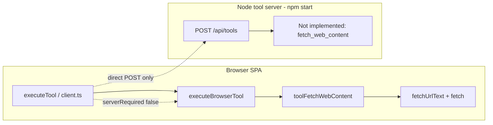

# BUG-011 — Fetch web content fails

| Field | Value |
|-------|-------|
| **ID** | BUG-011 |
| **Severity** | Major |
| **Status** | Open (plan only) |
| **Area** | `fetch_web_content` — browser executor web fetch |
| **Source** | [bug-hunt-session-2026-05-24.md](../../bug-hunt-session-2026-05-24.md) |
| **Related** | BUG-015 (`rag_web_content`, shared `fetchUrlText`), BUG-010 (CDP `browser_*`, separate stack) |

---

## Problem statement

During the 2026-05-24 bug hunt, **Fetch web content** (`fetch_web_content`) was reported as non-functional: the tool returns **`fetch failed`** with no usable page text.

**Expected:** HTTP(S) URL fetched; plain text returned (HTML stripped, ~8 KB cap), or a **specific** error (HTTP status, CORS, invalid URL, tool disabled).

**Actual:** Generic failure — user-visible text matches the browser executor’s catch path (`fetch failed`).

---

## Current architecture



| Concern | Location | Notes |
|---------|----------|-------|
| Tool catalog | [`src/tools/definitions.ts`](../../../src/tools/definitions.ts) | `serverRequired: false`; description warns **CORS** |
| Routing | [`src/tools/client.ts`](../../../src/tools/client.ts) | No server fallback (unlike `web_search` → `web_search_ddg`) |
| Implementation | [`src/tools/browser-executor.ts`](../../../src/tools/browser-executor.ts) | `toolFetchWebContent` → `fetchUrlText` → `global fetch` |
| Server registry | [`server/config/tool-ids.js`](../../../server/config/tool-ids.js) | Listed in `ALL_TOOL_IDS` for settings sync only |
| Server handlers | [`server.js`](../../../server.js) `SERVER_TOOL_HANDLERS` | **No** handler — POST returns `Not implemented: fetch_web_content` |
| Default enablement | [`src/config/defaults.ts`](../../../src/config/defaults.ts) | **Off** by default (not in `DEFAULT_ENABLED_TOOL_IDS`) |
| Documented workaround | [`README.md`](../../../README.md) | CORS errors → CDP `browser_navigate` + `browser_snapshot` |

**Error source (today):**

```351:369:src/tools/browser-executor.ts
async function fetchUrlText(urlString: string): Promise<string> {
  // ...
  try {
    response = await fetch(parsed.toString());
  } catch (err) {
    const message = err instanceof Error ? err.message : String(err);
    return `Error: fetch failed (${message}). The site may block cross-origin requests (CORS).`;
  }
```

Browsers often surface `TypeError: Failed to fetch` (summarized by users as **“fetch failed”**). That is **expected** for many origins when using in-page `fetch`, not necessarily a Minnow regression.

**Not the same as BUG-010:** CDP `browser_*` tools run on the server via [`server/cdp/browser-tools.js`](../../../server/cdp/browser-tools.js). `fetch_web_content` does **not** use CDP. Fixing BUG-010 does **not** automatically fix BUG-011 (though CDP remains the documented workaround for CORS-heavy pages when CDP works).

---

## Root-cause hypotheses (investigate in order)

| # | Hypothesis | How to confirm | If true |
|---|------------|----------------|---------|
| H1 | **CORS / browser security** — target site blocks cross-origin `fetch` from Minnow origin | Reproduce with `https://example.com` (often permissive) vs `https://github.com` (often blocked); check DevTools console CORS errors | Server-side fetch fallback (recommended fix) |
| H2 | **Tool disabled** — `permissions.default.fetch_web_content === 'off'` | Settings → Tools; `isToolEnabled('fetch_web_content')` | Enable by default for Research agents **or** clearer “tool disabled” message (separate UX) |
| H3 | **`npm run dev` only** — user expects server tools; fetch is browser-only anyway | `npm start` vs `npm run dev` — fetch should still run in browser | Educate in error copy; server fallback still needs `npm start` |
| H4 | **Invalid URL / non-http(s)** | Pass `ftp://`, empty `url`, malformed string | Already returns `Error: invalid URL` — unlikely root cause |
| H5 | **Code regression** in `stripHtmlToText` / `DOMParser` after successful fetch | Force mock `Response` with HTML body in unit test | Fix parser path (lower priority if H1 confirmed) |
| H6 | **Corporate proxy / offline** | `navigator.onLine`, same URL in external browser | Document environment limits; optional User-Agent / timeout tuning on server |

---

## Reproduction checklist (before coding)

- [ ] Enable **Fetch page** in Settings → Tools (`fetch_web_content`).
- [ ] Run app with **`npm start`** (representative user setup; not strictly required for browser fetch).
- [ ] Invoke tool with args `{ "url": "https://example.com" }` via chat or tool runner.
- [ ] Record **full** tool result string (not truncated in UI).
- [ ] Open DevTools → Network for the page `fetch` to the target URL.
- [ ] Repeat with `https://en.wikipedia.org/wiki/Minnow` and one known CORS-strict site.
- [ ] Note whether **`wikipedia_search`** works (same executor, different endpoint — CORS-open API).
- [ ] Capture Minnow origin (e.g. `http://localhost:5173`) for CORS analysis.

Store findings in a short comment on this plan or the bug-hunt card (URL list + exact errors).

---

## Proposed solution (recommended)

### A. Server-side fetch proxy (primary)

Mirror the established **`web_search` → `web_search_ddg`** pattern:

1. **Extract** shared logic from `fetchUrlText` / `stripHtmlToText` / `truncateUtf8` into a small module usable from both browser and Node (or duplicate minimally in `server/tools/fetch-web-content.js` with parity tests).
2. **Add** server handler e.g. `fetch_web_content` or internal name `fetch_web_content_http` registered in `SERVER_TOOL_HANDLERS` in [`server.js`](../../../server.js):
   - Validate `http:` / `https:` URL.
   - Node `fetch` with sensible `User-Agent` (align with `toolWebSearchDdg`).
   - Enforce **8 KB** UTF-8 cap and HTML → plain text strip.
   - Return `Error: HTTP {status}` on non-OK responses (same semantics as browser path).
3. **Route** in [`src/tools/client.ts`](../../../src/tools/client.ts) inside `executeToolInner`:
   - When `name === 'fetch_web_content'` and `isLocalServerAvailable()`, call `executeServerTool('fetch_web_content', { url })` (or dedicated server-only name if catalog separation is needed).
   - When server down, keep browser path with improved error text mentioning `npm start` for reliable fetch.

**Rationale:** Node fetch is not subject to browser CORS; matches user expectation that “Fetch page” works for public URLs in a local dev agent. Same approach already used for DuckDuckGo search.

### B. Error message hardening (secondary, same PR)

- Map common `Failed to fetch` → explicit **“blocked by browser CORS or network”**.
- When server unavailable: **“Run npm start for server-side page fetch.”**
- Include **requested URL** and **HTTP status** when response exists.
- Avoid returning only the substring `fetch failed` without context.

### C. Optional CDP path (defer unless BUG-010 fixed)

[`src/skills/browser-automation/SKILL.md`](../../../src/skills/browser-automation/SKILL.md) already directs agents to CDP for login/SPA/CORS-blocked pages. Do **not** block BUG-011 on BUG-010; treat CDP as complementary, not the primary fix.

### D. `rag_web_content` (BUG-015)

Shares `fetchUrlText`. After server fetch exists, route **`rag_web_content`** through the same HTTP layer, then run sentence ranking in browser (or move ranking to server for parity). Track under BUG-015 but implement in the **same PR** if touch points overlap.

---

## Out of scope (this bug)

- Embedded in-app browser (bug-hunt polish item).
- SSRF hardening beyond existing URL scheme checks (follow-up security review if server fetch is added).
- Changing default tool enablement globally (separate product decision).
- Fixing BUG-010 CDP stack.

---

## Implementation todos

| ID | Task | Owner phase |
|----|------|-------------|
| reproduce-matrix | Reproduction matrix per checklist above | Investigation |
| confirm-routing | Confirm client routing and settings enablement | Investigation |
| root-cause-decision | Record H1–H6 outcome in bug-hunt notes | Investigation |
| server-fetch-handler | Node handler + shared strip/truncate utilities | Implementation |
| client-fallback-routing | `client.ts` server-first routing when server up | Implementation |
| error-messages | User-visible error copy on both paths | Implementation |
| unit-tests | `test/tools/fetch-web-content.test.mts` (or `.mjs`) | Implementation |
| manual-qa | Research mode + public URLs per acceptance criteria | Verification |
| docs-update | `context.md`, README, bug-hunt status | Documentation |

---

## Test plan

### Automated

- URL validation: reject `file:`, `javascript:`, missing `url`.
- HTML strip: sample fixture → expected plain text.
- UTF-8 truncation at 8192 bytes without splitting code points.
- Server handler: mock `fetch` — 200 HTML, 404, network throw.
- Client router: when `isLocalServerAvailable()` true, asserts server tool name invoked (mock `executeServerTool`).

### Manual (acceptance)

| Step | Pass criteria |
|------|----------------|
| `npm start`, tool enabled | `fetch_web_content` on `https://example.com` returns non-empty plain text |
| Same | Wikipedia article URL returns article text excerpt (≤ 8 KB) |
| `npm run dev` only | Either browser success on CORS-open URL **or** clear message to use `npm start` |
| Error case | Invalid URL shows `invalid URL`, not bare `fetch failed` |
| Research agent | Researcher work agent can fetch a docs page when tool allowed in mode policy |

---

## Acceptance criteria

1. **Public HTTP(S) pages** (e.g. example.com, Wikipedia) return stripped text when the local tool server is running (`npm start`).
2. Failures include **actionable** context: URL, HTTP status and/or CORS/npm start guidance.
3. No regression to **`wikipedia_search`** or **`web_search`** / **`web_search_ddg`** routing.
4. **`npm test`** includes new unit coverage; existing suite green (except known reef widget failures).
5. **`documentation/context.md`** Web tools table documents server fallback when implemented.
6. BUG-011 marked **Fixed** in `bug-hunt-session-2026-05-24.md` with fix PR reference.

---

## Files likely touched (implementation phase)

| File | Change |
|------|--------|
| `server.js` or `server/tools/fetch-web-content.js` | New handler |
| `src/tools/client.ts` | Server-first routing |
| `src/tools/browser-executor.ts` | Shared utilities or thinner wrapper |
| `src/tools/definitions.ts` | Description: server fetch when `npm start` |
| `test/tools/fetch-web-content.test.mts` | New tests |
| `documentation/context.md` | Web tools routing table |
| `README.md` | Troubleshooting row update |
| `documentation/bug-hunt-session-2026-05-24.md` | Status when done |

---

## Risk and security notes

- **SSRF:** Server fetch can reach internal networks from the user’s machine. Mitigations to consider in implementation (not required for plan approval): optional blocklist for `localhost` / RFC1918, max response size before strip, request timeout.
- **Robots / ToS:** Agent fetch is user-directed; no change to legal posture vs browser fetch.
- **Rate limiting:** Defer; local single-user tool.

---

## Verification (2026-05-24)

**Verdict:** Bug **confirmed** as a product/architecture gap, not a broken `fetchUrlText` implementation on successful responses.

| Check | Result |
|-------|--------|
| `serverRequired: false` + no `SERVER_TOOL_HANDLERS` entry | Confirmed — direct `POST /api/tools` returns `Not implemented: fetch_web_content` |
| Client routing (`client.ts`) | No server fallback (unlike `web_search` → `web_search_ddg`) |
| Default enablement | `fetch_web_content` **off** in `DEFAULT_ENABLED_TOOL_IDS` — users must enable in Settings |
| Node + JSDOM `DOMParser` on `https://example.com` | **Success** — ~125 chars plain text (fetch + strip OK) |
| Node without `DOMParser` | `Error: DOMParser is not defined` after HTTP 200 (browser has `DOMParser`; not user-reported path) |
| Error string source | `Error: fetch failed (${message}). The site may block cross-origin requests (CORS).` at `browser-executor.ts` catch on `fetch()` |

**Root-cause classification:** **H1 (primary)** — browser `fetch()` is CORS-bound; many real-world URLs surface `Failed to fetch` → user-visible **fetch failed**. **H2 (secondary)** — tool disabled by default may cause “does not work” if never enabled. **H5 regression:** Not supported for CORS-open URLs (example.com works when fetch completes).

**Recommended fix (unchanged):** Server-side HTTP proxy + `client.ts` routing when `isLocalServerAvailable()`; share path with **BUG-015** (`rag_web_content`).

---

## Decision log

| Date | Decision |
|------|----------|
| 2026-05-24 | Plan created; no code changes. Primary fix direction = server HTTP proxy + client routing, following `web_search_ddg` precedent. |
| 2026-05-24 | Verification complete — H1 confirmed; implementation todos remain pending. |
| 2026-05-24 | Linear: [MIN-73](https://linear.app/minnowai/issue/MIN-73/bug-011-fetch-web-content-fails) (High, Bug + tools). |


---

## Verification (APPROVED)

**Date:** 2026-05-24

**Notes:** Plan verified against codebase (static review). Bug-hunt entry aligned. Ready for implementation unless plan header marks shipped.

**Linear:** [MIN-73](https://linear.app/minnowai/issue/MIN-73/bug-011-fetch-web-content-fails)
