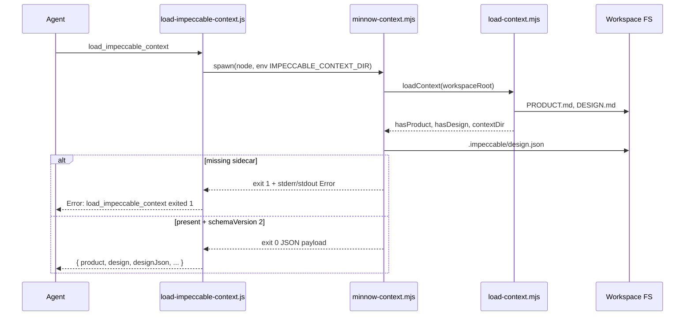

# BUG-012 — `load_impeccable_context` fails when `.impeccable/design.json` is missing

**Tracker:** [bug-hunt-session-2026-05-24.md](../../bug-hunt-session-2026-05-24.md) (BUG-012)  
**Architecture:** [documentation/context.md](../../context.md) — Impeccable / UI Designer  
**Primary code:** [`src/skills/impeccable/scripts/minnow-context.mjs`](../../../src/skills/impeccable/scripts/minnow-context.mjs)  
**Server wrapper:** [`server/impeccable/load-impeccable-context.js`](../../../server/impeccable/load-impeccable-context.js)

> **Scope of this document:** analysis and implementation plan only. No code changes are included here.

**Linear:** [MIN-66](https://linear.app/minnowai/issue/MIN-66/bug-012-impeccable-missing-designjson) (High, labels Bug + skills)

---

## Verification (2026-05-24)

| Check | Result |
|-------|--------|
| Temp workspace: `PRODUCT.md` + `DESIGN.md`, no `.impeccable/` | **Fail** — `minnow-context.mjs` exit 1; message matches bug hunt |
| Minnow `PROJECT_ROOT` with tracked sidecar | **Pass** — exit 0; `designJson.schemaVersion === 2` |
| `toolLoadImpeccableContext` (server wrapper) | **Pass** — `test/impeccable/load-context-tool.test.mjs` |
| `npm run` / `node --test` impeccable tests (clean env) | **Pass** — 14/14 after clearing stale `IMPECCABLE_CONTEXT_DIR` from manual repro |

**Verdict:** Bug **confirmed** for workspaces without the sidecar; fix not yet implemented (plan option A recommended).

---

## Problem summary

Invoking the **`load_impeccable_context`** tool (or running `minnow-context.mjs` directly) **exits with code 1** when the active workspace has no **`.impeccable/design.json`**, even if `PRODUCT.md` and `DESIGN.md` are present. The agent sees:

```text
Error: load_impeccable_context exited 1
Error: Missing .impeccable\design.json — run impeccable document or add design tokens
```

That blocks Impeccable and UI Designer flows that treat context load as a **hard gate** before critique or edits.

---

## Reproduction

| Step | Action |
|------|--------|
| 1 | Open a workspace **without** `.impeccable/design.json` (new repo, or Minnow before sidecar was committed). |
| 2 | Call **`load_impeccable_context`** from chat, UI Designer, or `/impeccable` harness. |
| 3 | Observe non-zero child exit and `Error:` prefix in tool result. |

**Manual CLI repro:**

```bash
# Empty temp dir with only PRODUCT.md / DESIGN.md optional
mkdir /tmp/no-sidecar && cd /tmp/no-sidecar
IMPECCABLE_CONTEXT_DIR=$PWD node path/to/minnow/scripts/minnow-context.mjs
echo $?   # expect 1 today
```

**Minnow repo today:** `.impeccable/design.json` is **tracked** and present; the bug still applies to **other workspaces** and to clones that never ran `/impeccable document`.

---

## Root cause

### Asymmetric strictness

| Layer | Missing `PRODUCT.md` / `DESIGN.md` | Missing `.impeccable/design.json` |
|-------|-----------------------------------|----------------------------------|
| [`load-context.mjs`](../../../src/skills/impeccable/scripts/load-context.mjs) | Returns `hasProduct: false` / `hasDesign: false`; **exit 0** | Not consulted |
| [`minnow-context.mjs`](../../../src/skills/impeccable/scripts/minnow-context.mjs) | Inherits graceful flags via `loadContext()` | **`readDesignJson()` throws** → uncaught in `main()` → **exit 1** |
| [`live-server.mjs`](../../../src/skills/impeccable/scripts/live-server.mjs) `/design-system.json` | `hasMd: false` when absent | `hasSidecar: false` when absent; **HTTP 200** |

`minnow-context.mjs` is the **only** Minnow context path that **requires** the sidecar. That contradicts upstream Impeccable behavior for the live panel and with `load-context.mjs` semantics.

### Failure mechanism

```33:38:src/skills/impeccable/scripts/minnow-context.mjs
function readDesignJson(contextDir, workspaceRoot) {
  const designJsonPath = path.join(contextDir, '.impeccable', 'design.json');
  if (!fs.existsSync(designJsonPath)) {
    throw new Error(
      `Missing ${path.relative(workspaceRoot, designJsonPath)} — run impeccable document or add design tokens`,
```

`main()` has no top-level `try/catch`, so Node reports an unhandled exception and exit code **1**. [`load-impeccable-context.js`](../../../server/impeccable/load-impeccable-context.js) maps `code !== 0` to a string starting with `Error: load_impeccable_context exited …` — indistinguishable from script bugs or timeouts for the model.

### When the sidecar is legitimately absent

Per [`src/skills/impeccable/reference/document.md`](../../../src/skills/impeccable/reference/document.md):

- **Seed mode** intentionally skips writing `.impeccable/design.json` until real tokens exist.
- **Day-zero projects** may have `DESIGN.md` frontmatter only until the user runs **`/impeccable document`** (Step 4b).
- **External workspaces** opened in Minnow often have no Impeccable setup at all.

The error message (“run impeccable document”) is **correct guidance** but **wrong severity** (process failure vs. setup state).

### Operational note: `impeccable:sync`

[`scripts/sync-impeccable-skill.mjs`](../../../scripts/sync-impeccable-skill.mjs) copies upstream `scripts/` with `force: true`. **`minnow-context.mjs` exists only under `src/skills/impeccable/scripts/`** (not in `.agents/skills/impeccable`). Sync does not delete extra dest files, but any future upstream file name collision could still break Minnow’s loader. A **preserve list** for Minnow-only scripts is worth adding when implementing this bug fix.

---

## Data flow (today)



---

## Affected surfaces

| Surface | Impact |
|---------|--------|
| Tool `load_impeccable_context` | Hard fail; blocks tool loop |
| `/impeccable` harness + [`src/skills/impeccable/SKILL.md`](../../../src/skills/impeccable/SKILL.md) | “Context gate (required)” assumes full JSON |
| UI Designer ([`agent.full.md`](../../../src/chat/prompts/work-agents/ui-designer/agent.full.md), [`ui-designer/SKILL.md`](../../../src/skills/ui-designer/SKILL.md)) | Step 1 preflight calls tool; `context=fail` |
| Tests | [`test/impeccable/load-context-tool.test.mjs`](../../../test/impeccable/load-context-tool.test.mjs) and [`test/skills-impeccable.test.mjs`](../../../test/skills-impeccable.test.mjs) only cover **happy path** (Minnow repo with sidecar) |
| README / tool catalog | Describes all three files as always loaded |

**Not broken by missing sidecar alone:** `run_impeccable detect`, harness reference fetch API, `load-context.mjs` CLI.

---

## Design goals

1. **Do not block** PRODUCT/DESIGN-only workflows when the sidecar was never generated.
2. **Preserve machine-readable tokens** when `.impeccable/design.json` exists (`schemaVersion: 2` validation stays strict).
3. **Guide setup** with one clear next step: **`/impeccable document`** (harness), not `npx impeccable document`.
4. **Keep tool contract stable** for consumers that already parse JSON on success (add fields; avoid breaking `designJson` when present).
5. **Align tests** with both “full context” and “partial context” workspaces.

---

## Options considered

### A — Soft success (recommended)

On missing or invalid sidecar (missing file only for “soft”; keep strict parse for **present** invalid JSON):

- Exit **0**
- Payload includes existing `loadContext()` fields plus:
  - `hasDesignJson: boolean`
  - `designJson: object | null`
  - `designJsonSetupHint: string` (e.g. run `/impeccable document` to generate `.impeccable/design.json`)
  - `designJsonPath: string | null` (relative path for display)

**Pros:** Matches `load-context.mjs` and live-server; agents can still read `product` / `design`; model can branch.  
**Cons:** Callers must check `hasDesignJson`; prompts need one-time updates.

### B — Hard fail with client preflight only

Keep exit 1 in script; add Minnow UI/server check before agents invoke the tool.

**Pros:** Forces explicit setup.  
**Cons:** Poor DX in chat; duplicate logic; external workspaces still fail inside tool loop.

### C — Auto-bootstrap minimal `design.json`

Synthesize schema v2 from `DESIGN.md` frontmatter when sidecar missing (subset of `/impeccable document`).

**Pros:** “Just works” for simple cases.  
**Cons:** Large scope; duplicates document workflow; risk of stale/wrong tokens; write permissions on workspace.

### D — Ship default sidecar in every template / postinstall

Commit or generate `.impeccable/design.json` for Minnow; document for other repos.

**Pros:** Fixes dogfooding repo only.  
**Cons:** Does not fix arbitrary workspaces; seed mode still skips sidecar by design.

**Recommendation:** **A** as the fix; optionally combine with **D** for Minnow repo onboarding docs (separate, low priority).

---

## Recommended implementation plan

### 1. `minnow-context.mjs` — graceful sidecar

- Replace `throw` on missing file with structured result (no process exit).
- Wrap `main()` in try/catch only for **unexpected** errors (permissions, etc.) if desired; missing file is **not** unexpected.
- Keep **strict** validation when file exists: JSON parse, `schemaVersion === 2`.
- Extend stdout payload:

```json
{
  "hasProduct": true,
  "hasDesign": true,
  "hasDesignJson": false,
  "designJson": null,
  "designJsonSetupHint": "Run /impeccable document in this workspace to generate .impeccable/design.json.",
  "designJsonPath": ".impeccable/design.json",
  "contextDir": "...",
  "workspaceRoot": "...",
  "appRoot": "..."
}
```

- Use **`contextDir`** (from `loadContext`) for sidecar path, not only `workspaceRoot`, so monorepo `IMPECCABLE_CONTEXT_DIR` stays correct.

### 2. Server tool (`load-impeccable-context.js`)

- No change required if script always exits 0 for “missing sidecar.”
- Optional: if stdout parses as JSON and `hasDesignJson === false`, append a single human-readable line after JSON for the model (avoid duplicating full error stack).

### 3. Agent / skill copy

| File | Change |
|------|--------|
| `src/skills/impeccable/SKILL.md` | Context gate: if `hasDesignJson` is false, run `/impeccable document` before token-critical critique; allow PRODUCT/DESIGN-only teach/audit where reference allows |
| `src/skills/ui-designer/SKILL.md` | Preflight: `context=pass` when `hasProduct`/`hasDesign`; sub-gate for `designJson` |
| `src/chat/prompts/work-agents/ui-designer/agent.{full,lite}.md` | Same branching |
| `src/tools/definitions.ts` | Description: “Returns JSON; `designJson` may be null until sidecar exists” |

### 4. Tests

| Test | Intent |
|------|--------|
| New fixture dir `test/fixtures/impeccable-workspace-partial/` | `PRODUCT.md` + `DESIGN.md`, **no** `.impeccable/` |
| `load-context-tool.test.mjs` | `toolLoadImpeccableContext` returns JSON, `hasDesignJson === false`, no `Error:` prefix |
| `skills-impeccable.test.mjs` | `spawn minnow-context.mjs` with `IMPECCABLE_CONTEXT_DIR` → fixture; exit 0 |
| Existing happy-path tests | Unchanged against `PROJECT_ROOT` |

### 5. Sync safety

- In `sync-impeccable-skill.mjs`, after copying upstream `scripts/`, **re-copy or protect** `minnow-context.mjs` from a Minnow-only source path, or maintain `scripts/minnow-context.mjs` outside the synced tree and import from a thin wrapper (heavier).

### 6. Documentation

- Update `documentation/context.md` Impeccable table: partial context semantics.
- Close BUG-012 in bug-hunt doc after QA.

---

## Acceptance criteria

- [ ] Workspace with `PRODUCT.md` + `DESIGN.md` but **no** `.impeccable/design.json`: `load_impeccable_context` returns **success** (no `Error:` prefix), valid JSON, `hasDesignJson: false`, actionable hint.
- [ ] Workspace with valid sidecar: unchanged behavior; `designJson.schemaVersion === 2`.
- [ ] Workspace with **invalid** sidecar (bad JSON or wrong schema): still **fails** with clear message (exit non-zero or structured error — team choice; prefer fail for corrupt file).
- [ ] `npm run test:impeccable` and `npm run test:skills-impeccable` pass including new partial fixture cases.
- [ ] UI Designer / Impeccable prompts tell the model what to do when `hasDesignJson` is false.
- [ ] `npm run impeccable:sync` does not remove or revert `minnow-context.mjs` behavior.

---

## Out of scope (for BUG-012)

- Full auto-generation of sidecar from `DESIGN.md` (option C).
- Changing upstream Impeccable npm package behavior.
- Fixing unrelated Impeccable issues (harness routing, `llmster` streaming, etc.).
- Committing `.impeccable/design.json` into **user** projects automatically.

---

## Open questions (product / UX)

1. Should **invalid** `design.json` (present but corrupt) use the same soft path or remain a hard error? **Proposal:** hard error — indicates user action to fix file, not missing setup.
2. Should Minnow show a **composer banner** when `hasDesignJson === false` (client-side parse of last tool result)? Nice-to-have; not required for script fix.
3. For **seed-mode** `DESIGN.md` with no tokens, is PRODUCT/DESIGN-only context enough for `/impeccable teach`? Confirm per `reference/teach.md` before relaxing gates in prompts.

---

## Verification checklist (manual QA)

1. Temp workspace: only `DESIGN.md` stub → tool succeeds, hint present.
2. Minnow `PROJECT_ROOT` → tool succeeds, `designJson.schemaVersion === 2`.
3. Corrupt `.impeccable/design.json` → fails with parse/schema message.
4. Run `/impeccable document` in temp workspace → subsequent load returns `hasDesignJson: true`.
5. UI Designer plan mode: preflight line reflects partial vs full context.

---

## Related references

- Bug hunt detail: [bug-hunt-session-2026-05-24.md § BUG-012](../../bug-hunt-session-2026-05-24.md)
- Sidecar authoring: [`reference/document.md`](../../../src/skills/impeccable/reference/document.md) Step 4b
- Tool registration: [`server.js`](../../../server.js) `load_impeccable_context` handler
- Existing tests: [`test/impeccable/load-context-tool.test.mjs`](../../../test/impeccable/load-context-tool.test.mjs)


---

## Verification (APPROVED)

**Date:** 2026-05-24

**Notes:** Plan verified against codebase (static review). Bug-hunt entry aligned. Ready for implementation unless plan header marks shipped.

**Linear:** [MIN-66](https://linear.app/minnowai/issue/MIN-66/bug-012-impeccable-missing-designjson)
