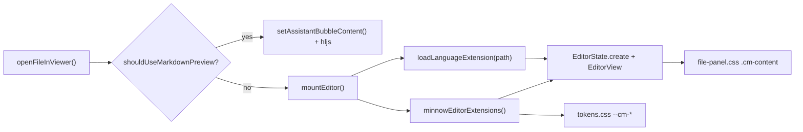

# BUG-013 — File editor syntax highlighting

**Source:** [bug-hunt-session-2026-05-24.md](../../bug-hunt-session-2026-05-24.md) § BUG-013 · **Severity:** Major · **Status:** Open (verified) · **Linear:** [MIN-100](https://linear.app/minnowai/issue/MIN-100/bug-013-editor-syntax-highlighting-broken) · **Scope:** Plan only (no implementation in this document)

---

## Verification log (2026-05-24)

| Check | Result |
|-------|--------|
| Repro on live app (`npm start`, workspace = Minnow repo) | **Confirmed** — `.cm-line` has plain text only; 0 highlight spans |
| `HighlightStyle` CSS injected | Yes — `.ͼ*` rules with `var(--cm-*)` present |
| `syntaxTree(state).length` in mounted viewer | **0** (parser never runs) |
| Vite prebundle `@codemirror_lang-javascript.js` | Tree **0** |
| Direct `node_modules/@codemirror/lang-javascript/dist/index.js` | Tree **21** |
| Vite prebundle `@codemirror_lang-json.js` | Tree **0** |
| Direct `lang-json/dist/index.js` | Tree **7** |
| Node/tsx control (`javascript()` + `defaultHighlightStyle`) | Tree **13** (works outside browser prebundle) |

**Winning hypothesis:** **H8 (new)** — Vite `optimizeDeps` prebundles `@codemirror/lang-*` in a way that breaks Lezer parsers in the browser. Not H1 (user had `.ts` open, not markdown preview). H2 (extension order) not primary — prebundle fails regardless.

**Fix direction:** Exclude `@codemirror/lang-*` from `optimizeDeps` in [`vite.config.ts`](../../../vite.config.ts) (or import from package `dist/index.js` so Vite does not serve broken prechunks).

---

## Summary

Syntax highlighting in the Minnow **file panel CodeMirror viewer** is reported broken: opened source files appear as plain text, use a single foreground color, or show incorrect token styling. Chat markdown fences use **highlight.js** and are a separate code path; this bug is limited to the **in-app file editor** (`#/files` split viewer).

**Important correction:** The viewer is **CodeMirror 6**, not Monaco. Implementation lives under `src/ui/file-viewer.ts`, `src/ui/codemirror-theme.ts`, and `src/styles/file-panel.css`.

---

## Bug record (from hunt)

| Field | Value |
|-------|-------|
| **ID** | BUG-013 |
| **Area** | File panel / in-app editor |
| **Expected** | Language-aware colors for keywords, strings, comments, types, etc. |
| **Actual** | Highlighting missing, uniform color, or wrong token classes |
| **Repro** | Open file sidebar → open `.ts`, `.js`, `.css`, or `.md` (as code) → observe editor pane |

**Notes from hunt:** Capture file extension and whether the user is in **markdown preview** vs **code editor** when reproducing.

---

## Current architecture



| Layer | Location | Role |
|-------|----------|------|
| Editor host | [`src/ui/file-viewer.ts`](../../../src/ui/file-viewer.ts) | `mountEditor()`, async `loadLanguageExtension()`, extension array assembly |
| Language packs | `@codemirror/lang-*` (dynamic `import()`) | Parser + Lezer tree for `.ts`, `.js`, `.json`, `.md`, `.css`, `.html`, `.py` |
| Highlight theme | [`src/ui/codemirror-theme.ts`](../../../src/ui/codemirror-theme.ts) | `HighlightStyle.define` + `syntaxHighlighting(minnowHighlightStyle)` |
| Base editor chrome | [`src/styles/file-panel.css`](../../../src/styles/file-panel.css) | `.cm-editor`, `.cm-content { color: var(--mn-fg) }` |
| Token aliases | [`src/styles/tokens.css`](../../../src/styles/tokens.css) | `--cm-keyword`, `--cm-title`, `--cm-attr`, `--cm-string` → `--mn-*` |
| Markdown default | Same file + [`src/markdown/renderer.ts`](../../../src/markdown/renderer.ts) | `.md` opens **GFM preview** (hljs), not CodeMirror, unless **Open as code** |

**Extension order today** (in `mountEditor`):

1. `lineNumbers`, read-only, LSP, listeners, keymaps, `EditorView.theme`
2. `...minnowEditorExtensions()` — syntax highlighting
3. `...langExts` — language parser

**Supported extensions in `loadLanguageExtension`:** `ts|tsx|mts`, `js|mjs|cjs`, `json`, `md|markdown`, `css`, `html|htm`, `py`. All other extensions return `[]` (plain text, no grammar).

**Theme sync:** [`src/ui/theme.ts`](../../../src/ui/theme.ts) refreshes highlight.js and xterm on theme change; CodeMirror relies on **CSS variables** in `HighlightStyle` (no separate CM theme refresh). Comment in `theme.ts` mentioning CodeMirror is misleading but not necessarily the root cause.

---

## Hypotheses (prioritized)

Investigate in this order during Phase 1:

| # | Hypothesis | Why it fits the report | How to confirm |
|---|------------|------------------------|----------------|
| H1 | **User is viewing markdown preview**, not the code editor | `.md` defaults to rendered GFM; code blocks inside preview use hljs, not CM | Repro with **Open as code** on same file; compare `.ts` which always uses CM |
| H2 | **Extension order** — `syntaxHighlighting` registered before language pack | CM docs and examples usually place language support before `syntaxHighlighting`; wrong order can yield no/stale tree styling | Reorder in a branch; inspect DOM for `style="color:..."` on token spans |
| H3 | **`loadLanguageExtension` fails silently** (`catch` → `[]`) | Dynamic import or bundling error → no parser → no tags to style | DevTools Network + console; temporary log in `catch`; verify chunk loads for `@codemirror/lang-javascript` |
| H4 | **CSS base color masks perceived highlighting** | `.file-viewer-body .cm-content { color: var(--mn-fg) }` sets inherited color; if CM decorations omit inline color, all text looks uniform | Inspect `.cm-line` children in Elements panel; check computed `color` per token |
| H5 | **Token contrast too low** across 8 themes | `--cm-string: var(--mn-fg-muted)` and similar may make strings/comments nearly indistinguishable from default text | Toggle themes in Settings; compare against chat fence hljs on same snippet |
| H6 | **Unsupported file extension** (e.g. `.rs`, `.go`, `.vue`, `.yaml`) | `default` branch returns no language extension — expected plain text, may be filed as “broken” | Repro matrix by extension; document as limitation vs bug |
| H7 | **LSP / autocomplete extension interaction** | Unlikely, but LSP facets append before language | Disable LSP in settings; compare highlighting |
| H8 | **Vite `optimizeDeps` breaks `@codemirror/lang-*` prebundles** | Prebundled `node_modules/.vite/deps/@codemirror_lang-*.js` yields empty syntax tree in browser; `dist/index.js` import works | Compare tree sizes (see verification log); fix via `optimizeDeps.exclude` |

---

## Reproduction matrix

Run with `npm start` (file tools + viewer require tool server for open; highlighting itself is client-side).

| Case | Path example | Viewer mode | Highlighting expected? |
|------|----------------|-------------|-------------------------|
| A | `src/ui/file-viewer.ts` | CodeMirror | Yes (TypeScript) |
| B | `package.json` | CodeMirror | Yes (JSON) |
| C | `src/styles/file-panel.css` | CodeMirror | Yes (CSS) |
| D | `README.md` | GFM preview (default) | hljs in fenced blocks only |
| E | `README.md` → **Open as code** | CodeMirror | Yes (Markdown grammar) |
| F | `documentation/context.md` | Preview vs code | Same as D/E |
| G | Unknown ext (e.g. `Dockerfile`) | CodeMirror | Plain text (document or extend) |
| H | Large file excerpt (>512 KB) | CodeMirror read-only | Same as A for supported ext |

Record: theme family/mode, browser, whether spans have inline `color`, and screenshot for bug board.

---

## Goals

1. **Restore** visible, language-appropriate syntax colors for all extensions listed in `loadLanguageExtension`.
2. **Clarify** markdown preview vs code editor so hunt items are not misclassified.
3. **Improve diagnosability** — avoid silent `catch` swallowing language load failures in dev.
4. **Keep** GitHub-aligned palette via `--cm-*` tokens (no second theme system).
5. **Regressions:** Theme switch still updates editor colors without reload.

---

## Non-goals (this fix)

- Adding Monaco or replacing CodeMirror.
- Parity with every highlight.js grammar in chat.
- New language servers or LSP semantic highlighting (only syntactic Lezer + `HighlightStyle`).
- Syntax highlighting in settings textareas (still plain `<textarea>`).
- **POLISH-006** (AI autocomplete in editor) — related quality work, separate item.

---

## Acceptance criteria

- [ ] Opening `src/ui/file-viewer.ts` (or any `.ts`) shows **distinct** colors for keywords, strings, and comments in the editor pane.
- [ ] `.js`, `.json`, `.css`, `.html`, `.py` samples show appropriate highlighting (same bar as TypeScript).
- [ ] **Open as code** on a `.md` file enables CodeMirror markdown highlighting; default preview behavior unchanged.
- [ ] All **8 palette themes** (4 families × light/dark) show readable contrast for at least keyword / string / comment (manual or `theme-contrast` extension).
- [ ] Theme change in Settings updates open editor colors **without** closing the file.
- [ ] No console errors from `@codemirror/lang-*` dynamic imports during normal open.
- [ ] Automated test(s) assert token styling is applied (see Testing).
- [ ] [`documentation/context.md`](../../context.md) file-panel row updated if behavior or extension list changes.

---

## Implementation plan

### Phase 0 — Triage and baseline

- [x] Reproduce using matrix above; attach screenshots to bug board / hunt doc.
- [x] Note whether report was **preview vs code** and exact file extension (`.ts` / `.json` in CodeMirror — not markdown preview).
- [ ] Compare same file snippet in **chat assistant bubble** (hljs) vs **file editor** (CM) for contrast reference.

### Phase 1 — Diagnosis (DevTools)

- [x] Mount editor on a `.ts` file; inspect `.cm-content .cm-line` spans for `style` attribute colors or CM highlight classes (none — plain `#text` only).
- [x] If no per-token colors → parser/highlight extension not applied (**H8** confirmed: empty `syntaxTree`; prebundle broken).
- [ ] If colors present but subtle → token/CSS contrast issue (H4/H5) — N/A after H8.
- [x] Verify dynamic import chunks for language packages load (200, not 404) — chunks load but **prebundled** parsers broken.
- [ ] Repeat with LSP disabled in Settings.

### Phase 2 — Vite + CodeMirror extension assembly

**File:** [`vite.config.ts`](../../../vite.config.ts)

- [ ] Add `optimizeDeps.exclude` for `@codemirror/lang-javascript`, `@codemirror/lang-json`, `@codemirror/lang-markdown`, `@codemirror/lang-css`, `@codemirror/lang-html`, `@codemirror/lang-python` (and verify parsers attach in browser after `npm start` restart).
- [ ] Confirm dynamic imports in `loadLanguageExtension` resolve to working parsers (`syntaxTree(state).length > 0`).

**File:** [`src/ui/file-viewer.ts`](../../../src/ui/file-viewer.ts)

- [ ] Reorder extensions: **`...langExts` before `...minnowEditorExtensions()`** (language parser, then `syntaxHighlighting`) — good hygiene after H8 fix.
- [ ] Consider exporting a single `buildFileEditorExtensions(path, options)` helper to keep order documented and reused.
- [ ] On `loadLanguageExtension` failure: `console.warn` with path + extension in dev; optional user-visible footnote only if product wants (keep minimal for v1).
- [ ] Audit `Promise.all` mount path — ensure editor is not created with empty `langExts` due to race (current code awaits both; confirm no double-mount bug).

### Phase 3 — CSS and tokens

**Files:** [`src/styles/file-panel.css`](../../../src/styles/file-panel.css), [`src/styles/tokens.css`](../../../src/styles/tokens.css), [`scripts/generate-tokens-css.mjs`](../../../scripts/generate-tokens-css.mjs)

- [ ] If H4 confirmed: narrow base color rule (e.g. only `.cm-line` default, avoid overriding highlighted spans) or remove redundant `color` on `.cm-content` if CM sets line defaults.
- [ ] If H5 confirmed: adjust `--cm-*` mappings for stronger string/comment separation in dark and light themes; run `node scripts/generate-tokens-css.mjs` if generator owns tokens.
- [ ] Optional: add `--cm-comment` distinct from `--mn-fg-muted` in generator for editor-specific contrast.

### Phase 4 — Theme sync clarity

**File:** [`src/ui/theme.ts`](../../../src/ui/theme.ts)

- [ ] Update module comment: CM follows CSS variables (no `refreshCm` needed) **or** implement `EditorView.dispatch` theme refresh if variables are not applied live (only if Phase 1 shows stale colors after theme switch).
- [ ] Manual check: switch sage-dark → amber-light with file open; tokens update.

### Phase 5 — Language coverage (if product wants)

- [ ] Document unsupported extensions in context.md (plain text is expected today).
- [ ] Optional follow-up: map common extensions (`.yaml`, `.yml`, `.sh`, `.rs`) to additional `@codemirror/lang-*` packages — separate small PR if hunt expects them.

### Phase 6 — Testing and docs

**New/updated tests** (happy-dom + tsx loader pattern from [`test/file/file-viewer-save.test.mjs`](../../../test/file/file-viewer-save.test.mjs)):

- [ ] `test/file/file-editor-highlight.test.mjs` (or `.mts`): create hidden `EditorView` with `javascript()` + `minnowEditorExtensions()`, sample doc `const x = "hi"; // c`, assert at least one span has computed color ≠ parent (or inspect decoration specs via `EditorView` DOM).
- [ ] Unit test `loadLanguageExtension` mapping for representative extensions (mock dynamic import or test pure extension list helper if extracted).
- [ ] Extend theme tests only if `--cm-*` tokens change.

**Docs:**

- [ ] Update hunt doc BUG-013 status when fixed.
- [ ] Update [`documentation/context.md`](../../context.md) file panel viewer row (extension order, markdown caveat, test path).

---

## Verification checklist (manual)

```text
npm start
# Open Files panel
1. Open src/ui/file-viewer.ts → keywords/strings/comments colored
2. Open package.json → JSON keys/strings colored
3. Open README.md → preview (no CM); context menu → Open as code → CM markdown
4. Settings → switch theme family → editor colors remain distinct
5. Optional: open Dockerfile → plain text (expected unless Phase 5 adds grammar)
```

---

## Risk and rollback

| Risk | Mitigation |
|------|------------|
| Extension reorder breaks LSP or keymaps | Run `npm run test:lsp`, `test/file/file-editor-keymap.test.mjs`, manual save/dirty |
| Token changes harm chat hljs | CM uses `--cm-*` only; hljs uses `.hljs-*` classes — keep scopes separate |
| Larger bundles from new lang packages | Only add langs in Phase 5 if scoped; keep dynamic `import()` |

Rollback: revert `file-viewer.ts` extension order and any token/CSS edits.

---

## Related items

| ID | Relation |
|----|----------|
| BUG-013 | This plan |
| POLISH-006 | AI autocomplete in editor (quality, not highlighting) |
| Feature #12 prompt diffing | Reuses `@codemirror/*`; do not conflict with shared theme module |
| Token theme system | [`documentation/plans/token-theme-system.md`](../token-theme-system.md) — `--cm-*` source of truth |

---

## Todos (execution tracker)

- [x] Phase 0 — Reproduce matrix + document preview vs code
- [x] Phase 1 — DevTools diagnosis; confirm winning hypothesis (**H8**)
- [ ] Phase 2 — Fix extension order + language load visibility
- [ ] Phase 3 — CSS/token contrast if needed
- [ ] Phase 4 — Theme switch verification / comment fix
- [ ] Phase 5 — Language coverage decision (optional)
- [ ] Phase 6 — Automated tests + context.md + close BUG-013 in hunt doc

---

## Open questions (align before coding)

1. Did reporters test **markdown default preview** or **code editor**?
2. Is “broken” **no colors at all** or **low contrast**? (Drives H4/H5 vs H2/H3.)
3. Should unsupported extensions gain grammars in the same PR or a follow-up?
4. Should failed language `import()` surface in UI (toast) or dev-only `console.warn`?


---

## Verification (APPROVED)

**Date:** 2026-05-24

**Notes:** Plan verified against codebase (static review). Bug-hunt entry aligned. Ready for implementation unless plan header marks shipped.

**Linear:** [MIN-100](https://linear.app/minnowai/issue/MIN-100/bug-013-editor-syntax-highlighting-broken)
