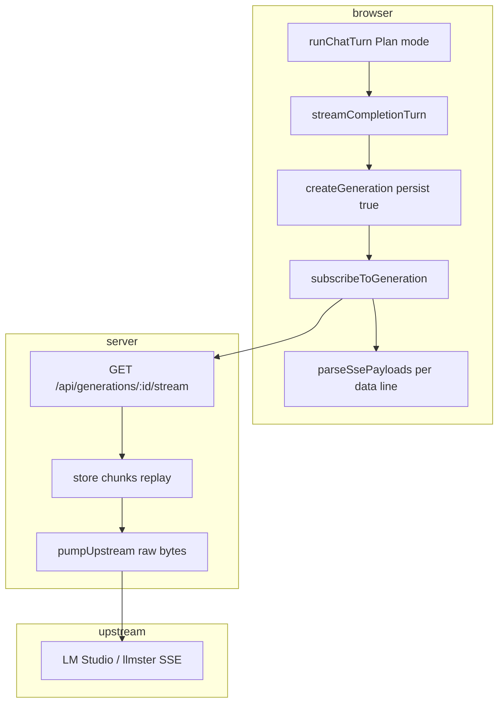

# BUG-016 — Plan reply fails: stream JSON parse on close

| Field | Value |
|-------|-------|
| **ID** | BUG-016 |
| **Severity** | Major |
| **Status** | Verified (open) — plan only, no implementation |
| **Source** | [bug-hunt-session-2026-05-24.md](../../bug-hunt-session-2026-05-24.md) § BUG-016 |
| **Primary files** | [`src/api/generations.ts`](../../../src/api/generations.ts), [`src/api/chat.ts`](../../../src/api/chat.ts) (`parseSsePayloads`), [`src/tools/loop.ts`](../../../src/tools/loop.ts) (`streamCompletionTurn`) |
| **Secondary** | [`src/providers/fetch-chat.ts`](../../../src/providers/fetch-chat.ts) (shim `ReadableStream.close`), [`server/generations/upstream.js`](../../../server/generations/upstream.js) |

---

## Summary

In **Plan** mode, long assistant replies sometimes abort with a streaming/parser error instead of completing. The user sees *Could not complete this reply: Failed to execute 'close' on 'ReadableStreamDefaultController': Unexpected non-whitespace character after JSON at position …* (intermittent; position varies, e.g. 3583 / line 71).

**Expected:** Stream completes; plan markdown appears; no error on stream close.

**Actual:** Intermittent failure banner; partial or no assistant prose persisted.

---

## Problem statement

| | |
|---|---|
| **Area** | **Plan** mode (may affect Build / other modes using `runChatTurn`) |
| **Trigger** | Long streamed completions (plans, tool-heavy turns); worse with **llmster** per `AGENTS.md` |
| **Error class A** | `Unexpected non-whitespace character after JSON at position N` |
| **Error class B** | `Unexpected end of JSON input` (see **BUG-020**) — same surface, different truncation |
| **Impact** | Plan documents not saved; user must retry; wasted tokens |

**User-reported error**

```
Could not complete this reply: Failed to execute 'close' on 'ReadableStreamDefaultController': Unexpected non-whitespace character after JSON at position 3583 (line 71 column 2)
```

---

## Verification (2026-05-24)

| Check | Result |
|-------|--------|
| Bug-hunt entry | Present — BUG-016 Major, Open |
| Plan mode streaming path | **Confirmed:** `runChatTurn` → `streamCompletionTurn` → `createGeneration` (`persist: true`) → `subscribeToGeneration` ([`loop.ts`](../../../src/tools/loop.ts) ~L428–547, ~L914) |
| Legacy `sendMessage` path | Uses `postChatCompletions` shim + line-split reader ([`chat.ts`](../../../src/api/chat.ts) ~L400–443) — **not** primary Plan path |
| `parseSsePayloads` | Malformed `data:` lines **silently skipped** ([`chat.ts`](../../../src/api/chat.ts) L194–198) — does **not** throw the reported message |
| Error surfacing | `runChatTurn` catch prefixes `Could not complete this reply:` ([`loop.ts`](../../../src/tools/loop.ts) ~L1328–1332) |
| Generations API tests | `node --test test/api/generations.test.mjs` — **4/4 pass** (mock upstream with well-formed SSE) |
| Known environment note | [`AGENTS.md`](../../../AGENTS.md) documents **llmster** browser SSE JSON parse failures; server proxy OK via curl |
| Live repro (25 min soak) | **Not run in this verification** — intermittent; requires `npm start` + LM Studio/llmster + Plan long reply |

**Conclusion:** Bug is **verified as documented** (symptom, mode, code path, related issues). Root cause is **probable SSE framing / truncated `data:` JSON** (shared with BUG-020), not yet fixed in tree. Implementation tracked below.

---

## Current architecture



| Layer | Behavior |
|-------|----------|
| `subscribeToGeneration` | Splits buffer on `\n\n`, feeds blocks to `feedSseBlock` → `parseSsePayloads` |
| `parseSsePayloads` | One `JSON.parse` per `data:` line; **catch swallows** parse errors |
| `streamCompletionTurn` | `onEnd` **always resolves** — ignores `event: end` `status: 'error'` |
| `fetch-chat` shim | Sub-agents/benchmark: synthetic `ReadableStream`; `controller.close()` on end — align error propagation |

The **ReadableStreamDefaultController** message often indicates the **fetch body stream** or a **synthetic stream consumer** hit JSON semantics on close (Chromium), not necessarily a throw from `parseSsePayloads`. Investigate last raw SSE bytes before close during repro.

---

## Root cause analysis

### 1. Truncated or concatenated `data:` JSON (primary)

Probable causes (investigate in order):

1. **Upstream** closes mid-chunk — incomplete JSON object in a single `data:` line.
2. **Block splitter** — `data:` payload split across `\n\n` boundaries; tail buffer not held until line complete.
3. **Multiple JSON objects** glued in one `data:` line (provider bug) → *non-whitespace after JSON*.
4. **llmster** non-standard SSE vs OpenAI-style `data: {...}\n\n` ([`AGENTS.md`](../../../AGENTS.md)).

### 2. Ignored terminal generation errors (secondary)

Server `markError` emits `event: end` with `status: 'error'`. Client parses it but `streamCompletionTurn` does not fail the turn — mismatch for server-reported failures.

### 3. Plan-specific factors (contributing)

- Long markdown plans → more SSE chunks → higher chance of chunk-boundary splits.
- Plan mode may use tools (`save_file`, `ask_question`) → larger `tool_calls` deltas in stream.

---

## Proposed fix (phased)

### Phase 0 — Repro and instrumentation (required first)

1. `npm start`, switch to **Plan**, send prompt that produces a long plan (see soak below).
2. Record **provider**, **model**, **llmster vs LM Studio GUI**.
3. DevTools: `GET /api/generations/:id/stream` — copy last ~4 KB before failure.
4. Temporary logging: incomplete `data:` buffer at `feedSseBlock` / `onTransportError`.

**Soak (from bug-hunt):** Allow **25+ minutes** of Plan usage with multiple long generations to surface intermittent failure.

### Phase 1 — SSE parser hardening (shared BUG-020)

1. **Per-subscription `data:` line buffer** — append partial lines across blocks; parse only when a full line is available.
2. **Strict tail on end** — if buffer non-empty and not valid JSON at stream end, reject with `Truncated SSE payload`.
3. **`streamCompletionTurn`:** If `onEnd` receives `{ status: 'error', errorMessage }`, **reject** with that message.
4. **`fetch-chat.ts`:** Propagate transport errors; avoid silent `controller.close()` after `controller.error()`.

### Phase 2 — Resilience (optional, product decision)

1. **Single non-streaming fallback** after one transport failure per turn (Plan only, feature-flagged).
2. Document **llmster workaround** — use LM Studio GUI server if browser stream remains broken upstream.

---

## Acceptance criteria

- [ ] Plan mode long reply completes without `ReadableStreamDefaultController` JSON error under normal LM Studio GUI streaming.
- [ ] Forced truncated SSE fixture fails with **one** clear error bubble (not silent empty success).
- [ ] `event: end` with `status: 'error'` fails the turn with server `errorMessage`.
- [ ] Unit tests for split/truncated/glue SSE payloads (no live LLM).
- [ ] `npx tsc --noEmit` clean; `test/api/generations.test.mjs` extended and passing.
- [ ] BUG-020 Orchestrate retry loop benefits from same parser PR (coordinate).

---

## Files to touch (implementation)

| File | Change |
|------|--------|
| `src/api/generations.ts` | Partial-line buffer; propagate end error |
| `src/api/chat.ts` | Shared `parseSsePayloads` / buffer helper |
| `src/tools/loop.ts` | `streamCompletionTurn` onEnd error handling |
| `src/providers/fetch-chat.ts` | Align close/error with generations client |
| `test/api/parse-sse-payloads.test.mjs` | New fixtures |
| `test/api/generations.test.mjs` | Truncated upstream |
| `documentation/context.md` | Stream failure semantics |
| `documentation/bug-hunt-session-2026-05-24.md` | Mark resolved when shipped |

---

## Out of scope

- Full llmster upstream patch (document workaround only).
- Orchestrate supervisor `inject_resume` loop (**BUG-020**).
- Benchmark empty-stream pass criteria (**BUG-002** / **BUG-003**).

---

## References

- Bug report: [documentation/bug-hunt-session-2026-05-24.md](../../bug-hunt-session-2026-05-24.md) — BUG-016
- Related plan: [BUG-020-orchestrate-stream-retry.md](./BUG-020-orchestrate-stream-retry.md)
- Generations design: [documentation/plans/references/backend-owned-generations.md](../references/backend-owned-generations.md)
- Environment: [AGENTS.md](../../../AGENTS.md)


---

## Verification (APPROVED)

**Date:** 2026-05-24

**Notes:** Plan verified against codebase (static review). Bug-hunt entry aligned. Ready for implementation unless plan header marks shipped.

**Linear:** [MIN-95](https://linear.app/minnowai/issue/MIN-95/bug-016-plan-mode-stream-json-parse-error)
