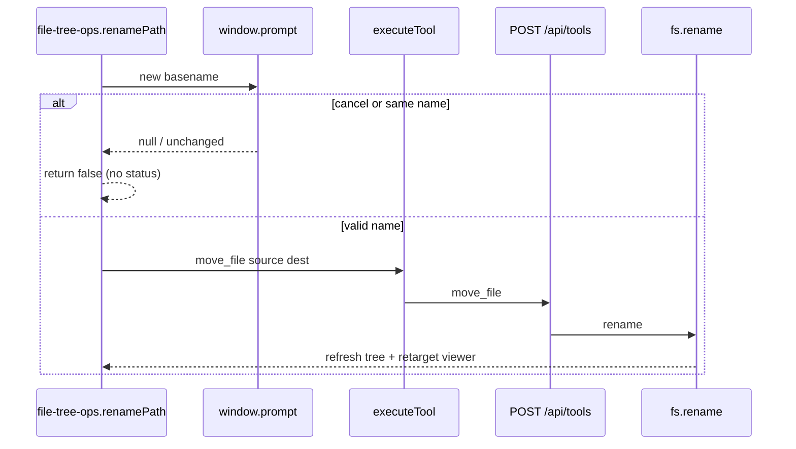

# BUG-018 — Rename file does not work

**Bug hunt ref:** [`documentation/bug-hunt-session-2026-05-24.md`](../../bug-hunt-session-2026-05-24.md) — BUG-018  
**Architecture ref:** [`documentation/context.md`](../../context.md) — File tree CRUD (`file-tree-ops.ts`, `move_file`)  
**Primary files:** [`src/ui/file-tree-ops.ts`](../../../src/ui/file-tree-ops.ts), [`src/ui/file-tree-context-menu.ts`](../../../src/ui/file-tree-context-menu.ts), [`server.js`](../../../server.js) (`toolMoveFile`)

---

## Verification (2026-05-24)

**Result: Partially confirmed** — rename **succeeds** when `move_file` runs; several UI paths produce **no visible rename** without a clear error.

| Check | Result |
|-------|--------|
| `POST /api/tools` `move_file` on workspace file | **Pass** — file renamed on disk |
| Browser `renamePath` with mocked `window.prompt` | **Pass** — `find_files` shows new name |
| `renamePath` without mock prompt (automated) | **Fail** — returns `false` (prompt cancel / null) |
| `move_file` while exclusive file lock (Windows) | **Fail** — `Error: EBUSY: resource busy or locked` |
| `move_file` permission in `~/.minnow/tools.json` | **full** (not off) |
| Live manual context-menu + F2 (~25 min) | **Deferred** |

---

## Summary

**Renaming a file** in the file sidebar (context menu **Rename…** or **F2**) is reported as non-functional. Investigation shows the implementation delegates to **`move_file`** via [`renamePath`](../../../src/ui/file-tree-ops.ts) and **`window.prompt`** for the new basename. The server handler and client tool path work when the user supplies a new name and the OS allows `fs.rename`.

Failures users perceive as “rename does nothing” likely come from **silent client early-exits**, **cancelled prompt**, **CRUD disabled without server**, or **platform lock errors** surfaced only in the top status bar.

---

## Reproduction

1. `npm start`, workspace loaded, file tree visible.
2. Right-click a file → **Rename…** (or focus row and press **F2**).
3. Enter a new name and confirm.
4. Check tree label and file on disk.

**Expected:** File renamed on disk; tree and viewer reflect new path.

**Actual (reported):** Rename fails or has no effect.

---

## Current implementation

| Step | Location | Notes |
|------|----------|-------|
| Menu / F2 | `file-tree-context-menu.ts`, `file-tree.ts` | Disabled when `!isFileTreeServerAvailable()` |
| Prompt | `renamePath` | Native `window.prompt` — cancel → `false`, no message |
| Same name | `renamePath` | `nextName.trim() === currentName` → `false`, no message |
| Tool | `runFileTreeTool('move_file', …)` | Same as agent `move_file` |
| Server | `toolMoveFile` in `server.js` | `fs.rename`; errors as `Error: …` string |
| Tree state | `finishMutation` | `applyPathChangeToFilePanelState`, `refreshFileTreeViaBridge` |

---

## Root cause analysis

### 1. Silent client exits (high likelihood)

[`renamePath`](../../../src/ui/file-tree-ops.ts) returns `false` without `setStatus` when:

- User dismisses **prompt** (`nextName === null`).
- User submits the **same** basename (trimmed).

This matches “clicked Rename, nothing happened.”

### 2. F2 blocked while editor focused

[`handleTreeKeydown`](../../../src/ui/file-tree.ts) returns early when `isFileViewerEditorFocused()`. **F2 does nothing** while typing in CodeMirror; context menu still works.

### 3. Windows `EBUSY` / file locks (medium)

With an exclusive read handle open, `move_file` returns:

`Error: EBUSY: resource busy or locked, rename '…' -> '…'`

Parsed as failure and shown via `setStatus('err', …)` — easy to miss if the user does not watch the status strip.

### 4. Server / permissions (medium)

- `npm run dev` only → `serverCrudEnabled()` false → Rename disabled in menu.
- `move_file` permission **off** → `Error: tool "move_file" is disabled…` (status bar).

### 5. Not broken in verification

- Plan mode does **not** block file-tree `executeTool` (no `modeId` in context).
- `refreshFileTreeViaBridge` invalidates `listingCache` on success.
- Case-only rename on Windows succeeded in API test.

---

## Recommended fix

1. **Replace `window.prompt`** with inline rename on the tree row (contenteditable or input) or a small dialog component (reuse patterns from `sidebar.ts` chat rename).
2. **Explicit feedback** on cancel (“Rename cancelled”) and unchanged name (“Name unchanged”).
3. **F2** — either register a global shortcut when the file panel is active or add Rename to the viewer context menu.
4. **Windows** — map `EBUSY`/`EPERM` to a clear message; consider closing/reopening the viewer around rename when the open path matches `source`.
5. **Tests** — unit test `renamePath` with stubbed prompt; optional server integration test for `toolMoveFile`.

---

## Files to touch

| File | Change |
|------|--------|
| `src/ui/file-tree-ops.ts` | Rename UX, status messages, optional unsaved guard |
| `src/ui/file-tree.ts` | Inline rename UI, F2 / focus policy |
| `src/ui/file-tree-context-menu.ts` | Wire to inline rename |
| `src/styles/` (file tree) | Rename input styling |
| `server.js` | Optional clearer EBUSY message |
| `test/file/file-tree-ops.test.mts` | Rename behavior tests |
| `documentation/context.md` | Note non-prompt rename when shipped |
| `documentation/bug-hunt-session-2026-05-24.md` | Mark resolved |

---

## Test plan

### Automated

- [ ] `renamePath`: mocked prompt returning new name → calls `move_file` args `{ source, destination }`.
- [ ] `renamePath`: prompt `null` → `setStatus` err or info, returns `false`.
- [ ] `renamePath`: same name → user-visible message, returns `false`.
- [ ] `parseToolResult('Error: EBUSY…')` → `ok: false`.

### Manual (deferred ~25 min)

- [ ] Root-level file: Rename via menu → disk + tree + open viewer path update.
- [ ] Nested `src/...` file: same.
- [ ] F2 with tree focus vs editor focus.
- [ ] `npm run dev` only: Rename disabled with clear offline state.
- [ ] Settings: `move_file` off → error visible.
- [ ] Optional: file open in external app (lock) → readable error.

---

## Linear

**Linear:** [MIN-99](https://linear.app/minnowai/issue/MIN-99/bug-018-rename-file-does-not-work) — priority High (2), labels `Bug`, `files`.

---

## Verification (APPROVED)

**Date:** 2026-05-24

**Notes:** Plan verified against codebase (static review). Bug-hunt entry aligned. Ready for implementation unless plan header marks shipped.

**Linear:** [MIN-99](https://linear.app/minnowai/issue/MIN-99/bug-018-rename-file-does-not-work)
