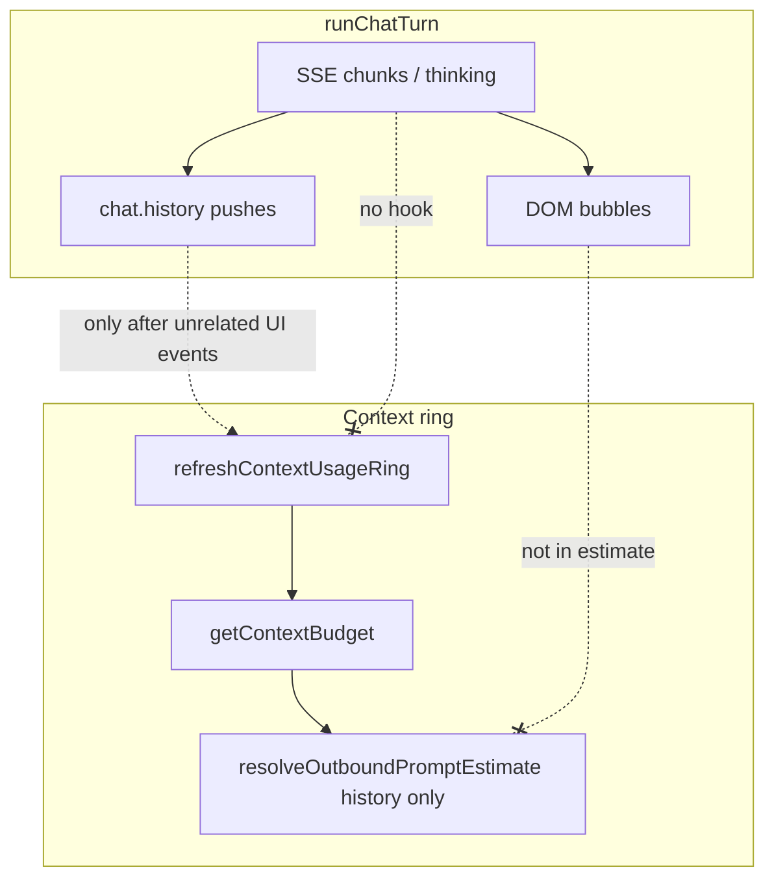

# BUG-019 — Context usage not real-time (tools + thinking)

**Tracker:** [documentation/bug-hunt-session-2026-05-24.md](../../bug-hunt-session-2026-05-24.md) — BUG-019  
**Severity:** Major  
**Area:** Context usage ring / token budget UI (`#contextUsageRing`, MIN-13)  
**Verification (2026-05-24):** **CONFIRMED** — static code review (see below). Manual UI repro recommended for stakeholder sign-off.

---

## Summary

The in-chat **context fill ring** should climb **during** an active turn (reasoning stream, partial assistant prose, each tool round-trip). Today it stays at the pre-turn snapshot until unrelated UI events refresh it (composer typing, chat switch, history re-render). Users cannot see context pressure build mid-turn.

---

## Problem statement

| | |
|---|---|
| **Expected** | Ring and breakdown update live as outbound context grows. |
| **Actual** | Ring reflects `chat.history` at last refresh only; no refresh from `runChatTurn` / streaming. In-flight tokens (thinking, streaming prose before `history.push`) are never counted. |
| **Impact** | False sense of headroom during long tool loops; surprise when limit hit after turn completes. |

---

## Verification (static — CONFIRMED)

### 1. No refresh during the tool loop

`refreshContextUsageRing` / `scheduleContextUsageRefresh` are **not imported or called** from [`src/tools/loop.ts`](../../../src/tools/loop.ts).

Call sites today:

| Trigger | File |
|---------|------|
| Chat history paint / stats panel | `src/ui/messages.ts` (`renderChatFromHistory`, `renderStatsForChat`) |
| Composer input, model change, visibility | `src/ui/context-usage-ring.ts` |
| Attachment queue | `src/attachments/store.ts` |
| Tool enable toggles | `src/ui/tools-list.ts` |
| Model cache refresh | `src/api/models.ts` |
| App init | `src/main.ts` |

Turn completion calls `updateStrip()` in `loop.ts` but **not** `refreshContextUsageRing()`. `renderStatsForChat()` (which does refresh) is **not** invoked from the loop.

### 2. Estimate source = persisted history only

[`resolveOutboundPromptEstimate()`](../../../src/chat/prompts/token-estimate.ts) passes `chat.history` into `estimateHistoryTokens()`. During streaming:

- Assistant prose lives in `livePartialText` + DOM until `chat.history.push` at finalize.
- Reasoning lives in `ThoughtBubbleController` until persisted on `AssistantMessage.thinking`.
- Tool call JSON is in stream accumulator until `assistantToolMsg` is pushed.

So even a refresh mid-stream would under-count until history catches up.

### 3. Thinking omitted from history estimate after persist

[`serializeMessageContentForEstimate()`](../../../src/chat/prompts/token-estimate-core.ts) uses `m.content` (+ tool_calls JSON) for assistant rows — **not** `thinking` arrays. Completed turns with heavy reasoning still under-report in the ring.

### 4. Documentation drift

[`documentation/context.md`](../../context.md) MIN-13 claims refresh on “stats update”; `updateStrip` alone does not refresh the ring.

---

## Reproduction (manual)

1. `npm start`, load a model with tools + reasoning enabled.
2. Send a Build-mode prompt that triggers **multiple tool rounds** and visible **thinking**.
3. During the turn, hover `#contextUsageRing` — note **used** tokens vs after turn ends (or after switching chat and back).
4. Optional long soak: observe ring across 25+ minutes of tool-heavy work (bug-hunt session note).

---

## Root cause (diagram)



---

## Proposed fix

### A. Refresh hooks (required)

Debounced `scheduleContextUsageRefresh()` (200 ms, existing debounce in ring module):

| Event | Location |
|-------|----------|
| After each `chat.history.push` in tool path | `loop.ts` (~967, ~1040, ~1237) |
| On `onPartialText` / reasoning delta (throttled) | `streamCompletionTurn` / `handleChunk` |
| In `finally` after turn ends | `runChatTurn` finally block |
| After user message push | `pushUser` block (~617) |

### B. In-flight estimate overlay (required for “live” accuracy)

Extend `getContextBudget` options:

```ts
inFlight?: {
  partialAssistantText?: string;
  thinkingText?: string;
  pendingToolCallsJson?: string;
}
```

Wire from `loop.ts` state (`livePartialText`, thought controller snapshot, `finalizeToolCalls` accumulator before history push). Add optional breakdown row **“In progress (estimate)”** when non-zero.

### C. Count persisted thinking (recommended)

Update `serializeMessageContentForEstimate` to append serialized `thinking` segments for assistant messages (same chars÷4 heuristic).

### D. Tests + docs

- Extend `test/chat/context-usage.test.mts` for overlay + thinking serialization.
- Update `documentation/context.md` refresh list to match real triggers.

---

## Out of scope

- Server-side context budget enforcement (feature-03) — UI-only bug.
- Provider-accurate tokenizer counts mid-stream (keep heuristic; optional `lastTurnPromptTokens` still end-of-turn).

---

## Linear

Create **[BUG-019] Context usage not realtime** — priority High (2), labels `bug`, `context`.


---

## Verification (APPROVED)

**Date:** 2026-05-24

**Notes:** Plan verified against codebase (static review). Bug-hunt entry aligned. Ready for implementation unless plan header marks shipped.

**Linear:** [MIN-75](https://linear.app/minnowai/issue/MIN-75/bug-019-context-usage-not-live)
