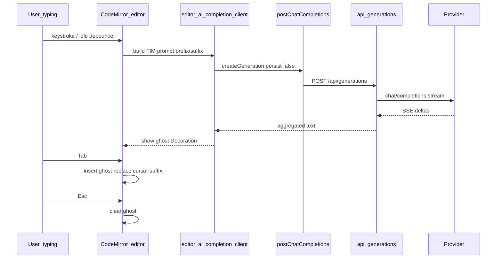

# POLISH-006 — AI code autocomplete in file editor

**Tracker:** [documentation/bug-hunt-session-2026-05-24.md](../../bug-hunt-session-2026-05-24.md) — POLISH-006  
**Type:** Polish / feature request (not a defect)  
**Area:** File panel — CodeMirror editor (`src/ui/file-viewer.ts`, `file-editor-*`, `file-panel`)  
**Status:** Built (MIN-104) — see `src/ui/file-editor-ai-extensions.ts` and `documentation/context.md` LSP section.

---

## Summary

Minnow’s file viewer already ships **LSP dropdown autocomplete** (CodeMirror `autocompletion` → `POST /api/lsp/completion`). **POLISH-006** adds **AI-assisted inline completions** (ghost text after the cursor, Copilot-style): model-suggested continuation of the current line/block, **Tab to accept**, **Esc to dismiss**, respecting the user’s **active provider/model** (local LLM when configured), with an **optional settings toggle** so the editor stays unchanged when disabled.

---

## Desired behavior (from bug hunt)

| Behavior | Detail |
|----------|--------|
| **Trigger** | After the user pauses typing (debounced), while the caret is in an editable buffer. |
| **Display** | Semi-transparent **ghost text** immediately after the cursor (not only a dropdown). |
| **Accept** | **Tab** inserts the suggestion (whole ghost or agreed subset in v1). |
| **Dismiss** | **Esc** clears ghost without leaving the editor (see keymap conflict below). |
| **Context** | Current file content around cursor, path/extension (language), workspace-relative path. |
| **Provider** | Same stack as chat: `postChatCompletions` → backend `/api/generations` (`persist: false`), active provider profile. |
| **Privacy** | No cloud requirement — works with local OpenAI-compatible endpoints when that is the active provider. |
| **Toggle** | Settings off → **no** completion requests, no ghost UI, no Tab hijack for AI. |
| **Non-blocking** | Failures/timeouts are silent or subtle; never prevent save, LSP, or normal typing. |

---

## Current state

### File editor stack

| Piece | Role |
|-------|------|
| [`src/ui/file-viewer.ts`](../../../src/ui/file-viewer.ts) | Mounts CodeMirror 6: `lineNumbers`, language packs (`loadLanguageExtension`), `minnowEditorExtensions`, `fileEditorKeymapExtensions`, optional `lspEditorExtensions(path)`. |
| [`src/ui/file-editor-extensions.ts`](../../../src/ui/file-editor-extensions.ts) | LSP `autocompletion({ override: [...] })` → [`fetchCompletions`](../../../src/lsp/completion-client.ts). |
| [`src/ui/file-editor-keymap.ts`](../../../src/ui/file-editor-keymap.ts) | `indentWithTab` + **Escape blurs** the editor. |
| [`server/lsp/manager.js`](../../../server/lsp/manager.js) | `getLspCompletions` for `textDocument/completion`. |

Markdown paths can open **preview-only** (`shouldUseMarkdownPreview`) — AI completion applies only when the **code editor** is mounted, not the GFM preview pane (**POLISH-007** may widen editable `.md` later).

### LLM infrastructure (reuse)

| Piece | Role |
|-------|------|
| [`src/providers/fetch-chat.ts`](../../../src/providers/fetch-chat.ts) | All chat completions go through `createGeneration` + SSE subscribe (`persist: false` for ephemeral calls). |
| [`src/chat/reef/run-widget-completion.ts`](../../../src/chat/reef/run-widget-completion.ts) | Reference **headless** streaming completion: no tools, `temperature: 0.4`, `max_tokens: 2048`, delta aggregation. |
| [`documentation/plans/references/backend-owned-generations.md`](../../references/backend-owned-generations.md) | Main chat streams are backend-owned; editor completion should use the **same** API with **`persist: false`** (no `currentGenerationId` on chat). |

### Gaps

- No ghost-text / inline suggestion layer in CodeMirror.
- No editor-specific completion prompt or debounce/cancel pipeline.
- No `config.json` / Settings surface for editor AI completion.
- **Tab** is reserved for **indent** ([`file-editor-keymap.ts`](../../../src/ui/file-editor-keymap.ts)); product backlog **E5** (`feature-27-editor-tab-key`) targets the same behavior — AI accept must **win only when a ghost is showing**.

### Related open work

| ID | Relationship |
|----|----------------|
| **BUG-013** | Syntax highlighting broken — fixing theme/lang extensions improves editor UX alongside AI ghost contrast. |
| **POLISH-007** | Editable Markdown — once `.md` uses the code editor by default, AI completion should apply there too. |
| **POLISH-008** | Add selection to chat — orthogonal; share file viewer context menu patterns. |
| **E5 / feature-27** | Tab = indent baseline; AI ghost accept is an **override** when active. |

---

## Goals

1. **Copilot-like UX** — Ghost suggestion after idle typing; Tab accept; Esc dismiss.
2. **Provider-aligned** — Default to **active chat** `providerId` / `modelId`; optional dedicated override in `config.json` (same pattern as Reef widget LLM / titles).
3. **Local-first friendly** — No new cloud dependency; uses configured provider URL and API key from existing provider store.
4. **Coexist with LSP** — Keep LSP dropdown for symbols/types; AI for multi-token continuations; avoid duplicate or conflicting UI.
5. **Fail-safe** — Read-only excerpt viewer, loading state, and `npm run dev` (no tool server) must not throw or spam errors.
6. **Cost-aware defaults** — Low `max_tokens`, debounce ≥ 300–500 ms, cancel in-flight on cursor/doc change.

---

## Non-goals (v1)

- Multi-file retrieval / repo-wide RAG for completion context.
- Multi-cursor or simultaneous suggestions.
- Command palette “generate whole function” (chat/tools remain the place for large edits).
- Persisting completion history or training on accepted suggestions.
- Server-side FIM endpoint separate from chat completions (optional phase 3 only if payload size or caching demands it).
- Changing main-chat generation lifecycle (`persist: true` turns).

---

## Architecture



### Proposed modules

| Module | Responsibility |
|--------|----------------|
| `src/config/editor-ai-completion.ts` | Load/merge `editorAiCompletion` from meta; defaults when absent. |
| `src/ui/editor-ai-completion-prompt.ts` | Pure: given `EditorState` + cursor + path → `{ system, user }` messages; cap prefix/suffix lines/chars. |
| `src/ui/editor-ai-completion-client.ts` | Debounce, `AbortSignal`, call `postChatCompletions`, stream to string, error → null. |
| `src/ui/file-editor-ai-extensions.ts` | CodeMirror `Extension`: ghost decorations, state field for active suggestion, keymap hooks. |
| `src/ui/file-viewer.ts` | Conditionally append AI extensions when enabled and editable. |
| Settings UI | Toggle + optional provider/model override + debounce (Features or `#/settings/editor`). |

### Prompt shape (FIM-style)

Use a **fill-in-the-middle** style user message so local models behave predictably:

- **System:** “You are a code completion engine. Output only the text that should appear at the cursor. No explanations, fences, or comments unless they fit the insertion point.”
- **User:** Structured blocks, e.g. path + language + `\n---\n` + prefix + `<CURSOR>` + suffix (suffix may be empty).

**Parameters (initial):** `temperature: 0.2–0.4`, `max_tokens: 64–256` (tune in spike), `stream: true`, no tools.

**Stop sequences (optional):** double newline, closing fence, if model drifts into chat mode.

---

## Key design decisions

| Decision | Recommendation | Rationale |
|----------|----------------|-----------|
| **Transport** | Reuse `postChatCompletions` | Same auth, proxy, and provider routing as Reef/benchmark; no new server route in v1. |
| **Model binding** | Default **active chat**; optional `editorAiCompletion.providerId` / `modelId` | Matches user expectation (“same model as chat”); power users can pin a smaller/faster model. |
| **Ghost implementation** | Spike first; prefer **Decoration.mark** or widget after cursor | `@codemirror/autocomplete` is optimized for **menus**, not ghost text. |
| **Tab binding** | AI extension keymap **above** `indentWithTab` when ghost active | Aligns with bug-hunt Tab accept + backlog E5 indent. |
| **Escape binding** | First press clears ghost; second press blurs (or keep blur-only when no ghost) | Today Esc always blurs — UX regression if not layered. |
| **LSP vs AI** | LSP on typing + Ctrl+Space; AI on **debounced idle** only | Reduces duplicate requests; LSP stays authoritative for symbols. |
| **Read-only** | No AI in read-only excerpt / attachment snapshot viewer | Avoid leaking prompts for non-persisted snapshots; save bandwidth. |
| **Concurrency** | One in-flight request per editor; abort on `docChanged` or cursor move | Prevents stale ghosts and provider load. |

---

## Acceptance criteria

- [ ] With feature **enabled** and `npm start` + reachable provider, typing in an open `.ts` (or other code) file shows **ghost text** after a short idle period.
- [ ] **Tab** inserts the ghost and clears the suggestion state; without a ghost, **Tab** still indents (2-space `indentUnit`).
- [ ] **Esc** dismisses ghost when present; editor focus behavior documented if second Esc blurs.
- [ ] **Typing** or **cursor move** cancels in-flight LLM request and removes stale ghost.
- [ ] Settings **disabled** → no network completion calls and no ghost UI.
- [ ] **Read-only** excerpt / attachment viewer → no AI completion.
- [ ] **LSP autocomplete** still works (dropdown) when LSP enabled; no regression in `file-editor-extensions.ts` tests.
- [ ] Uses **active provider** when overrides unset; override uses pinned provider/model when set.
- [ ] `npx tsc --noEmit` clean; new unit tests for prompt builder + keymap precedence pass in `npm test`.
- [ ] `documentation/context.md` updated with feature description and link to this plan.

---

## Implementation plan

### Phase 0 — Spike (1–2 days)

1. Prototype ghost text in isolation (test harness or minimal mount in file viewer behind flag).
2. Validate Tab/Escape ordering with [`file-editor-keymap.ts`](../../../src/ui/file-editor-keymap.ts).
3. Run one local model with FIM prompt; measure latency and token waste; pick `max_tokens` + debounce defaults.

### Phase 1 — Core pipeline (MVP)

1. **Config:** `editorAiCompletion` in validators + `DEFAULT_META` (`enabled: false` default).
2. **Prompt builder** + **client** with debounce/abort/stream aggregate.
3. **CodeMirror extension** — ghost display, accept, dismiss.
4. **Wire** `mountEditor` — gate on `enabled`, `getLocalServerAvailable()`, `!readOnlyExcerpt`.
5. **Model resolution** — `resolveEditorAiBinding()` mirroring [`resolveWidgetLlmBinding`](../../../src/chat/reef/run-widget-completion.ts).

### Phase 2 — Settings and polish

1. Settings UI section + save to meta.
2. Subtle status when provider down (mirror LSP “server not running” patterns in file viewer).
3. CSS: ghost color uses theme muted token (`--mn-fg-muted` or equivalent) for light/dark.
4. Optional: status line “AI completion (model name)” in file viewer chrome.

### Phase 3 — Optional enhancements

- Partial accept (Ctrl+Right or similar).
- Dedicated `POST /api/editor/completion` if request bodies should be logged/redacted differently.
- Per-language temperature/max_tokens in config.
- Integration with **feature #02 model routing** consolidated UI when that ships.

---

## Testing strategy

| Layer | Approach |
|-------|----------|
| **Unit** | Prompt extraction from fixed `EditorState` fixtures; no live LLM. |
| **Unit** | Keymap: mock ghost-active vs inactive → Tab behavior. |
| **Integration** | Optional mocked `postChatCompletions` returning canned SSE. |
| **Manual** | Checklist in `documentation/plans/verification/` (create `POLISH-006-editor-ai-autocomplete.md` when implementing). |
| **CI** | Do not require LM Studio in CI; tests use mocks only. |

---

## Risks and mitigations

| Risk | Mitigation |
|------|------------|
| **Tab conflict** with indent + LSP menu | Strict precedence: ghost > LSP accept > indent; document in plan verification. |
| **Cost / rate** | Debounce, low `max_tokens`, abort stale requests; default **off**. |
| **Stale ghost** after fast typing | Abort on any `docChanged`; never apply ghost if cursor moved since request start. |
| **Model outputs prose** | Strong system prompt + stop tokens; strip common prefixes (` ``` `). |
| **Huge files** | Cap context window (lines/chars around cursor); do not send full 512k excerpt files. |
| **llmster streaming quirk** | Same known issue as main chat in browser-only dev; verify with `npm start` + server proxy path. |

---

## Files likely touched (implementation reference)

| File | Change |
|------|--------|
| `src/ui/file-viewer.ts` | Mount AI extensions conditionally. |
| `src/ui/file-editor-keymap.ts` | Esc/Tab layering or export hooks for AI extension. |
| `src/ui/file-editor-extensions.ts` | Re-export or document LSP + AI ordering. |
| `src/ui/file-editor-ai-extensions.ts` | **New** — ghost UI + keymaps. |
| `src/ui/editor-ai-completion-*.ts` | **New** — prompt + client. |
| `src/config/editor-ai-completion.ts` | **New** — meta load/save. |
| `server/config/validators.js` | Meta schema for `editorAiCompletion`. |
| `server/config/home.js` | Default meta seed. |
| `src/ui/settings-sections.ts` or `settings-editor.ts` | **New** settings block. |
| `index.html` | Settings nav/section if new hash. |
| `src/styles/file-panel.css` | Ghost text styles. |
| `documentation/context.md` | Feature documentation. |

---

## Open questions (resolve in Phase 0 spike)

1. **Accept partial lines** — v1 whole ghost only, or allow line-by-line accept?
2. **Trigger characters** — always idle debounce, or also after `.`, `(`, ` `?
3. **Multi-line ghosts** — display wrapped ghost vs single-line only for v1?
4. **Settings placement** — Features toggle vs dedicated **Editor** settings page next to LSP (`#/settings/lsp`).
5. **Model default** — always chat model vs recommend smaller “completion model” in copy.

---

## Documentation updates (on ship)

- [`documentation/context.md`](../../context.md) — File viewer subsection: AI inline completion, config keys, settings entry, interaction with LSP.
- [`documentation/bug-hunt-session-2026-05-24.md`](../../bug-hunt-session-2026-05-24.md) — Mark POLISH-006 **Built** with link to this plan.
- Optional: `documentation/plans/verification/POLISH-006-editor-ai-autocomplete.md` manual QA checklist.

---

## Verification (APPROVED)

**Date:** 2026-05-24  
**Verifier:** Agent (POLISH-006 plan review)  
**Plan poll:** Skipped (user directed immediate verification).

### Code path verification

| Claim | Result |
|-------|--------|
| No `editorAiCompletion` / `file-editor-ai-extensions` / `editor-ai-completion-*` in `src/` | **Confirmed** — plan-only; no implementation yet |
| `mountEditor` wires LSP + `fileEditorKeymapExtensions`; no AI extension hook | **Confirmed** — `src/ui/file-viewer.ts` L226–272 |
| `readOnlyExcerpt` gates editable buffer and save | **Confirmed** — `file-viewer.ts` L41, L232–266, L365 |
| LSP dropdown via `lspEditorExtensions` → `fetchCompletions` | **Confirmed** — `src/ui/file-editor-extensions.ts` |
| Tab = `indentWithTab`; Esc blurs editor (AI must layer above) | **Confirmed** — `src/ui/file-editor-keymap.ts` L12–24 |
| `postChatCompletions` uses backend generations with `persist: false` | **Confirmed** — `src/providers/fetch-chat.ts` L20–34 |
| Reef widget headless completion pattern for reuse | **Confirmed** — `src/chat/reef/run-widget-completion.ts` |
| `resolveWidgetLlmBinding` pattern for provider/model | **Confirmed** — same file L68–80 |

### Bug-hunt alignment

[documentation/bug-hunt-session-2026-05-24.md](../../bug-hunt-session-2026-05-24.md) § POLISH-006 (ghost text, Tab/Esc, provider-aligned, settings toggle, file panel area) matches this plan. Tracker status **Requested**.

### Plan quality

- Architecture reuses existing `postChatCompletions` / generations path; no redundant server route in v1.
- Tab/Esc conflicts with current keymap are identified with concrete mitigation (ghost-active precedence, layered Esc).
- LSP coexistence, read-only gating, cost controls (debounce, abort, default off), and acceptance criteria are actionable.
- Related items (BUG-013, POLISH-007, E5/feature-27) cross-linked appropriately.
- `node --test test/file/file-editor-keymap.test.mjs` passes (baseline for future AI keymap tests).

### Outcome

**APPROVED** — Plan is ready for implementation. Linear issue filed for tracking.

---

## Reference links

- Bug hunt entry: [POLISH-006 — AI code autocomplete in file editor](../../bug-hunt-session-2026-05-24.md) (§ POLISH-006)
- LSP completion today: [`src/ui/file-editor-extensions.ts`](../../../src/ui/file-editor-extensions.ts)
- Streaming without tools: [`src/chat/reef/run-widget-completion.ts`](../../../src/chat/reef/run-widget-completion.ts)
- Backend generations: [`documentation/plans/references/backend-owned-generations.md`](../../references/backend-owned-generations.md)

**Linear (tracking):** [MIN-102](https://linear.app/minnowai/issue/MIN-102/polish-006-editor-ai-autocomplete)
