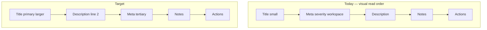

# POLISH-010 — Bug tracker: title + description layout

**Tracker:** [documentation/bug-hunt-session-2026-05-24.md](../../bug-hunt-session-2026-05-24.md) — POLISH-010  
**Type:** UX polish (layout / typography)  
**Area:** Global bug tracker — `#/bugs`, `#globalBugsList`, [`src/ui/bug-board.ts`](../../../src/ui/bug-board.ts), [`src/styles/bug-board.css`](../../../src/styles/bug-board.css)  
**Status:** Done (verified 2026-05-24) — Linear [MIN-97](https://linear.app/minnowai/issue/MIN-97/polish-010-bug-title-description-layout)

---

## Summary

Bug tracker kanban cards should give **more room and hierarchy to titles**, with **descriptions on a clear second line** beneath the title. Today the DOM already uses separate elements for title and description, but **metadata sits between them**, shared orchestrate card typography is **very small (0.72rem)**, and **five narrow columns** make long titles feel cramped. The **add-bug form** also lays title and description **side by side** via `flex-wrap`, which works against the same mental model.

This is **layout and CSS only** — no schema, store, or tool changes.

---

## Problem statement

| | |
|---|---|
| **Expected** | **Line 1:** bug title (primary, readable, multi-line if needed). **Line 2:** description (secondary, full card width). Meta (severity, workspace, chat) should not break the title → description reading order. |
| **Actual** | Title and description are separate nodes, but **meta renders between title and description**. Title inherits orchestrate **0.72rem** card text; five-column grid limits horizontal space. Add form places title input and description textarea on one wrapped row. |
| **Impact** | Hard to scan bugs in `#/bugs`; long titles compete with severity/workspace line; descriptions feel tertiary even when present. |

---

## Current state

### UI entry points

| Surface | Implementation |
|---------|----------------|
| Route | `#/bugs` → [`openGlobalBugs()`](../../../src/ui/global-bugs-page.ts) |
| Mount | `#globalBugsList` → [`mountGlobalBugKanban()`](../../../src/ui/bug-board.ts) |
| Card renderer | `renderBugCard()` in `bug-board.ts` |
| Styles | [`bug-board.css`](../../../src/styles/bug-board.css) + shared [`orchestrate-board.css`](../../../src/styles/orchestrate-board.css) (`.board-task-card*`) |

There is **no separate table list** in the live UI. [`global-bugs-page.css`](../../../src/styles/global-bugs-page.css) still defines `.global-bugs-table*` (MIN-16 phase-4 artifact); **out of scope** for this polish unless product revives a table view.

### Card DOM order today (`renderBugCard`)

```text
article.board-task-card.bug-task-card
  h4.board-task-card__title          ← bug.title
  div.board-task-card__meta          ← "severity · workspace · chatName" (no dedicated CSS)
  p.bug-task-card__description       ← optional, JS-truncated to 160 chars
  p.bug-task-card__notes             ← optional, truncated to 200 chars
  div.bug-task-card__actions         ← Investigate / Plan fix / …
```

**Gap vs desired UX:** meta is **line 2**, description is **line 3**.

### Typography and layout constraints

- `.board-task-card` sets `font-size: 0.72rem` (orchestrate board default).
- `.board-task-card__title` only sets `margin: 4px 0` and `color` — no larger type, weight, or `line-clamp`.
- `.bug-task-card__description` / `__notes`: `0.75rem`, subtle color — reasonable for secondary text.
- `.kanban-grid.bug-board-kanban`: **5 columns** on desktop (`repeat(5, minmax(0, 1fr))`), **2 columns** below 899px — titles wrap but columns stay narrow.
- Description truncation is **hard-coded in TS** (`157 + …`), not CSS `line-clamp`.

### Add-bug form (`renderAddBugForm`)

- `.bug-add-form`: `display: flex; flex-wrap: wrap; gap: 8px`.
- Title `<input>` and description `<textarea>` compete on one row; textarea has `flex: 1 1 12rem` but title does not span full width first.

### Related product items (not in scope here)

| ID | Relationship |
|----|----------------|
| **POLISH-012** | Categories + file links on cards — may add rows **below** description; plan DOM so meta/description order stays stable. |
| **POLISH-013** | Report bug context menu — pre-fills add form; benefits from stacked title/description fields. |
| **BUG-001** | `#/bugs` first-open flash — navigation; do not conflate with this layout task. |
| **MIN-16** | Global bugs aggregator done; this is v2 polish on the kanban-only UI. |

---

## Root cause analysis

1. **Content order:** `board-task-card__meta` inserted before description breaks the requested **title → description** scan path.
2. **Shared orchestrate styles:** Bug cards reuse `.board-task-card` without a bug-specific type scale; titles do not read as headings.
3. **Grid density:** Five workflow columns maximize board parity but minimize per-card width for titles.
4. **Form layout:** Horizontal wrap on add form mirrors kanban density, not a “title block then description block” pattern.



---

## Proposed solution

### A. Reorder and wrap card content (required)

In `renderBugCard`, emit:

```text
.bug-task-card__header (optional wrapper)
  h4.bug-task-card__title
  p.bug-task-card__description   ← omit if empty; no “placeholder” line
.bug-task-card__meta
p.bug-task-card__notes           ← unchanged position after meta
.bug-task-card__actions
```

- Keep `board-task-card` base for border/padding/hover; add **bug-specific** title class (e.g. `bug-task-card__title`) rather than overloading orchestrate task title semantics.
- Set `title` attribute on the title element when text is long (full string for hover).
- Move JS truncation toward **CSS line-clamp** where possible; keep a generous max (e.g. 3 lines description, 2 lines title) and optional `…` only if product still wants a hard char cap for performance.

### B. Bug card typography (required)

In `bug-board.css` (scoped under `.bug-task-card`):

| Element | Proposal |
|---------|----------|
| Card base | Slightly larger base font (`0.8rem`) **only** for `.bug-task-card`, not global `.board-task-card`. |
| Title | `font-size: ~0.85rem`, `font-weight: 600`, `line-height: 1.3`, `line-clamp: 2`, `-webkit-line-clamp`, `overflow-wrap: anywhere`. |
| Description | `font-size: 0.75rem`, `color: var(--mn-fg-subtle)`, `line-clamp: 3`, full width, `margin-top: 2px`. |
| Meta | `font-size: 0.68rem`, muted; flex row with gap; severity as pill using existing `.global-bugs-severity--*` classes. |

### C. Stack add-bug form (required)

- `.bug-add-form`: column stack for **title** then **description** (`flex-direction: column` or `grid` with two full-width rows).
- Second row: severity `<select>` + **Add bug** button (`flex` row, unchanged behavior).
- Title input: `width: 100%`; description textarea: `width: 100%`, `min-height` preserved.

### D. Column width tuning (conditional)

Only if manual QA shows titles still unusable after A–C:

- Increase `minmax` minimum on `.kanban-grid.bug-board-kanban` (e.g. `minmax(11rem, 1fr)`), **or**
- Allow horizontal scroll on `.board-main` for the kanban at desktop (product preference), **or**
- Reduce visible columns via CSS only on very wide screens (unlikely).

Prefer **typography + reorder** before widening columns to avoid breaking five-lane workflow parity.

---

## Acceptance criteria

- [ ] On `#/bugs` kanban cards, **description immediately follows title** when present (no meta between them).
- [ ] Title is visually **primary** (larger/heavier than description and meta).
- [ ] Long titles wrap to **at least two lines** before clamp/ellipsis; full title available via native `title` tooltip.
- [ ] Description uses **full card width** on the line below title; subtle secondary styling preserved.
- [ ] Meta (severity, workspace, chat) appears **after** description block (or after title if no description).
- [ ] Add-bug form: title field **above** description field, both full width.
- [ ] Clickable cards (`board-task-card--clickable`) still open investigation chat; action buttons still `stopPropagation`.
- [ ] No changes to `BugCard` schema, `bug_*` tools, or `~/.minnow/bugs/state.json`.
- [ ] `npx tsc --noEmit` clean; existing tests still pass (`npm test` / targeted `test/state/global-bugs.test.mts`).

---

## Implementation plan

### Phase 1 — Card structure and CSS

1. Update `renderBugCard()` DOM order and class names as in §Proposed A.
2. Add scoped rules in `bug-board.css`; avoid changing orchestrate board cards.
3. Wire severity meta to `.global-bugs-severity` + severity modifier classes (may require splitting meta string into elements instead of one `textContent` blob).
4. Replace or complement 160-char JS slice with CSS clamps; document chosen line counts in a short comment in CSS.

### Phase 2 — Add form

1. Adjust `renderAddBugForm()` markup/classes for stacked inputs.
2. Update `.bug-add-form` / `textarea` rules in `bug-board.css`.

### Phase 3 — QA and docs

1. Manual matrix:
   - Short / long title
   - No description / long description
   - With notes and action buttons
   - Linked chat (clickable) vs no `chatId`
   - Viewport 1200px (5 cols) and 768px (2 cols)
2. Update [documentation/context.md](../../context.md) bug tracker bullet with “card layout: title → description → meta”.
3. Mark POLISH-010 **done** in [bug-hunt-session-2026-05-24.md](../../bug-hunt-session-2026-05-24.md).

---

## Files to touch

| File | Change |
|------|--------|
| [`src/ui/bug-board.ts`](../../../src/ui/bug-board.ts) | `renderBugCard`, `renderAddBugForm` DOM order/classes; optional meta element structure |
| [`src/styles/bug-board.css`](../../../src/styles/bug-board.css) | Bug card typography, meta row, form stack |
| [`src/styles/global-bugs-page.css`](../../../src/styles/global-bugs-page.css) | Only if severity pills need a shared hook outside list mount |
| [`documentation/context.md`](../../context.md) | One-line UX note when shipped |
| [`documentation/bug-hunt-session-2026-05-24.md`](../../bug-hunt-session-2026-05-24.md) | Status when shipped |

**Not required:** `global-bugs-page.ts`, `bug-board-store.ts`, `types.ts`, tests (unless adding a shallow DOM structure test is desired).

---

## Testing strategy

| Layer | Action |
|-------|--------|
| **Manual** | Primary — visual scan of `#/bugs` with varied bug fixtures in `~/.minnow/bugs/state.json` |
| **Automated (optional)** | Lightweight test that `renderBugCard` builds meta after description (would need DOM export or test helper) |
| **Regression** | `npm test` — ensure global-bugs aggregator tests unchanged |
| **A11y** | Spot-check: `h4` title, keyboard activation on clickable cards, form labels/`aria-label` on add form |

No new LLM or tool-server dependencies.

---

## Risks and open questions

1. **Five narrow columns** — Reordering alone may not satisfy “more title space”; column min-width is the main lever if QA fails.
2. **Meta as structured elements** — Today meta is one text node; severity pills need DOM split (small TS change).
3. **Notes placement** — Plan keeps notes after meta; if notes are often long, consider collapsing behind “Notes” disclosure (future polish).
4. **Table view CSS** — Dead styles remain harmless; reviving table + this layout would be a separate task.

### Questions for product alignment

- Should **empty description** show a muted “No description” on line 2, or leave line 2 blank? **Proposed:** blank (no placeholder).
- **Max lines** for title (2) and description (3) — confirm or adjust after dogfood.
- Is **horizontal kanban scroll** acceptable on desktop if titles remain clipped? **Proposed:** try typography first.

---

## Out of scope

- Bug detail panel / full-page detail (**POLISH-012+** backlog in bug-hunt doc).
- Categories, linked files, context-menu report (**POLISH-012**, **POLISH-013**).
- Resurrecting `global-bugs-table` list UI.
- **BUG-001** route flash fix.
- Composer / per-chat bug boards (bugs are global-only per MIN-16).

---

## References

- Bug hunt: [documentation/bug-hunt-session-2026-05-24.md](../../bug-hunt-session-2026-05-24.md) — POLISH-010
- Architecture: [documentation/context.md](../../context.md) — Bug tracker (MIN-16)
- MIN-16 plan: [documentation/plans/min-16-global-bugs.md](../min-16-global-bugs.md)
- Card renderer: [`src/ui/bug-board.ts`](../../../src/ui/bug-board.ts) — `renderBugCard`, lines ~124–191
- Styles: [`src/styles/bug-board.css`](../../../src/styles/bug-board.css), [`src/styles/orchestrate-board.css`](../../../src/styles/orchestrate-board.css)


---

## Verification (APPROVED)

**Date:** 2026-05-24

**Notes:** Plan verified; implementation marked **Done** in plan header (2026-05-24). Kanban card layout shipped per acceptance criteria.

**Linear:** [MIN-97](https://linear.app/minnowai/issue/MIN-97/polish-010-bug-title-description-layout)
