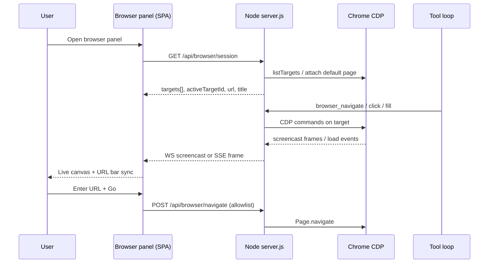

# POLISH-011 — In-app browser view (architecture)

**Source:** [bug-hunt-session-2026-05-24.md](../../bug-hunt-session-2026-05-24.md) § POLISH-011  
**Status:** **Approved** (2026-05-24) — architecture only; implementation tracked in Linear **MIN-69**  
**Linear:** https://linear.app/minnowai/issue/MIN-69/polish-011-in-app-browser-view  
**Track:** App shell / browser automation UX  
**Related bugs:** **BUG-010** (CDP tools broken), **BUG-011** / **BUG-015** (browser fetch / RAG — separate code paths)  
**Distinct from:** Reef widget iframes (sandboxed `srcdoc`), workspace folder picker (`GET /api/workspace/browse`), `fetch_web_content` (HTTP in browser executor)

---

## Summary

Minnow agents already automate pages via **Chrome DevTools Protocol (CDP)** against an **external** Chrome instance (`--remote-debugging-port`, default `9222`). Users only see results as tool text and inline **screenshots** in chat — not a live page. **POLISH-011** adds a **dedicated in-app browser surface** so users can watch navigation, interact manually when needed, and understand what `browser_*` tools are doing without alt-tabbing to Chrome.

This plan chooses an architecture that **preserves the existing CDP tool stack** and extends it with a **mirrored view + session binding**, rather than replacing automation with a naive `<iframe>` or bundling Electron solely for browsing.

---

## YAML todos

Planning and delivery checklist (implementation work is out of scope until this plan is approved).

```yaml
todos:
  - id: p011-00-prereq-bug-010
    content: "Confirm BUG-010 root cause fixed so CDP list/navigate/snapshot work on target machine"
    status: pending
  - id: p011-01-product-signoff
    content: "Product sign-off on recommended Option A (CDP mirror) vs managed Chrome (Option D)"
    status: pending
  - id: p011-02-config-schema
    content: "Extend config.json browser section (panel defaults, screencast quality, follow-agent target)"
    status: pending
  - id: p011-03-server-screencast
    content: "Design server module for Page.startScreencast WebSocket fan-out + active target registry"
    status: pending
  - id: p011-04-api-routes
    content: "Specify GET /api/browser/session, WS /api/browser/screencast, POST input relay endpoints"
    status: pending
  - id: p011-05-ui-shell
    content: "Add browser panel shell in index.html (header, URL bar, target picker, canvas) mirroring terminal-panel patterns"
    status: pending
  - id: p011-06-ui-client
    content: "Implement src/ui/browser-panel.ts + browser-panel.css + localStorage persistence"
    status: pending
  - id: p011-07-agent-sync
    content: "Bind panel to agent-selected target_id; highlight navigations from tool loop events"
    status: pending
  - id: p011-08-manual-nav
    content: "User URL bar navigates via same allowlist + ask_question flow as browser_navigate"
    status: pending
  - id: p011-09-settings
    content: "Extend Settings → Browser (CDP) with panel toggle, connection health, open-external link"
    status: pending
  - id: p011-10-tests
    content: "Add test/browser-panel*.test.mjs with mock CDP screencast frames and allowlist gate"
    status: pending
  - id: p011-11-docs
    content: "Update context.md, README browser section, browser-automation SKILL when shipped"
    status: pending
  - id: p011-12-v2-managed-chrome
    content: "Optional phase — server-spawned Chrome profile (document only until v1 ships)"
    status: pending
```

---

## Current state

| Area | Today | Key files |
|------|--------|-----------|
| **Automation engine** | External Chrome; CDP HTTP + per-target WebSocket | [`server/cdp/`](../../../server/cdp/), [`server/cdp/browser-tools.js`](../../../server/cdp/browser-tools.js) |
| **Config** | `browser.enabled`, `defaultUrl`, `allowNavigate`, `allowedOriginPatterns`, `screenshotDir` | [`server/cdp/browser-config.js`](../../../server/cdp/browser-config.js), [`src/config/browser-meta.ts`](../../../src/config/browser-meta.ts) |
| **Env override** | `MINNOW_BROWSER_URL` | [`server/cdp/browser-config.js`](../../../server/cdp/browser-config.js) |
| **Tools (7 server)** | `browser_list`, `browser_navigate`, `browser_snapshot`, `browser_click`, `browser_fill`, `browser_eval`, `browser_screenshot` + client `request_browser_origin_access` | [`src/tools/definitions.ts`](../../../src/tools/definitions.ts) |
| **Origin gate** | Server allowlist + in-chat `ask_question` cards | [`server/cdp/allowlist.js`](../../../server/cdp/allowlist.js), [`src/tools/browser-navigation-gate.ts`](../../../src/tools/browser-navigation-gate.ts) |
| **User-visible output** | Tool strings; PNG in chat via attachments + `GET /api/browser/screenshot/:id` | [`server/browser-screenshot-middleware.js`](../../../server/browser-screenshot-middleware.js) |
| **Web fetch (no CDP)** | `fetch_web_content`, `rag_web_content`, `web_search` in browser executor | [`src/tools/browser-executor.ts`](../../../src/tools/browser-executor.ts) |
| **App shell panels** | Terminal (bottom), file viewer (split), agent activity (overlay) — **no browser panel** | [`index.html`](../../../index.html), [`src/ui/terminal-xterm.ts`](../../../src/ui/terminal-xterm.ts), [`src/ui/file-viewer.ts`](../../../src/ui/file-viewer.ts) |
| **Sandboxed HTML** | Reef widgets only (`srcdoc` + strict CSP) — not general browsing | [`src/chat/reef/widget-iframe.ts`](../../../src/chat/reef/widget-iframe.ts) |
| **Build shape** | Vite SPA + Node middleware on `npm start` — not an Electron desktop shell | [`server.js`](../../../server.js), [`AGENTS.md`](../../../AGENTS.md) |

**User pain:** CDP may be configured and tools may run (when **BUG-010** is fixed), but the “browser” is invisible unless the user finds Chrome’s debugging window or relies on chat screenshots.

---

## Goals

1. **Visibility:** Show the **active CDP page target** (URL, title, loading state) inside Minnow while agents work.
2. **Parity:** Manual navigation in the panel uses the **same allowlist and approval UX** as `browser_navigate`.
3. **Agent alignment:** When tools pass `target_id` or operate on the default page, the panel **follows** that target (configurable).
4. **Incremental delivery:** Ship a **read-only live preview** before full bidirectional input (lower risk).
5. **Preserve investments:** Reuse `server/cdp/*`, `browser-navigation-gate`, settings allowlist, and existing tool schemas.

### Non-goals (v1)

- Replacing Chrome with a general-purpose embedded browser that loads arbitrary origins without CDP (no `<iframe src="https://…">` product browser).
- Packaging Minnow as Electron solely for this feature.
- Merging `fetch_web_content` into the in-app view (different trust model and implementation).
- Fixing **BUG-010** / **BUG-011** / **BUG-015** inside POLISH-011 (prerequisite work stays separate).
- Cursor IDE Browser MCP parity (separate product integration).

---

## Architecture options

| Option | Idea | Pros | Cons | Fit for Minnow |
|--------|------|------|------|----------------|
| **A — CDP mirror UI** | Keep external (or server-managed) Chrome; stream **Page.screencast** (or fast screenshot polling) to a canvas; optional **Input.dispatch*** relay | Reuses all `browser_*` tools; same cookies/session as automation; no new rendering engine | Requires open CDP connection + WS fan-out; input relay is security-sensitive | **Recommended v1** |
| **B — `<iframe>` + reverse proxy** | Tool server proxies HTML/assets | Feels “embedded” | Breaks most modern sites (CSP, cookies, WebSocket, OAuth); huge security burden | **Reject** for general web |
| **C — Electron / `<webview>`** | Native embedded Chromium in desktop app | True embedded browser | Conflicts with current **web-first** Vite SPA; large packaging pivot | **Defer** unless product moves to desktop shell |
| **D — Server-managed Chrome** | Node launches Chrome with known flags; exposes CDP URL to tools + panel | One-click UX; consistent profile | OS-specific spawn; antivirus friction; resource use | **Recommended v2** after A |

### Decision (recommended)

**Phase 1 (v1): Option A** — “Browser panel” is a **live mirror** of the CDP page the agent uses, not a second browser.

**Phase 2 (v2): Option D** — Optional **`browser.launchManaged: true`** in config so `npm start` can spawn Chrome when `MINNOW_BROWSER_URL` is unset (document spawn flags, user data dir under `~/.minnow/browser-profile/`).

**Explicitly not chosen for v1:** Option B and C.

---

## Recommended design (v1 — CDP mirror)

### High-level flow



### Session model

| Concept | Description |
|---------|-------------|
| **Browser endpoint** | Same as today: `resolveBrowserUrl(args)` → config `defaultUrl` or `MINNOW_BROWSER_URL` |
| **Target** | CDP page target `id` (already returned by `browser_list`) |
| **Active target** | Panel + server agree on one `activeTargetId`; agent tools with `target_id` override temporarily (“follow agent”) |
| **Screencast** | One `Page.startScreencast` subscription per active target per server process; JPEG/PNG frames at capped FPS (e.g. 5–15) to limit CPU |

### UI placement (app shell)

Mirror existing bottom/split patterns:

| Pattern | Reference | Proposal for browser |
|---------|-----------|----------------------|
| Terminal panel | `#terminalPanel`, resize handle, `hidden` class | **Bottom dock** `#browserPanel` below chat or above terminal (mutually exclusive default — user picks which dock is open) |
| File viewer | `#fileViewerPane` + `#splitResizer` | **Not** primary — browser is time-varying web content, not workspace files |
| Agent activity | `#agentActivityPanel` overlay | Optional **“Open browser”** action on rows when tool is `browser_*` |

**Shell markup (future):** new `<section id="browserPanel">` in [`index.html`](../../../index.html) near `terminalPanel`, with:

- Header: back/forward (v1.1), reload, URL input, target `<select>`, connection status pill, close
- Body: `<canvas>` or `` for frames (prefer canvas for DPI)
- Footer hint: “Mirrors Chrome CDP — start Chrome with remote debugging or enable managed browser (v2)”

**Persistence:** `localStorage` keys e.g. `minnow.browserPanel.open`, `minnow.browserPanel.height` (same spirit as terminal / stats strip).

### Server additions (specification only)

New modules under `server/cdp/` or `server/browser-panel/`:

| Endpoint | Method | Purpose |
|----------|--------|---------|
| `/api/browser/session` | GET | Health, `browserUrl`, page targets, active target metadata |
| `/api/browser/screencast` | WebSocket (preferred) or SSE | Binary or base64 frames + metadata (`url`, `title`, `targetId`) |
| `/api/browser/navigate` | POST | User-initiated `{ url, targetId? }` — **must** call same `assertNavigationAllowed` as tools |
| `/api/browser/input` | POST | v1.1 — `{ type: click \| key, ... }` mapped to CDP Input domain (disabled by default setting) |

**Implementation notes:**

- Reuse [`connectTarget`](../../../server/cdp/client.js) and [`listTargets`](../../../server/cdp/targets.js).
- Central **ScreencastManager** singleton: ref-count subscribers (panel WS clients); stop screencast when last client disconnects.
- Do **not** expose raw CDP WebSocket to the browser SPA (security).

### Client module (specification only)

| Module | Responsibility |
|--------|----------------|
| [`src/ui/browser-panel.ts`](../../../src/ui/browser-panel.ts) | Mount, resize, WS client, URL bar, target picker, connection errors |
| [`src/styles/browser-panel.css`](../../../src/styles/browser-panel.css) | Layout, theme tokens (`--mn-*`) |
| [`src/state/browser-panel.ts`](../../../src/state/browser-panel.ts) | Optional persisted state via `PUT /api/config/meta` → `browserPanel` block (like `filePanel`) |
| Event bus | `browser-panel-events.ts` — emit `navigate`, `target-changed` for tool loop highlights |

### Tool loop integration

| Event | Panel behavior |
|-------|----------------|
| `browser_navigate` starts | Show panel optionally (setting: “auto-open on browser tool”); set follow target |
| `browser_screenshot` completes | Thumbnail in chat **unchanged**; panel may flash highlight |
| `browser_list` | Populate target `<select>` |
| Tool error “browser disabled” | Panel shows setup card linking to Settings → Browser |

**No change required to tool JSON schemas for v1** beyond documenting that `target_id` selects the mirrored page.

### Security model

| Threat | Mitigation |
|--------|------------|
| Arbitrary navigation | Reuse [`assertNavigationAllowed`](../../../server/cdp/allowlist.js); user URL bar calls same check + [`maybeBlockBrowserNavigation`](../../../src/tools/browser-navigation-gate.ts) pattern server-side |
| XSS in panel | Panel only renders **images/canvas bitmaps** from CDP — never executes page DOM in Minnow origin |
| CDP exfiltration | No pass-through CDP to client; server holds WS to Chrome |
| Input injection | v1: **view-only**; v1.1: `browser.allowPanelInput` default **false** |
| Downloads / file pickers | Out of scope v1; managed Chrome v2 uses isolated profile |
| `file://` / internal IPs | Same origin rules as navigate allowlist; document `127.0.0.1` localhost patterns already in defaults |

### Config extensions (`~/.minnow/config.json` → `browser`)

```json
{
  "browser": {
    "enabled": true,
    "defaultUrl": "http://127.0.0.1:9222",
    "panel": {
      "enabled": true,
      "autoOpenOnTool": false,
      "defaultHeightPx": 280,
      "screencastFps": 10,
      "allowManualInput": false,
      "followAgentTarget": true
    }
  }
}
```

Merge via existing [`mergeBrowserConfig`](../../../server/cdp/browser-config.js) pattern.

---

## Phased delivery

### Phase 0 — Prerequisites

- [ ] **BUG-010** resolved on Windows/Linux/macOS dev setups (CDP list + navigate smoke test).
- [ ] Document Chrome launch line in README (already partial) + troubleshooting when `session` endpoint unreachable.

### Phase 1 — Read-only mirror (MVP)

- [ ] Browser panel shell + open/close toggle in sidebar footer (near terminal / agent activity).
- [ ] `GET /api/browser/session` + screencast stream at modest FPS.
- [ ] Target picker synced with `browser_list` output shape.
- [ ] URL bar display + copy link; **Go** uses allowlist POST navigate.
- [ ] Settings: enable panel, connection status indicator.
- [ ] Tests: mock CDP frame pump; allowlist denied → 403 JSON.

**Acceptance (MVP):**

- User opens panel, sees live updates when agent runs `browser_navigate` on allowed origin.
- User denied navigate shows same origin approval cards (or server error message consistent with tools).
- Panel degrades gracefully when CDP offline (“Start Chrome with --remote-debugging-port=9222”).

### Phase 2 — Interaction + polish

- [ ] Back / forward / reload (CDP `Page` history where supported).
- [ ] Optional manual click/type (`allowManualInput`) with clear “you are controlling agent browser” banner.
- [ ] Auto-open panel on first `browser_*` tool in a turn (setting).
- [ ] Chat tool bubble action: “Show in browser panel”.

### Phase 3 — Managed Chrome (Option D)

- [ ] Server spawn helper (`server/cdp/launch-chrome.js`) with pinned user-data dir.
- [ ] Settings toggle “Let Minnow start Chrome” vs external only.
- [ ] Shutdown hook on `server.js` exit.

---

## Alternative: screenshot-only fallback

If `Page.startScreencast` proves unstable across Chrome versions, **fallback v1** uses timed `Page.captureScreenshot` (same as `browser_screenshot`) at 2–5 FPS. Higher latency but minimal new CDP surface. Document switch in config `panel.mode: "screencast" | "screenshot"`.

---

## Relationship to other work

| Item | Relationship |
|------|----------------|
| **BUG-010** | Blocker for any live mirror — fix first |
| **BUG-011 / BUG-015** | Independent fetch/RAG paths; may share “browser offline” banners in UI |
| **Feature #18 headless** | Headless CLI has no panel; CDP tools still use same server handlers |
| **POLISH-016 welcome** | No overlap |
| **Reef iframes** | Do not reuse Reef CSP pipeline for real URLs |
| **Cursor IDE Browser MCP** | Different host; optional future “open in Minnow panel” bridge is out of scope |

---

## Open product questions

1. **Default dock:** Browser panel above terminal, or tabbed “Browser | Terminal” in one region?
2. **Multi-target:** Show tabs for multiple CDP pages or single active + dropdown only?
3. **Auto-open:** Default on or off when agent uses browser tools (distraction vs discoverability)?
4. **Managed Chrome v2:** Opt-in only, or default for new installs?
5. **PWA / `npm run dev`:** Panel requires `npm start` — is banner-only degradation acceptable (same as terminal)?

---

## Test strategy (when implementing)

| Layer | Approach |
|-------|----------|
| **Unit** | ScreencastManager ref-count; allowlist on `POST /api/browser/navigate` |
| **Integration** | Mock CDP server (extend [`test/browser-cdp.test.mjs`](../../../test/browser-cdp.test.mjs)) emitting fake frames |
| **Manual** | Agent navigates `https://example.com`, user sees mirror; deny `https://evil.test` |

No live network in unit tests; fixed target ids and static PNG bytes.

---

## Files likely touched (implementation reference)

| Area | Paths |
|------|--------|
| Shell | `index.html`, `src/main.ts` init |
| UI | `src/ui/browser-panel.ts`, `src/styles/browser-panel.css` |
| State | `src/state/browser-panel.ts`, `server/config/validators.js` (`browserPanel` meta) |
| Server | `server/cdp/screencast-manager.js`, `server/browser-panel-routes.js`, `server.js` middleware registration |
| Config | `server/cdp/browser-config.js`, `src/config/browser-meta.ts`, `src/ui/settings-browser.ts` |
| Docs | `documentation/context.md`, `README.md`, `src/skills/browser-automation/SKILL.md` |

---

## Risks and mitigations

| Risk | Mitigation |
|------|------------|
| Screencast CPU/bandwidth | Cap FPS; pause when panel hidden |
| Windows CDP/firewall quirks | Document port; align with BUG-010 fixes |
| User expects full browser | Copy: “Agent browser mirror”, not Minnow’s own engine |
| Input relay security | Off by default; explicit setting + banner |
| Two browsers confusion | v2 managed Chrome uses single profile path |

---

## Approval checklist

- [x] Architecture option **A (+ D later)** accepted
- [x] Phase 1 MVP scope accepted (read-only mirror + manual navigate)
- [ ] Open product questions answered (tracked in MIN-69)
- [ ] BUG-010 ownership scheduled before panel work

**Next step:** Implement per YAML todos `p011-03` through `p011-11` on branch `henri/min-69-polish-011-in-app-browser-view`; prototype server screencast contract before UI (`p011-05`/`p011-06`).


---

## Verification (APPROVED)

**Date:** 2026-05-24

**Notes:** Plan verified against codebase (static review). Bug-hunt entry aligned. Ready for implementation unless plan header marks shipped.

**Linear:** [MIN-69](https://linear.app/minnowai/issue/MIN-69/polish-011-in-app-browser-view)
