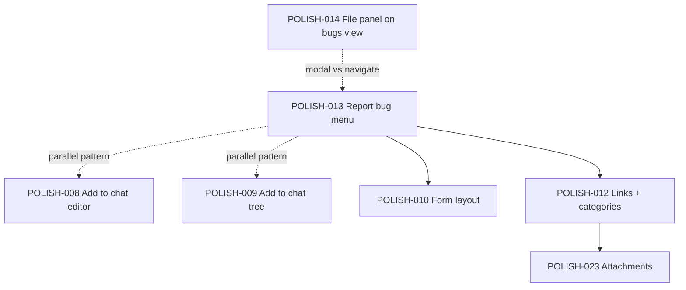
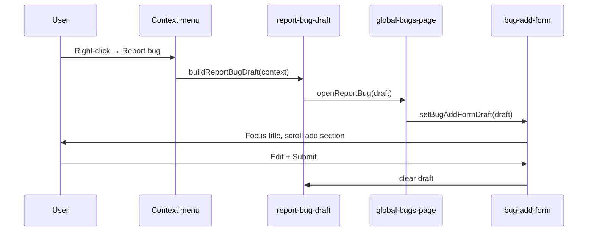

# POLISH-013 — Context menu: Report bug

**Tracker:** [documentation/bug-hunt-session-2026-05-24.md](../../bug-hunt-session-2026-05-24.md) — POLISH-013  
**Type:** Polish / UX  
**Area:** File tree + file editor context menus → global bug tracker (`#/bugs`)  
**Status:** Verified baseline 2026-05-24 — not implemented; Linear [MIN-70](https://linear.app/minnowai/issue/MIN-70/polish-013-report-bug-context-menu)

---

## Summary

Users filing bugs from code should not re-type paths and snippets. **Right-click** a **file** in the tree or **text** in the code editor and choose **Report bug** to open bug creation with **title**, **description**, **workspace-relative path**, optional **line range**, and **selected code** pre-filled. This mirrors the planned **Add to chat** flows (**POLISH-008** / **POLISH-009**) but routes into the **All bugs** tracker instead of the composer.

---

## Problem statement

| | |
|---|---|
| **Expected** | Context menu **Report bug** on file tree files and editor (selection or file); creation UI opens with sensible defaults; user edits and submits. |
| **Actual** | File panel menus only support open/CRUD (`file-tree-context-menu.ts`). Viewer context menu is markdown preview/code toggle only (`file-viewer.ts`). Bugs are added manually on `#/bugs` via the inline **Add bug** form (`bug-board.ts`). |
| **Impact** | High friction when dogfooding or bug-hunting; file context is lost; duplicates manual copy-paste into description. |

---

## Desired behavior (from bug hunt)

- Menu item **Report bug** on **file tree file rows** and **editor** (with selection or whole open file).
- Pre-fill:
  - **Title** — short suggestion (editable).
  - **Description** — reproduction/context template including path, line range, fenced snippet.
  - **Linked file path** — workspace-relative (feeds **POLISH-012** when structured links exist).
  - **Line range** + **code snippet** when selection is non-empty.
- **Optional:** default **category** from context (blocked on **POLISH-012** taxonomy — see phased approach below).
- Distinct from agent **`bug_add`** tool (requires All bugs screen + agent turn); this is a **direct UI** path for humans.

---

## Current state

### File panel context menus

| Surface | Module | Today |
|---------|--------|--------|
| File tree row | [`src/ui/file-tree-context-menu.ts`](../../../src/ui/file-tree-context-menu.ts) | Open, Cut/Copy/Paste, Rename, Delete |
| Tree background | Same | New File/Folder (server required) |
| File viewer | [`src/ui/file-viewer.ts`](../../../src/ui/file-viewer.ts) + `showFilePanelContextMenu` | Markdown only: Open as preview/code |

Shared renderer: `showFilePanelContextMenu`, `showFileTreeRowContextMenu` — same `.file-tree-context-menu` popover styling as workspace menu (`documentation/context.md`).

### Bug tracker (MIN-16)

- Persistence: `~/.minnow/bugs/state.json` via [`src/state/bug-board-store.ts`](../../../src/state/bug-board-store.ts).
- **`BugCard`** ([`src/types.ts`](../../../src/types.ts)): `id`, `title`, `description`, `severity`, `column`, `workspacePath`, timestamps; optional `chatId`, `notes`, `planPath`, run ids. **No** `category`, `fileLinks`, or `snippets` fields yet.
- UI: [`src/ui/global-bugs-page.ts`](../../../src/ui/global-bugs-page.ts) opens `#/bugs`, hides chat shell + top bar; [`src/ui/bug-board.ts`](../../../src/ui/bug-board.ts) mounts kanban + **`renderAddBugForm`** (title, description, severity → `addBug()`).
- Agent tools: `bug_add` / `bug_update` / `bug_get_state` in [`src/tools/bug-board-tools.ts`](../../../src/tools/bug-board-tools.ts) — gated on `isGlobalBugsPageOpen()`.

### Editor selection (CodeMirror 6)

- Active code editor: `editorView` in `file-viewer.ts`.
- Selection: `editorView.state.selection.main` + `doc.lineAt` for 1-based line numbers.
- Read-only attachment snapshots and markdown **preview** have no selection menu today.

### Prototype / build spec

No `prototype/` folder in repo; behavior is defined by shipped SPA + [`documentation/context.md`](../../context.md).

---

## Dependencies and sequencing



| Item | Relationship |
|------|----------------|
| **POLISH-008 / 009** | Reuse menu placement and context extraction patterns; shared helper module optional (`file-panel-context-actions.ts`). |
| **POLISH-010** | Add form may get layout changes; pre-fill API should not assume single-line description. |
| **POLISH-012** | **v1:** encode path/lines/snippet in `description` markdown. **v2:** populate structured `BugCard` links when schema + UI exist. |
| **POLISH-014 / 015** | Today `openGlobalBugs()` hides chat shell and top bar; reporting from editor may feel disruptive — consider modal until split layout ships. |
| **POLISH-023** | Auto-attach screenshots/files out of scope; description snippet is enough for v1. |
| **MIN-16** | No change to persistence version until POLISH-012; v1 stays `bugs` v1 schema. |

**Recommended order:** POLISH-013 **v1** (description-based context) can ship **before** POLISH-012; refactor to structured links when POLISH-012 lands.

---

## Product decisions (resolve before coding)

1. **Open target**
   - **A (recommended for v1):** `openGlobalBugs()` + apply draft to add form (consistent with existing entry point).
   - **B:** Non-navigating **modal** over file panel (better if POLISH-014 delayed; avoids losing editor context).
2. **File tree: folders**
   - **Proposed:** **Files only** — omit **Report bug** on folder rows (no single path/snippet).
3. **Editor: no selection**
   - **Proposed:** **Report bug** still available — pre-fill whole file path; description notes “no selection” or optional full-file excerpt (cap length, e.g. 2k chars).
4. **Editor: markdown preview**
   - **Proposed v1:** **Code mode only** — if `isMarkdownPreviewActive()`, menu shows preview toggle only (current behavior); no Report bug until user switches to code (or extend in follow-up).
5. **Offline file tree**
   - CRUD items disabled when server offline; **Report bug** should remain **enabled** (bugs are local `~/.minnow`, not server CRUD).
6. **Default severity**
   - **Proposed:** `medium` (matches existing form default).
7. **Category**
   - **Deferred** until POLISH-012; optional heuristic (e.g. `src/ui/` → UI) documented as v2.

---

## Pre-fill specification

### Shared draft type (new module)

```ts
/** Ephemeral draft for Report bug; cleared after submit or cancel. */
export type ReportBugDraft = {
  title: string;
  description: string;
  severity?: BugSeverity;
  /** Workspace-relative path for POLISH-012 v2 */
  filePath?: string;
  startLine?: number;
  endLine?: number;
  snippet?: string;
};
```

### Title heuristics (deterministic, testable)

| Context | Rule | Example |
|---------|------|---------|
| File tree file | `Issue in {basename}` | `Issue in file-viewer.ts` |
| Editor, no selection | Same as file | `Issue in bug-board.ts` |
| Editor, selection | First non-empty line, trim, max 80 chars; fallback `Issue in {basename}:{startLine}` | `selectionMain is empty when...` |

### Description template (markdown)

Static structure (no dynamic string building in tests — build via helper, assert full static strings in tests):

```markdown
## Context

**File:** `{workspaceRelativePath}`
**Lines:** {start}–{end} *(omit section if no selection)*

## Snippet

```{langOrText}
{snippet}
```

## Steps to reproduce

1. 

## Expected / actual

- **Expected:** 
- **Actual:** 
```

- **Language tag:** extension map (`.ts` → `typescript`, `.md` → `markdown`, else `text`).
- **Snippet max length:** 8_000 chars with truncation notice in description.
- **Path:** always workspace-relative via existing path helpers (`file-tree-path.ts` / workspace root).

### Line range

- CodeMirror: `from`/`to` positions → `doc.lineAt(from).number` (1-based), same for end line.
- Collapsed cursor (empty selection): omit **Lines** and **Snippet** sections; keep **File** only.

---

## UX flow



**After submit:** existing `addBug()` + `refreshGlobalBugKanban()` + sidebar badge — no change to pipeline.

**Cancel / navigate away:** clear draft on `closeGlobalBugs()` or new Report bug (overwrite).

---

## Implementation plan

### Phase 0 — Draft builder + store

1. Add [`src/ui/report-bug-draft.ts`](../../../src/ui/report-bug-draft.ts):
   - `buildReportBugDraftFromFile(path: string): ReportBugDraft`
   - `buildReportBugDraftFromEditor(path, editorView): ReportBugDraft`
   - Pure functions for title/description (exported for tests).
2. Add [`src/state/report-bug-draft-store.ts`](../../../src/state/report-bug-draft-store.ts) or module-level singleton:
   - `setPendingReportBugDraft(draft | null)`
   - `consumePendingReportBugDraft(): ReportBugDraft | null`

### Phase 1 — Wire add form

1. Refactor [`renderAddBugForm`](../../../src/ui/bug-board.ts) to accept optional initial values:
   - `export function setBugAddFormDraft(draft: ReportBugDraft): void`
   - Focus `title` input, `requestAnimationFrame` scroll `.bug-add-section` into view.
2. Add `openReportBug(draft)` in [`src/ui/global-bugs-page.ts`](../../../src/ui/global-bugs-page.ts) or `report-bug-draft.ts`:
   - `openGlobalBugs()` then `setBugAddFormDraft(draft)`.
3. If kanban not mounted yet, queue draft until `mountGlobalBugKanban` completes (same pattern as filter sync).

### Phase 2 — File tree menu

1. In `buildFileMenuItems`, append separator + **Report bug** (always enabled).
2. Action: `buildReportBugDraftFromFile(ctx.path)` → `openReportBug(draft)`.
3. Do **not** add to `buildFolderMenuItems` or background menu (per decisions).

### Phase 3 — Editor context menu

1. Replace/extend `bindFileViewerContextMenu`:
   - **Code editor active** (`editorView` set, not read-only excerpt): build items:
     - If markdown path: keep **Open as preview** (when in code mode).
     - **Report bug** (selection-aware via `buildReportBugDraftFromEditor`).
   - **Read-only excerpt:** optional **Report bug** with path from virtual attachment path (lower priority).
2. `preventDefault` on `contextmenu` when showing Report bug items (extend beyond markdown-only).

### Phase 4 — POLISH-012 bridge (follow-up)

When `BugCard` gains `links[]` / `category`:

- Extend `AddBugInput` + `addBug()` to accept structured links.
- Map draft `filePath` / lines / `snippet` into store fields.
- Keep description template for human-readable card preview until **POLISH-023** detail view.

### Phase 5 — Polish alignment (optional same PR)

- **POLISH-010:** Ensure add form uses separate lines for title vs description (CSS only).
- **POLISH-014:** If split layout ships, revisit modal vs full-page navigation.

---

## Files to touch

| File | Change |
|------|--------|
| `src/ui/report-bug-draft.ts` | **New** — draft builders + `openReportBug` |
| `src/state/report-bug-draft-store.ts` | **New** — pending draft (or colocate in draft module) |
| `src/ui/file-tree-context-menu.ts` | **Report bug** on file rows |
| `src/ui/file-viewer.ts` | Editor context menu + selection read |
| `src/ui/bug-board.ts` | Form pre-fill API, consume draft on mount |
| `src/ui/global-bugs-page.ts` | Call draft apply after open (if not in draft module) |
| `test/ui/report-bug-draft.test.mts` | **New** — deterministic title/description fixtures |
| `documentation/context.md` | File panel + bug tracker bullets (on implement) |
| `documentation/bug-hunt-session-2026-05-24.md` | Mark POLISH-013 resolved when shipped |

**Not in v1 scope:** `src/types.ts` schema, `bug_add` tool schema, `bug-board-tools.ts` (unless agent should file with links later).

---

## Testing strategy

| Layer | Action |
|-------|--------|
| **Unit** | `buildReportBugDraftFromFile` / `FromEditor` with fixed paths and mock selection → assert **static** full `description` strings and titles (per project test guidelines). |
| **Integration** | Optional: jsdom test that menu item calls `openReportBug` with spy on draft builder. |
| **Manual** | Tree: right-click `src/ui/file-tree.ts` → Report bug → `#/bugs` opens, fields filled, submit → card in Reported column with path in description. |
| **Manual** | Editor: select lines → Report bug → line range + fence in description. |
| **Manual** | Empty selection → file path only. |
| **Regression** | `npm test` + `npx tsc --noEmit`; existing `bug-board-store` / `global-bugs` tests unchanged. |

---

## Acceptance criteria

- [ ] **File tree:** Right-click a **file** shows **Report bug**; folder rows unchanged.
- [ ] **Editor (code mode):** Right-click with selection shows **Report bug**; pre-fills line range + snippet.
- [ ] **Editor (code mode):** Right-click without selection pre-fills file path and title; description template usable.
- [ ] **Submit:** Creates bug in **Reported** with current `workspacePath`; kanban refreshes; badge updates.
- [ ] **Offline tree:** Report bug works when server CRUD is disabled.
- [ ] **No agent required:** Flow does not use `bug_add` tool or composer.
- [ ] **Tests:** Unit tests cover at least file-only and selection drafts with hardcoded expected strings.
- [ ] **Docs:** `context.md` updated when feature ships.

---

## Risks and open questions

1. **Navigation disrupts editing** — `openGlobalBugs()` hides chat and file shell today; users lose file panel until **POLISH-014**. Mitigation: modal v1.1 or implement POLISH-014 first.
2. **Large selections** — Truncation must be obvious to avoid silent data loss.
3. **Duplicate menu patterns** — Implementing POLISH-008/009 separately may duplicate path/line helpers; extract shared `file-context.ts` when both land.
4. **`bug_add` parity** — Agents cannot pre-fill links until schema extended; acceptable for v1.
5. **BUG-001** — First-open flash on `#/bugs` may affect Report bug flow; verify after fix.

### Questions for product / QA

- Should **Report bug** appear on **folder** rows with path = folder (for “whole module” bugs)?
- Should submitting auto-run **Investigate**? *(Proposed: no — same as manual add.)*
- Preferred **title** heuristic for multi-line selections — first line vs file:line only?

---

## Out of scope

- **POLISH-012** categories and structured `BugCard` links (v2 follow-up).
- **POLISH-023** image/file attachments on create.
- **POLISH-008 / 009** Add to chat (separate items; may share helpers later).
- Changing `bug_add` tool permissions or All-bugs-only gate.
- Full-screen bugs layout (**POLISH-014**), top bar on bugs view (**POLISH-015**).
- Auto-categorization ML/heuristics beyond simple path rules.

---

## References

- Request: [documentation/bug-hunt-session-2026-05-24.md](../../bug-hunt-session-2026-05-24.md) — POLISH-013
- Architecture: [documentation/context.md](../../context.md) — Bug tracker (MIN-16), file tree CRUD
- MIN-16 plans: [min-16-global-bugs.md](../min-16-global-bugs.md), [min-16-bug-tracker.md](../min-16-bug-tracker.md)
- Plan template: [BUG-003-speed-zero-chars-pass.md](./BUG-003-speed-zero-chars-pass.md)
- Parallel UX: POLISH-008, POLISH-009, POLISH-010, POLISH-012


---

## Verification (APPROVED)

**Date:** 2026-05-24

**Notes:** Plan verified against codebase (static review). Bug-hunt entry aligned. Ready for implementation unless plan header marks shipped.

**Linear:** [MIN-70](https://linear.app/minnowai/issue/MIN-70/polish-013-report-bug-context-menu)
