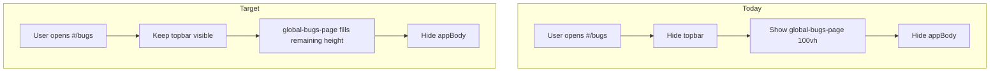

# POLISH-015 — Keep top bar on bug tracker

**Tracker:** [documentation/bug-hunt-session-2026-05-24.md](../../bug-hunt-session-2026-05-24.md) — POLISH-015  
**Type:** Layout / UX polish  
**Area:** Global bugs screen (`#/bugs`), `header.topbar`, `src/ui/global-bugs-page.ts`  
**Status:** Shipped 2026-05-26 (MIN-92)

---

## Summary

When users open **All bugs** (`#/bugs`), Minnow today hides the **main top bar** (`header.topbar` — brand, model picker, workspace, benchmark, settings) and shows a **full-viewport** bugs page with its own header (`global-bugs-page-header`). Product intent is the opposite: keep the same top bar as chat so model and workspace controls stay available while triaging bugs.

---

## Problem statement

| | |
|---|---|
| **Expected** | `#/bugs` shows the standard `header.topbar`; model refresh/load, workspace picker, benchmark, and settings remain usable. |
| **Actual** | `openGlobalBugs()` adds `.hidden` to `header.topbar`; users only see bugs-specific chrome (back, “All bugs”, summary). |
| **Impact** | Context switching cost (must close bugs to change model/workspace); inconsistent shell vs chat; top bar feels “replaced” by duplicate header styling (`min-height: var(--topbar-h)`). |

---

## Current state

### DOM / shell layout (`index.html`)

`body` is a column flex container (`src/styles/global.css`):

1. `header.topbar` — global chrome (always in DOM).
2. `main#globalBugsView.global-bugs-page` — full-page bugs (sibling of chat shell).
3. `main#settingsView`, `main#benchmarkView` — other full-page routes (same topbar-hide pattern).
4. `div#appBody.app-body` — chat sidebar, file panel, composer, etc.

Opening bugs:

- `#globalBugsView` → `.is-open` (`display: flex`).
- `#appBody` → `.hidden` (chat shell hidden).
- `header.topbar` → `.hidden` (**this item removes POLISH-015**).

### Routing (`src/ui/global-bugs-page.ts`)

| Function | Top bar | Chat shell |
|----------|---------|------------|
| `openGlobalBugs()` | `classList.add('hidden')` (line ~140) | `appBody.classList.add('hidden')` |
| `closeGlobalBugs()` | `classList.remove('hidden')` (line ~122) | `appBody.classList.remove('hidden')` |

Entry points: sidebar `#btnAllBugs`, `hashchange` → `#/bugs`, `initGlobalBugsPage()` boot hash.

`closeSettings()` is called from `openGlobalBugs()` so settings and bugs do not stack.

### Page chrome (`index.html` + `src/styles/global-bugs-page.css`)

- **Sub-header:** `.global-bugs-page-header` — back (`#btnGlobalBugsBack`), title “All bugs”, `#globalBugsSummary`.
- **Body:** filters (`#globalBugsScope`, `#globalBugsColumn`, `#globalBugsHideComplete`) + Kanban mount `#globalBugsList` (`mountGlobalBugKanban` in `bug-board.ts`).
- **Height:** `.global-bugs-page { height: 100vh }` — written assuming topbar is hidden; will **overflow** or clip if topbar stays visible without CSS change.

### Historical context (MIN-16)

[`documentation/plans/min-16-global-bugs.md`](../min-16-global-bugs.md) shipped phase 4 with “hide chat shell while open.” Top bar hiding followed the same pattern as **Settings** and **Benchmark** full-page routes (`settings-page.ts`, `benchmark-page.ts` also hide topbar). POLISH-015 **only** changes bugs behavior; settings/benchmark remain out of scope unless product asks for parity later.

### Related work (not this ticket)

| Item | Relationship |
|------|----------------|
| **BUG-001** | First click on All bugs flashes open/close — hash/handler race; **not** caused by topbar hide alone. Fix independently; re-test after POLISH-015. |
| **POLISH-014** | File sidebar + viewer visible on `#/bugs` — larger layout refactor (`file-layout.ts`, `appBody` visibility). Coordinate so topbar + file panel + bugs body share height correctly. |
| **POLISH-012 / 013** | File-linked bugs — benefits from POLISH-014 + visible topbar (workspace path in topbar). |

---

## Root cause

Intentional copy of full-page overlay pattern:

```ts
// src/ui/global-bugs-page.ts — openGlobalBugs()
document.querySelector('header.topbar')?.classList.add('hidden');
```

Bugs page header was sized to **substitute** for topbar (`min-height: var(--topbar-h)` in `global-bugs-page.css`), producing duplicate chrome when both should show.



---

## Proposed fix

### A. Stop toggling topbar visibility (required)

In `src/ui/global-bugs-page.ts`:

- **Remove** `document.querySelector('header.topbar')?.classList.add('hidden')` from `openGlobalBugs()`.
- **Remove** `document.querySelector('header.topbar')?.classList.remove('hidden')` from `closeGlobalBugs()` (no-op once open path is fixed; keeps symmetry if other code paths relied on close restoring topbar).

Do **not** change settings/benchmark topbar behavior in this ticket.

### B. Layout height under visible topbar (required)

Update `src/styles/global-bugs-page.css`:

**Preferred (matches `body` flex column):**

```css
.global-bugs-page {
  display: none;
  flex-direction: column;
  flex: 1;
  min-height: 0;
  /* remove height: 100vh */
}
.global-bugs-page.is-open {
  display: flex;
}
```

`#globalBugsView` is already a direct child of `body` after `header.topbar`, so `flex: 1` consumes remaining viewport below the topbar (including `body` `padding-top: env(safe-area-inset-top)`).

**Alternative** if flex sibling order or display quirks appear:

```css
height: calc(100dvh - var(--topbar-h) - env(safe-area-inset-top, 0px));
```

Use `100dvh` + `--topbar-h` from `tokens.css` for consistency with file panel offsets.

### C. Sub-header treatment (recommended)

Keep `.global-bugs-page-header` as **page** toolbar (back + title + summary), not as topbar replacement:

- Optionally reduce `min-height` from `var(--topbar-h)` to a compact bar (~40–44px) since global model row is in topbar.
- Ensure bottom border separates sub-header from filters/Kanban.
- **Do not** duplicate model picker or workspace button into bugs header (product: use topbar).

### D. Cross-route navigation (recommended)

With topbar visible, users can click **Settings** / **Benchmark** while on `#/bugs`:

| Control | Today | Proposed |
|---------|-------|----------|
| Settings (`openSettings`) | Closes bugs via dynamic import | Keep; already correct |
| Benchmark (`openBenchmark`) | Does **not** close bugs | Call `closeGlobalBugs()` (or shared `closeOverlayPages()`) before opening benchmark, same as settings |

Also ensure `openGlobalBugs()` closes benchmark if open (mirror `closeSettings()`), if not already — verify `openGlobalBugs` only calls `closeSettings()` today.

### E. Sidebar toggle while on bugs (QA / small follow-up)

`#btnSidebarToggle` lives in topbar; `#appBody` (contains `#chatSidebar`) is hidden on bugs page. Options:

1. **No-op** while bugs open (document in QA).
2. **Close bugs** and show chat (heavier).
3. **POLISH-014+** — keep partial shell visible.

Default recommendation for POLISH-015: **no code change** unless QA finds confusing behavior; note in release notes.

---

## Acceptance criteria

- [ ] With `#/bugs` open, `header.topbar` is visible and **does not** have `.hidden`.
- [ ] Model picker, refresh/load, workspace button, benchmark, and settings are clickable without closing bugs first (except routes that intentionally replace the page — settings/benchmark should close bugs cleanly).
- [ ] Bugs content (filters + Kanban) scrolls in the remaining area; no double scrollbar or content hidden under topbar.
- [ ] `#btnGlobalBugsBack` still closes bugs and restores chat shell (`appBody` visible, hash `#/`).
- [ ] Safe area / mobile: no gap or overflow under notch (verify `100dvh` / safe-area).
- [ ] No regression: `bug_add` / `bug_update` / `bug_get_state` still require All bugs screen (`bug-board-tools.ts`).
- [ ] **BUG-001** re-tested after ship (may still need separate fix).

---

## Implementation plan

### Phase 1 — Core behavior

1. Edit `openGlobalBugs` / `closeGlobalBugs` — remove topbar `.hidden` toggles.
2. Adjust `global-bugs-page.css` height/flex as in §B.
3. Smoke: `npm start` → All bugs → confirm topbar + Kanban visible.

### Phase 2 — Navigation polish

1. In `openBenchmark()` (or `openBenchmarkFromTopbar`), close global bugs when `isGlobalBugsPageOpen()` (import pattern from `settings-page.ts`).
2. In `openGlobalBugs()`, close benchmark if `#benchmarkView.is-open` (symmetry).
3. Hash handlers: `#/bugs` vs `#/benchmark` vs `#/settings` remain mutually exclusive.

### Phase 3 — Visual pass

1. Tweak `.global-bugs-page-header` spacing if double header feels tall.
2. Quick responsive check (`src/styles/responsive.css` topbar rules) at narrow widths.

### Phase 4 — Verification and docs

1. Manual test matrix (desktop + narrow viewport).
2. Optional: `test/ui/global-bugs-page.test.mjs` — parse `global-bugs-page.ts` or DOM fixture ensuring no `topbar` + `hidden` in open path.
3. Update `documentation/context.md` top bar / bug tracker rows when merged.
4. Mark POLISH-015 **Done** in `documentation/bug-hunt-session-2026-05-24.md`.

---

## Manual test matrix

| Step | Action | Expected |
|------|--------|----------|
| 1 | Open app, click **All bugs** | Topbar visible; bugs page below; chat shell hidden |
| 2 | Change model in topbar | Picker works; status pill updates |
| 3 | Open workspace picker | Folder dialog works; bug filters still usable |
| 4 | Click **Settings** | Bugs close; settings open; topbar hidden (settings unchanged) |
| 5 | Reopen bugs, click **Benchmark** | Bugs close; benchmark open |
| 6 | Reopen bugs, click **Back** | Chat shell returns; hash `#/` |
| 7 | Deep link `/#/bugs` on reload | Topbar visible after boot |
| 8 | First click All bugs (BUG-001) | Note whether flash persists |

---

## Files to touch

| File | Change |
|------|--------|
| `src/ui/global-bugs-page.ts` | Remove topbar hide/show; optional close benchmark on open |
| `src/styles/global-bugs-page.css` | Flex height / calc; optional sub-header compaction |
| `src/ui/benchmark-page.ts` | Close global bugs before open (recommended) |
| `documentation/context.md` | Note `#/bugs` keeps topbar (on ship) |
| `documentation/bug-hunt-session-2026-05-24.md` | Status when shipped |

**Unlikely for minimal fix:** `index.html`, `bug-board.ts`, `topbar.css`.

**Coordinate later (POLISH-014):** `src/ui/file-layout.ts`, `index.html` structure, `appBody` partial visibility.

---

## Testing strategy

| Layer | Action |
|-------|--------|
| **Manual** | Test matrix above on `npm start` |
| **Unit** | Existing `test/state/global-bugs.test.mts` unchanged (data layer) |
| **UI (optional)** | New test file asserting no topbar hide in `openGlobalBugs` |
| **Regression** | `npm test` + `npx tsc --noEmit` after edits |

No live LLM required.

---

## Risks and open questions

1. **Double header height** — Topbar + bugs sub-header reduces Kanban vertical space; compact sub-header mitigates.
2. **100vh → flex** — If another full-page sibling breaks flex distribution, use explicit `calc()` instead.
3. **Benchmark/settings parity** — Product may later want topbar on settings/benchmark too; out of scope for POLISH-015.
4. **POLISH-014 ordering** — Implement POLISH-015 first (small diff) or combine with file-panel layout to avoid two layout passes.
5. **BUG-001** — Do not claim POLISH-015 fixes first-open flash without repro verification.

### Questions for product / QA

- Should **Benchmark** from topbar leave bugs open in the background (stacked) or close bugs? **Proposed:** close bugs (exclusive full-page routes).
- Should bugs sub-header keep **Back** when topbar is visible? **Proposed:** yes — clear exit without using sidebar (hidden with `appBody`).
- Is **sidebar toggle** in topbar expected to do anything on `#/bugs`? **Proposed:** document as no-op until POLISH-014.

---

## Out of scope

- Showing file sidebar / viewer on bugs page (**POLISH-014**).
- Hiding or redesigning settings/benchmark topbar behavior.
- Moving **All bugs** button from sidebar footer to topbar.
- BUG-001 root-cause fix (unless discovered during navigation work).
- Kanban card UX (**POLISH-010**–**013**).

---

## References

- Bug hunt: [documentation/bug-hunt-session-2026-05-24.md](../../bug-hunt-session-2026-05-24.md) — POLISH-015, BUG-001, POLISH-014  
- MIN-16: [documentation/plans/min-16-global-bugs.md](../min-16-global-bugs.md)  
- Architecture: [documentation/context.md](../../context.md) — Top bar, Bug tracker (MIN-16)  
- Implementation: `src/ui/global-bugs-page.ts`, `src/styles/global-bugs-page.css`, `index.html` (`#globalBugsView`, `header.topbar`)


---

## Verification (APPROVED)

**Date:** 2026-05-24

**Notes:** Plan verified against codebase (static review). Bug-hunt entry aligned. Ready for implementation unless plan header marks shipped.

**Linear:** [MIN-92](https://linear.app/minnowai/issue/MIN-92/polish-015-top-bar-on-bug-view)
