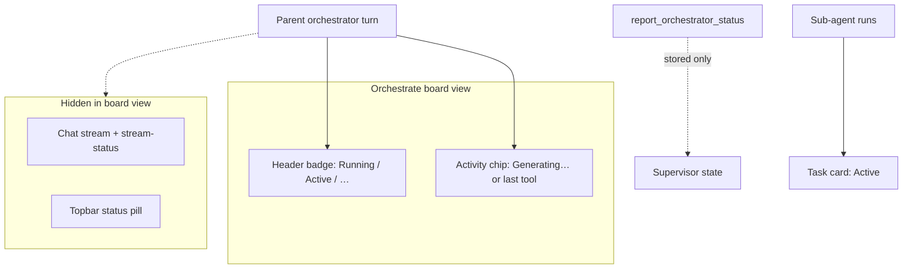

# POLISH-022 — Orchestrator status: granular detail

| Field | Value |
|-------|-------|
| **ID** | POLISH-022 |
| **Type** | Polish / UX (observability) |
| **Status** | Verified baseline 2026-05-24 — not implemented; Linear [MIN-85](https://linear.app/minnowai/issue/MIN-85/polish-022-orchestrator-status-detail) |
| **Source** | [`documentation/bug-hunt-session-2026-05-24.md`](../../bug-hunt-session-2026-05-24.md) — POLISH-022 |
| **Area** | Orchestrate mode UI, orchestrator/sub-agent runtime, `report_orchestrator_status`, Agent activity panel |
| **Related** | Feature #15 (Agent activity — shipped), Orchestrate supervisor / heartbeat (shipped) |

---

## Summary

**Orchestrate** mode should expose **step-level** status — e.g. `Generating sub-agent prompt for W1-A` — instead of only coarse labels like **Running**, **Active**, or a retroactive “last tool” chip. Users debugging multi-worker runs (especially on the **board view**, where the chat stream is hidden) need a live line that names the **worker/task id** and the **current action**.

---

## Problem statement

| | |
|---|---|
| **User request** | Live status that includes worker/sub-agent id (e.g. `W1-A`) and action (generating prompt, spawning, executing, waiting, tool use, handoff, completed/failed). |
| **Observed today** | Board header badge is task-aggregate (`Running`, `Active`, `Complete`, …). Activity chip shows **Generating…** while the parent streams, else the **last completed** parent tool/message from history — not the orchestrator’s *current intent*. |
| **Gap** | `report_orchestrator_status` stores `phase` / `next_action` in supervisor state but **nothing in the UI reads it**. Sub-agent “building prompt” happens inside `executeRun` with no published phase. Task cards show generic **Active**, not per-step copy. |
| **Impact** | Hard to see what the orchestrator is doing without opening chat tool logs or sub-agent drawers; board-first workflow suffers most. |

---

## Why board view is the critical surface

[`isStreamDomVisible()`](../../../src/chat/streaming-state.ts) returns **false** when `mode === 'orchestrate'` and `viewMode === 'board'`. Effects:

- No streaming assistant row or stream-status line in `#chatArea`.
- Top-bar [`setStatus`](../../../src/ui/status.ts) updates in `loop.ts` are gated on `isStreamDomVisible` — user on the board often **does not** see “Generating reply…” / “Running tools…”.

The **board header** (`deriveBoardHeaderStatus` + `deriveOrchestratorLastActivity` in [`src/ui/orchestrate-board.ts`](../../../src/ui/orchestrate-board.ts)) is therefore the primary status real estate for POLISH-022.



---

## Current state (audit)

### Status surfaces

| Surface | What it shows | Granularity | Key files |
|--------|----------------|-------------|-----------|
| **Board header badge** | `Running`, `Active`, `Stalled — Resume`, … from task + run counts | Coarse | `deriveBoardHeaderStatus` in `orchestrate-board.ts` |
| **Board activity chip** | `Generating…` if parent streaming; else last parent tool label or message snippet | Medium (retroactive) | `deriveOrchestratorLastActivity` in `last-activity.ts` |
| **`report_orchestrator_status`** | Model supplies `phase`, `next_action`, `active_tasks`, … | Structured but **UI-invisible** | `report-types.ts`, `report-tool.ts`, `definitions.ts` |
| **Task card agent badge** | `Active` / `Failed` / `Complete` / `Cancelled` | Coarse | `deriveTaskAgentBadge` in `orchestrate-board.ts` |
| **Agent activity panel** | Sub-agent: `Running` / `Running {tool}`; main turn: `Generating` | Medium (sub-agent tool only) | `agent-activity-registry.ts`, `agent-activity-panel.ts` |
| **Sub-agent cards / drawer** | Type, status, transcript | Deep (per run) | `sub-agent-cards.ts`, `sub-agent-drawer.ts` |
| **Chat stream status** | Thinking / Generating | Medium | `stream-status.ts`, `messages.ts` — **not shown on board view** |

### Orchestrator heartbeat (supervisor)

- Tool schema: [`report_orchestrator_status`](../../../src/tools/definitions.ts) — required `phase`, `next_action`, `active_tasks`, `blocked_tasks`; optional `current_wave_id`, `note`, `confidence`.
- Parsed type: [`OrchestratorStatusReport`](../../../src/agents/supervisor/report-types.ts).
- Consumed by: R7 heartbeat (`detectMissedOrchestratorHeartbeat`), R10 low confidence, LLM escalation context — **not** board UI.
- Prompt example in [`orchestrate.full.md`](../../../src/chat/prompts/modes/orchestrate.full.md) already suggests `next_action: "spawn verifier for W1-A"` but the UI never displays it.

### Sub-agent lifecycle (instrumentation gap)

In [`orchestrator.ts`](../../../src/agents/orchestrator.ts) `executeRun`:

1. Resolve model binding  
2. `buildSubAgentSystemPrompt(...)` — **no live status emit** (user-visible gap for “Generating sub-agent prompt for W1-A”)  
3. Seed messages + `getSubAgentRunner().run(...)`  
4. `recordToolCallForRun` sets `liveCurrentToolName` — already feeds Agent activity panel  

`boardTaskId` is set on spawn and task cards link runs, but activity rows use **type label only** (`Explore`, `shell`, …), not `W1-A`.

### Feature #15 relationship

[Feature #15](<../Build out/feature-15-agent-activity-view.md>) shipped cross-chat **Agent activity** with `liveCurrentToolName` for sub-agents. POLISH-022 **complements** it:

- **#15** = process-centric, all chats, sub-agent tool name.  
- **#022** = orchestrate-centric, **parent** step narrative + **task id** on workers + board header as primary affordance.

Avoid duplicating full logic in both places — share a small **status snapshot** module (see Architecture).

---

## Goals

1. **Board-first clarity:** While on Orchestrate board view, the header activity line updates through spawn → prompt build → worker tool rounds → poll/wait, with **task id** when known.
2. **Dual fidelity:** Prefer **code-instrumented** steps (deterministic); merge **model-reported** `next_action` / `note` when fresher or more specific.
3. **Worker attribution:** Sub-agent and board-task rows surface `boardTaskId` (e.g. `W1-A`) in labels or secondary text.
4. **Supervisor-safe:** Extending `report_orchestrator_status` remains backward compatible; R7 still keys off `lastReportAt` / `bumpOrchestratorProgress`.
5. **Low noise:** Throttle UI refresh (reuse Agent activity ~150 ms pattern); no per-80 ms transcript thrash on the header chip.

### Non-goals (v1)

- Replacing Kanban task status model (`planned` / `in_progress` / …).  
- Full supervisor tick row in Agent activity (open question below).  
- Historical timeline / trace replay (feature #1).  
- Changing stall detection thresholds (R7/R8) unless a separate bug requires it.  
- Requiring the model to call a new tool on every micro-step (instrumentation carries deterministic phases).

---

## Proposed step taxonomy

Canonical machine ids + display templates (implement as a single map module).

### Parent orchestrator (`OrchestratorStep`)

| Step id | Example display | Emit when |
|---------|-----------------|-----------|
| `idle` | Ready | Board idle, no parent stream |
| `streaming` | Planning next step… | Parent SSE active, no finer signal |
| `tool:board_init` | Initializing board… | Parent invokes `board_init` |
| `tool:board_update` | Updating {taskId}… | Parent invokes `board_update_task` |
| `tool:spawn_sub_agent` | Spawning worker for {taskId}… | Parent `spawn_sub_agent` in flight |
| `tool:list_sub_agents` | Checking workers… | Parent list/status tools |
| `tool:report_status` | Reporting status… | Parent `report_orchestrator_status` |
| `tool:{name}` | {describeToolInvocation} | Other parent tools |
| `waiting_sub_agents` | Waiting on {taskId} ({n} running)… | Parent turn idle, active subs for chat |
| `reported` | {nextAction from lastReport} | Fallback when model report fresher than instrumented |

### Sub-agent worker (`SubAgentStep`) — keyed by `runId` + optional `boardTaskId`

| Step id | Example display | Emit when |
|---------|-----------------|-----------|
| `queued` | {taskId}: Queued | Run queued (concurrency) |
| `building_prompt` | {taskId}: Generating sub-agent prompt… | Start → end of `buildSubAgentSystemPrompt` |
| `starting` | {taskId}: Starting {type}… | Runner invoked |
| `running` | {taskId}: Running {type}… | Model stream without tool |
| `tool` | {taskId}: {toolName}… | Each nested tool (existing `liveCurrentToolName`) |
| `completed` / `failed` / `cancelled` | {taskId}: Done / Failed / Cancelled | Terminal settle |

**Template rule:** If `boardTaskId` missing, fall back to short `runId` suffix or type only.

---

## Architecture

### 1. Live status store (new)

Recommended: [`src/chat/orchestrate/orchestrator-live-status.ts`](../../../src/chat/orchestrate/orchestrator-live-status.ts)

```ts
/** Snapshot for UI: one primary line + optional per-worker lines */
interface OrchestratorLiveStatus {
  chatId: string;
  updatedAtMs: number;
  primary: { text: string; title: string; source: 'instrumented' | 'report' | 'history' };
  workers: Array<{ runId: string; taskId?: string; text: string }>;
}
```

- **Writes:** thin `setOrchestratorLiveStatus(chatId, patch)` from orchestrator, `board-tools`, optional `loop.ts` parent-tool hooks, `report-tool.ts` on successful report.
- **Reads:** `getOrchestratorLiveStatus(chatId)` for board header + optional Agent activity formatter.
- **Events:** `subscribeOrchestratorLiveStatus(cb)` mirroring `subscribeSubAgentRuns` ergonomics.

Priority when building `primary.text`:

1. Instrumented parent step (if `updatedAtMs` within ~2 s or parent streaming).  
2. Else `sup.lastReport.nextAction` (trim, capitalize) if `lastReportAt` fresh.  
3. Else existing `deriveOrchestratorLastActivity` (keep as fallback).

### 2. Instrumentation points

| Location | Change |
|----------|--------|
| [`orchestrator.ts`](../../../src/agents/orchestrator.ts) | Emit `building_prompt` / `starting` / terminal around `executeRun`; emit on spawn with `boardTaskId` |
| [`board-tools.ts`](../../../src/tools/board-tools.ts) | Emit on `board_init` / `board_update_task` with `task_id` |
| [`report-tool.ts`](../../../src/agents/supervisor/report-tool.ts) | On success, push `reported` line from `nextAction` (+ optional new field) |
| [`loop.ts`](../../../src/tools/loop.ts) | Optional: when orchestrate + board view, map parent tool batch to step (if not redundant with board-tools) |
| [`sub-agent-events.ts`](../../../src/agents/sub-agent-events.ts) | Reuse existing emit; consumers read new fields on `SubAgentRun` |

Extend [`SubAgentRun`](../../../src/agents/types.ts) optionally:

```ts
liveLifecycleStep?: SubAgentStepId;
```

Set/clear alongside `liveCurrentToolName` (same emit path).

### 3. Schema extension (optional, backward compatible)

Extend [`OrchestratorStatusReport`](../../../src/agents/supervisor/report-types.ts) and tool schema:

| Field | Type | Purpose |
|-------|------|---------|
| `status_message` / `detail_line` | string | Single human line for UI (max ~120 chars) |
| `worker_steps` | `{ task_id, action }[]` | Optional structured mirror of active workers |

Parser: ignore unknown keys; do not require new fields. Prompts: encourage `status_message` matching taxonomy examples.

**Alternative (smaller diff):** No schema change — UI only displays existing `next_action` + `note` from `lastReport`. Instrumentation still required for prompt-build phase.

**Recommendation:** Phase 1 = instrumentation + display `next_action`; Phase 2 = optional `status_message` if model copy is inconsistent.

### 4. UI wiring

| Surface | Behavior |
|---------|----------|
| **Board activity chip** | Replace/supplement `deriveOrchestratorLastActivity` with `resolveBoardOrchestratorActivity(chat, isStreaming)` merging live status + fallback |
| **Board header badge** | Keep `deriveBoardHeaderStatus` as-is (aggregate health); optional subtitle only if design allows |
| **Task cards** | Optional v2: second line under badge, e.g. `grep src/…` from worker `liveCurrentToolName` — defer if scope creep |
| **Agent activity** | `buildSubAgentRows`: append ` · W1-A` to label when `boardTaskId` set; main_turn row uses orchestrate live primary when mode is orchestrate |
| **Chat view** | No change required; stream-status already adequate when user switches to chat |

### 5. Prompt / docs

- [`orchestrate.full.md`](../../../src/chat/prompts/modes/orchestrate.full.md) / lite: table of encouraged `next_action` strings; call `report_orchestrator_status` after spawn **and** when starting prompt-heavy work (if still model-visible only via report in Phase 2).
- [`work-agents/orchestrator/agent.full.md`](../../../src/chat/prompts/work-agents/orchestrator/agent.full.md): align examples with board task ids.

---

## Acceptance criteria

- [ ] On **board view**, during spawn of `W1-A`, activity chip shows a line equivalent to **Generating sub-agent prompt for W1-A** before the worker’s first tool call (instrumented).
- [ ] While worker runs, chip or Agent activity shows **W1-A** + current tool name when applicable.
- [ ] When the model calls `report_orchestrator_status` with `next_action: "spawn verifier for W1-B"`, UI shows that string within one refresh cycle without requiring a completed tool message in history.
- [ ] Switching to **chat view** does not regress stream-status / sub-agent cards.
- [ ] No change to supervisor R7 pass/fail semantics when reports stop (heartbeat still uses `lastReportAt` / progress clock).
- [ ] Empty/idle board shows no misleading “Generating…” chip.
- [ ] **Tests:** label resolver and merge priority with fixed timestamps and fake supervisor state.

---

## Implementation phases

### Phase 1 — Instrumentation + board chip (MVP)

- Add `orchestrator-live-status` module + sub-agent `liveLifecycleStep`.
- Emit `building_prompt` and spawn/queued steps.
- Board header activity uses live primary line; fallback to `deriveOrchestratorLastActivity`.
- **Done when:** Board view shows prompt-build and spawn steps with task id.

### Phase 2 — Report + Agent activity

- Surface `lastReport.nextAction` / optional `status_message` on chip when fresher.
- Agent activity sub-agent rows include `boardTaskId`.
- Prompt tweaks for report cadence and string examples.
- **Done when:** Model-reported next action visible; global panel shows task ids.

### Phase 3 — Polish + docs

- Throttle/coalesce emits; tooltip `title` with source (`instrumented` vs `report`).
- Update [`documentation/context.md`](../../context.md) Orchestrate visibility subsection.
- Mark POLISH-022 resolved in bug-hunt doc.
- **Done when:** Manual dogfood checklist passes; context.md updated.

---

## Key files

| Action | Path |
|--------|------|
| **New** | `src/chat/orchestrate/orchestrator-live-status.ts` |
| **New** | `src/chat/orchestrate/orchestrator-status-labels.ts` (step → string templates) |
| **Edit** | `src/agents/orchestrator.ts` |
| **Edit** | `src/agents/types.ts` |
| **Edit** | `src/ui/orchestrate-board.ts` |
| **Edit** | `src/chat/orchestrate/last-activity.ts` (fallback helper or delegate) |
| **Edit** | `src/agents/supervisor/report-types.ts` + `report-tool.ts` (Phase 2) |
| **Edit** | `src/tools/definitions.ts` (Phase 2 schema) |
| **Edit** | `src/state/agent-activity-registry.ts` |
| **Edit** | `src/chat/prompts/modes/orchestrate.full.md`, `orchestrate.lite.md` |
| **Test** | `test/orchestrate/orchestrator-live-status.test.mts` |
| **Test** | `test/ui/orchestrate-board-header-status.test.mjs` (extend) |
| **Docs** | `documentation/context.md` (on ship) |

---

## Tests

| File | Focus |
|------|--------|
| `test/orchestrate/orchestrator-live-status.test.mts` | Priority merge: instrumented vs `lastReport` vs history fallback; worker list ordering |
| `test/agents/orchestrator-live-phase.test.mts` | `liveLifecycleStep` transitions on mocked `executeRun` |
| `test/ui/orchestrate-board-header-status.test.mjs` | Activity chip text for streaming + live status fixtures |

Use **fixed** chat ids, task ids (`W1-A`), and `nowMs` — no `Date.now()` in assertions.

**Manual test plan**

1. Orchestrate + board view + plan with `W1-A`: send “execute plan” — watch header chip through board_init → spawn → prompt → worker tool.
2. Open Agent activity — confirm sub-agent row shows `W1-A` and tool name.
3. Stay on board while parent calls `report_orchestrator_status` — confirm `next_action` appears on chip.
4. Switch to chat view — stream-status still works; board chip still updates when returning to board.
5. Complete plan — chip clears to idle/complete; no stuck “Generating…”.

---

## Dependencies

| Dependency | Relationship |
|------------|----------------|
| Orchestrate board + supervisor (shipped) | Required |
| `report_orchestrator_status` (shipped) | Required — display + optional schema |
| Feature #15 Agent activity (shipped) | Complementary — reuse throttle/subscribe patterns |
| Feature #3 Context budgets | None blocking |
| llmster browser SSE issues (`AGENTS.md`) | May limit live **chat** streaming QA; board/tool instrumentation still testable |

---

## Risks and mitigations

| Risk | Impact | Mitigation |
|------|--------|------------|
| Stale instrumented step after fast tool chain | Wrong chip text | Short TTL; clear on parent stream end and tool result |
| Model `next_action` vague or stale | Misleading copy | Prefer instrumented when newer; cap length; ellipsis |
| Duplicate emits (board-tools + loop) | Flicker | Single writer module; coalesce patches |
| Scope creep onto task card redesign | Delay | Phase 1 = header chip only |
| Breaking report parser | Supervisor regressions | Optional fields only; existing tests in `test/supervisor/report-tool.test.mts` |

---

## Open questions (align before Phase 1)

1. **Chip vs badge:** Should granular text **replace** the activity chip only, or also refine the green **Running** badge label?
2. **Schema:** Is displaying `next_action` enough, or do we need `status_message` for model-authored lines?
3. **Multiple active workers:** One combined chip line (“W1-A: grep…; W1-B: Queued”) vs rotating primary + tooltip list?
4. **Supervisor row:** Show last `phase` in Agent activity for orchestrate parent, or keep panel worker-only?
5. **Chat view parity:** Should orchestrate chat view show the same live line in the composer strip, or board-only?

---

## Documentation updates (on ship)

- [`documentation/context.md`](../../context.md): Orchestrate board header + live status module; cross-link POLISH-022.
- [`documentation/bug-hunt-session-2026-05-24.md`](../../bug-hunt-session-2026-05-24.md): Mark POLISH-022 **Built** with file pointers.
- Optional verification checklist: `documentation/plans/verification/POLISH-022-orchestrator-status.md` (mirror acceptance criteria).


---

## Verification (APPROVED)

**Date:** 2026-05-24

**Notes:** Plan verified against codebase (static review). Bug-hunt entry aligned. Ready for implementation unless plan header marks shipped.

**Linear:** [MIN-85](https://linear.app/minnowai/issue/MIN-85/polish-022-orchestrator-status-detail)
