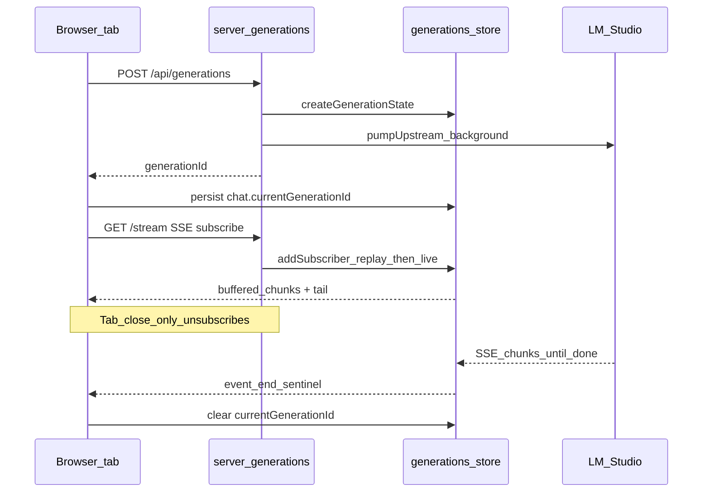
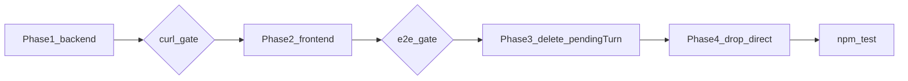

# Backend-owned LLM generations refactor

Source exploration: [explore-how-we-are-idempotent-ripple.md](c:\Users\dukky\.claude\plans\explore-how-we-are-idempotent-ripple.md) (filename is historical; content is **backend-owned generations**, not UI ripple).

**Problem today:** [`server/providers/proxy.js`](server/providers/proxy.js) `proxyChatCompletions` pipes upstream bytes directly to the browser `ServerResponse`. When the client disconnects (refresh, tab close), `res.write()` fails, the reader loop stops, upstream `fetch` aborts, and LM Studio drops the in-flight prompt. [`src/chat/turn-recovery.ts`](src/chat/turn-recovery.ts) + `pendingTurn` ask the model to cooperatively resume partial text on the next request.

**Target:** Backend starts and buffers each completion; browsers subscribe with replay-from-zero; subscriber disconnect never cancels upstream; Stop explicitly cancels. Persist `chat.currentGenerationId` so refresh re-subscribes instead of re-prompting.

**User-approved constraints (from explore doc):**
- Generations run to completion with zero browser tabs (no orphan-grace timer).
- Multiple tabs can subscribe to the same `generationId` (replay + live tail).
- Remove `connectionMode: 'direct'` — all chat via backend.
- Remove `pendingTurn` resume entirely.
- In-memory buffer only (16 MiB cap; 5 min eviction post-terminal).
- **Orphan turn recovery dropped** (no lone-user / tool-tail retry banners).

**Known limitations (document in release notes + [`documentation/context.md`](documentation/context.md)):**
- Tool rounds between LLM iterations remain browser-side; refresh mid-tool still interrupts tools.
- Sub-agent, reef widget, and title streams unchanged (still browser-passthrough via `postChatCompletions` shim).
- Backend restart evicts in-flight generations (`currentGenerationId` → 404 + inline error).

---

## Architecture



**Pattern reference:** PTY attach replays scrollback then subscribes ([`server/terminal/pty-ws.js`](server/terminal/pty-ws.js) L62–70); generations replay `chunks[]` then attach to `subscribers` Set.

**Upstream URL/auth:** Reuse [`getProviderRuntime`](server/providers/store.js) (same as today's proxy) — `profile.baseUrl + paths.chatCompletionsPath` + `buildAuthHeaders`.

---

## Phase 1 — Backend `server/generations/` (additive)

Ship backend-only; no frontend changes. Verify with curl before Phase 2.

### 1.1 `server/generations/store.js`

In-memory `Map<generationId, GenerationState>`:

| Field | Purpose |
|-------|---------|
| `id`, `providerId`, `requestBody` | Identity + replay payload for debugging |
| `chunks: Buffer[]`, `totalBytes` | Raw upstream SSE bytes |
| `status` | `pending` → `streaming` → `complete` \| `error` \| `cancelled` |
| `upstreamController` | Abort on cancel / overflow / shutdown |
| `subscribers: Set<ServerResponse>` | Live SSE clients |
| `evictTimer` | 5 min after terminal (30s when `persist: false`) |

**Helpers:**
- `createGenerationState({ providerId, body, persist })` — UUID id, schedule eviction policy
- `appendChunk(state, buf)` — push, broadcast `res.write(buf)` to all subscribers; if `totalBytes > 16 MiB` → `markError('Buffer overflow')` + abort upstream
- `addSubscriber(state, res)` — sync replay all `chunks`, then add to set; if already terminal, replay + write terminal sentinel + `res.end()`
- `markComplete` / `markError` / `markCancelled` — set status, broadcast `event: end\ndata: {...}\n\n`, `res.end()` each subscriber, `scheduleEviction`
- `cancel(state)` — abort upstream, `markCancelled`
- `deleteGenerationsForProviderShutdown()` — mark cancelled + abort all (for `process.on('exit')`)

**Critical rule:** `req.on('close')` on stream route removes subscriber only — **never** calls `cancel`.

### 1.2 `server/generations/upstream.js`

`pumpUpstream({ state, url, headers })`:
- Fire-and-forget from route handler (do not await in middleware)
- `fetch` POST with `state.requestBody`, pipe `upstream.body` through `appendChunk`
- On completion → `markComplete`; on throw → `markError`
- Wrap in `.catch()` so unhandled rejections become `markError`

### 1.3 `server/generations/routes.js`

Export `createGenerationsMiddleware()`:

| Route | Behavior |
|-------|----------|
| `POST /api/generations` | Body `{ providerId, body }` (raw JSON buffer or parsed then re-serialized). `getProviderRuntime`, create state, start `pumpUpstream`, `201 { generationId }` |
| `GET /api/generations/:id/stream` | SSE headers (`text/event-stream`, `Cache-Control: no-cache`, `Connection: keep-alive`, `X-Accel-Buffering: no`). `addSubscriber`; unsubscribe on `req.close` |
| `POST /api/generations/:id/cancel` | `{ ok: true }` |
| `GET /api/generations/:id` | Debug snapshot `{ status, totalBytes, startedAt, finishedAt, errorMessage }` |

Optional query/body flag `persist: false` for headless callers (30s eviction) — used by Phase 2 `postChatCompletions` shim.

### 1.4 Wire into dev server

In [`server.js`](server.js) `configureServer` middleware stack (~L866), insert **after** `createProviderMiddleware()` and **before** `createWorkAgentsMiddleware()`:

```js
server.middlewares.use(createGenerationsMiddleware());
```

On shutdown (~L905), alongside `destroyAllPtySessions()`:

```js
process.on('exit', () => {
  destroyAllPtySessions();
  deleteGenerationsForProviderShutdown();
});
```

### 1.5 Phase 1 tests

Add [`test/api/generations.test.mjs`](test/api/generations.test.mjs) (or `.js`) using existing provider mock patterns from [`test/providers/proxy-mock.test.js`](test/providers/proxy-mock.test.js):
- POST creates id; GET status transitions
- Two parallel stream readers receive identical replay+tail (mock upstream SSE fixture)
- Close one subscriber mid-stream; other completes; status stays `streaming` until upstream ends
- POST cancel → `cancelled`

**Manual curl checklist** (from explore doc) remains the gate before Phase 2.

---

## Phase 2 — Frontend client + main chat path (additive)

### 2.1 `src/api/generations.ts` (new)

```ts
createGeneration(providerId, body): Promise<{ generationId: string }>
subscribeToGeneration(id, { onChunk, onEnd, onTransportError }): () => void
cancelGeneration(id): Promise<void>
```

- `subscribeToGeneration`: `fetch('/api/generations/:id/stream', { signal })` + `getReader()` + `TextDecoder` — mirror [`src/api/chat.ts`](src/api/chat.ts) L404–440 loop shape
- Reuse `parseSsePayloads`, `extractStreamDelta`, `mergeStreamMeta` from [`src/api/chat.ts`](src/api/chat.ts)
- Parse terminal `event: end` **inside** `subscribeToGeneration` (not in `parseSsePayloads`)

### 2.2 Rewrite `streamCompletionTurn` in [`src/tools/loop.ts`](src/tools/loop.ts)

Replace `postChatCompletions` + local reader (~L474–561) with:

1. `createGeneration(provider.id, body)` → `{ generationId }`
2. **Immediately** `chat.currentGenerationId = generationId` + `scheduleSaveSessions()` (closes create→subscribe race on F5)
3. `subscribeToGeneration(generationId, { onChunk: handleChunk, onEnd, onTransportError })` — keep existing `handleChunk` / thought bubble / DOM logic
4. On `AbortError` (Stop): `await cancelGeneration(generationId)` then rethrow
5. On clean end: clear `chat.currentGenerationId` + save

Add `RunChatTurnOptions.resumeGenerationId?: string` — when set, skip step 1–2 id creation, only subscribe (boot path).

### 2.3 `postChatCompletions` shim — [`src/providers/fetch-chat.ts`](src/providers/fetch-chat.ts)

Refactor to:
1. `createGeneration(provider.id, body, { persist: false })`
2. `subscribeToGeneration` driving a **synthetic** `Response` with `ReadableStream` body

Keeps five callers unchanged:
- [`src/api/chat.ts`](src/api/chat.ts) `sendMessage` (non-tool path)
- [`src/tools/loop.ts`](src/tools/loop.ts) — only until `streamCompletionTurn` uses generations directly (loop uses generations; others keep shim)
- [`src/agents/sub-agent-runner.ts`](src/agents/sub-agent-runner.ts)
- [`src/chat/reef/run-widget-completion.ts`](src/chat/reef/run-widget-completion.ts)
- [`src/chat/titles/provider-port.ts`](src/chat/titles/provider-port.ts)

After 2.2, loop no longer calls `postChatCompletions` for main turns.

### 2.4 Boot rehydration — new `src/chat/generation-resume.ts`

Replace [`bootTurnRecoveryForChat`](src/chat/turn-recovery.ts) calls with `bootGenerationResumeForChats(chats)`:

| Call site | Change |
|-----------|--------|
| [`src/main.ts`](src/main.ts) L234 | `bootGenerationResumeForChats(sessionState.chats)` |
| [`src/ui/sidebar.ts`](src/ui/sidebar.ts) L345, L407 | `bootGenerationResumeForChat(chat)` — single-chat variant that subscribes if `currentGenerationId` |

Logic:
- Find chats with `currentGenerationId`
- **First** chat with id wins global `streaming` flag ([`src/app-state.ts`](src/app-state.ts)); others subscribe in background (sidebar dot via [`src/ui/chat-item-dot.ts`](src/ui/chat-item-dot.ts) — update in Phase 3)
- `runChatTurn({ resumeGenerationId, pushUser: false, ... })` mounts streaming row + subscribes
- Stream 404 → clear id, inline error: "This reply was lost when the server restarted."
- No auto-retry

### 2.5 Stop button — [`src/chat/stop-generation.ts`](src/chat/stop-generation.ts)

1. Resolve active streaming chat → `currentGenerationId`
2. `cancelGeneration(id)` if present
3. `chatFetchAbort?.abort()` to tear down local SSE reader

### 2.6 Types + persistence (partial — full pendingTurn removal in Phase 3)

Add to [`src/types.ts`](src/types.ts) `Chat`:

```ts
currentGenerationId?: string;
```

Wire [`server/config/validators.js`](server/config/validators.js) session chat row parser to accept/drop unknown `pendingTurn` and persist `currentGenerationId` (string).

[`src/state/sessions.ts`](src/state/sessions.ts): on load, strip stale `currentGenerationId` if generation likely dead (optional: always clear on load until Phase 2 verified — explore doc says clear stale post-deploy).

### 2.7 Phase 2 verification

- Long prompt → F5 mid-stream → catches up, completes, no duplicate prose
- Two tabs same chat → tab B mirrors tab A in real time
- Close all tabs 30s → reopen → completed history (generation finished server-side)
- Stop → LM Studio abort + `cancelled` status + stopped affordance ([`src/ui/stopped-affordance.ts`](src/ui/stopped-affordance.ts))

---

## Phase 3 — Delete `pendingTurn` system (after Phase 2 verified)

### 3.1 Delete files

- [`src/state/pending-turn.ts`](src/state/pending-turn.ts)
- [`src/state/pending-turn-shape.ts`](src/state/pending-turn-shape.ts)
- [`src/chat/turn-checkpoint.ts`](src/chat/turn-checkpoint.ts)
- [`src/chat/turn-recovery.ts`](src/chat/turn-recovery.ts)
- [`src/chat/finalize-stopped-turn.ts`](src/chat/finalize-stopped-turn.ts)
- [`src/ui/pending-turn-recovery.ts`](src/ui/pending-turn-recovery.ts)
- [`src/styles/pending-turn-recovery.css`](src/styles/pending-turn-recovery.css)

### 3.2 Types + session load

[`src/types.ts`](src/types.ts): remove `PendingTurn` interface + `pendingTurn?` on `Chat`.

[`src/state/sessions.ts`](src/state/sessions.ts): remove `ensurePendingTurn`, `clearStalePendingTurnsOnLoad`; ignore `pendingTurn` on hydrate; clear orphan `currentGenerationId` on load.

[`server/config/validators.js`](server/config/validators.js): remove `ensurePendingTurn` for chat rows.

### 3.3 [`src/tools/loop.ts`](src/tools/loop.ts) — largest edit

Remove:
- `beginTurnCheckpoint` / `TurnCheckpointHandle`
- `clearPendingTurn` calls
- `continueFromPending` branch in `sendMessageWithTools` (~L1241–1264)
- `BuildApiMessagesOptions.pendingTurnResume` + `effectivePendingResumeText` / `pendingTurnResumeHasApiPayload` / `shouldInjectPendingTurnResume` / `appendPendingTurnResumeToApiMessages`
- `RunChatTurnOptions.continueFromPending` / `ephemeralContinueInstruction` (continue-from-pending path)

**Abort handling:** On `AbortError`, keep partial assistant text in history with `stopped: true` via existing `markMessageStopped` — no checkpoint write.

### 3.4 UI + entry

| File | Change |
|------|--------|
| [`src/api/chat.ts`](src/api/chat.ts) | Remove `clearPendingTurn`, `finalizeStoppedTurn` |
| [`src/ui/messages.ts`](src/ui/messages.ts) | Delete `renderPendingTurn` + call sites |
| [`src/main.ts`](src/main.ts) | Remove `flushPendingTurnNow`, pending CSS import, `pagehide`/`beforeunload`/`visibilitychange` flush block |
| [`src/ui/chat-item-dot.ts`](src/ui/chat-item-dot.ts) | Replace `pendingTurn?.phase === 'thinking'` with `currentGenerationId != null` + streaming phase |
| [`src/chat/orchestrate/last-activity.ts`](src/chat/orchestrate/last-activity.ts) | Remove `pendingTurn` references |

### 3.5 Delete / rewrite tests

**Remove:**
- [`test/state/pending-turn.test.mts`](test/state/pending-turn.test.mts)
- [`test/state/pending-turn-shape.test.mts`](test/state/pending-turn-shape.test.mts)
- [`test/state/pending-turn-recovery.test.mts`](test/state/pending-turn-recovery.test.mts)
- [`test/chat/turn-recovery-boot.test.mts`](test/chat/turn-recovery-boot.test.mts)

**Add:**
- [`test/chat/generation-resume.test.mts`](test/chat/generation-resume.test.mts) — boot picks first chat with `currentGenerationId`; 404 clears id
- [`test/ui/chat-item-dot.test.mjs`](test/ui/chat-item-dot.test.mjs) — update dot state for `currentGenerationId` instead of `pendingTurn`

### 3.6 [`documentation/context.md`](documentation/context.md)

Replace feature-22 `pendingTurn` section with backend generations + `currentGenerationId` boot subscribe; note dropped orphan recovery.

---

## Phase 4 — Remove `connectionMode: 'direct'`

All chat/completions traffic goes through `/api/generations` (main loop) or `/api/providers/:id/...` models paths only.

### 4.1 Frontend

| File | Change |
|------|--------|
| [`src/providers/types.ts`](src/providers/types.ts) | Remove `ConnectionMode`, `connectionMode` from `ProviderPublic`; drop `chatUrl` from `ProviderEndpoints` |
| [`src/providers/resolve.ts`](src/providers/resolve.ts) | Single proxy path: always `/api/providers/:id/...` for models load/unload |
| [`src/providers/store.ts`](src/providers/store.ts) | Remove `connectionMode: 'direct'` fallback |
| [`src/agents/resolve-work-agent-binding.ts`](src/agents/resolve-work-agent-binding.ts) L87 | Drop `connectionMode` guard |
| [`src/agents/ui-designer/config.ts`](src/agents/ui-designer/config.ts) L83 | Same |

`fetch-chat.ts` after Phase 2 already uses generations API — no direct LM Studio URL.

### 4.2 Backend

| File | Change |
|------|--------|
| [`server/providers/store.js`](server/providers/store.js) | Stop reading/writing `connectionMode`; `toProviderPublic` omits field; treat all chat as server-mediated |
| [`server/providers/validate.js`](server/providers/validate.js) | Remove `validateConnectionMode` |
| [`server/providers/routes.js`](server/providers/routes.js) | Delete `chatMatch` → `proxyChatCompletions` route (~L202–211) |
| [`server/providers/proxy.js`](server/providers/proxy.js) | Delete `proxyChatCompletions`; keep models load/unload |

**Profile migration:** Existing `profile.json` may still contain `connectionMode: "direct"` — ignore on read (no user-facing toggle found in [`src/ui/settings-page.ts`](src/ui/settings-page.ts)).

### 4.3 Tests

Update:
- [`test/api/models-load-unload.test.mts`](test/api/models-load-unload.test.mts)
- [`test/providers/proxy-mock.test.js`](test/providers/proxy-mock.test.js)
- [`test/work-agents/binding.test.mjs`](test/work-agents/binding.test.mjs)

Remove `connectionMode` from fixtures; add assertion that chat completions route is **only** `/api/generations`.

---

## Implementation order and gates



Do **not** start Phase 3 until Phase 2 manual passes (F5 + dual-tab + stop) succeed — avoids deleting the only recovery path while generations are broken.

---

## Deliverable doc location

After approval, save this plan under [`documentation/plans/Build out/backend-owned-generations.md`](documentation/plans/Build%20out/backend-owned-generations.md) (project convention).

---

## Risk notes

| Risk | Mitigation |
|------|------------|
| Race: F5 between POST and subscribe | Persist `currentGenerationId` immediately after POST |
| Double prose on resume | `handleChunk` only appends deltas; boot must not re-push user message (`pushUser: false`) |
| Memory pressure | 16 MiB cap per generation + 5 min eviction |
| Multi-chat resume | First `currentGenerationId` owns `streaming`; others background subscribe |
| Headless shim streams | `persist: false` + 30s eviction on sub-agent/title paths |
