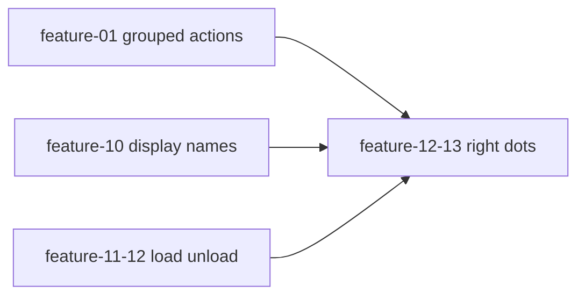

# Feature 01 — Top bar grouped actions (A1)

**Feature ID:** `feature-01-topbar-grouped-actions`  
**Title (backlog):** Clean up top bar — group all action buttons together  
**Epic:** A — Top bar and model picker  
**Backlog:** [`documentation/plans/product_backlog_agents_48a41af9.plan.md`](../product_backlog_agents_48a41af9.plan.md) — **A1**  
**Wave:** 1 (Top bar and chat polish)  
**Size:** S  
**Status:** Build plan (not implemented)  
**Depends on:** None (coordinate with A4 layout)  
**Blocks / coordinates:** **A4** (`feature-12-13-model-picker-right-dots`) — same `.topbar-end` real estate; ship **A1 before A4**  
**Prototype:** None — use [`DESIGN.md`](../../../DESIGN.md), [`.impeccable/design.json`](../../../.impeccable/design.json), [`documentation/context.md`](../../context.md)

### Backlog alignment (A1)

| Backlog field | Build plan mapping |
|---------------|-------------------|
| **Current** — scattered topbar; model `flex: 1` splits groups | §1 current-state table + CSS root causes |
| **Goal** — actions cluster with consistent gap; brand left; model + status right | §1 goal table + `.topbar-actions` / `.topbar-end` zones |
| **Key files** — `index.html`, `topbar.css`, `responsive.css` | §2 required implement (plus `package.json` + tests for `npm test`) |
| **Acceptance** — contiguous icons; no workspace/model separator; mobile ≤380px hides refresh | AC1–AC3, AC5–AC6 (see §4) |
| **Depends on** — None | Header + no upstream blockers |

---

## 1. Problem summary — current vs goal

### User problem

The top bar reads as **scattered chrome**: workspace, model picker, and trailing icons (files, refresh, terminal, settings) are not one visual group. A separator between workspace and the model control reinforces the split.

### Current state (researched)

**DOM** — flat flex children of `header.topbar` in [`index.html`](../../../index.html):

| Order | Element | Notes |
|-------|---------|-------|
| 1–2 | `.logo-mark`, `.app-title` | Brand |
| 3 | `.topbar-sep` | After brand |
| 4 | `#btnSidebarToggle` | Mobile hamburger (`topbar-sidebar-toggle`) |
| 5 | `#btnWorkspace` | Workspace folder |
| 6 | `.topbar-sep.workspace-sep.mid-hide` | **Orphan** between workspace and model |
| 7 | `.model-wrap` → `#modelSelect` | Model picker |
| 8–11 | `#btnFileTreeToggle`, `#btnRefreshModels`, `#btnTerminal`, `#btnSettings` | Trailing icons |
| 12 | `.status-pill` (`#sDot`, `#sText`) | Connection / model count text |

**CSS root causes** in [`src/styles/topbar.css`](../../../src/styles/topbar.css):

- `.model-wrap { flex: 1; … }` — the select **consumes free space** between workspace and the file/terminal/settings icons, pushing those icons to the far right while the model sits in the “middle.”
- `.status-pill { margin-left: auto; }` — status is pushed past the model instead of grouping **model + status** on the right.

**Behavior today (unchanged by this feature):**

- `#btnRefreshModels` → `onclick="fetchModels()"`.
- `#btnSettings` → `onclick="openSettingsFromTopbar()"` ([`src/ui/settings-page.ts`](../../../src/ui/settings-page.ts) hides `header.topbar` on `#/settings/*`).
- Status after model load: `` `${models.length} models, ${nLoaded} loaded` `` ([`src/api/models.ts`](../../../src/api/models.ts) line 88) — **copy change is A4**, not A1.
- No dedicated `src/ui/topbar.ts`; all wiring is **stable element IDs** + inline handlers.

**Responsive** ([`src/styles/responsive.css`](../../../src/styles/responsive.css)):

- ≤600px: hide `.app-title`, `.topbar-sep.mid-hide`, widen `.model-wrap`.
- ≤380px: hide `#btnRefreshModels`.
- ≥641px: hide `.topbar-sidebar-toggle`.

**Hygiene note:** [`scripts/_extracted-body.html`](../../../scripts/_extracted-body.html) topbar is **stale** (no workspace/files/terminal; settings uses `toggleDrawer()`). Sync when touching markup or document as non-authoritative.

### Goal state

| Area | Target |
|------|--------|
| **Left** | `.topbar-brand` — logo + title (unchanged content) |
| **Center-left** | `.topbar-actions` — **all icon buttons contiguous** (4px internal gap): sidebar → workspace → files → refresh → terminal → settings |
| **Flex spacer** | `.topbar-spacer` — `flex: 1` pushes the right block |
| **Right** | `.topbar-end` — `#modelSelect` + `.status-pill` grouped (8px gap); no separator between workspace and model |
| **CSS** | Remove `flex: 1` from `.model-wrap`; remove `margin-left: auto` from `.status-pill` |

Desktop layout (≥641px):

```text
┌────────────────────────────────────────────────────────────────────────────┐
│ [logo+title] │ [≡][📁][files][↻][term][⚙]      <spacer>    [model ▼][● …] │
│ topbar-brand    topbar-actions                 flex:1      topbar-end       │
└────────────────────────────────────────────────────────────────────────────┘
```

### Out of scope (other backlog items)

- **A2** — friendly model labels (`feature-10-model-display-names`).
- **A3** — load/unload buttons (`feature-11-12-load-unload-model`) — will mount inside `.topbar-end` after A1.
- **A4** — model rightmost polish, per-model loaded dots, status pill copy (`feature-12-13-model-picker-right-dots`).
- **B1** — workspace recent menu (popover on `#btnWorkspace`).
- New topbar buttons, `config.json` / session schema, provider API, stats strip layout (**feature-26**).

---

## 2. Exact file change list

### Required — implement

| Path | Action |
|------|--------|
| [`index.html`](../../../index.html) | Restructure `header.topbar` into zones; move file/refresh/terminal/settings **before** model in DOM; remove `workspace-sep` |
| [`src/styles/topbar.css`](../../../src/styles/topbar.css) | `.topbar-brand`, `.topbar-actions`, `.topbar-spacer`, `.topbar-end`; fix `.model-wrap` / `.status-pill` |
| [`src/styles/responsive.css`](../../../src/styles/responsive.css) | Confirm/adjust rules for new structure (see §5 edge cases) |
| [`package.json`](../../../package.json) | Append `test/ui/topbar-layout.test.mjs` to root `npm test` script |

### Tests — add

| Path | Action |
|------|--------|
| [`test/fixtures/feature01/topbar-zones.json`](../../../test/fixtures/feature01/topbar-zones.json) | Expected zones, button ids, forbidden patterns |
| [`test/ui/topbar-layout.test.mjs`](../../../test/ui/topbar-layout.test.mjs) | Static HTML structure tests (pattern: [`test/ui/settings-page-html.test.mjs`](../../../test/ui/settings-page-html.test.mjs)) |
| [`scripts/feature01-topbar-smoke.mjs`](../../../scripts/feature01-topbar-smoke.mjs) | Optional — fetch `index.html` from running `npm start` |

### Verification + docs — on ship

| Path | Action |
|------|--------|
| [`documentation/plans/verification/feature-01.md`](../verification/feature-01.md) | Manual U1–U6 + command checklist |
| [`documentation/context.md`](../../context.md) | **Layout → Top bar** — three-zone structure |

### Hygiene

| Path | Action |
|------|--------|
| [`scripts/_extracted-body.html`](../../../scripts/_extracted-body.html) | Mirror new topbar markup **if** any script still consumes it; else add one-line comment at top of snippet that `index.html` is canonical |

### Explicitly unchanged (unless regression)

| Path | Why |
|------|-----|
| `src/api/models.ts`, `src/ui/status.ts`, `src/ui/workspace-button.ts`, `src/ui/init-file-panel.ts`, `src/ui/terminal-panel.ts`, `src/ui/settings-page.ts`, `src/main.ts` | IDs and handlers preserved |
| `src/styles/global.css`, `src/styles/tokens.css` | `--topbar-h: 52px` unchanged; sidebar/file-panel `calc(var(--topbar-h) + …)` still valid |

---

## 3. Schema / API changes

**None.** No config, session, or HTTP API surface changes.

**Migration:** N/A (presentation-only DOM/CSS).

- No `~/.minnow/config.json`, `sessions/state.json`, or HTTP API changes.
- No TypeScript types or `window` global changes.
- Presentation-only: HTML wrappers + CSS.

**DOM contract (preserve):**

| ID | Consumers (sample) |
|----|-------------------|
| `modelSelect` | `src/api/models.ts`, `src/api/chat.ts`, `src/tools/loop.ts`, `src/ui/sidebar.ts`, `src/ui/messages.ts` |
| `btnWorkspace` | `src/ui/workspace-button.ts` |
| `btnFileTreeToggle` | `src/ui/init-file-panel.ts` |
| `btnTerminal` | `src/ui/terminal-panel.ts` |
| `btnSettings` | `src/ui/settings.ts`, `openSettingsFromTopbar()` |
| `btnRefreshModels` | inline `fetchModels()` |
| `btnSidebarToggle` | inline `toggleSidebarLayout()` |
| `sDot`, `sText` | `src/ui/status.ts` |

**Constraint:** Add wrapper `div`s only; **do not rename or remove** these ids; keep `onclick` / `onchange` attributes.

### Target markup (`index.html`)

```html
<header class="topbar">
  <div class="topbar-brand">
    <div class="logo-mark" aria-hidden="true">…</div>
    <div class="app-title">Minnow</div>
  </div>
  <div class="topbar-sep" aria-hidden="true"></div>

  <div class="topbar-actions">
    <button class="icon-btn topbar-sidebar-toggle" id="btnSidebarToggle" …>…</button>
    <button class="icon-btn workspace-btn" id="btnWorkspace" …>…</button>
    <button class="icon-btn" id="btnFileTreeToggle" …>…</button>
    <button class="icon-btn" id="btnRefreshModels" … onclick="fetchModels()">…</button>
    <button class="icon-btn" id="btnTerminal" …>…</button>
    <button class="icon-btn" id="btnSettings" … onclick="openSettingsFromTopbar()">…</button>
  </div>

  <div class="topbar-spacer" aria-hidden="true"></div>

  <div class="topbar-end">
    <div class="model-wrap">
      <label class="visually-hidden" for="modelSelect">Model</label>
      <select id="modelSelect" onchange="onModelSelectChange()"></select>
    </div>
    <div class="status-pill" role="status" aria-live="polite">
      <div class="s-dot" id="sDot" aria-hidden="true"></div>
      <span id="sText">Loading models…</span>
    </div>
  </div>
</header>
```

### Target CSS (`topbar.css`)

| Class | Rules |
|-------|-------|
| `.topbar-brand` | `display: flex; align-items: center; gap: 8px; flex-shrink: 0` |
| `.topbar-actions` | `display: flex; align-items: center; gap: 4px; flex-shrink: 0` |
| `.topbar-spacer` | `flex: 1; min-width: 8px` |
| `.topbar-end` | `display: flex; align-items: center; gap: 8px; flex-shrink: 0; min-width: 0` |
| `.model-wrap` | **Remove** `flex: 1`; keep `min-width: 0`, `max-width` (340px; 380px at ≥900px in `responsive.css`) |
| `.status-pill` | **Remove** `margin-left: auto` |

---

## 4. Acceptance criteria and edge cases

### Acceptance criteria (from backlog + research)

1. **Contiguous actions:** `#btnSidebarToggle`, `#btnWorkspace`, `#btnFileTreeToggle`, `#btnRefreshModels`, `#btnTerminal`, `#btnSettings` are all under `.topbar-actions` with **consistent 4px gap** and **no** `.model-wrap` or `.topbar-sep` between them (backlog: single actions cluster).
2. **Right grouping:** `#modelSelect` and `.status-pill` are both under `.topbar-end`, aligned to the right on desktop (≥900px) via `.topbar-spacer`.
3. **No orphan separator:** `workspace-sep` (and any sep between workspace and model) removed.
4. **Behavior parity:** Workspace picker, file tree toggle, terminal toggle, settings (drawer + full page), model change, and refresh models work **without** TS edits.
5. **Mobile (≤640px):** Title hidden; hamburger visible; action cluster remains tappable.
6. **Narrow (≤380px):** `#btnRefreshModels` hidden per existing rule; files, terminal, settings still visible.
7. **Settings page:** `#/settings/*` still adds `.hidden` to `header.topbar`; returning to chat restores layout.
8. **Visual:** Icon buttons remain 40×40px `.icon-btn` inside cluster.
9. **Build/tests:** `npm run build` and `npm test` pass including new `topbar-layout.test.mjs`.
10. **Docs:** `documentation/context.md` updated when feature ships.

### Edge cases

| Case | Expected |
|------|----------|
| Long `modelSelect` option text | `text-overflow: ellipsis` on select; `.topbar-end` shrinks via `min-width: 0` on `.model-wrap` |
| Long status (`Generating reply…`, `N models, M loaded`) | Mobile `#sText` max-width rules in `responsive.css` still apply; pill must not eject model off-screen |
| `npm run dev` only | Same layout; empty model list OK |
| Safe-area notches | Keep `.topbar` `padding-left/right: max(14px, env(safe-area-inset-*))` |
| `pointer: coarse` | Icons stay ≥40px (no topbar density reduction) |
| `getElementById` / `querySelector('header.topbar')` | Wrappers must not break lookups |
| Settings drawer vs page | `#btnSettings` opens full settings page via `openSettingsFromTopbar`; drawer markup separate — unchanged |
| **A4 follow-up** | Reserve horizontal space in `.topbar-end` for load/unload buttons (A3) and loaded-state dots; avoid putting dots inside `.topbar-actions` |
| **A2 follow-up** | Wider friendly labels may need `max-width` tweak on `.model-wrap` only — not in A1 |
| RTL | Out of scope |
| `_extracted-body.html` drift | Update in same PR or mark deprecated to avoid false extracts |

---

## 5. Build plan — ordered implementation todos

### Phase 0 — Planning

- [ ] Read backlog **A1** and skim **A4** / **A3** for `.topbar-end` extension points
- [ ] Create [`documentation/plans/verification/feature-01.md`](../verification/feature-01.md) from §6 manual QA

### Phase 1 — Markup (`index.html`)

- [ ] Add `.topbar-brand` wrapping logo + title
- [ ] Add `.topbar-actions` containing buttons in order: sidebar → workspace → files → refresh → terminal → settings
- [ ] Add `.topbar-spacer` between actions and end
- [ ] Add `.topbar-end` wrapping `.model-wrap` + `.status-pill`
- [ ] Remove `.topbar-sep.workspace-sep.mid-hide` (and drop unused `workspace-sep` class)
- [ ] Keep first `.topbar-sep` after brand (optional visual break before actions)
- [ ] Confirm `#btnNewChatTop` remains absent (removed in Step 01)

### Phase 2 — Styles

- [ ] Implement zone classes in `topbar.css`
- [ ] Remove `flex: 1` from `.model-wrap`
- [ ] Remove `margin-left: auto` from `.status-pill`
- [ ] Remove dead `.workspace-sep` rules if any
- [ ] Pass `responsive.css`: `.app-title` hide, `.model-wrap` max-width, `#btnRefreshModels` hide, `.topbar-sidebar-toggle` hide
- [ ] If `.mid-hide` sep no longer used anywhere, remove `.topbar-sep.mid-hide` rule or leave harmless

### Phase 3 — Tests and wiring

- [ ] Add `test/fixtures/feature01/topbar-zones.json`
- [ ] Add `test/ui/topbar-layout.test.mjs` (T1–T8 in §6)
- [ ] Edit `package.json` `test` script to include `test/ui/topbar-layout.test.mjs`
- [ ] Optional: `scripts/feature01-topbar-smoke.mjs`

### Phase 4 — Hygiene and verify

- [ ] Sync or annotate `scripts/_extracted-body.html`
- [ ] Run `npm run build`
- [ ] Run `npm test`
- [ ] Manual U1–U6 (verification doc)
- [ ] Update `documentation/context.md` **Layout → Top bar**

### Phase 5 — Handoff

- [ ] Implementer marks YAML todos complete
- [ ] Verifier re-runs commands in a clean session (separate from implementer)

**Suggested commit message (when user requests):**

```
💄 feat(ui): group topbar icon actions into single cluster
```

---

## 6. Test plan

### Unit — `test/ui/topbar-layout.test.mjs`

Use `node:test` + `readFileSync('index.html')`.

**Fixture** — `test/fixtures/feature01/topbar-zones.json`:

```json
{
  "zones": ["topbar-brand", "topbar-actions", "topbar-end"],
  "spacer": "topbar-spacer",
  "actionButtonIds": [
    "btnSidebarToggle",
    "btnWorkspace",
    "btnFileTreeToggle",
    "btnRefreshModels",
    "btnTerminal",
    "btnSettings"
  ],
  "endIds": ["modelSelect", "sDot", "sText"],
  "forbiddenPatterns": ["workspace-sep"]
}
```

| # | Test | Assertion |
|---|------|-----------|
| T1 | Zones | HTML contains `class="topbar-brand"`, `topbar-actions`, `topbar-end` |
| T2 | Spacer | HTML contains `topbar-spacer` |
| T3 | Actions block | Regex: content between `topbar-actions` and `topbar-end` includes all `actionButtonIds` |
| T4 | Model in end | `id="modelSelect"` appears after `topbar-end` opens and before `</header>` |
| T5 | Status in end | `status-pill` and `id="sText"` in same region as model |
| T6 | Forbidden | HTML does not contain `workspace-sep` |
| T7 | Regression | `btnNewChatTop` absent |
| T8 | Mobile toggle class | `btnSidebarToggle` has `topbar-sidebar-toggle` |

### Commands

```bash
npm run build
npm test
# Optional smoke (npm start running):
node scripts/feature01-topbar-smoke.mjs http://localhost:5173
```

### Regression suite (no changes expected)

```bash
node scripts/step01-ui-smoke.mjs http://localhost:<port>
node scripts/step-11-smoke.mjs http://localhost:<port>
```

### Manual QA — record in `documentation/plans/verification/feature-01.md`

| ID | Steps | Pass |
|----|-------|------|
| U1 | Desktop ≥900px: six action icons read as one strip (small gaps); model + status on far right | ☐ |
| U2 | No vertical rule between workspace icon and model control | ☐ |
| U3 | Mobile ≤640px: title hidden; hamburger visible; icons tappable | ☐ |
| U4 | Width 375px: refresh hidden; files, terminal, settings reachable | ☐ |
| U5 | `#btnSettings` → full settings page; topbar hidden; back restores layout | ☐ |
| U6 | Exercise workspace, files, terminal, refresh, model change — same as pre-refactor | ☐ |

---

## 7. Dependencies and coordination notes (A4 layout)

### Wave 1 position



**A1 has no upstream dependency.** Implement **before A4** so the right-hand column is stable.

### A4 (`feature-12-13-model-picker-right-dots`) — layout contract

| Topic | A1 provides | A4 will change |
|-------|-------------|----------------|
| Container | `.topbar-end` flex row | Add loaded/unloaded **dots** on model row; optional **load/unload** from A3 |
| Model position | Right side via spacer | Model remains **rightmost control before status pill** (backlog: “model select far right”) |
| Status pill | Stays in `.topbar-end` | **Remove** `` `N models, M loaded` `` from `setStatus` in `models.ts`; pill shows connection/workspace only |
| `topbar.css` | `.model-wrap::after` chevron | May add dot pseudo-elements or custom listbox — do not move icons back into center |
| `index.html` | Stable `.topbar-end` | May wrap model in `.model-row` with dot + buttons — **inside** `.topbar-end` only |

**Do not in A1:**

- Change `setStatus` messages or add per-model dots (A4).
- Change `<select>` option formatting (A2).
- Add load/unload buttons (A3).

**Do in A1 for A4:**

- Keep `.topbar-spacer` so `.topbar-end` can grow leftward without collapsing the action cluster.
- Use `min-width: 0` on `.topbar-end` / `.model-wrap` so future controls can shrink on narrow viewports.

### Parallel features (no hard conflict)

| Feature | Interaction |
|---------|-------------|
| **B1** workspace menu | `#btnWorkspace` stays first action after hamburger; popover anchors same id |
| **feature-26** stats strip | Lives below topbar in `.main-column` — independent |
| **Step 20** settings page | `header.topbar.hidden` — wrapper-agnostic |

### Risks

| Risk | Mitigation |
|------|------------|
| Broken `getElementById` | ID preservation + T3–T5 |
| Narrow viewport overflow | `.topbar-end` `min-width: 0`; existing `#sText` ellipsis |
| Double layout pass with A4 | Ship A1 first; document `.topbar-end` extension in A4 plan |
| Stale `_extracted-body.html` | Sync in same PR |

---

## References

- [`documentation/plans/product_backlog_agents_48a41af9.plan.md`](../product_backlog_agents_48a41af9.plan.md) — A1, A4, Wave 1
- [`documentation/context.md`](../../context.md) — Layout → Top bar (update on ship)
- [`index.html`](../../../index.html) — lines 100–143 (current topbar)
- [`src/styles/topbar.css`](../../../src/styles/topbar.css)
- [`src/styles/responsive.css`](../../../src/styles/responsive.css)
- [`test/ui/settings-page-html.test.mjs`](../../../test/ui/settings-page-html.test.mjs) — HTML test pattern
