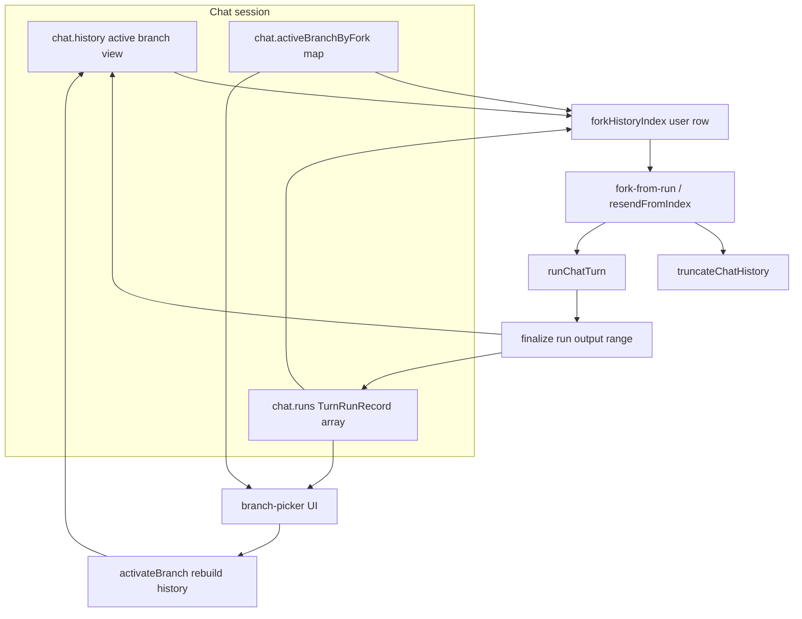

# Feature 01 — Trace and replay infrastructure

**Status:** Partial  
**Roadmap:** [feature-audit-roadmap.md](../feature-audit-roadmap.md) item **#1**  
**Size:** L (foundational; unblocks headless #18 and determinism #19 patterns)

## Overview

Minnow already buffers in-flight LLM streams on the server ([`server/generations/`](../../../server/generations/)) and lets users **regenerate**, **remake**, and **edit** messages via history truncation ([`src/chat/resend-from-index.ts`](../../../src/chat/resend-from-index.ts), [`src/ui/message-actions.ts`](../../../src/ui/message-actions.ts)). Those flows are **destructive**: truncating `chat.history` drops alternate outcomes, and there is no persisted record of *what* was sent (composed system stack, tool policy, model/provider, sampler) at a given user turn.

This feature adds a **`runs` layer parallel to `chat.history`**: each **fork point** (user `historyIndex`) can have multiple **turn runs** (branches). Users can **replay** with the same snapshot, **fork** with a different model/provider at that point, and **switch branches** from a per-message picker without losing sibling outcomes. Implementation reuses `truncateChatHistory` + `runChatTurn` rather than a separate inference path.

**Out of scope (v1):** Server-persisted run archive across restarts (generations remain transport-only); full transcript diff UI; automatic merge of branches; `MINNOW_RECORD` test harness (#19); headless CLI (#18) — design hooks only.

---

## Current state (file pointers)

| Area | What exists | Key files |
|------|-------------|-----------|
| Stream transport | In-memory generation buffer; `persist: true` for main chat; reload via `currentGenerationId` | [`server/generations/store.js`](../../../server/generations/store.js), [`routes.js`](../../../server/generations/routes.js), [`src/api/generations.ts`](../../../src/api/generations.ts) |
| Boot resume | Re-subscribe SSE; no re-prompt | [`src/chat/generation-resume.ts`](../../../src/chat/generation-resume.ts) |
| History replay | Truncate at user index (atomic assistant+tool chains), `runChatTurn({ pushUser: false })` | [`src/chat/resend-from-index.ts`](../../../src/chat/resend-from-index.ts), [`src/chat/history-truncate.ts`](../../../src/chat/history-truncate.ts), [`src/chat/history-truncate-core.ts`](../../../src/chat/history-truncate-core.ts) |
| Message UX | Copy, Edit, Regenerate, Remake, Delete | [`src/ui/message-actions.ts`](../../../src/ui/message-actions.ts) |
| Turn execution | Composed system prompt, tool loop, `parentTurnId` for sub-agents (not user-facing branches) | [`src/tools/loop.ts`](../../../src/tools/loop.ts), [`src/chat/prompts/compose-context.ts`](../../../src/chat/prompts/compose-context.ts) |
| Session persistence | `SESSION_SCHEMA_VERSION = 2`; `~/.minnow/sessions/state.json` | [`src/types.ts`](../../../src/types.ts), [`src/state/sessions.ts`](../../../src/state/sessions.ts), [`server/config/validators.js`](../../../server/config/validators.js) |
| Sub-agent transcripts | Per-chat `subAgentRuns[]` keyed by `parentTurnId` | [`src/types.ts`](../../../src/types.ts) (`PersistedSubAgentRun`) |

**Important distinction:** `server/generations/*` stores **raw upstream SSE bytes** for reconnect. **Turn runs** store **semantic replay inputs** (messages prefix, prompt stack, tool allowlist, bindings) and **pointers** into `chat.history` for committed outputs. A replay may create a *new* `generationId`; the run record is the source of truth for *intent*, not the byte buffer.

---

## Gap analysis

| Capability | Today | Needed |
|------------|-------|--------|
| Forkable run record | Only linear `history`; `parentTurnId` is ephemeral per turn for sub-agents | Immutable `TurnSnapshot` at fork + `TurnRunRecord` per execution |
| System stack capture | Recomputed on each `runChatTurn` | Persist `composedSystemPrompt`, `userRulesContent`, prompt profile fingerprint, mode/work-agent/expert ids |
| Tools used | Implicit from current mode + work agent | Persist ordered `enabledToolNames[]` and `maxToolTurns` cap at fork time |
| Model/provider at fork | UI globals + chat fields at send time | Snapshot `providerId`, `modelId`, `temperature`, `maxTokens`; optional overrides on fork |
| Non-destructive branches | Truncate drops alternate replies | Multiple runs per `forkHistoryIndex`; `activeBranchId` selects visible history |
| Branch picker | None | UI on user bubbles when `runsAtFork > 1` |
| Model swap at fork | User must change global model picker manually | **Fork with different model…** passes overrides into `fork-from-run` |

---

## Goals and acceptance criteria

### Goals

1. **Trace:** Every main-chat turn started via send, regenerate, remake, or edit-resend creates a **durable run record** with a complete input snapshot.
2. **Replay:** **Replay** at a user message reproduces the same snapshot (default path = current regenerate behavior).
3. **Fork:** **Fork with different model…** truncates from that user message and starts a new branch with overridden `providerId` / `modelId` (and optional sampler fields if present in UI).
4. **Branch switch:** User can switch **active branch** at a fork point; `chat.history` updates to show that branch’s committed messages without re-calling the LLM.
5. **Compatibility:** Reload persistence for in-flight streams (`currentGenerationId`) remains unchanged.

### Acceptance criteria

- [ ] After a normal send, `chat.runs` contains one run with `forkHistoryIndex` matching the user row, `snapshot` populated, and `outputHistoryEnd` pointing at the last assistant/tool row for that turn.
- [ ] **Regenerate from here** creates a **new** run on the same fork index; previous run is `superseded` but retained; branch picker shows ≥2 branches.
- [ ] **Fork with different model…** produces a branch whose snapshot reflects the chosen model/provider; inference uses that binding (verified via stats strip or logged snapshot).
- [ ] Switching branches updates the transcript back/forward without truncation of stored runs.
- [ ] **Remake** on an assistant message forks from the preceding user index (same as today) and records a new run.
- [ ] **Delete message** / truncate marks runs whose outputs extended past the cut as `superseded` or `orphaned` (no crash; picker hides invalid branches).
- [ ] Streaming guard: fork/replay/branch switch blocked with the same status copy as regenerate today.
- [ ] `npm test` includes new suites; `npx tsc --noEmit` clean.
- [ ] `documentation/context.md` updated when shipped (see todo `context-doc-update`).

---

## Architecture and design

### Conceptual model



### Data model (`runs` layer)

Add to [`src/types.ts`](../../../src/types.ts):

```ts
/** Stable id for one execution from a fork point (branch). */
export type TurnRunId = string;

/** Snapshot of everything needed to replay/fork without re-deriving from UI globals. */
export interface TurnSnapshot {
  /** User row index at fork time (anchor). */
  forkHistoryIndex: number;
  /** Exact stored user content (includes skill tags). */
  userContent: string;
  /** Parsed skill id if any (for runChatTurn). */
  skillId: string | null;
  providerId: string;
  modelId: string;
  temperature: number;
  maxTokens: number;
  modeId: ModeId;
  workAgentId: string | null;
  workAgentAuto: boolean;
  expertSelection?: ExpertSelection;
  uiDesignerMode?: 'plan' | 'implement';
  /** Full composed system string from resolveOutboundSystemMessages. */
  composedSystemPrompt: string;
  userRulesContent?: string;
  /** Ordered tool function names enabled for this turn. */
  enabledToolNames: string[];
  maxToolTurns: number;
  /** SHA-256 of JSON.stringify(apiMessages) for prefix through fork (excludes ephemeral continue). */
  historyPrefixHash: string;
  /** Optional: orchestrate plan path at fork. */
  orchestratePlanPath?: string;
}

export type TurnRunStatus = 'running' | 'completed' | 'stopped' | 'failed' | 'superseded';

export interface TurnRunRecord {
  runId: TurnRunId;
  branchId: string;
  forkHistoryIndex: number;
  parentRunId?: TurnRunId;
  status: TurnRunStatus;
  createdAt: number;
  endedAt?: number;
  snapshot: TurnSnapshot;
  /** Inclusive indices in chat.history produced by this run (assistant/tool rows). */
  outputHistoryStart?: number;
  outputHistoryEnd?: number;
  /** Backend generation ids used during this run (for debugging; not required for replay). */
  generationIds?: string[];
  /** Links to chat.subAgentRuns parentTurnId / runId correlation. */
  parentTurnId?: string;
}

export interface Chat {
  // ...existing fields...
  /** All turn runs for this chat (append-only; prune superseded optionally). */
  runs?: TurnRunRecord[];
  /** forkHistoryIndex (string) -> active branchId for picker. */
  activeBranchByFork?: Record<string, string>;
}
```

**`branchId`:** UUID assigned at fork creation; multiple reruns from the same fork without switching branch can share one `branchId` *or* allocate one branch per run — **v1 choice: one `branchId` per `runId`** (simplest picker: label = `Branch 1`, `Branch 2`, subtitle = model id).

**`activeBranchByFork`:** Keys are `String(forkHistoryIndex)`. Value is `branchId` whose output slice is spliced into `history` when activating.

### History + runs consistency

**Active view:** `chat.history` remains the materialized transcript for the **currently selected** branches along the timeline. Prefix through fork index is shared; suffix is swapped per fork’s `activeBranchByFork`.

**`activateBranch(chatId, forkHistoryIndex, branchId)` algorithm:**

1. Find all runs with matching `forkHistoryIndex`, sorted by `createdAt`.
2. Let `prefix = history.slice(0, forkHistoryIndex + 1)` (includes user row).
3. Let `winner` = run where `branchId` matches and `status` is `completed` | `stopped`.
4. Let `suffix = history.slice(winner.outputHistoryStart, winner.outputHistoryEnd + 1)` (validated).
5. Replace `chat.history = [...prefix, ...suffix]`; update `activeBranchByFork[fork] = branchId`; `scheduleSaveSessions()`; `renderChatFromHistory`.

**Truncate interaction:** `truncateChatHistory` at index `i` marks any run with `outputHistoryStart > i` as `superseded`. Runs at `forkHistoryIndex >= i` may be removed or kept for audit — **v1: keep but hide in picker** when outputs no longer exist (defensive validation in `activateBranch`).

### Fork and replay API

New [`src/chat/fork-from-run.ts`](../../../src/chat/fork-from-run.ts):

```ts
export interface ForkOverrides {
  providerId?: string;
  modelId?: string;
  temperature?: number;
  maxTokens?: number;
}

export async function forkFromUserIndex(
  chatId: string,
  userHistoryIndex: number,
  overrides?: ForkOverrides,
): Promise<void>;
```

**Flow:**

1. Guards: not streaming; valid user row (same as `resendFromIndex`).
2. Resolve prior run at fork (if any) for `parentRunId` linkage.
3. `truncateChatHistory(chatId, userHistoryIndex, 'inclusive')`.
4. Build snapshot from **pre-truncate** chat state if not already captured for this send — on replay, clone snapshot from selected active run and merge `overrides`.
5. `runChatTurn({ pushUser: false, ... })` with optional `replaySnapshot` option (new field on `RunChatTurnOptions`) so loop uses snapshotted sampler + prompt instead of live DOM reads when set.
6. On completion, finalize run record.

[`resendFrom-index.ts`](../../../src/chat/resend-from-index.ts) becomes a thin wrapper: `forkFromUserIndex(chatId, userHistoryIndex)`.

### `runChatTurn` integration

Extend [`RunChatTurnOptions`](../../../src/tools/loop.ts):

- `replaySnapshot?: TurnSnapshot` — when set, skip reading temperature/maxTokens/model from DOM; use snapshot bindings; pass `composedSystemPrompt` / `userRulesContent` into `buildApiMessages`.
- `runId?: TurnRunId` — pre-assigned id for correlation.

At turn start (after `resolveOutboundSystemMessages`):

- If no `replaySnapshot`, call `buildTurnSnapshot(...)`.
- `createRun(chat, snapshot, { parentRunId, overrides })`.

At turn end (existing paths: normal complete, stop, error):

- Set `outputHistoryStart/End`, `status`, `endedAt`, push `generationIds`.

### Branch picker (UI)

New [`src/ui/branch-picker.ts`](../../../src/ui/branch-picker.ts):

- Rendered on **user** message wraps when `countRuns(forkIndex) > 1` OR when any superseded run exists (configurable: show only if >1).
- Shows: `▾ 2 branches` with menu items: `Branch A — qwen3 @ local`, `Branch B — llama3 @ local`.
- Selecting item calls `activateBranch` then re-renders chat.
- Attach next to existing ⋮ actions ([`attachMessageActions`](../../../src/ui/message-actions.ts)).

**Message menu changes:**

| Label | Behavior |
|-------|----------|
| Replay | Same as Regenerate; uses `forkFromUserIndex` without overrides |
| Fork with different model… | Opens compact picker modal; calls fork with overrides |
| Remake | Unchanged UX; implementation routes through `forkFromUserIndex` |

### Relation to `server/generations`

| Layer | Lifetime | Purpose |
|-------|----------|---------|
| Generation | Minutes; in-memory | SSE reconnect / stop |
| Turn run | Session lifetime (`state.json`) | Fork/replay/branch semantics |

Replay always creates a **new** generation; old generation ids remain on the old run for debugging.

### Sequencing with other roadmap items

| Item | Relationship |
|------|----------------|
| #19 Determinism / `MINNOW_RECORD` | Orthogonal; may later ingest `TurnSnapshot` for fixtures |
| #18 Headless | Future: expose `POST /api/chats/:id/fork` using same snapshot schema |
| #9 Sampler presets | When shipped, extend `TurnSnapshot` with sampler block |
| #22 Project-scoped configs | Runs stay per-chat in session blob; project resolver affects snapshot contents |

---

## Key files to create or modify

### Create

| File | Responsibility |
|------|----------------|
| [`src/chat/turn-snapshot.ts`](../../../src/chat/turn-snapshot.ts) | Build snapshot + history hash |
| [`src/chat/fork-from-run.ts`](../../../src/chat/fork-from-run.ts) | Fork/replay orchestration |
| [`src/state/runs-store.ts`](../../../src/state/runs-store.ts) | CRUD + branch listing + activate |
| [`src/ui/branch-picker.ts`](../../../src/ui/branch-picker.ts) | Branch picker DOM |
| [`src/styles/branch-picker.css`](../../../src/styles/branch-picker.css) | Picker styles |
| [`test/chat/runs-store.test.mts`](../../../test/chat/runs-store.test.mts) | Store unit tests |
| [`test/chat/fork-from-run.test.mts`](../../../test/chat/fork-from-run.test.mts) | Fork orchestration tests |
| [`test/chat/turn-snapshot.test.mts`](../../../test/chat/turn-snapshot.test.mts) | Snapshot tests |
| [`test/ui/branch-picker.test.mjs`](../../../test/ui/branch-picker.test.mjs) | UI tests |
| [`documentation/plans/verification/feature-01-trace-replay.md`](../verification/feature-01-trace-replay.md) | Manual QA |

### Modify

| File | Change |
|------|--------|
| [`src/types.ts`](../../../src/types.ts) | Run types, schema version 3 |
| [`src/state/sessions.ts`](../../../src/state/sessions.ts) | Hydrate/persist `runs`, `activeBranchByFork`, migration |
| [`server/config/validators.js`](../../../server/config/validators.js) | Accept v3 chat fields |
| [`src/tools/loop.ts`](../../../src/tools/loop.ts) | `replaySnapshot`, capture/finalize hooks |
| [`src/chat/resend-from-index.ts`](../../../src/chat/resend-from-index.ts) | Delegate to fork-from-run |
| [`src/ui/message-actions.ts`](../../../src/ui/message-actions.ts) | Replay + fork menu items |
| [`src/ui/messages.ts`](../../../src/ui/messages.ts) | Attach branch picker on user rows |
| [`documentation/context.md`](../../context.md) | Ship documentation (todo) |

---

## Implementation phases

### Phase 1 — Schema and snapshot capture (foundation)

1. Land types + `SESSION_SCHEMA_VERSION = 3` with backward-compatible migrate (empty `runs`).
2. Implement `buildTurnSnapshot` and `runs-store` create/finalize.
3. Hook `runChatTurn` to record runs (no UI yet); verify snapshots in unit tests.
4. Confirm existing regenerate still works (behavior unchanged).

### Phase 2 — Fork API and replay snapshot

1. Implement `forkFromUserIndex` + `RunChatTurnOptions.replaySnapshot`.
2. Refactor `resendFromIndex` to use fork helper.
3. When `replaySnapshot` set, loop uses snapshotted model/provider/prompt/tools (not DOM).
4. Finalize runs on stop/error paths ([`stop-generation.ts`](../../../src/chat/stop-generation.ts) integration).

### Phase 3 — Branch materialization

1. Implement `activateBranch` with validation against `outputHistoryStart/End`.
2. Wire `activeBranchByFork` updates on fork completion.
3. Truncate/supersede rules in `history-truncate` + runs-store.

### Phase 4 — UI

1. Branch picker on user messages.
2. Message actions: Replay + Fork with different model….
3. Styles + a11y (menu keyboard, `aria-expanded`).

### Phase 5 — Docs and verification

1. Verification doc + manual QA.
2. Update `context.md` and roadmap item status.

---

## Dependencies and sequencing

**Hard prerequisites (in-repo):**

- Backend-owned generations (shipped) — replay creates new generations.
- Message actions + history truncate (shipped) — fork truncates atomically.
- `resolveOutboundSystemMessages` (shipped) — snapshot source.

**Soft / parallel:**

- Model picker ([`src/api/models.ts`](../../../src/api/models.ts)) for fork modal.
- Sub-agent runs: correlate via `parentTurnId` but no branch picker on sub-agent cards in v1.

**Blocks:** None for MVP. **Enables:** headless runner (#18), eval harness (#21), determinism snapshots (#19).

**Recommended order:** Phase 1 → 2 → 3 → 4 → 5 (strictly sequential; do not ship picker before `activateBranch` is correct).

---

## Test plan

### Automated

| Suite | Covers |
|-------|--------|
| `test/chat/turn-snapshot.test.mts` | Snapshot fields, hash stability, skill tag parsing |
| `test/chat/runs-store.test.mts` | Multiple runs per fork, supersede, active branch map |
| `test/chat/fork-from-run.test.mts` | Overrides applied; truncate+runChatTurn invocation |
| `test/ui/branch-picker.test.mjs` | Menu render, switch branch callback |
| Existing `test/chat/generation-resume.test.mts` | Must still pass (no regression) |
| `npx tsc --noEmit` | Type safety for schema v3 |

### Manual QA ([`verification/feature-01-trace-replay.md`](../verification/feature-01-trace-replay.md))

1. Send user message → assistant reply; inspect `state.json` for `runs[0].snapshot` and output range.
2. Regenerate same user message with a different global model → two branches; picker appears; switch between them — transcript changes, no new LLM call.
3. Fork with different model… → only the new branch uses selected model (check stats / response style).
4. Remake from assistant bubble → new run, same fork index.
5. Delete messages after fork → picker prunes invalid branches; no console errors.
6. Reload mid-stream (`currentGenerationId`) → stream resume still works; run finalizes on complete.
7. Background stream on another chat → fork blocked on active chat with status message.

---

## Risks and edge cases

| Risk | Mitigation |
|------|------------|
| **Snapshot size** — full `composedSystemPrompt` bloats `state.json` | Store once per run; optional future `promptHash` + server-side dedupe; cap run count per chat (e.g. 50, LRU superseded) |
| **History index drift** after edits | Edit flow creates new user content at same index then new run; re-hash `historyPrefixHash` on edit-send |
| **Orchestrate / board mode** | Capture `orchestratePlanPath` + `activeParentTurnId` in snapshot; board-only tool rows follow same output range rules |
| **Attachments on user turn** | Snapshot includes attachment descriptors from pending attachment store at fork; replay must rehydrate attachments or inline per existing `buildApiMessages` VLM rules |
| **UI Designer / work agent overrides** | Persist effective `workAgentId` and UI designer flag in snapshot |
| **Tool approval / ask_question mid-turn** | Run stays `running` until turn completes; stop → `stopped` with partial output range |
| **Server restart** | Generations lost (existing message); run record remains; replay creates new generation — acceptable v1 |
| **Branch activate with missing output range** | Fail safe: hide branch in picker, log dev warning |
| **Concurrent fork** | Guard with `isChatStreaming` (v1 single stream) |
| **Migration** | v2 chats load with `runs: []`; no blocking migration |

---

## Open questions (resolve in implementation PR)

1. **One branch per run vs reuse branchId on regenerate** — default above: one branch per run (clearer picker).
2. **Store full `composedSystemPrompt` vs hash-only** — default: store full string for true offline replay; revisit if session size spikes.
3. **Prune superseded runs** — keep all in v1 for traceability; add optional “Clear branch history” later.

---

## References

- Roadmap gap: [`documentation/plans/feature-audit-roadmap.md`](../feature-audit-roadmap.md) §1
- Architecture: [`documentation/context.md`](../../context.md) — Backend-owned generations, message actions, session persistence
- Plan template: [`documentation/plans/product_backlog_agents_48a41af9.plan.md`](../product_backlog_agents_48a41af9.plan.md) § Per-agent deliverable template
- Prior art (transport only): [`documentation/plans/references/backend-owned-generations.md`](../references/backend-owned-generations.md) (referenced in context; generations ≠ turn runs)
