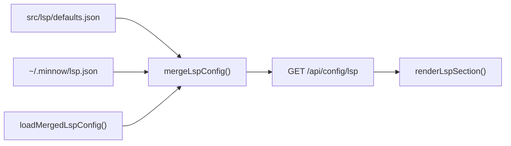

# F1 — LSP full catalog in settings (`feature-02-lsp-full-catalog`)

| Field | Value |
|-------|-------|
| **Backlog** | Epic F — Settings, prompts, tools — **F1** |
| **ID** | `feature-02` |
| **Size** | M |
| **Wave** | 4 (with F2–F6) |
| **Status** | Build plan (not yet implemented) |
| **References** | [OpenCode LSP docs](https://opencode.ai/docs/lsp/#custom-lsp-servers), [`documentation/plans/to-fix.md`](../to-fix.md) (LSP line), [`product_backlog_agents_48a41af9.plan.md`](../product_backlog_agents_48a41af9.plan.md) § F1 |

---

## Problem

Users expect **Settings → Language servers** (`#/settings/lsp`) to list every built-in server Minnow ships, with enough context to enable the right one. The stack is close but has gaps:

1. **Stale `~/.minnow/lsp.json` after upgrades**  
   [`seedLspJson()`](../../../server/lsp/config-loader.js) runs only when `lsp.json` is **missing**. Profiles from older Minnow versions may store partial `lsp` objects (toggles for servers that existed then). Runtime [`mergeLspConfig()`](../../../src/lsp/merge-config.mjs) still overlays [`defaults.json`](../../../src/lsp/defaults.json), so `GET /api/config/lsp` usually returns the full merged catalog — but the **on-disk user file** omits new built-in ids. That breaks backup/export fidelity and any code that reads `lsp.json` without merging.

2. **Requirements not surfaced**  
   `defaults.json` defines `requirements` for many servers (`package`, `binary`, `command`). [`listLspServers()`](../../../server/lsp/manager.js) does not expose them; [`lsp-settings.ts`](../../../src/ui/lsp-settings.ts) shows id, extensions, running/idle, and a generic “no command” warning only.

3. **Command-less built-ins**  
   Some entries ship without `command` (e.g. `eslint`, `razor`, `jdtls`, `elixir-ls`). Enabling them shows a warning but not a **disabled reason** tied to `requirements`.

4. **Doc drift**  
   Backlog says “lists `GET /api/lsp/status`”; implementation uses `GET /api/config/lsp` via [`fetchLspConfig()`](../../../src/lsp/config-client.ts). Align acceptance tests with the config endpoint.

**Catalog baseline:** **39** server ids in `defaults.json` (38 product built-ins + test `fake`). UI hides `fake` → **38 visible built-in rows** plus user custom servers.



**In scope for F1:** persistence migration, API richness, UI clarity. **Not in scope:** changing merge algorithm, install probing, or LSP spawn logic.

---

## Dependencies

| Dependency | Notes |
|------------|-------|
| **Step 17 — LSP integration** (shipped) | `src/lsp/defaults.json`, `server/lsp/*`, `#/settings/lsp`, completion/diagnostics, `GET/PUT /api/config/lsp` |
| **`npm start`** | Settings section requires local server (`detectLocalServer()`); offline hint unchanged |
| **OpenCode catalog alignment** | `defaults.json` shape (`command`, `extensions`, `requirements`, `defaultEnabled`) — do not re-audit catalog in this feature |
| **Blocks** | Nothing in Epic F; independent of F2–F6, workspace, file panel |

**Downstream (optional, same PR):** `list_lsp_servers` tool in [`server.js`](../../../server.js) already `JSON.stringify(await listLspServers())` — new fields appear automatically if `listLspServers()` is extended.

---

## File list

### Server

| File | Change |
|------|--------|
| [`server/lsp/config-loader.js`](../../../server/lsp/config-loader.js) | `migrateLspJsonMissingBuiltins(defaults, userPayload)`; call from `loadMergedLspConfig()` when file exists; write only if keys added; `invalidateLspConfigCache()` after write |
| [`server/lsp/manager.js`](../../../server/lsp/manager.js) | Extend `listLspServers()`: `requirements`, `disabledReason`, `defaultEnabled` |
| [`server/lsp/middleware.js`](../../../server/lsp/middleware.js) | No route changes; ensure cache invalidation after migration |

### Client / shared

| File | Change |
|------|--------|
| [`src/lsp/config-client.ts`](../../../src/lsp/config-client.ts) | Extend `LspServerStatus` |
| [`src/ui/lsp-settings.ts`](../../../src/ui/lsp-settings.ts) | Requirements + `disabledReason` in row meta; optional header count |
| [`src/styles/settings-page.css`](../../../src/styles/settings-page.css) | `.settings-lsp-requirements`, `.settings-lsp-reason` |

### Tests / fixtures

| File | Change |
|------|--------|
| `test/lsp/migrate-lsp-json.test.mjs` | **New** — stale user file → stubs added |
| `test/lsp/lsp-config-api.test.mjs` | **New** — `servers.length` vs defaults count |
| `test/fixtures/lsp-stale-home/lsp.json` | **New** — e.g. only `typescript` (+ optional `fake`) |
| [`test/lsp/merge-config.test.mjs`](../../../test/lsp/merge-config.test.mjs) | Regression only |

### Docs (on ship)

| File | Change |
|------|--------|
| [`documentation/context.md`](../../context.md) | LSP subsection: migration on load, API fields, visible count |

### Out of scope

- Probing `requirements.package` / `binary` on disk
- Changing `defaultEnabled` values in `defaults.json`
- Optional UI grouping (AC10) unless time permits
- [`src/lsp/merge-config.mjs`](../../../src/lsp/merge-config.mjs) logic change (unless shared test helper needed)

---

## Schema / API

### Existing routes (unchanged)

| Method | Path | Role |
|--------|------|------|
| `GET` | `/api/config/lsp` | `{ enabled, lsp, servers }` — settings list source |
| `PUT` | `/api/config/lsp` | Partial patch; `removeLspIds` for custom removal |
| `GET` | `/api/lsp/status` | Lightweight `{ enabled, servers }` poll |

### `GET /api/config/lsp` — extended `servers[]` item

```ts
interface LspServerStatus {
  id: string;
  label: string;
  disabled: boolean;
  running: boolean;
  extensions: string[];
  builtin: boolean;
  hasCommand: boolean;
  // NEW
  requirements?: { package?: string; binary?: string; command?: string };
  disabledReason?: string;
  defaultEnabled?: boolean;
}
```

### `disabledReason` derivation (`listLspServers`)

| Condition | Example text |
|-----------|----------------|
| `disabled === true` | `Disabled in settings` |
| `!hasCommand && !disabled` | `No command configured — add command in ~/.minnow/lsp.json or install tooling` |
| `requirements` present | Append: `Requires: npm package pyright` / `Requires: binary rust-analyzer` / `Requires: command go` |
| `running === true` | Omit or empty (Running badge sufficient) |

Single string field for UI (D7).

### User file: `~/.minnow/lsp.json`

**Missing file (unchanged):** `seedLspJson(defaults)` — one stub per default id with `disabled: true` except `defaultEnabled === true`; includes `fake` for tests.

**Existing file (NEW migration):** For each `id` in `defaults.lsp` where `id !== 'fake'` and `id ∉ user.lsp`:

```json
"new-id": { "disabled": true }
```

(`defaultEnabled: true` → `{ "disabled": false }` — product built-ins: only `typescript`; `fake` is test-only and excluded from migration.)

Do **not** copy `command` / `extensions` into user file (remain in defaults). Never overwrite keys already in `user.lsp`.

### Design decisions

| # | Decision | Choice |
|---|----------|--------|
| D1 | When to migrate | Every `loadMergedLspConfig()` when file exists and builtins missing |
| D2 | Stub shape | Minimal `{ disabled }` per D2 above |
| D3 | Overwrite user keys | Never |
| D4 | `fake` in migration | Exclude from normal home migration; keep UI filter |
| D5 | Install detection | Display-only requirements (no probe) |
| D6 | UI grouping | Optional follow-up (flat list first) |
| D7 | `disabledReason` | Single string for UI (combine disable / no-command / requirements) |
| D8 | Count acceptance | `servers.length === Object.keys(defaults.lsp).length` on API; UI = builtins − 1 + customs |

---

## Acceptance criteria + edge cases

### Acceptance

- [ ] **AC1 — Full catalog in API:** `GET /api/config/lsp` → `servers.length === 39` (matches `defaults.json` key count) for fresh seed and stale fixture after one load.
- [ ] **AC2 — Full catalog in UI:** **38** built-in rows (all except `fake`) + custom servers; built-ins first, then label sort.
- [ ] **AC3 — Migration persists stubs:** Stale `lsp.json` gains only missing builtin ids; existing keys (e.g. `typescript.disabled`) unchanged.
- [ ] **AC4 — Extensions visible:** Each row shows merged extensions.
- [ ] **AC5 — Requirements visible:** Rows with `requirements` show install hint in meta.
- [ ] **AC6 — Disabled reason:** Disabled rows show reason; enabled without `command` show warning + requirements when present.
- [ ] **AC7 — Toggles:** Enable/disable via `PUT` partial patch; refresh does not drop servers.
- [ ] **AC8 — Custom servers:** Add/remove custom server unchanged; migration does not delete non-builtin ids.
- [ ] **AC9 — Tests:** `npm run test:lsp` green including new migration + API tests.

**Optional:** **AC10** — Collapsible groups (JS/TS, Python, .NET, …) via taxonomy map; non-blocking.

### Edge cases

| Scenario | Expected behavior |
|----------|-------------------|
| Empty `user.lsp` object | Migration adds all builtin stubs (except `fake` policy) |
| User custom id not in defaults | Untouched; appears in list with `builtin: false`, Remove button |
| `PUT` concurrent with load migration | Shallow merge on PUT; migration only adds keys — acceptable for single-user desktop |
| Second `loadMergedLspConfig()` | Idempotent — no write if no missing keys |
| `enabled: false` master switch | Master checkbox still works; per-server rows remain listed |
| Server without `command` enabled | `hasCommand: false`, `disabledReason` explains; LSP manager may fail spawn — existing behavior |
| `npm run dev` only | Offline hint; no migration (no server) |
| `MINNOW_HOME` test fixture | Use `resetMinnowHomeCache()` + `invalidateLspConfigCache()` between cases |
| Upgraded Minnow + old `lsp.json` with `fake` only | After load, file has all builtin stubs; UI still hides `fake` |
| `removeLspIds` custom server | Does not re-add from defaults |

---

## Build todos

- [ ] **T1** — Implement `migrateLspJsonMissingBuiltins()` in `config-loader.js` (D1–D4).
- [ ] **T2** — Wire migration in `loadMergedLspConfig()`; write file + `invalidateLspConfigCache()` when mutated.
- [ ] **T3** — Extend `listLspServers()` with `requirements`, `disabledReason`, `defaultEnabled`.
- [ ] **T4** — Update `LspServerStatus` in `config-client.ts`.
- [ ] **T5** — Update `createLspServerRow()` in `lsp-settings.ts` for requirements + reason.
- [ ] **T6** — CSS for new meta lines in `settings-page.css`.
- [ ] **T7** — Add `test/fixtures/lsp-stale-home/lsp.json` + `test/lsp/migrate-lsp-json.test.mjs`.
- [ ] **T8** — Add `test/lsp/lsp-config-api.test.mjs` for server count.
- [ ] **T9** — Run `npm run test:lsp`; fix regressions.
- [ ] **T10** — Update `documentation/context.md` LSP subsection.
- [ ] **T11 (optional)** — Grouped list UI (AC10).

---

## Test plan

### Automated

```bash
npm run test:lsp
```

| Test file | Assert |
|-----------|--------|
| `migrate-lsp-json.test.mjs` | Stale fixture (2 ids) → after `loadMergedLspConfig`, disk contains stubs for all builtins except `fake`; existing `typescript` toggle unchanged |
| `migrate-lsp-json.test.mjs` | Second load → no extra write |
| `lsp-config-api.test.mjs` | HTTP `GET /api/config/lsp` → `servers.length === 39` with `MINNOW_HOME` fixture |
| `merge-config.test.mjs` | User `disabled` still wins over defaults |
| `completion-api.test.mjs`, `fake-lsp.integration.test.mjs` | No regression |

**Harness:** Point `MINNOW_HOME` at fixtures; call home cache reset + `invalidateLspConfigCache()` between cases (pattern from [`test/lsp/completion-api.test.mjs`](../../../test/lsp/completion-api.test.mjs)).

### Manual

1. `npm start` → open app → `#/settings/lsp`.
2. **Fresh:** Delete `~/.minnow/lsp.json`, restart server → **38** visible built-ins (no `fake`); disk file lists all builtin stubs.
3. **Stale:** Set `lsp.json` to `{ "enabled": true, "lsp": { "typescript": { "disabled": false } } }`, restart → UI still **38** rows; disk file now has all missing stubs.
4. Toggle `pyright` off/on → reload → state persists.
5. Enable `eslint` (no command) → requirements / no-command message visible.
6. Add custom `myls` → Remove works; built-in count still **38**.
7. Stop server → offline hint; add panel hidden.

---

## Verifier handoff

Create [`documentation/plans/verification/feature-02.md`](../verification/feature-02.md) on ship:

- **Automated:** `npm run test:lsp` (including `migrate-lsp-json.test.mjs`, `lsp-config-api.test.mjs`)
- **Manual:** M1–M7 in verification doc
- **Sign-off:** PASS only if AC1–AC9 and manual checks pass; optional AC10 documented if deferred

---

## Risks

| Risk | Mitigation |
|------|------------|
| Rewriting `lsp.json` every request | Write only when ≥1 key added |
| Large list UX | Optional AC10 grouping; search deferred |
| `fake` in user home | Exclude from migration; UI filter |

---

## Open questions

1. Include `requirements` / `disabledReason` in `list_lsp_servers` tool output? **Recommend yes** (same JSON as API).
2. Migration add `fake` for parity with `seedLspJson`? **Recommend no** for normal homes.
3. Group taxonomy — defer unless implementing AC10.

---

*Plan only — no implementation in this document.*
