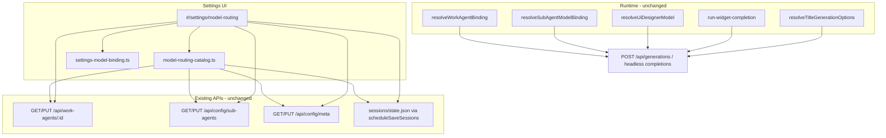

# Feature 02 — Per-agent model routing (formalize)

**Roadmap:** [feature-audit-roadmap.md §2](../feature-audit-roadmap.md#2-per-agent-model-routing--built-formalize)  
**Status:** **Built (formalize)** — routing logic and persistence already exist; gap is a **single Settings surface**.  
**Scope lock:** New `#/settings/model-routing` consolidating **existing APIs only** — **no** new JSON schema fields, **no** changes to `resolveWorkAgentBinding`, sub-agent runner, or generation payloads.

---

## Current state

Per-role model routing is **implemented end-to-end** for inference; users configure it in **four disconnected Settings areas** (plus two `config.json` blocks that today lack a dedicated UI).

| Role | Persistence | Resolution / runtime | Settings UI today |
|------|-------------|----------------------|-------------------|
| **Work agents** (builder, planner, ui-designer, …) | Built-in frontmatter in `src/chat/prompts/work-agents/<id>/agent.{full,lite}.md`; overrides in `~/.minnow/work-agents.json` | [`resolveWorkAgentBinding`](../src/agents/resolve-work-agent-binding.ts) — override → agent meta → chat → active provider | `#/settings/work-agents` — expand row → provider/model in [`mountWorkAgentEditor`](../src/ui/settings-entity-editor.ts); `PUT /api/work-agents/:id` |
| **Sub-agent types** (generalPurpose, explore, shell, reef-widget, …) | Shipped [`src/agents/defaults/sub-agents.json`](../src/agents/defaults/sub-agents.json); user `~/.minnow/sub-agents.json` | [`resolveSubAgentModelBinding`](../src/agents/orchestrator.ts) — type `providerId`/`modelId` → parent chat | `#/settings/sub-agents` — per-type expand → same binding controls; `PUT /api/config/sub-agents` |
| **UI Designer** (`/ui-designer` skill + pinned work agent) | `config.json` → `uiDesigner.{providerId, modelId, fallbackToChatModel}` | [`resolveUiDesignerModel`](../src/agents/ui-designer/model-resolution.ts) — dedicated pair → chat fallback → error; [`resolveUiDesignerBinding`](../src/agents/ui-designer/config.ts) in [`loop.ts`](../src/tools/loop.ts) | **No dedicated section** — users edit `~/.minnow/config.json` manually or rely on chat default; work-agent row exists but **does not** write `uiDesigner` block |
| **Reef widget LLM** (`callLLM` in iframe) | **Per chat** — `chat.reefWidgetProviderId`, `chat.reefWidgetModelId` in `sessions/state.json` | [`run-widget-completion.ts`](../src/chat/reef/run-widget-completion.ts) — reef fields → chat default | `#/settings/modes` → expand **Reef** → [`mountReefWidgetLlmSettings`](../src/ui/reef-widget-settings.ts) |
| **Chat title jobs** (first-message rename) | `config.json` → `titles.{enabled, providerId, modelId, maxTokens, temperature}` | [`schedule.ts`](../src/chat/titles/schedule.ts) `resolveTitleGenerationOptions` — config → scheduled send context → chat | **No dedicated section** — [`loadTitlesConfig`](../src/config/titles-meta.ts) only; no `saveTitlesConfig` yet |

**Registry reference:** [`work-agent-registry.ts`](../src/agents/work-agent-registry.ts) merges built-ins from glob + `setUserWorkAgentOverrides`; default ids include `ui-designer` ([`registry.json`](../src/chat/prompts/work-agents/registry.json)).

**Main chat default** (top-bar model picker) is not a separate “agent” but is the **fallback** for empty bindings across work agents, sub-agents, Reef, and titles when configured to use chat default.

---

## Gap

- **Discoverability:** Operators cannot answer “which model runs X?” without opening four Settings sections and `config.json`.
- **Incomplete UI:** `uiDesigner` and `titles` bindings are documented in README/context but **not editable in Settings** (unlike work agents and sub-agents).
- **Duplication:** Provider/model `<select>` logic is copy-pasted in `settings-entity-editor.ts` and `reef-widget-settings.ts`.
- **Reef confusion:** Widget LLM is under **Modes → Reef** while other bindings live elsewhere; it is **per active chat**, not global.

**Out of scope for this feature:** Per-agent sampler presets (#9), project-scoped overrides (#22), capability matrix (#11), new routing dimensions, or moving prompt editors into the consolidated page.

---

## Goals

1. **Single pane of glass** — `#/settings/model-routing` lists every non-main-chat routing target with effective provider + model (and “uses chat default” when empty).
2. **Inline edit** — Change bindings from the consolidated section using **existing** save paths (`PUT /api/work-agents/:id`, `PUT /api/config/sub-agents`, `PUT /api/config/meta`, session save for Reef).
3. **First-class meta editors** — Add minimal UI + `saveTitlesConfig` / `saveUiDesignerConfig` so `titles` and `uiDesigner` are no longer manual JSON edits.
4. **Preserve behavior** — Empty `modelId` / null continues to mean chat default; no migration of `work-agents.json` or `sub-agents.json`.
5. **Keep deep editors** — Work agent / sub-agent / mode prompt editors remain; consolidated view links out for Full/Lite prompts and tool allowlists.

---

## Acceptance criteria

- [ ] Nav item **Model routing** opens `#/settings/model-routing` and renders without `npm start` (read-only/offline banner); with server up, all rows load.
- [ ] **Work agents** table shows every agent from `GET /api/work-agents` with label, effective provider/model, disabled flag; saving updates `work-agents.json` and list refreshes.
- [ ] **Sub-agent types** table shows each type from `GET /api/config/sub-agents` with effective binding; saving updates `sub-agents.json` types map.
- [ ] **UI Designer** row edits `config.json` `uiDesigner` (provider, model, fallback-to-chat toggle) via `PUT /api/config/meta`; `/ui-designer` turns still resolve per [`model-resolution.ts`](../src/agents/ui-designer/model-resolution.ts).
- [ ] **Chat titles** row edits `titles.providerId` / `titles.modelId` (and optional enabled toggle) via meta PUT; title job still uses [`resolveTitleGenerationOptions`](../src/chat/titles/schedule.ts) precedence.
- [ ] **Reef widget LLM** row shows **active chat** name; provider/model persist to that chat’s `reefWidget*` fields; changing sidebar chat updates displayed values when section is open.
- [ ] Each row has a **deep link** to the legacy section for prompt/advanced settings.
- [ ] `npm test` includes new catalog + UI smoke tests; `npx tsc --noEmit` clean.
- [ ] `documentation/context.md` documents the new section and links this plan.

---

## Architecture

**Data flow (read):**

1. `loadModelRoutingCatalog()` parallel-fetches work agents, sub-agent config, config meta (`uiDesigner`, `titles`), and reads `getActiveChat()` for Reef overrides.
2. For display, apply the **same fallback rules** as runtime (documented per row “effective” column — e.g. sub-agent empty model → parent chat model label).
3. Optional: show built-in vs override badge for work agents (`source` from merged definition).

**Data flow (write):**

| Row group | Save handler |
|-----------|----------------|
| Work agent | `patchWorkAgentOverride(id, { providerId, modelId })` |
| Sub-agent type | `saveSubAgentConfigToServer({ types: { [id]: { providerId, modelId } } })` |
| UI Designer | `saveUiDesignerConfig({ providerId, modelId, fallbackToChatModel })` |
| Titles | `saveTitlesConfig({ providerId, modelId, enabled })` |
| Reef widget | Copy `persistFromUi` from reef-widget-settings — touch active chat + `scheduleSaveSessions()` |

---

## Key files

| Area | Files |
|------|--------|
| **Catalog (new)** | `src/settings/model-routing-catalog.ts` |
| **Shared binding UI (new)** | `src/ui/settings-model-binding.ts` |
| **Section renderer (new)** | `src/ui/settings-model-routing.ts` |
| **Meta save helpers** | `src/config/titles-meta.ts`, `src/agents/ui-designer/config.ts` |
| **Settings shell** | `src/ui/settings-page.ts`, `src/ui/settings-sections.ts`, `index.html` |
| **Reuse / link** | `src/ui/settings-entity-editor.ts`, `src/ui/reef-widget-settings.ts`, `src/agents/work-agent-prompt-api.ts`, `src/agents/sub-agent-config.ts` |
| **Runtime (read-only)** | `src/agents/resolve-work-agent-binding.ts`, `src/agents/orchestrator.ts`, `src/agents/ui-designer/model-resolution.ts`, `src/chat/titles/schedule.ts`, `src/chat/reef/run-widget-completion.ts` |
| **Server (unchanged)** | `server/work-agents/routes.js`, `server/config/middleware.js`, `server/config/validators.js` |
| **Tests** | `test/settings/model-routing-catalog.test.mts`, `test/ui/settings-model-routing.test.mjs` |
| **Docs** | `documentation/plans/verification/feature-02-model-routing.md`, `documentation/context.md` |

---

## Implementation phases

### Phase 1 — Catalog and shared UI (no new nav yet)

1. Implement `ModelRoutingRow` type: `{ id, group, label, description?, providerId, modelId, usesChatDefault, disabled?, persistKind, editTarget? }`.
2. Implement `loadModelRoutingCatalog()` with parallel API calls; handle offline → empty catalog + flag.
3. Extract `fillModelSelect` / provider select builder to `settings-model-binding.ts`; refactor `settings-entity-editor.ts` and `reef-widget-settings.ts` to import (behavior-neutral refactor).
4. Add `saveTitlesConfig` and `saveUiDesignerConfig` with tests against fixture `MINNOW_HOME`.

**Exit:** Unit tests prove catalog matches resolution helpers for fixture configs.

### Phase 2 — Settings section

1. Add `model-routing` to `SettingsSectionId`, nav (suggest: after **Providers**), and `index.html` `<section id="settingsSection-model-routing">`.
2. `renderModelRoutingSection()` in `settings-model-routing.ts`:
   - Intro hint: main chat model is top-bar picker; this page is **per-role overrides**.
   - Subsections: **Work agents**, **Sub-agents**, **Background** (UI Designer + Titles), **Reef (active chat)**.
   - Each row: provider select, model select, Save, link “Advanced…”
3. Wire `refreshSettingsSection('model-routing')` in `settings-sections.ts`.
4. On `renderSidebar` / chat switch, if model-routing panel active, refresh Reef group (`syncReefWidgetSettingsFromActiveChat` pattern).

**Exit:** Manual save round-trip for each group with `npm start`.

### Phase 3 — Polish and legacy coexistence

1. Deep links: `location.hash = '#/settings/work-agents'` etc.; optional `?agent=builder` hash param deferred unless needed.
2. Status toasts via existing `setStatus`.
3. Consider one-line hint under Work agents / Sub-agents section headers pointing to **Model routing** (non-breaking).
4. **Do not** remove model rows from entity editors in this feature (avoids regressions for users who live in prompt expandables).

**Exit:** Verification doc signed off.

### Phase 4 — Documentation

1. Add `documentation/plans/verification/feature-02-model-routing.md`.
2. Update `documentation/context.md` Settings section and product backlog pointer.

---

## Dependencies

| Dependency | Reason |
|------------|--------|
| **Step 03 Providers** | Model lists require `listProviders` + `fetchModelsForProvider` |
| **Step 08 Work agents** | `GET/PUT /api/work-agents` |
| **Step 09 Sub-agents** | `GET/PUT /api/config/sub-agents` |
| **Step 15 UI Designer** | `uiDesigner` meta block + loop binding |
| **Reef mode** | Per-chat `reefWidget*` fields |
| **Step 07 Titles** | `titles` meta block |
| **`npm start`** | All saves except local Reef draft require config server |

**Blocks nothing critical** — pure UX. Enables future #9 (sampler per agent) and #15 (activity panel) to reference the same catalog.

**Suggested sequence:** Ship before #22 project-scoped configs (resolver would later overlay workspace `.minnow/` on catalog reads).

---

## Test plan

### Automated

| Suite | Covers |
|-------|--------|
| `test/settings/model-routing-catalog.test.mts` | Fixture home: work agent override, sub-agent empty model + chat parent, uiDesigner dedicated vs fallback, titles config precedence |
| `test/ui/settings-model-routing.test.mjs` | Section mount point exists; nav `data-settings-nav="model-routing"`; hash parser accepts `model-routing` |
| Existing | `test/work-agents/**`, `test/ui-designer/config.test.mts`, `test/titles/**` — run full `npm test` for regressions |

### Manual (`documentation/plans/verification/feature-02-model-routing.md`)

1. `npm start` → Settings → **Model routing** — all groups populated.
2. Set **builder** to provider A / model X → send as builder work agent → network/generation uses X (status pill / generation payload).
3. Set **explore** sub-agent to empty model → spawn explore → uses **active chat** model.
4. Set **uiDesigner** to dedicated vision model → `/ui-designer plan` with screenshot path uses that model.
5. Set **titles** to small/fast model → new chat first message → sidebar title updates without using main chat model (when chat model differs).
6. Set **Reef** widget model on chat A, switch to chat B → routing page shows B’s values.
7. Offline (`npm run dev` only) → banner; no false “saved” toasts.

---

## Risks

| Risk | Mitigation |
|------|------------|
| **Dual UI Designer binding** (work-agents.json vs `uiDesigner` meta) confuses users | Consolidated row labels **“UI Designer (skill/runtime)”** for meta; footnote that work-agent row is for non-skill work-agent mode only; link to Step 15 docs |
| **Reef per-chat** edited from “global” page | Always show active chat name; disable Reef saves if no chats |
| **Drift** between catalog display and runtime | Unit-test catalog against pure resolution functions; do not reimplement fallback in UI-only ad hoc way |
| **Large agent lists** | Reuse compact table; no expand-all prompts on this page |
| **Refactor regressions** in entity editor | Phase 1 extract-only with existing tests green before Phase 2 |

---

## Fallback reference (for catalog “effective” column)

**Work agent** ([`resolve-work-agent-binding.ts`](../src/agents/resolve-work-agent-binding.ts)):

`userOverride` → `agent.providerId/modelId` → `chat` → global active provider.

**Sub-agent** ([`orchestrator.ts`](../src/agents/orchestrator.ts)):

`type.modelId` (if set) → parent chat `modelId`; `type.providerId` (if set) → parent chat `providerId`.

**UI Designer** ([`model-resolution.ts`](../src/agents/ui-designer/model-resolution.ts)):

Both `uiDesigner.providerId` and `modelId` set → use them; else if `fallbackToChatModel` → chat; else error.

**Reef widget** ([`run-widget-completion.ts`](../src/chat/reef/run-widget-completion.ts)):

`reefWidgetModelId` → `chat.modelId`.

**Titles** ([`schedule.ts`](../src/chat/titles/schedule.ts)):

`config.titles.modelId` → scheduled send context → `chat.modelId`.

---

## Related plans

- Roadmap quick win #2: [feature-audit-roadmap.md](../feature-audit-roadmap.md)
- Future: #9 sampler presets (extends same rows), #15 agent activity panel (reads live bindings), #22 project-scoped resolver (catalog loader gains workspace overlay)
