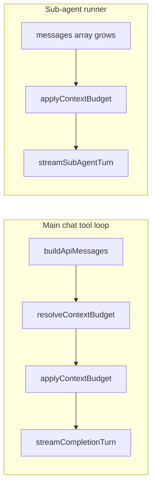

# Feature 03 — Context budgets per agent

**Roadmap:** [feature-audit-roadmap.md](../feature-audit-roadmap.md) item **#3**  
**Status:** Partial → target **Built** (enforcement + config)  
**Primary deliverable:** `src/chat/context-budget.ts` + hooks in `buildApiMessages` send path and `sub-agent-runner.ts`

---

## Current state

| Area | What exists today | Location |
|------|-------------------|----------|
| **Measurement (UI)** | In-chat context **fill ring** and breakdown popover (system, rules, tools, history, composer, attachments). Uses chars÷4 estimates; optional last-turn `prompt_tokens` from provider. | [`src/chat/context-usage.ts`](../../../src/chat/context-usage.ts), [`src/ui/context-usage-ring.ts`](../../../src/ui/context-usage-ring.ts) |
| **Token heuristics** | Shared `estimateTokensFromText`, history/tools serialization for estimates | [`src/chat/prompts/token-estimate-core.ts`](../../../src/chat/prompts/token-estimate-core.ts) |
| **Outbound estimate** | Mirrors send stack for settings header + ring (`resolveOutboundPromptEstimate`) | [`src/chat/prompts/token-estimate.ts`](../../../src/chat/prompts/token-estimate.ts) |
| **Message assembly** | `buildApiMessages(chat, sysPrompt, options)` serializes history, tool rows, VLM multimodal last user turn, ephemeral continue line | [`src/tools/loop.ts`](../../../src/tools/loop.ts) ~305–367 |
| **Main send loop** | Each tool round: `buildApiMessages` → `streamCompletionTurn` | [`src/tools/loop.ts`](../../../src/tools/loop.ts) ~771 |
| **Work agents** | Per-agent `providerId` / `modelId` / `allowedTools`; overrides in `~/.minnow/work-agents.json` | [`src/agents/work-agent-types.ts`](../../../src/agents/work-agent-types.ts) |
| **Sub-agents** | Per-type `maxToolTurns`, `timeoutMs`, `maxConcurrent`; no input token cap | [`src/agents/types.ts`](../../../src/agents/types.ts), [`src/agents/defaults/sub-agents.json`](../../../src/agents/defaults/sub-agents.json) |
| **Sub-agent runner** | Isolated `messages[]` starting `[system, user task]`; grows with assistant/tool rounds | [`src/agents/sub-agent-runner.ts`](../../../src/agents/sub-agent-runner.ts) |

**Important distinction:** `context-usage.ts` is **observability only** (MIN-13). It does not trim or rewrite outbound messages. Feature 03 adds **declared limits** and **enforcement** in a separate module so the ring can later reflect agent caps without coupling UI to send logic.

---

## Gap

From the audit:

> Declared `maxInputTokens` per agent plus an enforcement policy (`summarize` / `slide` / `truncate`).

| Missing | Notes |
|---------|--------|
| `maxInputTokens` on work agents and sub-agent types | Not in `WorkAgentDefinition` / `SubAgentTypeConfig` or JSON schemas |
| `contextEnforcementPolicy` (or equivalent) | No policy selection in settings or defaults |
| Pre-send enforcement | `buildApiMessages` returns full history regardless of size |
| Sub-agent enforcement | Runner posts ever-growing `messages` until `maxToolTurns` stops the run |
| User-visible “budget applied” signal | Ring may show over-limit **estimate** but send still proceeds |

**Out of scope for v1 (defer or minimal stub):**

- Feature **#7** structured sub-agent summaries (`summarySchema`) — shares `maxInputTokens` field; enforcement can land first, summary contract later.
- Feature **#11** provider capability matrix — agent cap still uses existing `resolveContextLimit` / model row for ceiling.
- Feature **#22** project-scoped `.minnow/` overrides — configs stay global under `~/.minnow/` until resolver exists.
- Accurate tokenizer — keep chars÷4 heuristic aligned with MIN-13 / Feature 25.

---

## Goals

1. **Declare** an optional per-agent **input token budget** (`maxInputTokens`) and **enforcement policy** for main chat (active work agent) and each sub-agent type.
2. **Resolve** effective limit: `min(modelContextLimit, agentMaxInputTokens)` when both are known; agent-only cap when model limit unknown.
3. **Enforce** immediately before each provider `messages` payload is sent (main tool loop + sub-agent loop).
4. **Preserve** OpenAI message invariants: never orphan `tool` messages; keep leading `system` message(s) unless policy explicitly compacts them (v1: **never drop system**).
5. **Surface** config in Settings (work agents + sub-agents) with server validation and shipped defaults.
6. **Test** policy behavior deterministically in Node (`tsx` / `node --test`) without LLM calls for `truncate` / `slide`; mock summarizer for `summarize` tests.

---

## Acceptance criteria

### Configuration

- [ ] `WorkAgentDefinition` + `WorkAgentUserOverride` accept optional `maxInputTokens` (positive integer or `null` = no agent-specific cap) and `contextEnforcementPolicy` (`summarize` \| `slide` \| `truncate`).
- [ ] `SubAgentTypeConfig` + `SubAgentsFile` accept the same fields; defaults file sets sensible per-type defaults (e.g. `explore`: higher cap + `slide`; `shell`: lower cap + `truncate`).
- [ ] `PUT /api/work-agents/:id` and `PUT /api/config/sub-agents` persist and validate new fields (`server/config/validators.js`).
- [ ] Settings UI (`#/settings/work-agents`, `#/settings/sub-agents`) shows numeric **Max input tokens** and policy **select** per row; saves on change like existing KV controls.

### Enforcement (main chat)

- [ ] After `buildApiMessages(...)` in `runChatTurn`, `applyContextBudget()` runs when resolved effective limit is finite and estimated tokens exceed limit.
- [ ] Active work agent config drives budget; when no work agent / default agent with null cap, behavior matches today (enforce only against model limit if we add global cap later — **v1: no enforcement without agent cap or over model limit**).
- [ ] Tool loop rounds that add history see enforcement on **every** round (history grew).
- [ ] User receives a non-blocking status or footnote when enforcement ran (e.g. “Context trimmed (slide): dropped 4 older turns”).

### Enforcement (sub-agents)

- [ ] `defaultSubAgentRunner` applies the same helper to `messages` before each `streamSubAgentTurn` / fallback, using merged type config.
- [ ] Terminal run still respects `maxToolTurns`; budget does not replace turn cap.

### Policies (behavioral)

- [ ] **`truncate`:** Remove oldest **history** messages (after system block) until estimate ≤ limit; if a single message exceeds limit, hard-truncate its string content with a suffix marker `[… truncated for context budget]`.
- [ ] **`slide`:** Drop oldest complete **turns** (user + following assistant/tool sequence) until ≤ limit, keeping at least **1** recent user-visible turn pair (configurable `minRecentTurns`, default 1).
- [ ] **`summarize`:** Replace dropped prefix with one synthetic `system` or `user` “context summary” message (fixed template + concatenation of dropped text, capped by `summaryReserveTokens`); v1 may use **deterministic extractive** summary (head+tail chars) without extra LLM; optional flag `summarizeViaLlm: false` default.

### Quality

- [ ] `npm test` includes new `test/chat/context-budget.test.mts` (all policies, tool-pair safety, limit resolution).
- [ ] `npx tsc --noEmit` clean.
- [ ] `documentation/context.md` updated with enforcement module and config keys.

---

## Architecture

### Module layout: `src/chat/context-budget.ts`

Pure, DOM-free module (safe for Node tests). Suggested exports:

```typescript
/** How to fit outbound messages under a token ceiling. */
export type ContextEnforcementPolicy = 'summarize' | 'slide' | 'truncate';

export interface AgentContextBudgetConfig {
  /** Agent-specific cap; null = only model window applies. */
  maxInputTokens: number | null;
  enforcementPolicy: ContextEnforcementPolicy;
  /** slide: minimum recent turns to retain (default 1). */
  minRecentTurns?: number;
  /** summarize: token budget reserved for injected summary block (default 512). */
  summaryReserveTokens?: number;
}

export interface ResolvedContextBudget {
  /** Model/agent resolved ceiling for this send. */
  effectiveLimit: number | null;
  agentCap: number | null;
  modelLimit: number | null;
  policy: ContextEnforcementPolicy;
}

export interface ApplyContextBudgetResult {
  messages: ApiMessage[];
  applied: boolean;
  policy: ContextEnforcementPolicy;
  tokensBefore: number;
  tokensAfter: number;
  droppedMessageCount: number;
  summaryInjected: boolean;
}

export function estimateApiMessagesTokens(messages: ApiMessage[]): number;
export function resolveContextBudget(params: {
  agentConfig: AgentContextBudgetConfig;
  modelLimit: number | null;
}): ResolvedContextBudget;

export function applyContextBudget(
  messages: ApiMessage[],
  resolved: ResolvedContextBudget,
): ApplyContextBudgetResult;
```

**Token counting:** Reuse `estimateTokensFromText` + a small `serializeApiMessageForEstimate(msg)` mirroring `serializeMessageContentForEstimate` but for `ApiMessage` (including `tool_calls` JSON).

**System messages:** Treat index `0..n-1` consecutive `role: system` as **pinned**; policies only mutate messages after the system block.

**Tool integrity:** When dropping messages, drop from the oldest **user** turn boundary outward; never leave `assistant` with `tool_calls` without following `tool` messages in the retained suffix.

### Enforcement policies (detailed)

| Policy | When to use | Algorithm (v1) |
|--------|-------------|----------------|
| **truncate** | Aggressive, predictable, low cost | Walk from oldest non-system message; remove whole messages until under limit; last resort: truncate longest single `content` string |
| **slide** | Chat-like threads; keep recent tool context | Partition history into **turns** (user → assistant/tool\*); pop oldest turns until ≤ limit; respect `minRecentTurns` |
| **summarize** | Long research / explore agents | Collect text from dropped turns; inject one message: `## Prior context (compressed)\n…` under `summaryReserveTokens`; then apply truncate to injected blob if needed |



### Hook: `buildApiMessages` / `runChatTurn`

**File:** [`src/tools/loop.ts`](../../../src/tools/loop.ts)

1. Resolve active work agent + user override → `AgentContextBudgetConfig`.
2. `modelLimit = resolveContextLimit(sendModelId, chat)` (import from `context-usage.ts` or move shared helper to `context-budget.ts` to avoid circular imports — prefer **extract** `resolveContextLimit` to `lib/context-limit-resolve.ts` or duplicate thin wrapper).
3. `const { messages: raw } = buildApiMessages(...)` then `const { messages } = applyContextBudget(raw, resolveContextBudget(...))`.
4. Pass trimmed `messages` into `ChatCompletionBody`.

**`BuildApiMessagesOptions` extension (optional):** `skipEnforcement?: boolean` for tests and resend-debug paths.

### Hook: `sub-agent-runner.ts`

**File:** [`src/agents/sub-agent-runner.ts`](../../../src/agents/sub-agent-runner.ts)

- Import type config in `run()` input: pass `contextBudget: AgentContextBudgetConfig` from orchestrator (merged sub-agent type).
- Before each `streamSubAgentTurn`, run `applyContextBudget(messages, resolved)` where `modelLimit` comes from sub-agent’s `modelId` if cached, else agent cap only.
- Log trim metadata into run debug log (`~/.minnow/logs/sub-agents/`) when `applied`.

### Relationship to `context-usage.ts`

| Concern | Module |
|---------|--------|
| Ring / breakdown UI | `context-usage.ts` (unchanged behavior) |
| Enforcement | `context-budget.ts` |
| Shared limit resolution | Extract or import `resolveContextLimit`; ring tooltip may show **Agent cap: X · Model: Y · Effective: min** |

Optional follow-up in ring: if `effectiveLimit` from agent < `limit` shown today, display both values in breakdown header.

---

## Key files

| Action | Path |
|--------|------|
| **New** | `src/chat/context-budget.ts` |
| **Edit** | `src/tools/loop.ts` — post-`buildApiMessages` enforcement |
| **Edit** | `src/agents/sub-agent-runner.ts` — per-turn enforcement |
| **Edit** | `src/agents/types.ts` — `SubAgentTypeConfig` fields |
| **Edit** | `src/agents/work-agent-types.ts` — work agent fields |
| **Edit** | `src/agents/defaults/sub-agents.json` — defaults |
| **Edit** | `src/agents/sub-agent-config.ts` — merge + validation |
| **Edit** | `src/agents/orchestrator.ts` — pass budget into runner |
| **Edit** | `server/config/validators.js` — normalize new keys |
| **Edit** | `src/ui/settings-entity-editor.ts` or sub-agents/work-agents settings panels |
| **New** | `test/chat/context-budget.test.mts` |
| **Edit** | `documentation/context.md` |
| **Maybe** | `src/chat/context-usage.ts` — import shared `estimateApiMessagesTokens` for DRY |

---

## Implementation phases

### Phase 1 — Schema and pure enforcement (no UI)

1. Add types + defaults (`null` cap = no agent enforcement; policy default `slide` for chat agents, `truncate` for shell sub-agent).
2. Implement `context-budget.ts` with `truncate` and `slide` fully; `summarize` with extractive v1.
3. Unit tests for turn detection, tool-pair drops, and limit resolution.

### Phase 2 — Main chat hook

1. Wire `applyContextBudget` in `runChatTurn` only (single choke point).
2. Status line / `chat.lastContextTrim` ephemeral field for UI (optional, for ring note).
3. Manual QA: long history + low `maxInputTokens` on Builder agent.

### Phase 3 — Sub-agent hook

1. Plumb config from `getSubAgentConfig()` into runner `run()` input.
2. Enforce before each completion in the loop.
3. Ensure aggregate `summary` still generated after trim.

### Phase 4 — Settings and server persistence

1. Extend work-agent PUT handler and sub-agents config PUT.
2. Settings row controls + validation errors surfaced inline.
3. Update shipped `sub-agents.json` defaults.

### Phase 5 — Observability polish (optional)

1. Breakdown ring: show agent cap when set.
2. Sub-agent drawer badge “context trimmed” when `applied`.

---

## Dependencies

| Dependency | Reason |
|------------|--------|
| [`token-estimate-core.ts`](../../../src/chat/prompts/token-estimate-core.ts) | Consistent token math with MIN-13 / Feature 25 |
| [`context-usage.ts`](../../../src/chat/context-usage.ts) `resolveContextLimit` | Model window ceiling |
| [`buildApiMessages`](../../../src/tools/loop.ts) | Single assembly point for main chat |
| [`sub-agent-runner.ts`](../../../src/agents/sub-agent-runner.ts) | Isolated agent message list |
| Settings Step 20 patterns | KV save for sub-agents; work-agent PUT |

**Soft dependency / sequencing:** Feature **#7** can add `summarySchema` on the same config object later; enforcement should not block on LLM-based summarization.

**Parallel safe with:** Feature **#2** (model routing UI) — orthogonal.

---

## Tests

**New:** `test/chat/context-budget.test.mts`

| Case | Expectation |
|------|-------------|
| `resolveContextBudget` | `effectiveLimit = min(8000, 32000)` when agent=8000 model=32000 |
| `resolveContextBudget` | agent null → `effectiveLimit = modelLimit` only |
| `truncate` | 10 user messages → drops oldest until under cap |
| `truncate` | Does not remove leading `system` |
| `slide` | Removes oldest **turns**, keeps `minRecentTurns` |
| `slide` | Assistant+tool group kept or dropped atomically |
| `summarize` | Injects summary message; total ≤ limit |
| Over-limit single message | String tail truncation marker present |

**Regression:** Existing [`test/chat/context-usage.test.mts`](../../../test/chat/context-usage.test.mts) stays green.

**Manual:**

1. Set Builder `maxInputTokens: 2000`, policy `slide`, long chat → send → verify older turns absent from network payload (devtools generations body or debug log).
2. Spawn `explore` sub-agent with low cap + many `read_file` results → run completes without provider context error.

---

## Risks and mitigations

| Risk | Impact | Mitigation |
|------|--------|------------|
| Heuristic tokens ≠ real tokenizer | Under-trim (provider error) or over-trim | Target 90% of limit (`safetyMargin = 0.9`); document in UI; later hook feature #11 |
| Breaking tool_call / tool pairs | Invalid API payload | Turn-aware drop only; unit tests with assistant+tool sequences |
| `summarize` LLM cost/latency | Slow sends | v1 extractive only; gate LLM summarization behind explicit opt-in |
| VLM multimodal `content[]` | Underestimate image tokens | Count `image_url` as fixed 256+ per existing attachment heuristic |
| User confusion vs MIN-13 ring | Ring shows “ok” but send trims | Refresh ring after trim; tooltip “Agent budget enforced on send” |
| Sub-agent parent loses context | Bad aggregate summary | Log dropped count in sub-agent debug log; feature #7 improves parent-facing summary |

---

## Default configuration proposal (v1)

| Agent / type | `maxInputTokens` | `contextEnforcementPolicy` | Rationale |
|--------------|------------------|----------------------------|-----------|
| Work agents (default) | `null` | `slide` | No cap until user sets one |
| `researcher` | `12000` | `summarize` | Long context role |
| `explore` (sub) | `16000` | `slide` | Many reads; keep recent files |
| `shell` (sub) | `8000` | `truncate` | Short output focus |
| `generalPurpose` (sub) | `null` | `slide` | Inherit model only |

Adjust after dogfooding on local 8k–32k models.

---

## Verification checklist

- [ ] `npm test` — new suite green; no regressions in `context-usage.test.mts`
- [ ] `npx tsc --noEmit`
- [ ] Settings save/load round-trip for new fields
- [ ] Main chat send with cap → provider accepts payload (no 400 context length)
- [ ] Sub-agent spawn with cap → completes or fails with clear error (not silent empty)
- [ ] `documentation/context.md` lists `context-budget.ts` and enforcement hook points

---

## References

- Roadmap gap: [`feature-audit-roadmap.md`](../feature-audit-roadmap.md) §3  
- Architecture: [`documentation/context.md`](../../context.md) — MIN-13, `buildApiMessages`, sub-agent runner  
- Message assembly: [`src/tools/loop.ts`](../../../src/tools/loop.ts) `buildApiMessages`, `runChatTurn`  
- Sub-agent types: [`src/agents/types.ts`](../../../src/agents/types.ts)  
- Context measurement: [`src/chat/context-usage.ts`](../../../src/chat/context-usage.ts)
