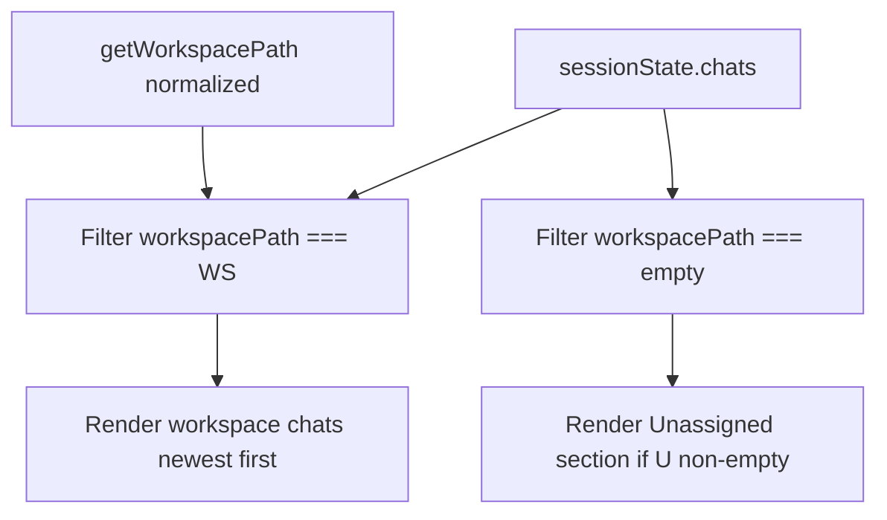

# Feature 03 — Workspace-scoped chats

**Feature ID:** `feature-03-workspace-scoped-chats`  
**Backlog:** [`documentation/plans/product_backlog_agents_48a41af9.plan.md`](../product_backlog_agents_48a41af9.plan.md) — Epic B, **B2**  
**Wave:** 3 (Workspace product shape; pairs with B1 recents)  
**Size:** L  
**Status:** Build plan only (not implemented)  
**Depends on:** B1 optional — [`feature-04-recent-workspaces-menu.md`](feature-04-recent-workspaces-menu.md) recommended first ([Coordination with B1](#coordination-with-b1))

**Source:** [`documentation/plans/product_backlog_agents_48a41af9.plan.md`](../product_backlog_agents_48a41af9.plan.md) § B2, [`documentation/context.md`](../../context.md) (persistence / multi-chat).

---

## Research snapshot (current code)

| Location | Finding |
| -------- | ------- |
| `src/types.ts` | `SESSION_SCHEMA_VERSION = 1`; `Chat` has no `workspacePath`; `SessionState` is `{ version, activeId, sidebarCollapsed, chats }` only |
| `src/constants.ts` | `SESSION_STATE_VERSION = 1` (must align with types) |
| `src/state/sessions.ts` | `parseSessionStateFromJson` rejects `version !== 1` (L214); `getChatsSortedByUpdatedDesc()` returns **all** chats; `createEmptyChatObject` does not set workspace |
| `src/ui/sidebar.ts` | `renderSidebar()` sorts `sessionState.chats` with no filter (L47) |
| `src/ui/workspace-button.ts` | After pick: file tree only — **no** `renderSidebar()` / session scope change |
| `src/state/workspace.ts` | `getWorkspacePath()` — client mirror of server workspace |
| `server/config/validators.js` | `validateSessionState` throws if `version !== 1`; `ensureChatShape` has no `workspacePath` |
| `server/config/store.js` | `readResource('sessions')` / `writeResource('sessions')` — read uses `defaultSessionStateJson()`; write runs `validateSessionState(body)` then persists (no extra migration logic in store) |
| `server/config/middleware.js` | `POST /api/config/migrate` parses localStorage via `validateSessionState` → writes `sessions/state.json` (**no handler change** — migration lives in validators) |
| `server/config/home.js` | `defaultSessionStateJson()` seeds `version: 1` |
| `server/terminal-runner.js` | Inline `{ version: 1, chats: [] }` fallbacks when patching terminal history |

**Persistence contract (unchanged):** single blob at `~/.minnow/sessions/state.json`; client fallback `localStorage` key `minnow-sessions-v1` (key name unchanged — version lives **inside** JSON).

---

## Problem

Today every chat lives in one flat list inside a single `SessionState` blob. The workspace folder drives the file tree and tool roots, but **not** which chats appear in the sidebar — conversations from project A and project B are mixed.

Users expect Cursor/VS Code–style behavior: **one chat list per workspace folder**, with history preserved when returning to a workspace.

---

## Goal

1. Persist **`chat.workspacePath`** — normalized absolute directory at chat creation (or `''` for legacy / unassigned).
2. Sidebar lists **only** chats for the active workspace, plus a dedicated **Unassigned** bucket (see below).
3. **New chat** binds `getWorkspacePath()` at create time.
4. **Workspace switch** updates sidebar and restores a sensible active chat for that workspace.
5. Bump **`SESSION_SCHEMA_VERSION` to `2`** with explicit v1→v2 migration on client parse, server validate, and migrate endpoint.

---

## Unassigned chats decision

**Chosen: visible “Unassigned” group — no silent auto-bind on migration.**

| Option | Verdict |
| ------ | ------- |
| Hide unassigned | **Rejected** — users would think chats were deleted after upgrade. |
| Auto-bind all legacy chats to current workspace on first load | **Rejected** — wrong attachment is destructive for multi-project users. |
| **Global “Unassigned” sidebar section** | **Selected** — transparent, recoverable; user can open, continue, or delete. |

### Rules

- **Migration:** every pre-v2 chat gets `workspacePath: ''` (empty string = unassigned sentinel).
- **Sidebar:** when any chat has `workspacePath === ''`, render a collapsible section **below** the workspace list:
  - Header: `Unassigned` + count badge.
  - Same row UI as normal chats (rename / delete / switch).
  - Section hidden when count is 0.
- **New chats** use normalized `getWorkspacePath()` when non-empty; if workspace unknown (Vite-only), may use `''` and appear under Unassigned until server loads path (re-bind on first load is **out of scope v1**).
- **Optional follow-up:** row action “Move to current workspace” — backlog only if deferred.

---

## Schema v2

### Version bump

Update **both** (prefer single export from `types.ts` imported by `constants.ts`):

- `src/types.ts` — `export const SESSION_SCHEMA_VERSION = 2 as const`
- `src/constants.ts` — `SESSION_STATE_VERSION = 2` or import from types

Do **not** rename `minnow-sessions-v1` localStorage key.

### `Chat` (v2)

```ts
/** Normalized absolute workspace root when chat was created; '' = unassigned (legacy). */
workspacePath: string;
```

Add to client `ensureChatShape` and server `ensureChatShape` in `validators.js`.

### `SessionState` (v2)

```ts
export interface SessionState {
  version: 2; // SessionSchemaVersion
  activeId: string | null;
  sidebarCollapsed: boolean;
  chats: Chat[];
  /** Last selected chat per workspace key (normalized path); '' key = unassigned bucket. */
  lastActiveChatIdByWorkspace?: Record<string, string>;
}
```

Parser initializes `lastActiveChatIdByWorkspace` to `{}` when missing.

### Path normalization

Reuse `normalizePathForComparison` from `src/tools/workspace-path-guard.ts` for store, compare, and map keys. If `sessions.ts` → `workspace-path-guard` is awkward, extract `src/lib/normalize-workspace-path.ts` and share test vectors with server `validators.js` (Windows: case-insensitive drive + slashes).

---

## Migration spec: v1 → v2

### When migration runs

| Path | Trigger |
| ---- | ------- |
| Client load | `parseSessionStateFromJson` in `src/state/sessions.ts` — accept `version` 1 or 2; **always normalize to v2 in memory** |
| Server read/write | `validateSessionState` in `server/config/validators.js` — accept 1 or 2; **return validated `version: 2`** |
| `store.js` | `writeResource('sessions')` already calls `validateSessionState` — persisted file becomes v2 on next PUT |
| localStorage → home | `POST /api/config/migrate` in `middleware.js` — `parse: (str) => validateSessionState(JSON.parse(str))` |
| Terminal patches | `server/terminal-runner.js` — stop defaulting to v1-only shapes; preserve `workspacePath` |

### Algorithm (`migrateSessionStateV1ToV2(parsed)`)

Implement in client (`sessions.ts`) and server (`validators.js` — shared behavior, duplicated or extracted):

1. If `parsed.version === 2` and chats have string `workspacePath` → coerce shapes only.
2. If `parsed.version === 1` (or missing version with v1-shaped blob):
   - Set `version: 2`.
   - For each chat: `workspacePath = typeof chat.workspacePath === 'string' ? normalize(chat.workspacePath) : ''`.
   - Set `lastActiveChatIdByWorkspace: {}` (do **not** infer from global `activeId`).
   - Keep `activeId` if that id still exists; else repair to first chat (existing logic).
3. Run `ensureChatShape` / `trimChatsIfNeeded` as today.

### Server write policy

- **Reject** unknown versions (`version` not in `1 | 2`).
- **Never** persist version `1` after this feature ships.

### Defaults

- `src/config/defaults.ts` — `defaultSessionState()` → `version: 2`, seed chat `workspacePath: ''` or server-known path when available.
- `server/config/home.js` — `defaultSessionStateJson()` → `version: 2`; seed chat may use `getWorkspaceInfo().path` in `ensureMinnowLayout` when workspace already set.

### Example: v1 on disk → v2 after load

**Before (`sessions/state.json`):**

```json
{
  "version": 1,
  "activeId": "chat-a",
  "sidebarCollapsed": false,
  "chats": [
    { "id": "chat-a", "name": "Refactor auth", "modelId": "...", "history": [], "updatedAt": 1 }
  ]
}
```

**After first client load or `PUT /api/config/sessions`:**

```json
{
  "version": 2,
  "activeId": "chat-a",
  "sidebarCollapsed": false,
  "lastActiveChatIdByWorkspace": {},
  "chats": [
    {
      "id": "chat-a",
      "name": "Refactor auth",
      "workspacePath": "",
      "modelId": "...",
      "history": [],
      "updatedAt": 1
    }
  ]
}
```

User sees **chat-a** under **Unassigned**, not in workspace A’s main list until explicitly moved (follow-up) or user creates new scoped chats.

---

## Per-workspace active chat

Global `activeId` alone is insufficient when switching workspace.

### `onWorkspaceChanged(newPath)` (export from `sessions.ts`)

Call after workspace pick / PUT / B1 recent menu:

1. **Save** current `activeId` under `lastActiveChatIdByWorkspace[normalize(previousPath)]` (`''` key when previous path empty).
2. **Resolve** next active id:
   - If `lastActiveChatIdByWorkspace[normalize(newPath)]` exists, chat exists, and `chat.workspacePath` matches new path → use it.
   - Else newest `updatedAt` among chats where `normalize(chat.workspacePath) === normalize(newPath)`.
   - Else `createAndActivateChat(modelId)` bound to new path.
3. Set `activeId`; refresh main column (`renderChatFromHistory`, stats, mode/expert/work-agent, terminal history); `renderSidebar()`; `scheduleSaveSessions()`.

### Same workspace

On `switchChat` / `createChat`, update `lastActiveChatIdByWorkspace[currentKey] = activeId` (with save).

---

## Sidebar UX



- **New chat:** only in current workspace section (not Unassigned).
- **Delete last chat in workspace:** existing empty-chat fallback; new empty chat gets current `workspacePath`.
- **Collapsed rail:** Unassigned follows same hide rules as today.

---

## File change list

| File | Changes |
| ---- | ------- |
| `src/types.ts` | v2 schema; `Chat.workspacePath`; optional `lastActiveChatIdByWorkspace` |
| `src/constants.ts` | Align version to 2 |
| `src/state/sessions.ts` | Migration, filters, `onWorkspaceChanged`, bind on create |
| `src/ui/sidebar.ts` | Filtered lists + Unassigned section |
| `src/ui/workspace-button.ts` | After successful pick → `onWorkspaceChanged()` |
| `src/config/defaults.ts` | v2 default blob |
| `server/config/validators.js` | v1/v2 validate + migrate; `workspacePath` on chat |
| `server/config/store.js` | No logic change — inherits v2 via `validateSessionState` on write (backlog key file) |
| `server/config/middleware.js` | No logic change — migrate endpoint already calls `validateSessionState` (backlog “migration in middleware”) |
| `server/config/home.js` | `defaultSessionStateJson` v2 |
| `server/terminal-runner.js` | v2 fallbacks; preserve `workspacePath` |
| `src/styles/sidebar.css` | Section headers for workspace vs Unassigned |
| `documentation/context.md` | After ship: multi-chat + schema v2 row |

**B1 coordination:** `feature-04` recent menu should call the same `onWorkspaceChanged()` after `setWorkspaceFromServer`.

---

## Coordination with B1

B1 (recent workspaces) is **recommended first** for testable switch paths; B2 can land alone via `workspace-button.ts` pick handler.

**Contract:** one `onWorkspaceChanged()` used by pick, PUT, and recent menu.

---

## Acceptance criteria

1. Workspace **A** active → sidebar shows only chats where `normalize(workspacePath) === normalize(A)`.
2. **New chat** on A has `workspacePath` A; switch to **B** → A’s chat not in B’s list.
3. **B → A** restores last active chat on A when valid; else newest on A; else new empty chat on A.
4. Upgrading v1 `state.json` → legacy chats under **Unassigned**; none hidden.
5. Unassigned chats never appear in a workspace’s main list.
6. `PUT /api/config/sessions` with v1 body succeeds; disk stores v2.
7. `npm test` includes migration + filter tests.
8. Streaming guards unchanged (no switch/delete while streaming).

---

## Test plan

### Automated (`npm test`)

Add `test/sessions/workspace-scoped.test.mjs` (or `.mts`):

| Case | Assert |
| ---- | ------ |
| `migrateSessionStateV1ToV2` | v1 blob → `version === 2`, all legacy chats `workspacePath === ''` |
| `getChatsForWorkspace` | paths A vs B; correct ids and counts |
| Normalize | Windows drive casing does not duplicate workspaces |
| `resolveActiveChatForWorkspace` | restores `lastActiveChatIdByWorkspace` when valid |
| `createEmptyChatObject` | sets `workspacePath` when workspace mock set |

Optional: `test/server/validate-sessions-v2.test.mjs` — `validateSessionState` accepts v1 input, returns v2.

### Manual QA

1. `npm start` — existing `~/.minnow/sessions/state.json` with chats → reload → legacy under Unassigned; new chat in main list.
2. Pick A, create chat, switch to B — A hidden; create on B; return to A — A visible and active restored.
3. `npm run dev` only — localStorage migration; Unassigned with `''`.
4. Delete all chats in one workspace → new empty chat scoped to that workspace.
5. During stream → cannot switch chat/workspace; after finish, switch works.

---

## Implementation todos

- [ ] **schema** — Bump versions to 2; types + `lastActiveChatIdByWorkspace`
- [ ] **normalize** — Shared `normalizeWorkspacePath()` (client + server)
- [ ] **migrate-client** — `parseSessionStateFromJson` v1→v2
- [ ] **migrate-server** — `validateSessionState` v1→v2; `home.js` / `defaults.ts` defaults
- [ ] **sessions-api** — `getChatsForWorkspace`, `getUnassignedChats`, `onWorkspaceChanged`, create bind
- [ ] **sidebar-ui** — Filter + Unassigned + CSS
- [ ] **workspace-hook** — `workspace-button.ts` (+ B1 when present)
- [ ] **terminal-runner** — v2-aware reads/writes
- [ ] **tests** — `test/sessions/workspace-scoped.test.mjs`
- [ ] **verify-docs** — `documentation/plans/verification/feature-03.md` (implementation sign-off)
- [ ] **docs-ship** — `documentation/context.md` after merge

---

## Verification artifact

Pre-implementation plan check: [`documentation/plans/verification/feature-03.md`](../verification/feature-03.md) (**PASS** — ready to implement).

After implementation, update that file with automated command results and manual **M1–M5** checkboxes from [Test plan](#test-plan) (manual QA).

---

## Out of scope (v1)

- Per-workspace chat export/import
- Auto re-bind Unassigned when server workspace first loads
- Bulk “assign all unassigned to current workspace”
- Updating `workspacePath` when project folder moves on disk
- Separate localStorage key per workspace

---

## Open questions (resolved)

| Question | Resolution |
| -------- | ---------- |
| Unassigned after migration (backlog open Q2) | **Unassigned sidebar section**; `workspacePath: ''`; no auto-bind |
| `SESSION_SCHEMA_VERSION` | **2** with v1→v2 on client parse and server validate |
| Per-workspace active chat | **`lastActiveChatIdByWorkspace`** + `onWorkspaceChanged()` |

---

## References

- Backlog: [`documentation/plans/product_backlog_agents_48a41af9.plan.md`](../product_backlog_agents_48a41af9.plan.md) — B2
- Context: [`documentation/context.md`](../../context.md)
- Related: B1 [`feature-04-recent-workspaces-menu.md`](feature-04-recent-workspaces-menu.md)
