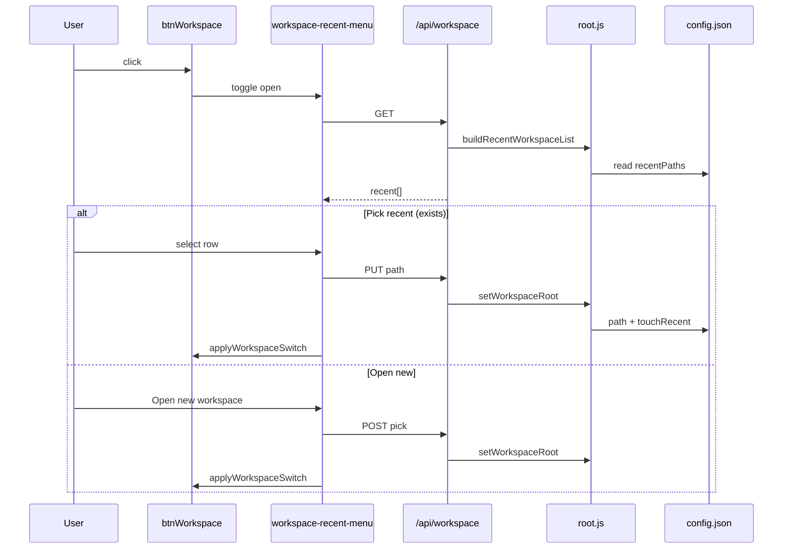

# Feature 04 — Recent workspaces menu

**Feature ID:** `feature-04-recent-workspaces-menu`  
**Backlog:** [`documentation/plans/product_backlog_agents_48a41af9.plan.md`](../product_backlog_agents_48a41af9.plan.md) — Epic B, **B1**  
**Wave:** 3 (Workspace product shape; pairs with B2 scoped chats)  
**Size:** M  
**Status:** Build plan (not implemented)  
**Depends on:** None  
**Recommended before:** B2 [`feature-03-workspace-scoped-chats`](feature-03-workspace-scoped-chats.md) (frequent workspace switches; shared `onWorkspaceChanged()` hook)  
**Prototype folder:** None — use [`DESIGN.md`](../../../DESIGN.md), [`.impeccable/design.json`](../../../.impeccable/design.json), [`documentation/context.md`](../../context.md)

---

## Overview

Replace the top bar workspace button’s immediate native folder picker with a **popover menu**: recently used workspace directories, the current selection marked, then **Open new workspace…** which opens the existing picker.

| User pain | Target outcome |
|-----------|----------------|
| Every workspace change opens a slow OS dialog | One click to switch among last ~10 folders |
| No memory of prior projects | Recents persisted in `~/.minnow/config.json` |
| Stale paths clutter the list | Missing folders shown disabled with **Remove** |

**Out of scope (v1):**

- Workspace-scoped chat lists (**B2** — separate plan; this feature only wires a shared switch callback)
- Pinning / reordering recents, workspace nicknames, “clear all recents”
- Recent list when `npm run dev` only (no `/api/workspace` — keep today’s error path)
- Settings page editor for recents (top bar menu only)

---

## Problem

### Current behavior

| Area | Behavior |
|------|----------|
| [`src/ui/workspace-button.ts`](../../../src/ui/workspace-button.ts) | `#btnWorkspace` `click` → `pickWorkspaceFolder()` immediately |
| [`server/workspace/middleware.js`](../../../server/workspace/middleware.js) | `GET/PUT /api/workspace`, `POST /api/workspace/pick` |
| [`server/workspace/root.js`](../../../server/workspace/root.js) | `workspace.path` only in `config.json`; `setWorkspaceRoot()` validates + persists path |
| [`server/config/validators.js`](../../../server/config/validators.js) | `mergeConfigMeta` merges `workspace.path` string only |
| [`src/config/workspace-api.ts`](../../../src/config/workspace-api.ts) | `fetchWorkspace`, `pickWorkspaceFolder`, `setWorkspacePath` |
| [`src/state/workspace.ts`](../../../src/state/workspace.ts) | In-memory mirror of current path/label/default |

Clicking the folder icon always blocks on the OS folder browser. Users who alternate between a few repos get no fast path.

### Persistence today

```json
// ~/.minnow/config.json (excerpt)
{
  "workspace": {
    "path": "C:\\Users\\dev\\Projects\\MyApp"
  }
}
```

No `recentPaths` array. `initWorkspaceRoot()` loads `workspace.path` or falls back to app cwd ([`root.js`](../../../server/workspace/root.js) lines 57–77).

---

## Goal

1. **Click** `#btnWorkspace` → open anchored menu (not native picker).
2. Menu lists up to **10** recent absolute paths (newest first), with **checkmark** on current workspace.
3. **Selecting a recent** valid path switches workspace via `PUT /api/workspace` (no dialog), then same UI refresh as today (label, file tree, file-panel prefs reset).
4. **Open new workspace…** runs existing `POST /api/workspace/pick`; on success, append/dedupe recents and switch.
5. **Invalid/missing** paths remain in the list but are **disabled** (muted, no switch); row action **Remove** drops them from `recentPaths` on disk.
6. **Dedupe** on every successful switch: same path (normalized) moves to front; cap length at 10.

---

## Persistence contract

### `config.json` shape (extend, backward compatible)

```json
{
  "workspace": {
    "path": "/absolute/current",
    "recentPaths": [
      "/absolute/current",
      "/absolute/other-project",
      "/old/moved-away"
    ]
  }
}
```

| Field | Type | Rules |
|-------|------|--------|
| `workspace.path` | `string` | Existing; absolute directory |
| `workspace.recentPaths` | `string[]` | Optional; max **10** entries; each non-empty absolute path string; order = MRU (index 0 = most recent) |

**Migration:** Missing `recentPaths` → treat as `[]`. On first successful `setWorkspaceRoot` after upgrade, seed list with `[currentPath]` if empty.

**Validators:** Extend `mergeConfigMeta` in [`validators.js`](../../../server/config/validators.js):

- Accept `recentPaths` only if `Array.isArray` of strings.
- Trim strings; drop empty entries.
- Cap length at `MAX_RECENT_WORKSPACES` (10) after dedupe.
- Do **not** validate directory existence on merge (existence checked at read/API time).

---

## Server design

### Constants and helpers — [`server/workspace/root.js`](../../../server/workspace/root.js)

Add (names illustrative):

| Export | Responsibility |
|--------|----------------|
| `MAX_RECENT_WORKSPACES` | `10` |
| `normalizeWorkspacePathKey(absPath)` | `path.resolve` + Windows case-fold for dedupe (mirror client guard test vectors) |
| `readRecentPathsFromMeta(meta)` | Safe array from config |
| `dedupeRecentPaths(paths)` | Normalize keys, preserve MRU order, cap 10 |
| `touchRecentWorkspacePath(absPath)` | Prepend resolved path, dedupe, persist via `writeConfigJson` |
| `removeRecentWorkspacePath(absPath)` | Remove one entry, persist |
| `buildRecentWorkspaceList()` | For API: map each stored path → `{ path, label, exists, isCurrent }` |

**Hook points:**

- `setWorkspaceRoot(userPath)` — after successful validate + write `workspace.path`, call `touchRecentWorkspacePath(resolved)`.
- `initWorkspaceRoot()` — unchanged for `path`; do not auto-prune missing recents on boot (UI handles).

### API — [`server/workspace/middleware.js`](../../../server/workspace/middleware.js)

#### `GET /api/workspace` (extend response)

```json
{
  "ok": true,
  "path": "...",
  "label": "...",
  "isDefault": false,
  "recent": [
    {
      "path": "C:\\Projects\\A",
      "label": "A",
      "exists": true,
      "isCurrent": true
    },
    {
      "path": "C:\\Projects\\Old",
      "label": "Old",
      "exists": false,
      "isCurrent": false
    }
  ]
}
```

- `exists`: `fs.stat` is directory (catch → false).
- `label`: `workspaceLabel(path)` (basename).
- `isCurrent`: normalized compare to `getWorkspaceRoot()`.
- Include **current path** in `recent` even if not yet in `recentPaths` (synthetic row or merge on read).

#### `PUT /api/workspace` (unchanged body)

Still `{ "path": "..." }`. Side effect: updates recents via `setWorkspaceRoot`.

#### `POST /api/workspace/pick` (unchanged flow)

Still opens native picker; `setWorkspaceRoot` updates recents.

#### `DELETE /api/workspace/recent` (new)

Body: `{ "path": "<absolute or as-stored>" }`.

- Remove matching entry (normalized key).
- **200** `{ ok: true, recent: [...] }` same shape as GET’s `recent` array.
- Does not change active `workspace.path` unless client also switches (not required for remove).

**CORS:** Add `DELETE` to `Access-Control-Allow-Methods`.

---

## Client design

### Module split

| Module | Role |
|--------|------|
| [`src/ui/workspace-button.ts`](../../../src/ui/workspace-button.ts) | Init button, label refresh, delegate open/toggle menu |
| **`src/ui/workspace-recent-menu.ts`** (new) | Popover DOM, open/close, keyboard, row actions |
| [`src/config/workspace-api.ts`](../../../src/config/workspace-api.ts) | Types + `fetchWorkspace` (include `recent`), `removeRecentWorkspace(path)` |
| [`src/state/workspace.ts`](../../../src/state/workspace.ts) | Unchanged mirror; optional `getRecentWorkspaces()` cache if needed |

Extract shared **post-switch refresh** from `onWorkspaceFolderChosen` into `applyWorkspaceSwitch(info: WorkspaceInfo)`:

1. `setWorkspaceFromServer(info)`
2. `updateWorkspaceButtonLabel(...)`
3. `patchFilePanelState({ expandedDirs: [], selectedPath: null })`
4. `invalidateFileTreeCache()` + `refreshFileTree()`
5. **B2 hook (when present):** `onWorkspaceChanged(info.path)` from [`sessions.ts`](../../../src/state/sessions.ts)
6. `setStatus('ok', ...)`

Both **recent select** and **picker success** call this helper.

### Popover UX

**Placement:** Anchor to `#btnWorkspace` (top bar). Prefer native **[`popover`](https://developer.mozilla.org/en-US/docs/Web/HTML/Global_attributes/popover)** + `popovertarget` / `toggleWorkspaceMenu()` if baseline targets Chromium-based local dev; document **fixed-position fallback** for Firefox/Safari (position with `getBoundingClientRect`, `position: fixed`, top layer z-index per design tokens).

**Structure:**

```text
┌─────────────────────────────┐
│ ✓ MyApp          C:\...\MyApp │  ← current, checkmark
│   OtherRepo      C:\...\Other │
│   Old (missing)  C:\...\Old  [×]│  ← disabled + remove
│ ───────────────────────────── │
│ Open new workspace…          │
└─────────────────────────────┘
```

| Interaction | Behavior |
|-------------|----------|
| Click recent (exists) | Close menu → `setWorkspacePath` → `applyWorkspaceSwitch` |
| Click recent (missing) | No switch; optional status hint |
| Remove (×) | `DELETE /api/workspace/recent` → re-render list |
| Open new… | Close menu → existing picker flow |
| Click outside / Esc | Close menu |
| `aria-expanded` on `#btnWorkspace` | `true` while open |

**Offline (`npm run dev`):** Click → `setStatus('err', 'Workspace requires npm start')` (same as today); do not show empty popover.

**Streaming guard (optional v1):** If `streaming` from [`app-state.ts`](../../../src/app-state.ts), either block switch with status message or allow switch (document: **allow** — workspace switch is rare; B2 may add stricter guard).

### Styles

New [`src/styles/workspace-menu.css`](../../../src/styles/workspace-menu.css) (import from [`main.ts`](../../../src/main.ts)):

- Panel: `--surface-elevated`, border `--border`, radius `--radius-sm`, shadow consistent with skill picker / settings dropdowns
- Row: two-line clamp (label + muted full path in `title` only)
- Disabled row: `--text-muted`, `pointer-events` limited to remove button
- Checkmark: accent color, `aria-current="true"` on current row
- Max height + `overflow-y: auto` if 10 rows exceed viewport

---

## Exact file change list

| File | Changes |
|------|---------|
| `server/workspace/root.js` | Recent list helpers; touch/remove on `setWorkspaceRoot`; export `buildRecentWorkspaceList` |
| `server/workspace/middleware.js` | GET includes `recent`; `DELETE /api/workspace/recent` |
| `server/config/validators.js` | Merge/sanitize `workspace.recentPaths` |
| `src/config/workspace-api.ts` | `WorkspaceRecentItem`, `recent` on GET, `removeRecentWorkspace` |
| `src/ui/workspace-recent-menu.ts` | **New** — popover UI |
| `src/ui/workspace-button.ts` | Toggle menu; extract `applyWorkspaceSwitch` |
| `src/styles/workspace-menu.css` | **New** |
| `src/main.ts` | Import workspace-menu CSS |
| `index.html` | Optional: `popover` attribute on menu element id `workspaceMenu` (or fully dynamic create) |
| `test/workspace/workspace-api.test.js` | Recent persistence, GET shape, DELETE remove, dedupe cap |
| `test/ui/workspace-recent-menu.test.mjs` | **New** — DOM open/close, disabled row (happy-dom) |
| `documentation/context.md` | After ship: workspace section — recents + menu |
| `documentation/plans/verification/feature-04.md` | Plan conformance (pre-ship); implementation checklist (post-ship) |

**Coordinate (B2, not blocking):**

| File | Changes |
|------|---------|
| `src/state/sessions.ts` | `onWorkspaceChanged()` called from `applyWorkspaceSwitch` |

---

## Data flow



---

## Acceptance criteria

Copy from backlog + edge cases:

1. First click on workspace button opens a **menu**, not the OS folder dialog.
2. Menu shows up to **10** recent entries, **newest first**; current workspace has a **visible checkmark** (or `aria-current`); a **divider** separates recents from **Open new workspace…** (backlog B1).
3. Selecting a recent **existing** directory switches workspace **without** opening the picker; file tree refreshes; top bar title/tooltip updates.
4. **Open new workspace…** opens the native picker; chosen path becomes current and appears at top of recents on next open.
5. Same path picked twice → **one** list entry (deduped), moved to front.
6. Missing directory: row **not** selectable for switch; **Remove** deletes from `config.json` only.
7. `GET /api/workspace` after two switches returns both paths in `recent` (order correct).
8. Invalid saved path in `config.json` does not break server start (`initWorkspaceRoot` still only validates **current** `workspace.path`).
9. `npm test` covers server recent list; manual QA on Windows + one Unix path if available.

---

## Test plan

### Build

```bash
npm run build
```

### Automated (`npm test`)

Extend [`test/workspace/workspace-api.test.js`](../../../test/workspace/workspace-api.test.js):

| Case | Assert |
|------|--------|
| PUT workspace | `config.workspace.recentPaths` contains path; length ≤ 10 |
| Second PUT different path | Both paths present; newer path first |
| PUT same path again | Single normalized entry; still first |
| GET workspace | `recent` array; `exists` true/false; `isCurrent` on active |
| DELETE recent | Entry removed; active `workspace.path` unchanged |
| 11th distinct path | List length stays 10; oldest dropped |

Add [`test/ui/workspace-recent-menu.test.mjs`](../../../test/ui/workspace-recent-menu.test.mjs) (happy-dom + tsx pattern from other UI tests):

| Case | Assert |
|------|--------|
| Render list | Current row has checkmark / `aria-current` |
| Missing path row | `disabled` or class; click does not call `setWorkspacePath` |
| Escape | Menu closes, `aria-expanded` false |

Optional: extract `dedupeRecentPaths` pure logic to `server/workspace/recent.js` for isolated unit tests without filesystem.

### Manual QA

1. **`npm start`** — Open menu → empty or seeded with current → **Open new workspace…** → pick folder A → menu shows A with checkmark.
2. Pick folder B via **Open new…** → menu shows B, then A.
3. Click **A** in menu (no dialog) → workspace switches; file tree root updates.
4. Delete folder A on disk → reload app → menu shows A grayed → **Remove** → A gone from list.
5. Rapidly open 12 different folders → menu never shows more than 10.
6. **`npm run dev`** — workspace button still shows server-required error (no menu).
7. **B2 after merge:** switch recent → sidebar chat list changes per workspace plan.

---

## Implementation todos

- [ ] **server-recent-helpers** — `touchRecentWorkspacePath`, `removeRecentWorkspacePath`, dedupe/cap in `root.js`
- [ ] **server-set-hook** — Call touch from `setWorkspaceRoot`; seed recents on first write when array empty
- [ ] **validators** — `mergeConfigMeta` accepts `workspace.recentPaths` array (sanitize, cap)
- [ ] **api-get-recent** — `GET /api/workspace` returns `recent[]` with `exists` / `isCurrent`
- [ ] **api-delete-recent** — `DELETE /api/workspace/recent` + CORS methods
- [ ] **client-api-types** — Extend `WorkspaceInfo`, add `removeRecentWorkspace`
- [ ] **apply-switch** — Extract `applyWorkspaceSwitch` in `workspace-button.ts`
- [ ] **menu-ui** — New `workspace-recent-menu.ts` (open/close, rows, remove, open-new)
- [ ] **menu-styles** — `workspace-menu.css` + import in `main.ts`
- [ ] **button-wire** — `initWorkspaceButton` toggles menu instead of direct pick
- [ ] **b2-hook-stub** — Call `onWorkspaceChanged` when B2 exists (no-op import guard or TODO comment until B2 merges)
- [ ] **tests-server** — Extend `workspace-api.test.js` for recents
- [ ] **tests-ui** — `workspace-recent-menu.test.mjs`
- [ ] **docs-ship** — Update `documentation/context.md` workspace table when feature merges
- [ ] **verify-artifact** — Complete [`documentation/plans/verification/feature-04.md`](../verification/feature-04.md) (plan review done; implementation sign-off after ship)

---

## Verifier handoff

Create or update [`documentation/plans/verification/feature-04.md`](../verification/feature-04.md):

- **Plan review:** B1 backlog + per-agent template (see verification doc § Plan conformance).
- **Automated:** `npm run build` then `npm test` (includes `test/workspace/workspace-api.test.js`, `test/ui/workspace-recent-menu.test.mjs`).
- **Manual:** U1–U7 in verification doc (from § Manual QA below).
- **Sign-off:** PASS only if acceptance criteria 1–9 hold and manual checks are checked.

---

## Coordination with B2 (workspace-scoped chats)

B2 is **recommended after** B1 so users can switch workspaces from recents and immediately see the correct chat list.

**Shared contract:** `applyWorkspaceSwitch()` must invoke `onWorkspaceChanged(newPath)` (from B2 plan) after `setWorkspaceFromServer`. B1 can land first with a no-op or deferred import; B2 wires the real handler.

Do **not** duplicate picker/PUT logic in B2’s `workspace-button.ts` changes — only add the session hook to the shared helper.

---

## Open questions (resolved for v1)

| Question | Resolution |
|----------|------------|
| Max recents | **10** (backlog “~10”) |
| Store missing paths | **Yes**, until user removes; `exists: false` in API |
| Include current path if not in array | **Yes** on GET (merge at read time) |
| Popover vs dropdown | **Popover** anchored to `#btnWorkspace`; native `popover` preferred with fixed fallback |
| Config API vs workspace API for recents | **Workspace API only** — keeps path validation in one module |

---

## References

- Product backlog: [`documentation/plans/product_backlog_agents_48a41af9.plan.md`](../product_backlog_agents_48a41af9.plan.md) — B1
- Related: [`feature-03-workspace-scoped-chats.md`](feature-03-workspace-scoped-chats.md) — B2
- Persistence overview: [`documentation/context.md`](../../context.md) — Workspace folder section
- Existing tests: [`test/workspace/workspace-api.test.js`](../../../test/workspace/workspace-api.test.js)
