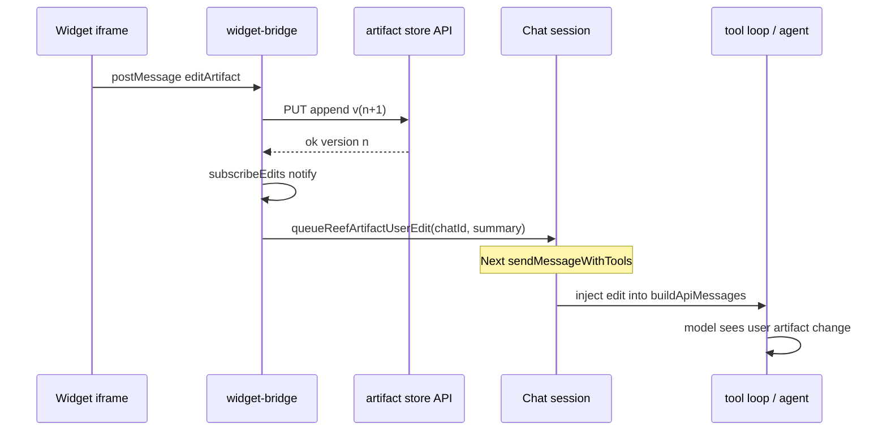

# Feature 04 — Reef artifacts evolution

**Roadmap:** [feature-audit-roadmap.md](../feature-audit-roadmap.md) item **#4** (Partial → Built).  
**Related today:** Reef widgets ([`src/chat/reef/`](../../src/chat/reef/)), bridge ([`widget-bridge.ts`](../../src/chat/reef/widget-bridge.ts)), modules at `~/.minnow/reef/modules/`, templates at `~/.minnow/reef/widgets/`.  
**Strategic sequencing:** Roadmap groups this with **#1 trace/replay** as a differentiator wave — artifact `turnId` / `generationId` metadata should align with future run records but must not block v1.

---

## Terminology (lock before coding)

| Concept | Lifetime | Storage | Typical content |
|---------|----------|---------|-----------------|
| **Widget** | Ephemeral per message | Chat `history` (markdown ` ```reef-widget ` fence) | Interactive UI fragment in sandboxed iframe |
| **Module** | Durable reusable template | `~/.minnow/reef/modules/<slug>.md` | Copy-paste widget source; agent-written after `ask_question` |
| **Artifact** (new) | Durable versioned document | `~/.minnow/reef/artifacts/<id>/` | User/agent co-edited state: markdown body, JSON snapshot, or promoted tool output |

**Rule:** Modules are **templates** (how to build a widget). Artifacts are **instances** (what the user and agent produced together, with history).

---

## Current state

### What ships today

- **Inline widgets:** When `Chat.modeId === 'reef'`, closed `reef-widget` fences mount as sandboxed iframes (`allow-scripts` only). Pipeline: `widget-block-detector.ts` → `widget-iframe.ts` → `registerReefWidgetHost` in `widget-bridge.ts`.
- **Bridge API (`window.minnow` in iframe):** `sendPrompt`, `callLLM`, `openLink`, `requestResize` — implemented in [`widget-prelude.ts`](../../src/chat/reef/widget-prelude.ts), handled in [`widget-bridge.ts`](../../src/chat/reef/widget-bridge.ts) via `postMessage` actions `sendPrompt` | `callLLM` | `resize` | `openLink`.
- **Widget LLM:** Dedicated binding (`Chat.reefWidgetProviderId` / `reefWidgetModelId`) via `run-widget-completion.ts` (no tools, max 2 concurrent).
- **Library:** 15 templates + 6 snippets under `src/chat/reef/widgets/`; synced read-only to `~/.minnow/reef/widgets/` on `npm start` (`server/reef/sync-widgets.js`).
- **User modules:** Read/write `@minnow/reef/modules/<slug>.md` with path guards in [`server/reef/widget-paths.js`](../../server/reef/widget-paths.js); save requires **`ask_question`** per [`reef.full.md`](../../src/chat/prompts/modes/reef.full.md).
- **Widget IDs:** Ephemeral per mount (`reef-widget-<n>` from `widget-iframe.ts`); not persisted across reload.
- **Tests:** `test/chat/reef/*.test.mjs` (conventions, catalog, save-prompt); bridge tests in `*.test.mts`.

### What is explicitly out of scope for “today”

- No `editArtifact` / `subscribeEdits` on the bridge.
- No `~/.minnow/reef/artifacts/` directory or API.
- No automatic promotion of `role: tool` results into durable Reef documents.
- No first-class links between artifacts (only chat prose and file paths).
- Reef prompt forbids the word `artifact` for fences — only `reef-widget` ([`reef.full.md` L26](../../src/chat/prompts/modes/reef.full.md)).

---

## Gap (product)

From the audit — all four must be addressed for **Built**:

1. **Live user-edit round-trip** — Edits inside a mounted widget must reach the **main chat agent** on the next turn without the user re-pasting state (today: `sendPrompt` only fills `#msgInput`; no structured handoff).
2. **Version history per artifact** — Append-only versions under `~/.minnow/reef/artifacts/<id>/v<n>.md` with a manifest (current version, title, refs, provenance).
3. **Tool-output → artifact pipeline** — Large or structured tool results (e.g. `read_file`, `grep`, `list_directory`, sub-agent JSON) should be promotable to an artifact the agent and widgets can reuse.
4. **Artifact-to-artifact references** — Manifest `refs: string[]` and stable `@minnow/reef/artifacts/<id>` aliases for `read_file` / prompt injection.

---

## Goals

1. **Co-editing:** User changes in-widget become a new artifact version and a compact **edit event** the model sees (diff summary or full body per policy).
2. **Durability:** Artifacts survive chat reload, workspace switch, and re-mount of widgets bound to an `artifactId`.
3. **Promotion:** Configurable hook after `executeTool` creates or updates an artifact when output exceeds size/structure thresholds.
4. **Composition:** Artifacts reference other artifacts; loader resolves refs for agent context (cycle-safe).
5. **Safety:** Same path sandbox as modules; no writes under workspace `{{cwd}}`; optional `ask_question` before first persist from agent-only paths.

---

## Non-goals (v1)

- Full three-way merge UI or OT/CRDT inside iframes.
- Artifacts as git-tracked workspace files (stay under `~/.minnow`).
- Replacing **modules** — modules remain the reusable template catalog.
- Binary blobs in artifact versions (text/markdown + JSON frontmatter only v1).
- Cross-chat artifact sharing UI (IDs are global under home; binding is per-chat in session).

---

## Acceptance criteria

### AC1 — Bridge edit round-trip

- [ ] Iframe calls `window.minnow.editArtifact({ artifactId, patch })` (or `content` replace mode).
- [ ] Host persists **v(n+1)** and emits `subscribeEdits` listeners with `{ artifactId, version, summary, path }`.
- [ ] Active chat receives a **pending user edit** record (see Architecture) consumed on next `sendMessageWithTools` — model system or user-role appendix includes “User edited artifact X …”.
- [ ] Debounced edits (e.g. 500ms) coalesce to one version per burst.

### AC2 — Version store

- [ ] Layout: `~/.minnow/reef/artifacts/<id>/manifest.json` + `v1.md`, `v2.md`, …
- [ ] `manifest.json` fields (minimum): `id`, `title`, `currentVersion`, `createdAt`, `updatedAt`, `refs[]`, `source?: { type: 'tool'|'widget'|'agent', toolName?, messageId?, widgetId? }`.
- [ ] `GET /api/reef/artifacts/:id` returns manifest + current body; `GET .../versions/:n` for history.
- [ ] `PUT` appends version (server validates monotonic `n`).

### AC3 — Tool-output pipeline

- [ ] After successful `executeTool` in [`loop.ts`](../../src/tools/loop.ts) (post-`renderToolResult`), hook evaluates promotion rules.
- [ ] Promotion creates artifact when: output length &gt; threshold **or** tool name in allowlist **or** model invoked `save_reef_artifact` tool (v1 optional explicit tool).
- [ ] Chat history tool message gains optional `artifactId` / `@minnow/reef/artifacts/<id>` pointer (metadata on `Message` or inline JSON footer — pick one in P0 spec).

### AC4 — References

- [ ] Manifest `refs: ["other-id"]` resolved when building artifact context bundle for the agent.
- [ ] Max depth / cycle detection — fail with clear error in logs, omit cyclic ref in prompt.
- [ ] Prompt documents `@minnow/reef/artifacts/<id>` and `refs` semantics in `reef.full.md`.

### AC5 — Regression

- [ ] Existing widget mount, `callLLM`, theme refresh, and module save-prompt tests still pass.
- [ ] `npx tsc --noEmit` clean for new types.

---

## Architecture

### 1. On-disk layout (`~/.minnow/reef/artifacts/`)

```text
~/.minnow/reef/artifacts/
  <artifact-id>/
    manifest.json       # metadata, refs, currentVersion, bindings
    v1.md               # body (markdown or markdown-wrapped JSON)
    v2.md
    ...
```

**`v<n>.md` shape (recommended):**

```markdown
---
version: 2
author: user | agent | tool
widgetId: reef-widget-3
parentVersion: 1
---

<artifact body — markdown table, JSON block, or prose>
```

**`manifest.json` example:**

```json
{
  "id": "expense-dashboard-2026-05",
  "title": "Expense dashboard",
  "currentVersion": 3,
  "refs": ["q1-revenue-csv"],
  "chatIds": ["chat-uuid-..."],
  "widgetBindings": [{ "messageId": "...", "widgetId": "reef-widget-2" }],
  "createdAt": "2026-05-22T12:00:00.000Z",
  "updatedAt": "2026-05-22T12:05:00.000Z"
}
```

**Scaffold:** Add `reef/artifacts` to [`server/config/home.js`](../../server/config/home.js) `DEFAULT_DIRS` (alongside `reef/widgets`, `reef/modules`).

### 2. Path resolution (server)

New module **`server/reef/artifact-paths.js`** (mirror `widget-paths.js`):

- `getHomeReefArtifactsDir()`
- `tryResolveReefArtifactPath(userPath)` for `@minnow/reef/artifacts/<id>`, `reef/artifacts/...`, `.minnow/reef/artifacts/...`
- `isAllowedReefArtifactPath(absPath)` — under home artifacts root only
- Integrate in `server.js` `resolveSafePath` / `read_file` / `save_file` (writes allowed for artifacts; distinct from read-only widgets)

### 3. HTTP API (minimal v1)

| Method | Route | Purpose |
|--------|-------|---------|
| `GET` | `/api/reef/artifacts` | List manifests (paginated) |
| `GET` | `/api/reef/artifacts/:id` | Manifest + current `vN.md` body |
| `GET` | `/api/reef/artifacts/:id/versions/:n` | Historical body |
| `PUT` | `/api/reef/artifacts/:id` | Append version `{ body, author, refs? }` |
| `POST` | `/api/reef/artifacts` | Create id + v1 (agent/tool); returns id |

Client wrapper: **`src/chat/reef/artifact-client.ts`** (fetch + types).

### 4. Bridge: `editArtifact` / `subscribeEdits`

**Iframe (`widget-prelude.ts`):**

```javascript
editArtifact: function (opts) {
  opts = opts || {};
  post("editArtifact", {
    artifactId: String(opts.artifactId || ""),
    content: opts.content != null ? String(opts.content) : undefined,
    patch: opts.patch, // optional JSON Patch or { field, value } v1 simplification
    summary: opts.summary != null ? String(opts.summary) : undefined,
  });
},
```

**Host (`widget-bridge.ts`):**

| Export | Responsibility |
|--------|----------------|
| `editArtifactFromWidget(widgetId, payload)` | Resolve `artifactId` from host record or `data-artifact-id` on `.reef-widget-host`; debounce; `PUT` new version |
| `subscribeEdits(listener)` | `Set<listener>` notified on every successful version write |
| `unsubscribeEdits(listener)` | Cleanup |

**Host record extension (`ReefWidgetHostRecord`):**

```typescript
artifactId?: string;
onEdit?: (payload: ReefArtifactEditPayload) => void;
```

**Binding:** When mounting, if bubble metadata includes `artifactId` (from promoted tool or agent fence attribute), set on host. Optional HTML comment in fence: `<!-- artifact: expense-dashboard -->` parsed in `widget-block-detector.ts` (P2).

**Agent round-trip flow:**



**Injection point:** New helper `src/chat/reef/artifact-context.ts`:

- `queueReefArtifactUserEdit(chatId, event)` — persisted in session blob `Chat.pendingReefArtifactEdits?: ReefArtifactEditEvent[]` (cleared after consumption).
- `consumeReefArtifactEditsForPrompt(chat)` — returns markdown block appended to **user** turn or `system` adjunct (prefer user-role appendix: “The user edited artifact …”).

### 5. Tool-result hook

**Location:** [`src/tools/loop.ts`](../../src/tools/loop.ts) immediately after `renderToolResult` / `chat.history.push` for each tool call (~L906).

**New module:** `src/chat/reef/artifact-promotion.ts`

```typescript
export interface ArtifactPromotionConfig {
  minChars: number;           // default 4000
  toolAllowlist: string[];    // e.g. read_file, grep, list_directory, spawn_sub_agent
  modeAllowlist: ModeId[];    // reef, build, research, ...
}

export async function maybePromoteToolResultToArtifact(
  ctx: { chatId: string; toolName: string; args: unknown; content: string; toolCallId: string },
): Promise<{ artifactId?: string; alias?: string } | null>
```

**Behavior:**

1. If `content.length < minChars` and tool not in allowlist → no-op.
2. Create artifact id (slug from tool + hash or uuid).
3. Write v1 with frontmatter `source: { type: 'tool', toolName, toolCallId }`.
4. Optionally append short pointer to tool message content: `\n\n[Reef artifact: @minnow/reef/artifacts/<id> v1]`.
5. Emit `subscribeEdits` for UI panels.

**Explicit tool (optional v1.1):** `save_reef_artifact` in `definitions.ts` — agent-controlled promotion with `title`, `body`, `refs`.

### 6. Artifact-to-artifact references

- **Write time:** Agent or user sets `refs` in manifest on create/update.
- **Read time:** `loadArtifactBundle(id, depth = 2)` BFS resolves refs, concatenates for prompt with headers `## Artifact: <id> (v<n>)`.
- **Cycles:** Track visited set; skip duplicate with `<!-- ref cycle: id -->` in bundle.

### 7. Session persistence

Extend **`Chat`** in [`src/types.ts`](../../src/types.ts):

```typescript
/** Pending user edits from Reef widgets; consumed on next send. */
pendingReefArtifactEdits?: ReefArtifactEditEvent[];
/** Artifact ids bound to this chat for sidebar/history. */
reefArtifactIds?: string[];
```

Persist via existing `sessions/state.json` — no new top-level file.

### 8. Prompt & tool contract updates

- **`reef.full.md`:** New § Artifacts vs modules; document `editArtifact` for widgets that edit tables/forms; `read_file` `@minnow/reef/artifacts/...`.
- **`tool-usage/default.full.md`:** Cross-link promotion + refs.
- **`ask-user` skill:** Optional preset “Save tool output as artifact?” when hook would auto-promote large results (if auto-promote disabled by settings).

---

## Key files (touch list)

| Area | Path | Change |
|------|------|--------|
| Bridge | `src/chat/reef/widget-bridge.ts` | `editArtifact` handler, `subscribeEdits`, debounce |
| Prelude | `src/chat/reef/widget-prelude.ts` | `window.minnow.editArtifact` |
| Mount | `src/chat/reef/widget-block-detector.ts` | Parse `artifact:` binding; `data-artifact-id` on host |
| Store client | `src/chat/reef/artifact-client.ts` | **new** |
| Context | `src/chat/reef/artifact-context.ts` | **new** — queue/consume edits, bundle refs |
| Promotion | `src/chat/reef/artifact-promotion.ts` | **new** |
| Public API | `src/chat/reef/index.ts` | Re-export subscribe + mount hooks |
| Tool loop | `src/tools/loop.ts` | Post-tool promotion hook |
| Types | `src/types.ts` | `Chat` + `Message` metadata |
| Server paths | `server/reef/artifact-paths.js` | **new** |
| Server store | `server/reef/artifact-store.js` | **new** — read/write versions |
| Server routes | `server.js` or `server/reef/middleware.js` | REST handlers |
| Home scaffold | `server/config/home.js` | `reef/artifacts` dir |
| Prompts | `src/chat/prompts/modes/reef.full.md`, `reef.lite.md` | Artifact docs |
| Settings | `src/ui/reef-widget-settings.ts` (optional) | Auto-promote toggles |
| Context doc | `documentation/context.md` | When shipped |

---

## Implementation phases

### Phase 0 — Spec & scaffold (0.5–1 d)

- Finalize `v<n>.md` + `manifest.json` schema and id slug rules (`[a-z0-9-]{1,64}`).
- Scaffold directory; empty list API returns `[]`.
- **Exit:** `npm start` creates `reef/artifacts/`; ping tests green.

### Phase 1 — Server store & paths (1–2 d)

- `artifact-paths.js` + `artifact-store.js` + REST routes.
- Tool path `@minnow/reef/artifacts/<id>` works with `read_file` / `save_file`.
- **Exit:** Manual curl create/read/version append.

### Phase 2 — Bridge edit + round-trip (2–3 d)

- `editArtifact` / `subscribeEdits`; debounced PUT from host.
- `pendingReefArtifactEdits` + inject on send.
- **Exit:** Integration test: postMessage edit → version 2 on disk → next mock send includes edit text.

### Phase 3 — Tool promotion + refs (2 d)

- `artifact-promotion.ts` + loop hook.
- `loadArtifactBundle` with refs + cycle guard.
- **Exit:** Large `read_file` result creates artifact; agent prompt bundle includes ref target.

### Phase 4 — UX & prompts (1–2 d)

- Optional sidebar “Artifacts for this chat” (list versions, open in file viewer).
- Prompt/skill updates; feature flag in `config.json` if needed (`reef.artifacts.enabled`).
- **Exit:** QA checklist below; `context.md` updated.

---

## Dependencies

| Dependency | Why |
|------------|-----|
| **`npm start` / `~/.minnow`** | All artifact I/O is server-mediated |
| **Reef Phase 2 widgets** | Bridge and mount pipeline must remain stable |
| **`server/reef/widget-paths.js` pattern** | Copy path-guard approach for artifacts |
| **Feature #1 trace/replay (soft)** | Optional `manifest.source.turnId` / `generationId` — add fields in manifest now, wire later |
| **Feature #22 project-scoped configs (soft)** | Artifacts may later move to `.minnow/reef/artifacts/` per workspace — v1 global home only |

**Blocks:** Nothing in-repo blocks P0–P2. **Blocked by this:** Future “artifact gallery” and eval harness fixtures referencing stable artifact ids.

---

## Tests

| Suite | File | Covers |
|-------|------|--------|
| Path resolution | `test/chat/reef/artifact-paths.test.mjs` | `@minnow/reef/artifacts/...` aliases, traversal rejected |
| Store | `test/chat/reef/artifact-store.test.mjs` | append version, monotonic n, manifest update |
| Bridge | `test/chat/reef/artifact-bridge.test.mts` | `editArtifact` → debounce → mock fetch PUT |
| Round-trip | `test/chat/reef/artifact-roundtrip.test.mts` | queue + `consumeReefArtifactEditsForPrompt` |
| Promotion | `test/chat/reef/artifact-promotion.test.mjs` | threshold, allowlist, no-op small output |
| Refs | `test/chat/reef/artifact-refs.test.mjs` | cycle A→B→A, depth limit |
| Regression | `test/chat/reef/*.test.mjs` | Existing reef conventions unchanged |

**Commands:**

```bash
node --test test/chat/reef/artifact-*.test.mjs
npx tsx --import ./test/test-loader.mjs --test test/chat/reef/artifact-*.test.mts
npm test   # full suite before merge
```

**Fixtures:** Use `MINNOW_HOME` temp dir; fixed artifact id `11111111-artifact-test` and static bodies (no `Date.now()` in assertions).

---

## Risks and mitigations

| Risk | Impact | Mitigation |
|------|--------|------------|
| **Unbounded versions** | Disk growth | Retention policy in manifest (`maxVersions`); prune job in store (v1.1) |
| **PII in artifacts** | Sensitive data in `~/.minnow` | Prompt: no secrets; optional exclude paths; settings toggle off auto-promote |
| **Debounce vs data loss** | User navigates away mid-edit | `beforeunload` flush in prelude; final debounced write |
| **Agent/user edit conflict** | Lost updates | Last-write-wins per version; manifest `parentVersion` check → 409 → agent retry message |
| **iframe forgery** | Malicious postMessage | Keep `hostsByWidgetId.has(widgetId)` gate; require bound `artifactId` for edits |
| **Huge tool outputs** | Promotion stalls UI | Async write; truncate preview in chat pointer, full body in artifact only |
| **Terminology clash** | Model emits wrong fence type | Keep “artifact” for files only; fences stay `reef-widget` in prompts |

---

## Open questions (resolve in P0)

1. **Edit payload shape:** Full `content` replace only v1, or JSON Patch for table widgets?
2. **Auto-promote default:** On or off? Threshold chars?
3. **Binding widget ↔ artifact:** HTML comment in fence vs only tool-time assignment?
4. **Message metadata:** Extend `Message` type vs inline markdown footer for `artifactId`?
5. **Settings surface:** Global `config.json` vs Reef mode panel only?

---

## Manual QA checklist (pre-ship)

- [ ] Reef mode: mount widget → edit field → send chat → assistant acknowledges edit without user paste.
- [ ] Reload app → artifact versions intact; re-open chat shows pointer to latest version.
- [ ] `read_file` `@minnow/reef/artifacts/<id>` returns current body from home, not workspace.
- [ ] Promoted grep output creates artifact; ref artifact appears in bundle when manifest lists `refs`.
- [ ] Module save flow (`ask_question` → `@minnow/reef/modules/`) unchanged.
- [ ] Non-reef modes: widgets do not mount; artifact APIs still work for Build mode tools.

---

## References

- [feature-audit-roadmap.md](../feature-audit-roadmap.md) §4  
- [documentation/context.md](../context.md) — Reef mode widgets, `~/.minnow/reef/` layout  
- [feature-reef-mode-widgets.md](../feature-reef-mode-widgets.md) (historical plan)  
- [reef-widget-library-expansion.md](../reef-widget-library-expansion.md)  
- [verification/feature-reef.md](../verification/feature-reef.md)
