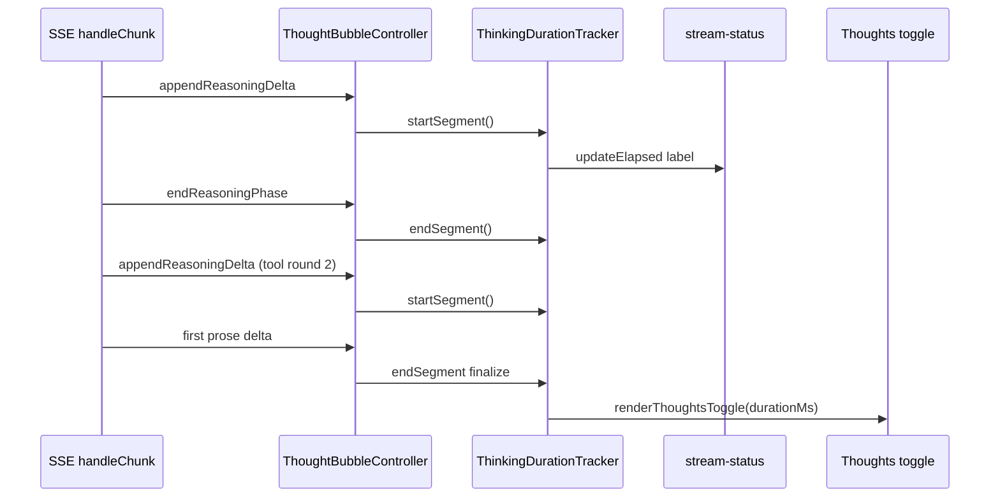

# Feature 05 — Thinking duration display

**Feature ID:** `feature-05-thinking-duration`  
**Epic:** C — Chat UX  
**Backlog:** [`documentation/plans/product_backlog_agents_48a41af9.plan.md`](../product_backlog_agents_48a41af9.plan.md) — **C4**  
**Wave:** 1 (low risk, parallel-safe with A1 / C3 / E4–E6)  
**Size:** S  
**Status:** Build plan (not yet implemented)  
**Depends on:** Existing reasoning UI ([`thought-bubbles.ts`](../../../src/ui/thought-bubbles.ts), [`stream-status.ts`](../../../src/ui/stream-status.ts)) — no Step 01 dependency required if stream phases already ship.  
**Blocks:** Nothing critical. Complements **C5** (`feature-22-stream-persistence-reload`) if `pendingTurn` later includes `thinkingDurationMs`.

### Backlog alignment (C4)

| Backlog wording | Build plan decision |
|-----------------|---------------------|
| “Timer from first reasoning delta until first prose token” | **Do not** use one continuous first→prose interval in tool loops (includes tool execution idle). |
| “Show on Thoughts header / bubble footer: e.g. `Thought for 12.4s`” | **Ship:** Thoughts toggle + live `Thinking… N.Ns` on stream-status; thought-stage footer optional. |
| `thinkingDurationMs` persist | **Ship:** optional field on final `AssistantMessage` with `thinking[]`. |

---

## Overview

Users want to see **how long the model spent reasoning**, separate from **TTFT** (time from request start to first prose token). Today:

| Signal | What it measures | Where it appears |
|--------|------------------|------------------|
| **TTFT** (`stats.time_to_first_token`) | `t0` (HTTP stream open) → first **prose** delta | Stats chips after reply; includes “waiting for model” + any reasoning + gap before prose |
| **Stream labels** | Phase only (`Generating…` / `Thinking…`) | [`.stream-status`](../../../src/ui/stream-status.ts) during live turn |
| **Thought bubbles** | Reasoning text, not elapsed time | [`.thought-stage`](../../../src/ui/thought-bubbles.ts) live; **Thoughts** toggle after reply |

**Goal:** Show a human-readable duration such as **`Thought for 12.4s`** on the **Thoughts** control (restored history) and a **live elapsed counter** while reasoning is active (stream-status and/or live thought stage). Persist optional **`thinkingDurationMs`** on the final assistant message for that user send.

**Out of scope:** Changing reasoning parsing, thought-bubble animations, TTFT calculation, settings toggle, sub-agent bubbles, server-side session validation changes (forward-compatible JSON only).

---

## Problem analysis (current behavior)

### A. Phase hooks exist but no timer

[`ThoughtBubbleController`](../../../src/ui/thought-bubbles.ts) already notifies the send path via [`ThoughtPhaseCallbacks`](../../../src/ui/thought-bubbles.ts):

- `onThinkingStart` — first non-empty `appendReasoningDelta` (sets stream phase to `thinking` in [`loop.ts`](../../../src/tools/loop.ts) L571–572 and [`chat.ts`](../../../src/api/chat.ts) L338–339).
- `onReasoningEnded` — `endReasoningPhase()` when prose starts or stream flushes reasoning (reverts to `generating` if still `msg--awaiting-prose`).

There is **no** `performance.now()` tracking, no live suffix on labels, and no duration on `renderThoughtsToggle`.

### B. TTFT is the wrong metric for “thinking time”

[`buildClientStats`](../../../src/api/chat.ts) sets `time_to_first_token` from `t0` → `tFirst` (first **content** delta). That span includes:

- Network / provider latency before any reasoning token
- Tool-loop gaps between reasoning rounds (model not streaming reasoning)
- Post-reasoning wait if the model pauses before prose

Users asking “how long did it think?” expect **reasoning-active wall time**, not full TTFT.

### C. Tool-loop spans multiple SSE rounds, one `ThoughtBubbleController`

In [`sendMessageWithTools`](../../../src/tools/loop.ts):

- A single `thoughtController` survives tool rounds; segments accumulate via `getSegmentsNormalized()`.
- Each tool round calls `endReasoningPhase()` at stream end ([`streamCompletionTurn`](../../../src/tools/loop.ts) L374–375) and may start reasoning again on the next round after `resetStreamPhaseHints()` (L725).

Duration logic must **pause** between reasoning segments and **resume** on the next reasoning delta, then attach **one** total to the **final** `AssistantMessage` that carries `thinking[]`.

### D. History restore ignores duration

[`renderChatFromHistory`](../../../src/ui/messages.ts) calls `renderThoughtsToggle(wrap, thinking)` with no duration. [`AssistantMessage`](../../../src/types.ts) has `thinking?: string[]` but no `thinkingDurationMs`.

### E. Non-streaming reasoning fallback

When streaming returns no prose, [`ingestCompletedReasoning`](../../../src/ui/thought-bubbles.ts) adds segments in one shot ([`loop.ts`](../../../src/tools/loop.ts) L754–756, [`chat.ts`](../../../src/api/chat.ts) L427–428). There is no live timer span; UI should still show a duration label if segments exist (see **Edge cases**).

---

## Target UX specification

### Copy and formatting

| Context | Label pattern | Example |
|---------|---------------|---------|
| **Collapsed Thoughts button** (history + after stream completes) | `Thought for {duration}` | `Thought for 12.4s` |
| **Live stream-status** (`thinking` phase) | `Thinking…` + muted elapsed | `Thinking… 4.2s` |
| **Live thought stage** (optional footer) | Small muted line under active bubble | `4.2s` |

**Formatter** (new helper, pure function):

- Input: integer milliseconds ≥ 0.
- Output: one decimal place for ≥ 1000 ms (`12.4s`), else two decimals for &lt; 1s (`0.35s`), clamp display minimum `0.1s` when ms &gt; 0 but &lt; 100 ms.
- Do **not** show duration UI when `thinkingDurationMs` is 0/undefined and there was no measurable reasoning window.

Use ASCII ellipsis in stream labels only where already established (`Thinking…`); duration suffix uses a normal space + `4.2s` without extra ellipsis.

### What to measure (decision)

**Recommended (implement):** **Accumulated reasoning-active time** — sum of wall-clock intervals where reasoning SSE is actively arriving:

1. **Start** interval on first `appendReasoningDelta` after idle (or first delta of the user send).
2. **Stop** interval on each `endReasoningPhase()` (prose started, or stream ended with reasoning flushed).
3. **Resume** on next `appendReasoningDelta` in the same user send (tool-loop round 2+).
4. **Finalize** on first prose delta **or** when the assistant message is committed (whichever ends the user-visible “thinking” story).

**Not recommended:** Single continuous timer from first reasoning delta → first prose (includes tool execution and provider idle — misleading in tool loops).

Document in code comment on the tracker so future changes do not “simplify” to TTFT-like semantics.

### Live update cadence

- While any reasoning interval is open, refresh displayed elapsed every **100 ms** via `requestAnimationFrame` or `setInterval` (prefer one timer per active user send, cleared on `abort` / finalize).
- Throttle DOM writes: only update label text when the formatted string changes (tenths of seconds).

### DOM placement (matches backlog)

| Surface | Element | Change |
|---------|---------|--------|
| After reply | `.thoughts-toggle` button | `Thought for 12.4s` instead of plain `Thoughts` when duration known |
| Live | `.stream-status__label` | Append muted `<span class="stream-status__elapsed">` sibling |
| History without `thinkingDurationMs` | `.thoughts-toggle` | Keep `Thoughts` (backward compatible) |

Optional: `.thought-stage` footer — only if stream-status alone feels easy to miss; treat as **nice-to-have** in implementation order.

---

## Architecture



### New module: `src/ui/thinking-duration.ts`

Keep timer logic **out of** `ThoughtBubbleController` (SRP: bubbles = DOM + segments; tracker = time).

```ts
// Suggested exports (names can match repo style)
export function formatThinkingDuration(ms: number): string;
export class ThinkingDurationTracker {
  startSegment(): void;
  endSegment(): void;
  finalize(): number; // total ms, stops timers
  getElapsedMs(): number; // for live label
  abort(): void;
}
```

Wire tracker from extended callbacks on `ThoughtBubbleController` **or** own the tracker in `loop.ts` / `chat.ts` and call it from existing `onThinkingStart` / `onReasoningEnded` plus explicit hooks on first prose (send paths already call `endReasoningPhase` before prose).

**Preferred:** extend `ThoughtPhaseCallbacks`:

```ts
export interface ThoughtPhaseCallbacks {
  onThinkingStart?: () => void;
  onReasoningEnded?: () => void;
  onThinkingTick?: (elapsedMs: number) => void; // optional, ~100ms while segment open
}
```

Controller calls `onThinkingTick` from the same place `onThinkingStart` fires, driven by a single interval owned by the controller **or** by the tracker passed in — implementer choice; avoid duplicate intervals.

---

## Exact file change list

| File | Action |
|------|--------|
| [`src/ui/thinking-duration.ts`](../../../src/ui/thinking-duration.ts) | **Add** — `formatThinkingDuration`, `ThinkingDurationTracker` |
| [`src/ui/thought-bubbles.ts`](../../../src/ui/thought-bubbles.ts) | **Edit** — optional `onThinkingTick`; `renderThoughtsToggle(wrap, segments, opts?: { expanded?, durationMs? })` + update all call sites |
| [`src/ui/stream-status.ts`](../../../src/ui/stream-status.ts) | **Edit** — `setThinkingElapsed(ms \| null)`; hide suffix when phase ≠ `thinking` |
| [`src/types.ts`](../../../src/types.ts) | **Edit** — `AssistantMessage.thinkingDurationMs?: number` |
| [`src/tools/loop.ts`](../../../src/tools/loop.ts) | **Edit** — tracker lifecycle; persist field on `assistantMsg`; live tick → stream-status |
| [`src/api/chat.ts`](../../../src/api/chat.ts) | **Edit** — same as loop for non-tool send path |
| [`src/ui/messages.ts`](../../../src/ui/messages.ts) | **Edit** — `renderChatFromHistory` passes `thinkingDurationMs` into toggle |
| [`src/styles/messages.css`](../../../src/styles/messages.css) | **Edit** — `.stream-status__elapsed` (muted, tabular nums) |
| [`src/styles/thoughts.css`](../../../src/styles/thoughts.css) | **Edit** — `.thoughts-toggle` duration label styling when needed |
| [`test/ui/thinking-duration.test.mjs`](../../../test/ui/thinking-duration.test.mjs) | **Add** — formatter + tracker segment sum |
| [`test/ui/thought-bubbles.test.mjs`](../../../test/ui/thought-bubbles.test.mjs) | **Edit** — toggle label includes duration when passed |
| [`test/ui/stream-status.test.mjs`](../../../test/ui/stream-status.test.mjs) | **Edit** — elapsed suffix in thinking phase |
| [`package.json`](../../../package.json) | **Edit** — register new test file in `npm test` script |
| [`documentation/context.md`](../../context.md) | **Edit on ship** — Message rendering § reasoning duration (not part of implementation PR unless team bundles docs) |

**No server changes required** — `~/.minnow/sessions/state.json` stores chat history as JSON; new optional field is ignored by older builds and preserved by newer ones.

---

## Schema / persistence

### Type change

```ts
export interface AssistantMessage {
  role: 'assistant';
  content: string;
  thinking?: string[];
  /** Wall-clock ms spent in reasoning streams for this reply (accumulated segments). */
  thinkingDurationMs?: number;
  stats?: Stats;
  usage?: Usage;
}
```

### Migration

- **Session file version:** remain `version: 1` ([`sessions.ts`](../../../src/state/sessions.ts)); no migration runner.
- **Read path:** missing `thinkingDurationMs` → show legacy `Thoughts` label only.
- **Write path:** set `thinkingDurationMs` only when `thinking?.length > 0` and `tracker.finalize() > 0` (or always when thinking present — team choice; prefer **only when &gt; 0** to avoid `Thought for 0.0s`).

### Tool-loop history shape

Only the **final** prose `AssistantMessage` in a user send receives `thinking[]` today. Attach **`thinkingDurationMs` on that same message** (total across all reasoning segments in that send). Do **not** attach duration to intermediate `AssistantToolCallMessage` rows.

---

## Implementation plan (ordered todos)

- [ ] **1. `thinking-duration.ts`** — Implement `formatThinkingDuration` with static test vectors; implement `ThinkingDurationTracker` (segment stack or running sum, `abort`, `finalize`).
- [ ] **2. Unit tests** — `test/ui/thinking-duration.test.mjs`: formatter edge cases; tracker: single segment, pause/resume across two segments, abort clears interval.
- [ ] **3. `stream-status.ts`** — Add optional elapsed suffix element; expose `setThinkingElapsed(ms: number | null)`; hide suffix when phase ≠ `thinking`.
- [ ] **4. `thought-bubbles.ts` + `renderThoughtsToggle`** — Change third argument to `opts?: { expanded?: boolean; durationMs?: number }` (update `loop.ts`, `chat.ts`, `messages.ts` call sites); button text `Thought for ${formatThinkingDuration(durationMs)}`; `aria-label` includes duration for a11y.
- [ ] **5. `loop.ts` wiring** — Create tracker per `sendMessageWithTools`; on `onThinkingStart` start segment + start tick timer; on `onReasoningEnded` end segment; on first prose (`revealProse` / `onFirstProseDelta`) end segment; on final `assistantMsg` push `thinkingDurationMs`; call `renderThoughtsToggle(..., { durationMs })`; dispose tick on abort.
- [ ] **6. `chat.ts` wiring** — Mirror loop for `sendMessage` (no tools) path.
- [ ] **7. `messages.ts` history** — Read `thinkingDurationMs` from `AssistantMessage` when rendering Thoughts toggle.
- [ ] **8. CSS** — Muted elapsed suffix (font-size 11px, `font-variant-numeric: tabular-nums`, `color: var(--text-muted)`).
- [ ] **9. Regression** — `npm test`; manual QA below.
- [ ] **10. Docs** — Update `documentation/context.md` Message rendering § when feature merges.

---

## Acceptance criteria

Copy from backlog, expanded:

1. **Live stream:** When reasoning deltas arrive, user sees elapsed time update (~0.1s resolution) on the **Thinking…** stream-status row within ~200 ms of reasoning start.
2. **Prose handoff:** When the first prose token arrives, live elapsed stops; stream-status hides per existing `prose` phase behavior.
3. **Completed reply:** If `thinking[]` is non-empty and duration &gt; 0, the Thoughts control reads **`Thought for X.Xs`** (not plain `Thoughts`).
4. **Restored chat:** Reload session / switch chat — messages with `thinkingDurationMs` show the same label without re-streaming.
5. **Tool loop:** Multi-round tool send with reasoning in round 1 and round 2 accumulates **both** reasoning windows into one `thinkingDurationMs` on the final assistant message (does **not** include wall time while tools execute).
6. **No reasoning:** Plain prose-only model — no duration suffix, no `thinkingDurationMs` on message.
7. **TTFT unchanged:** Stats strip still shows TTFT; thinking duration is never written into `stats.time_to_first_token`.
8. **Abort:** User aborts mid-reasoning — no thrown errors; timers cleared; partial message policy unchanged (no requirement to persist partial duration unless product later asks).
9. **Build gate:** `npm run build` and `npm test` exit 0 with new `thinking-duration` tests registered.

---

## Edge cases

| Case | Expected behavior |
|------|-------------------|
| Reasoning-only reply (no prose) | Duration ends at stream `endReasoningPhase`; if `thinking[]` saved with content-only empty prose policy, show duration on Thoughts if segments exist |
| `ingestCompletedReasoning` (non-stream fallback) | No live ticks; on message commit set `thinkingDurationMs` to `0` or omit label — **prefer omit** (no fake duration) |
| Sub-100 ms reasoning | Display `0.1s` minimum if any reasoning occurred |
| Very long reasoning (&gt; 60s) | `123.4s` format (no minutes conversion in v1) |
| `resetStreamPhaseHints` between tool rounds | Does not reset accumulated finalized ms; only stream-status phase hint flags reset |
| Duplicate `renderThoughtsToggle` | Idempotent guard remains; duration applied on first render only |
| `prefers-reduced-motion` | Elapsed text updates are fine; no new motion |

---

## Test plan

### Automated (`npm test`)

| Test file | Cases |
|-----------|--------|
| `test/ui/thinking-duration.test.mjs` | `formatThinkingDuration(0)`, `350`, `12400`; tracker single segment; two segments with gap; `abort()` |
| `test/ui/stream-status.test.mjs` | `setThinkingElapsed(4200)` → label contains `4.2s` |
| `test/ui/thought-bubbles.test.mjs` | `renderThoughtsToggle` with `durationMs: 5000` → button text matches `Thought for 5.0s` |

Use **happy-dom** + fixed `performance.now` mocks if needed (pattern from [`stream-status.test.mjs`](../../../test/ui/stream-status.test.mjs)).

### Manual QA

**Prerequisites:** LM Studio (or compatible provider) with **Developer → separated reasoning** enabled; model that emits `delta.reasoning` / `reasoning_content` (e.g. DeepSeek R1 class).

1. Send a prompt that triggers visible thought bubbles → confirm **Thinking… N.Ns** increments during reasoning → prose appears → toggle shows **Thought for N.Ns** → reload page → label persists.
2. Send prose-only prompt (no reasoning) → no elapsed suffix; toggle remains **Thoughts** or absent.
3. Enable tools; prompt that causes **tool_calls** then final answer with reasoning in both rounds → duration feels longer than a single short thought (sanity check accumulation).
4. Compare stats chip **TTFT** vs **Thought for** — values should differ when model thinks before prose.
5. Abort during reasoning → UI recovers; no stuck interval (check DevTools console).

---

## Open questions (resolve during implementation)

1. **Live suffix on thought bubble footer** — ship stream-status only first, or add stage footer in same PR?
2. **Non-stream fallback duration** — show `Thoughts` without time vs. approximate from client ingest timestamp?
3. **Integer storage** — store ms as integer (recommended) vs. tenths in JSON.

---

## Verifier handoff

After implementation, create [`documentation/plans/verification/feature-05.md`](../verification/feature-05.md) mirroring § Acceptance criteria and § Test plan (automated commands + manual QA M1–M5). Plan verification record: **PASS** (2026-05-20) — see that file for checklist.

**Sign-off:** Report **PASS** only if acceptance criteria 1–8 hold, `npm run build` and `npm test` are green, and manual **M1–M5** are checked.

---

## Parallelism and conflicts

| Parallel safe with | Notes |
|--------------------|-------|
| A1 topbar | Different CSS files |
| C3 smart scroll | Touch `scrollBottom` only indirectly |
| C5 stream persistence | When implemented, include `thinkingDurationMs` in `pendingTurn` schema |

| Serial conflict | Notes |
|-----------------|-------|
| None for Wave 1 | |

---

## References (research anchors)

### `ThoughtBubbleController` lifecycle

- First reasoning: `appendReasoningDelta` → `onThinkingStart` (L105–108).
- Paragraph split: `finalizeSegmentFromBoundary` + `THOUGHT_GAP_MS` (1000 ms) — gap is **UI animation**, not counted in reasoning timer (timer follows SSE active windows, not bubble fade).
- Prose: `endReasoningPhase` → `onReasoningEnded` + teardown live stage (L164–176).
- Persistence: `getSegmentsNormalized()` → `thinking[]` on assistant message.

### `attachStreamStatus` phases

- `generating` → `thinking` → `generating` (awaiting prose) → `prose` / `done` (hidden).
- Labels: [`STREAM_LABEL_GENERATING`](../../../src/ui/stream-status.ts), [`STREAM_LABEL_THINKING`](../../../src/ui/stream-status.ts).

### Send paths to keep in sync

| Path | File |
|------|------|
| Tool-enabled chat | [`src/tools/loop.ts`](../../../src/tools/loop.ts) |
| Plain chat | [`src/api/chat.ts`](../../../src/api/chat.ts) |
| History paint | [`src/ui/messages.ts`](../../../src/ui/messages.ts) |

---

## Summary

| Item | Value |
|------|--------|
| **User value** | Clear reasoning time vs TTFT; live feedback during long thinks |
| **Core addition** | `ThinkingDurationTracker` + `thinkingDurationMs` + label copy |
| **Risk** | Low — additive field, localized UI |
| **Estimate** | S (≈ half day) |
