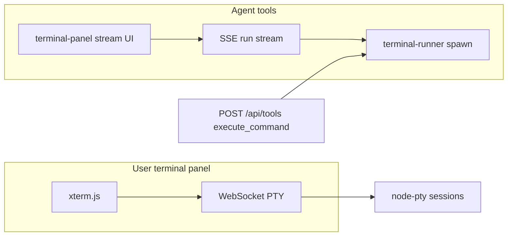

# Feature 06–09 — Interactive PTY terminal (tabs, shells, history)

**Feature ID:** `feature-06-07-08-09-terminal-pty`  
**Epic:** D — Terminal (backlog **D1**)  
**Wave:** 6 (dedicated agent; spike first)  
**Backlog:** [`documentation/plans/product_backlog_agents_48a41af9.plan.md`](../product_backlog_agents_48a41af9.plan.md)  
**Size:** XL  
**Status:** Implemented (Epic D1)  
**Depends on:** Step 10 terminal panel + run/SSE API (shipped in codebase; historical build doc `step-10-terminal-panel.md` removed from repo — behavior documented in [`documentation/context.md`](../../context.md) § Terminal panel)  
**Blocks:** Nothing in backlog; Wave 6 is intentionally isolated from chat/workspace waves  

**Grouped scope:**

| Sub-feature | Deliverable |
|-------------|-------------|
| feature-06 | PTY host + WebSocket + xterm.js viewport |
| feature-07 | Multi-tab UI + persisted tab metadata |
| feature-08 | OS-gated shell profile catalog + default profile |
| feature-09 | Shell-native Tab completion; ↑/↓ (shell and/or Minnow ring buffer) |

---

## Problem

Minnow’s terminal panel is a **one-shot command runner** with streamed stdout/stderr. It works for agent `execute_command` and a single-line user “Run” box, but it is **not** an interactive shell: no TTY, no cursor control, no readline Tab completion, no persistent session, and no multi-tab REPL-style workflows (`npm test` with prompts, `git rebase -i`, `python` REPL, etc.).

**User-locked goal (backlog):** full interactive **PTY** in the browser — tabs, OS-gated shell profiles, per-tab ↑/↓ command history, Tab completion via the shell’s readline.

---

## Current implementation (research)

### Server — `server/terminal-runner.js`

| Aspect | Behavior |
|--------|----------|
| Model | **Run registry** (`activeRuns` map): each invocation is a finite `createRun()` → `finishRun()` lifecycle |
| Spawn | `runProcess()` from [`server/process-runner.js`](../../../server/process-runner.js) — `child_process.spawn`, **not** a PTY |
| Windows | One-shot strings go through `cmd.exe /d /s /c` (no interactive shell) |
| Streaming | In-memory listeners + optional log file `~/.minnow/logs/terminal/<runId>.log` |
| Limits | 30s timeout (`COMMAND_TIMEOUT_MS`), 2MB buffer per run |
| Agent path | `executeCommandBlocking()` — same runner, no SSE required |
| History | `TerminalRunRecord[]` on chat in `sessions/state.json` (max 50), keyed by **run id** not shell session |

### HTTP — `server/terminal/middleware.js`

| Route | Purpose |
|-------|---------|
| `POST /api/terminal/run` | Start run; body: `command`, `args?`, `cwd`, `shell?`, `source`, `chatId?` |
| `GET /api/terminal/stream/:runId` | SSE: `meta`, `stdout`, `stderr`, `exit`, `error` |
| `POST /api/terminal/cancel/:runId` | `SIGTERM` on child when still active |
| `GET /api/terminal/history?chatId=` | Persisted run list |
| `GET /api/terminal/log/:runId` | Log tail for history replay |

Registered only when **`npm start`** runs (`server.js` → Vite `configureServer` → `createTerminalMiddleware`). **`npm run dev`** has no terminal API (offline banner in UI).

### Client — `src/ui/terminal-panel.ts`

| Aspect | Behavior |
|--------|----------|
| Output | `<pre id="terminalOutput">` — plain text + `.stderr-line` spans |
| Input | Single `<input>` + **Run** submit (one command per submit) |
| History sidebar | Per-**chat** list of **completed runs** (click → load log tail) |
| Agent integration | `runCommandWithTerminalStream()` from [`src/tools/client.ts`](../../../src/tools/client.ts) for `execute_command` / `run_javascript` / `run_python` |
| Prefs | `config.json` → `terminal: { open, heightPx, autoOpenOnAgentRun }` via [`src/config/terminal-meta.ts`](../../../src/config/terminal-meta.ts) |
| UX | `stickToBottom`, resize handle, Ctrl+` toggle, requires local server |

### What we keep vs replace

| Keep (agent / tools) | Replace / extend (user interactive) |
|----------------------|-------------------------------------|
| Run-based SSE pipeline for agents | xterm.js viewport + PTY WebSocket |
| `executeCommandBlocking` for `POST /api/tools` | New PTY session API |
| Per-chat **run** history for agent transparency | Per-tab **shell** sessions + optional scrollback buffer |
| `terminalHistory` on `Chat` | Add global/tab metadata (see schema) |

### Dependencies (`package.json` research)

| Package | Today | PTY feature |
|---------|-------|-------------|
| [`ws`](../../../package.json) `^8.20.1` | Used by CDP client (`server/cdp/client.js`) | Reuse for **terminal WebSocket** server attached to Vite HTTP |
| `node-pty` | **Not installed** | **Add** (native addon; prebuilds for common Node ABI) |
| `@xterm/xterm` + addons | **Not installed** | **Add** — `FitAddon`, `WebLinksAddon`; optional `WebglAddon` after spike |
| `child_process.spawn` | `server/process-runner.js` | Unchanged for agent runs |

**Install note:** `node-pty` requires native compile on first install unless a matching prebuild exists. Windows devs need **Visual Studio Build Tools** (C++) and Python for `node-gyp`. Document in README / context when shipping.

### Step 10 baseline (historical)

Step 10 delivered the **non-PTY** panel: docked UI, SSE streaming, per-chat run history, agent hook via `runCommandWithTerminalStream`, prefs in `terminal-meta`, logs under `~/.minnow/logs/terminal/`. Verification checklist lived in `documentation/plans/verification/step-10.md` (may be absent if docs were reorganized). **D1 extends** Step 10; it does not remove the run API.

---

## Decision: PTY vs agent runner (dual backend)

**Recommendation: keep both backends permanently.**



### Why not migrate agents to PTY

| Concern | Run runner (current) | PTY sessions |
|---------|----------------------|--------------|
| **Determinism** | Fixed command, 30s timeout, formatted tool result string | Long-lived; exit code only when shell exits |
| **Security / audit** | One command per tool call, log per `runId` | Shared shell state; harder to attribute output to one tool call |
| **Prompt contract** | `execute_command` expects bounded stdout/stderr in the tool result | Streaming into a tab does not replace structured tool output |
| **Concurrency** | Many parallel runs (separate children) | One shell per tab; agents would fight for stdin |
| **Implementation cost** | Already shipped + tested | New native dep, WebSocket upgrade path, session lifecycle |

### Integration rules

1. **User** types in the panel → **PTY only** (feature-06+).
2. **Agent** `execute_command` / `run_javascript` / `run_python` → **existing** `runCommandWithTerminalStream` + `terminal-runner` (unchanged).
3. **Optional later:** setting “mirror agent output to active PTY tab” — out of scope for D1; do not block PTY on it.
4. Deprecate the panel’s one-line **Run** input once xterm owns input; keep run history sidebar for **agent runs** (rename label in UI if needed).

---

## Spike: node-pty + xterm.js

**Goal:** de-risk native builds and Windows ConPTY before full feature work. Timebox: **1–2 days**.

### Spike tasks

- [ ] Add dependencies: `node-pty` (server), `@xterm/xterm` + `@xterm/addon-fit` + `@xterm/addon-web-links` (client, or equivalent current xterm package names).
- [ ] Minimal `server/terminal/pty-host.js`: spawn default shell with `cwd = workspaceRoot`, pipe `onData` / `write`, `resize(cols, rows)`.
- [ ] Upgrade Vite dev server HTTP → WebSocket on a dedicated path (e.g. `/api/terminal/ws`) using existing [`ws`](../../../package.json) dependency (same pattern as CDP client).
- [ ] Throwaway page or branch: single xterm instance, `FitAddon`, send keystrokes as UTF-8, render PTY output.
- [ ] Verify on **Windows 10/11** (ConPTY), **macOS**, **Linux** if available.
- [ ] Document build prerequisites in plan/README snippet (node-gyp, Python, VS Build Tools on Windows).

### Spike acceptance

| Check | Pass criteria |
|-------|---------------|
| Interactive shell | `ls`, `cd`, prompt redraw, Ctrl+C |
| Resize | Shrink/grow panel → `pty.resize` → `stty` or equivalent reflects cols/rows |
| Unicode / colors | `echo` with ANSI colors renders in xterm |
| npm lifecycle | `npm start` still boots; `npm run dev` still has **no** PTY (banner unchanged) |
| Clean exit | Close WebSocket → PTY killed, no zombie processes |

### Spike exit criteria (go / no-go)

- **Go:** node-pty builds and runs on primary dev OS (Windows for this repo owner).
- **No-go fallback:** document alternative (`@lydell/node-pty`, prebuild binaries, or defer Linux CI) — do not silently ship broken Windows PTY.

### Windows ConPTY (spike + ship checklist)

On Windows 10 build 1809+ and Windows 11, `node-pty` uses the **ConPTY** API (pseudo-console) instead of legacy winpty in modern releases. This repo’s primary dev OS is **Windows** — ConPTY validation is **release-blocking**.

| Topic | Spike action | Expected outcome |
|-------|--------------|------------------|
| **Build** | `npm install` with Node LTS used by the team | `node-pty` loads without `MODULE_NOT_FOUND` / ABI mismatch |
| **Interactive** | PowerShell + cmd tabs | Prompt, colors, `Ctrl+C`, `cls`, arrow keys |
| **Resize** | Drag `#terminalResize` + window width | No garbled lines; `FitAddon` + `pty.resize` keep cursor sane |
| **Encoding** | `echo` Unicode, `chcp 65001`, path with spaces | UTF-8 in xterm; document if legacy code page breaks glyphs |
| **npm scripts** | `npm test` in PTY tab | Spinner + colored output render (ANSI) |
| **Process hygiene** | Close tab / reload app | No lingering `pwsh.exe` / `node.exe` children in Task Manager |
| **WSL** | Optional `bash` via `wsl.exe` | Document detection; hide profile if WSL not installed |
| **Antivirus / corporate** | Note in QA | Rare blocks on native `.node` binaries — user workaround = rebuild |

**PowerShell default:** Prefer **`pwsh.exe`** (PowerShell 7+) when on PATH; fall back to `powershell.exe`. Spike records which executable is default and whether `-NoProfile` is acceptable.

**Do not** implement a Minnow-side ConPTY layer — delegate to `node-pty` and shell.

### Reference stack (industry standard)

| Layer | Library | Role |
|-------|---------|------|
| Emulator | [xterm.js](https://github.com/xtermjs/xterm.js) | DOM terminal, addons (fit, search, webgl optional) |
| Host | [node-pty](https://www.npmjs.com/package/node-pty) | Pseudoterminal, `spawn(shell, [], { cwd, cols, rows })` |
| Transport | WebSocket (binary or text UTF-8) | Bidirectional; prefer **text** + base64 only if binary needed |

**Avoid SSE for PTY:** Step 10 SSE is unidirectional except client cancel; PTY needs stdin. Do not overload `stream/:runId` with keyboard events.

---

## Security

PTY is strictly **more powerful** than one-shot runs. Treat as **local-dev-only**, same trust model as today’s terminal API.

### Threat model

| Threat | Mitigation |
|--------|------------|
| Arbitrary code execution | Already true for `execute_command`; PTY adds **interactive** persistence — user must run `npm start` locally |
| Path escape via `cd` | PTY `cwd` **initial** = workspace root; optional **watchdog** on `process.chdir` not practical — document that PTY is full user shell within OS permissions |
| Remote exposure | No bind beyond localhost in dev; if Minnow is ever hosted, **disable PTY** or require auth (out of scope) |
| `npm run dev` | No PTY routes registered — keep offline banner |
| Agent injection into user shell | Do not wire agent tools to PTY stdin in D1 |

### Cwd and environment

| Rule | Detail |
|------|--------|
| **Initial cwd** | `getWorkspaceRoot()` / `projectRoot` passed into middleware (same as `POST /api/terminal/run` today). Backlog “sanitize cwd” = **bind spawn cwd** to workspace root; user `cd` outside the tree is allowed (full OS shell). |
| **Env** | Inherit `process.env` but set `MINNOW_WORKSPACE_ROOT`, strip secrets if any are added later |
| **Full filesystem** | PTY is **not** gated by `toolSecurity.filesystemAccess` — that flag applies to **tool path APIs**, not the user’s own shell. Document in Settings: “Terminal has full shell access on your machine.” |
| **Command allowlist** | **Do not** implement for user PTY (unworkable for real shells). Agent runner keeps timeout + logging. |

### Session limits

| Limit | Suggested default |
|-------|-------------------|
| Max PTY sessions | 8 |
| Max scrollback per session | 512 KB in server RAM (optional persist to `~/.minnow/logs/pty/<id>.scroll`) |
| Idle timeout | None for D1 (user expectation: long-running dev server) |
| Kill on disconnect | Yes — `req.on('close')` / WebSocket `close` → `pty.kill()` |

### Audit

- Log session **create/destroy** with `{ sessionId, shell, cwd, pid }` to `~/.minnow/logs/terminal/pty-sessions.log` (no keystroke logging).

---

## API design

### New PTY routes (additive)

Keep all existing `/api/terminal/run|stream|history|log|cancel` routes for agent runs.

| Method | Path | Body / params | Response |
|--------|------|---------------|----------|
| `POST` | `/api/terminal/session` | `{ shellProfileId?, cwd?, cols?, rows?, chatId? }` | `{ sessionId, shell, cwd, pid? }` |
| `GET` | `/api/terminal/ws` | Upgrade; query `sessionId=` (backlog alt: `/api/terminal/ws/:sessionId` path param — pick one in PR 1) | WebSocket binary/text PTY I/O |
| `POST` | `/api/terminal/session/:id/resize` | `{ cols, rows }` | `{ ok: true }` |
| `DELETE` | `/api/terminal/session/:id` | — | `{ ok: true }` |
| `GET` | `/api/terminal/sessions` | `?chatId=` optional | `{ sessions: TerminalSessionMeta[] }` |

### WebSocket protocol (proposal)

**Client → server**

```json
{ "type": "input", "data": "<utf-8 string>" }
{ "type": "resize", "cols": 120, "rows": 32 }
```

**Server → client**

```json
{ "type": "output", "data": "<utf-8 string>" }
{ "type": "exit", "code": 0 }
{ "type": "meta", "sessionId": "...", "shell": "powershell" }
```

Use a single JSON line per message for debuggability; optimize to raw frames only if profiling shows bottleneck.

### Middleware layout

| File | Responsibility |
|------|----------------|
| `server/terminal/pty-host.js` | Session map, spawn/kill/resize, `node-pty` |
| `server/terminal/pty-ws.js` | WebSocket attach, auth gate (localhost-only) |
| `server/terminal/middleware.js` | Extend `handleTerminalRequest` or delegate PTY paths |
| `server.js` | Register WS on Vite `httpServer` (investigate `server.httpServer` in Vite 5 configureServer) |

### Vite + WebSocket wiring (implementation note)

Today `createTerminalMiddleware` is a **connect** middleware (HTTP only). PTY requires **HTTP upgrade** on the same port as the SPA (5173).

**Proposed pattern:**

1. In `server.js` `configureServer`, capture `server.httpServer` from the Vite dev server callback.
2. `import { WebSocketServer } from 'ws'` and attach `noServer: true` WSS, or use `WebSocketServer({ server: httpServer, path: '/api/terminal/ws' })`.
3. On `upgrade` request, validate `pathname` and `sessionId` query before accepting.
4. Reject upgrades when `req.socket.remoteAddress` is not loopback (defense in depth).

Mirror error handling from CDP: connection `close` → `pty.kill()` in `pty-host`.

**Why not a second port:** Avoid CORS/origin mismatch; keep “one URL” mental model for users (`npm start` → browser → same host).

---

## Feature-07 — Tabs

### UX

- Tab bar in `.terminal-header`: **+** new tab, close tab, middle-click close optional.
- Each tab ↔ one `sessionId` (PTY).
- Active tab drives xterm instance (single xterm, swap attach buffer **or** one xterm per tab — prefer **one xterm**, swap session attachment to save memory).
- Tab title: shell profile short name + optional cwd basename; truncate.

### Persistence

Extend `config.json` → `terminal`:

```ts
interface TerminalTabMeta {
  id: string;           // sessionId or client tab id
  shellProfileId: string;
  title?: string;
  chatId?: string | null;  // null = global terminal
  order: number;
}

interface TerminalMeta {
  open: boolean;
  heightPx: number;
  autoOpenOnAgentRun: boolean;
  tabs?: TerminalTabMeta[];
  activeTabId?: string | null;
}
```

**Decision:** default tabs are **global** (not per-chat) so `cd` persists when switching chats; optional `chatId` on tab for “scoped to chat” can be phase 2.

### Lifecycle

| Event | Action |
|-------|--------|
| Open panel | Restore tabs from meta; recreate PTY for each (or lazy-create on first focus) |
| New tab | `POST /api/terminal/session` + add tab meta |
| Close tab | `DELETE session` + remove meta |
| App reload | Tabs metadata restored; sessions **re-created** (new PTYs) — scrollback optionally from server buffer |

---

## Feature-08 — Shell profiles

### Profile catalog (OS-gated)

| `shellProfileId` | Windows | macOS | Linux |
|------------------|---------|-------|-------|
| `powershell` | `pwsh.exe` or `powershell.exe` | — | — |
| `cmd` | `cmd.exe` | — | — |
| `bash` | WSL `bash` if detected, else hide | `/bin/bash` | `/bin/bash` |
| `zsh` | — | `/bin/zsh` | `/bin/zsh` |

Detection at server startup: build `availableShellProfiles[]` once, expose `GET /api/terminal/shell-profiles`.

### UI

- Dropdown in terminal header (left of tab bar): changes shell for **new** tabs only, or prompts “New tab required” when changing profile.
- Settings → Terminal: default profile id (extends `terminal-meta`).

### Args / flags

| Shell | Suggested spawn |
|-------|-----------------|
| PowerShell | `['-NoLogo']` (pwsh: `-NoLogo -NoProfile` optional; document if `-NoProfile` breaks user tooling) |
| cmd | default |
| bash/zsh | `-l` optional (login shell) — spike whether login shell breaks cwd |

---

## Feature-09 — Command history and Tab completion

### Tab completion

**No custom implementation.** With PTY + xterm, **Tab** sends `0x09` to the shell; readline/bash/zsh/PowerShell handle completion. Acceptance: `cd` + Tab, `git che` + Tab, `npm` + Tab work in each profile.

### ↑/↓ command history

| Source | Scope |
|--------|-------|
| **Shell history** | Works automatically in PTY for bash/zsh/PowerShell (shell’s own `.bash_history` etc.) |
| **Minnow per-tab history** | Optional enhancement: ring buffer of submitted **full lines** (detect Enter), max 500, stored in `sessionStorage` or `config.json` under tab id |

Implementation (Minnow layer):

- [ ] On xterm `onData`, buffer until `\r` / `\n`, push line to `tabHistory[]`.
- [ ] ↑/↓ when xterm cursor at prompt (heuristic: last line) → inject previous/next line **or** let shell handle if PTY already does — **spike which feels better on Windows PowerShell**.
- [ ] Do not duplicate agent run history sidebar; rename sidebar to **“Agent runs”** for clarity.

---

## File change list (implementation)

### New files

| Path | Purpose |
|------|---------|
| `server/terminal/pty-host.js` | PTY session registry |
| `server/terminal/pty-ws.js` | WebSocket bridge |
| `server/terminal/shell-profiles.js` | OS detection + spawn argv |
| `src/ui/terminal-xterm.ts` | xterm mount, FitAddon, WS client |
| `src/ui/terminal-tabs.ts` | Tab bar DOM + meta sync |
| `src/api/terminal-pty.ts` | session CRUD + WS URL helper |
| `test/terminal/pty-session.test.mjs` | Integration (server required) |

### Modified files

| Path | Change |
|------|--------|
| `package.json` | Add `node-pty`, `@xterm/xterm`, addons |
| `server/terminal/middleware.js` | PTY REST routes |
| `server.js` | Attach WebSocket server to Vite HTTP server |
| `src/ui/terminal-panel.ts` | Orchestrate tabs + xterm; remove `<pre>` output + Run form for user shell |
| `src/config/terminal-meta.ts` | `tabs`, `activeTabId`, `defaultShellProfileId` |
| `index.html` | Tab bar, shell `<select>`, xterm host `div` |
| `src/styles/terminal.css` | xterm theming (match Minnow tokens) |
| `documentation/context.md` | Ship note + route table (when feature lands) |

### Unchanged (explicit)

| Path | Reason |
|------|--------|
| `server/terminal-runner.js` | Agent / blocking tools |
| `src/tools/client.ts` | Agent streaming path |
| `test/terminal-stream.test.mjs` | Regression for run/SSE API |

---

## Schema / migration

| Store | Change |
|-------|--------|
| `~/.minnow/config.json` | `terminal.tabs[]`, `terminal.activeTabId`, `terminal.defaultShellProfileId` — optional fields, backward compatible |
| `sessions/state.json` | **No change required** for PTY; keep `Chat.terminalHistory` for agent runs |
| Validators | Extend config meta validator if terminal block is validated server-side |

---

## Acceptance criteria

### feature-06 — PTY core

- [ ] User opens terminal with `npm start`, sees xterm canvas (not `<pre>` stream).
- [ ] Interactive commands work: `cd`, `npm test`, colored output, Ctrl+C.
- [ ] Panel resize reflows columns/rows (FitAddon + `resize` API).
- [ ] `npm run dev` shows offline banner; no WebSocket connection attempted.

### feature-07 — Tabs

- [ ] **+** opens second tab; each tab has independent PTY (parallel `npm run watch` in both).
- [ ] Close tab kills server session; other tabs unaffected.
- [ ] Tab layout persists across reload (tab count/profile); shells reconnect.

### feature-08 — Shell profiles

- [ ] Dropdown lists only shells available on current OS.
- [ ] New tab uses selected profile (PowerShell vs cmd vs bash verified on Windows).
- [ ] Default profile configurable and persisted.

### feature-09 — History & completion

- [ ] **Tab** completes paths/commands in shell (no Minnow-specific completion UI).
- [ ] **↑/↓** recalls prior commands (shell and/or Minnow per-tab buffer — document which won in spike).
- [ ] Agent `execute_command` still streams to panel when `autoOpenOnAgentRun` and still appears in **Agent runs** history.

### Regression

- [ ] `node test/terminal-stream.test.mjs http://localhost:5173` passes unchanged.
- [ ] `npm test` green.
- [ ] Tool permission gate / approval flow unchanged for agent commands.

---

## Test plan

### Test pyramid

```text
                    ┌─────────────────────┐
                    │ Manual QA (Win/mac) │  ConPTY, shells, UX
                    ├─────────────────────┤
                    │ Integration (HTTP)  │  pty-session.test.mjs (npm start)
                    ├─────────────────────┤
                    │ Unit (Node, no PTY) │  shell-profiles, meta validators
                    └─────────────────────┘
```

PTY integration tests **cannot** mock `node-pty` meaningfully in `node --test` without native spawn — split **unit** (pure JS) vs **integration** (requires server, like `test/terminal-stream.test.mjs`).

### Automated — regression (must stay green)

| Test | Command | Scope |
|------|---------|-------|
| SSE terminal API | `node test/terminal-stream.test.mjs http://localhost:5173` | `POST /run`, `GET /stream`, history, log, cancel, 400/404 |
| Full suite | `npm test` | No breakage in tools, config, UI tests |
| Agent code tools | Manual or extend `test/tools` | `execute_command` still uses SSE path, not WS |

**Gate:** Ship PTY only if `terminal-stream.test.mjs` passes unchanged after middleware refactor.

### Automated — new (add to `npm test` where feasible)

| File | Cases | Runner notes |
|------|-------|--------------|
| `test/terminal/shell-profiles.test.mjs` | `resolveProfiles('win32')` → powershell, cmd; darwin → bash, zsh; linux → bash | Mock `process.platform` via injected param (no spawn) |
| `test/terminal/pty-protocol.test.mjs` | JSON message encode/decode, max message size guard | Pure functions from `pty-ws.js` |
| `test/terminal/pty-session.test.mjs` | `POST /session` → 200 + `sessionId`; WS connect; send `input` `echo hello`; receive `output` containing `hello`; `DELETE` → 404 on reuse | **Requires** `npm start`; document in file header; CI optional job `test:terminal-pty` |
| `test/config/terminal-meta.test.mjs` (optional) | `tabs[]`, `activeTabId`, `defaultShellProfileId` normalization | If server validates `terminal` block |

**CI strategy:** Default `npm test` runs unit tests only; `npm run test:terminal-pty` runs integration when `TERMINAL_TEST_BASE=http://127.0.0.1:5173` is set (spawn server in job or use fixed port).

### Automated — client (happy-dom)

| File | Cases |
|------|-------|
| `test/ui/terminal-tabs.test.mjs` | Tab add/close updates meta patch; active tab id |
| `test/ui/terminal-xterm.test.mjs` (light) | WS URL builder includes `sessionId`; offline does not call `connect` |

Avoid mounting real xterm in unit tests (canvas/DOM weight); smoke xterm in spike/manual only.

### Manual QA matrix (Windows-primary)

| # | Scenario | Steps | Pass |
|---|----------|-------|------|
| M1 | PTY core | `npm start` → Terminal → PowerShell → `cd` workspace subfolder → `npm -v` | Prompt + colors; cwd follows `cd` |
| M2 | Tab completion | In PTY: `git che` + **Tab** | Shell completes (not Minnow UI) |
| M3 | History | **↑** after `echo A` then `echo B` | Prior command recalled (shell or Minnow buffer per spike) |
| M4 | Second tab | **+** tab → cmd → `echo %CD%` | Independent output; both alive |
| M5 | Close tab | Close cmd tab | Process gone; PowerShell tab still works |
| M6 | Resize | Drag terminal height + narrow window | No permanent layout corruption |
| M7 | Ctrl+C | Long-running command → Ctrl+C | Process interrupted; shell usable |
| M8 | Agent run | Chat with `execute_command` | SSE output in panel; **Agent runs** sidebar entry; PTY tab stdin untouched |
| M9 | Reload | F5 with 2 tabs configured | Tab chrome restores; new PTYs; no zombie processes |
| M10 | dev-only | `npm run dev` | Offline banner; no WS connection errors in console |
| M11 | Unicode | `echo café`, `dir` path with spaces | Readable output |
| M12 | Permission UX | Settings → Terminal blurb | User informed shell is full machine access |

### Manual QA — macOS / Linux (if available)

| # | Scenario | Pass |
|---|----------|------|
| L1 | bash tab | `echo $SHELL`, Tab completion |
| L2 | zsh tab (macOS) | Same as L1 |
| L3 | `node-pty` install | `npm install` succeeds on CI runner OS |

### Edge-case / failure tests

| Case | Expected |
|------|----------|
| WS disconnect mid-command | Server kills PTY; client shows “Session ended” + reconnect affordance (phase 2) or clear tab |
| Invalid `sessionId` on WS | Close with 4404-style code or HTTP 404 before upgrade |
| 9th tab open | Server rejects with clear error; UI toast |
| Scrollback flood (`yes` / huge cat) | RAM cap truncates or drops oldest; UI stays responsive |
| xterm hidden panel | Pause WS or stop FitAddon refresh until panel visible (battery/CPU) |
| `MINNOW_HOME` test profile | PTY logs under test home, not real `~/.minnow` |

### Accessibility (manual)

- Terminal toggle: `aria-expanded` on `#btnTerminal` still accurate.
- Tab bar: roving tabindex or `role="tablist"` / `aria-selected` on active tab.
- xterm: document keyboard focus trap — focus terminal on panel open (`term.focus()`).

### Performance (manual, optional)

- 10k lines `cat large.log` — scrollback cap prevents browser hang.
- 4 tabs each running `top` or watch — acceptable CPU on dev machine.

---

## Implementation todos (ordered)

### Phase 0 — Spike

- [ ] **S0.1** Add `node-pty` + xterm packages; confirm `npm install` on Windows.
- [ ] **S0.2** Prototype `pty-host.js` + WebSocket echo shell.
- [ ] **S0.3** Prototype `terminal-xterm.ts` fit + input.
- [ ] **S0.4** Spike write-up in PR / comment: ConPTY code page, PowerShell ↑/↓ behavior.

### Phase 1 — feature-06 PTY core

- [ ] **1.1** Implement `pty-host.js` session registry + limits.
- [ ] **1.2** Implement `pty-ws.js` + wire into `server.js` HTTP server.
- [ ] **1.3** REST `POST/DELETE /api/terminal/session`, `POST resize`.
- [ ] **1.4** Replace panel body with xterm; remove user Run `<form>`.
- [ ] **1.5** Theme xterm to match [`src/styles/tokens.css`](../../../src/styles/tokens.css).

### Phase 2 — feature-08 shells (before tabs simplifies testing)

- [ ] **2.1** `shell-profiles.js` + `GET /api/terminal/shell-profiles`.
- [ ] **2.2** Header dropdown + `defaultShellProfileId` in meta.
- [ ] **2.3** Settings section copy for “full shell access” warning.

### Phase 3 — feature-07 tabs

- [ ] **3.1** `terminal-tabs.ts` + `index.html` tab bar.
- [ ] **3.2** Persist `terminal.tabs` / `activeTabId`.
- [ ] **3.3** Lazy session create on tab focus; kill on close.

### Phase 4 — feature-09 history

- [ ] **4.1** Verify Tab completion via PTY (acceptance only).
- [ ] **4.2** Implement per-tab ↑/↓ ring buffer if spike shows shell history insufficient on Windows.
- [ ] **4.3** Rename history sidebar to “Agent runs”.

### Phase 5 — Docs & hardening

- [ ] **5.1** Update `documentation/context.md` routes + architecture diagram.
- [ ] **5.2** `test/terminal/pty-session.test.mjs` in `npm test` (skip if server not up, or spawn test server).
- [ ] **5.3** Optional: scrollback cap + session audit log.
- [ ] **5.4** Add [`documentation/plans/verification/feature-06-09.md`](../verification/feature-06-09.md) sign-off checklist (copy § Test plan manual matrix).

---

## Verifier handoff

Create [`documentation/plans/verification/feature-06-09.md`](../verification/feature-06-09.md) on ship:

- **Automated:** `npm test`; `node test/terminal-stream.test.mjs http://127.0.0.1:5173` (regression); new `test/terminal/shell-profiles.test.mjs`, `pty-protocol.test.mjs`; optional `npm run test:terminal-pty` for `pty-session.test.mjs`.
- **Manual:** M1–M12 (Windows-primary), L1–L3 if macOS/Linux available; spike ConPTY checklist.
- **Sign-off:** Dual backend unchanged for agents; D1 acceptance (PTY, tabs, profiles, Tab/↑/↓, resize) — see verification doc PASS/FAIL gate.

---

## Open questions (resolve in spike or PR 1)

1. **PowerShell executable:** `pwsh` vs Windows PowerShell 5 — which is default on target machines?
2. **WSL bash:** auto-detect `wsl.exe` for `bash` profile on Windows, or require manual enable?
3. **Tab ↔ chat binding:** global tabs (recommended) vs per-chat tabs — product call.
4. **xterm WebGL addon:** performance vs bundle size on low-end GPUs.
5. **Vite WS upgrade:** confirm `configureServer` hook exposes `httpServer` for `ws` attachment in Vite 5.4.

---

## Risks and mitigations

| Risk | Impact | Mitigation |
|------|--------|------------|
| `node-pty` fails to build on Windows | Blocks D1 | Spike first; document VS Build Tools; pin `node-pty` version with known prebuilds |
| Vite `httpServer` WS upgrade awkward | Blocks PTY | Spike in Phase 0; fallback standalone WS port only if unavoidable |
| Mixing agent SSE + user PTY confuses users | UX | Rename sidebar “Agent runs”; never attach tools to PTY stdin |
| Zombie processes on crash | Machine pollution | `process.on('exit')` sweep; WS `close` always kills PTY |
| Bundling xterm increases JS size | Load time | Lazy-import `terminal-xterm.ts` when panel first opened |

---

## References

| Resource | Link |
|----------|------|
| Current panel | [`src/ui/terminal-panel.ts`](../../../src/ui/terminal-panel.ts) |
| Current runner | [`server/terminal-runner.js`](../../../server/terminal-runner.js) |
| Terminal middleware | [`server/terminal/middleware.js`](../../../server/terminal/middleware.js) |
| Process runner | [`server/process-runner.js`](../../../server/process-runner.js) |
| Terminal API client | [`src/api/terminal.ts`](../../../src/api/terminal.ts) |
| Agent streaming | [`src/tools/client.ts`](../../../src/tools/client.ts) (`execute_command` → `runCommandWithTerminalStream`) |
| Context (Step 10) | [`documentation/context.md`](../../context.md) § Terminal panel |
| SSE integration test | [`test/terminal-stream.test.mjs`](../../../test/terminal-stream.test.mjs) |
| Backlog D1 | [`product_backlog_agents_48a41af9.plan.md`](../product_backlog_agents_48a41af9.plan.md) § Epic D |
| node-pty | https://www.npmjs.com/package/node-pty |
| xterm.js | https://github.com/xtermjs/xterm.js |
