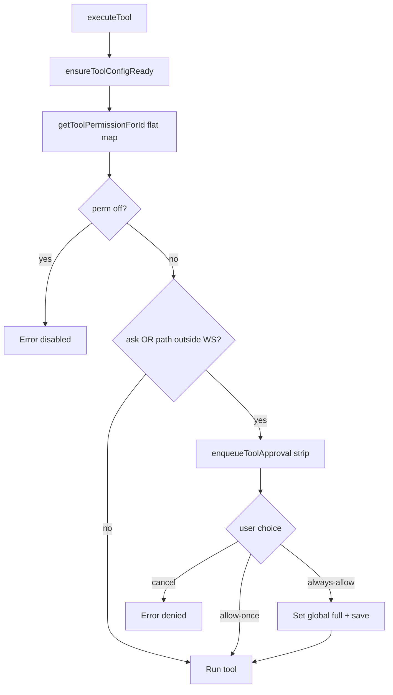

# Feature #6 — Approval gates with patterns

**Roadmap:** [`feature-audit-roadmap.md`](../feature-audit-roadmap.md) item **#6** (quick win).  
**Architecture context:** [`documentation/context.md`](../../context.md) — Tool approval (execution gate), `minnow.tools` shape.  
**Status:** Partial → target **Built** for agent-scoped overrides, argument patterns, and sticky per-agent “always allow”.

---

## YAML todos

```yaml
todos:
  - id: f06-schema
    content: Define ToolPermissionsV2 types + migrate flat permissions → default on read/write
    status: pending
  - id: f06-agent-key
    content: Propagate agentKey (workAgentId | subAgentType | main) through ExecuteToolContext → permission gate
    status: pending
  - id: f06-resolve
    content: Implement resolveToolPermission() — patterns → perAgent → default → path guard unchanged
    status: pending
  - id: f06-pattern-engine
    content: Add matchApprovalPatterns(toolId, args, agentKey) with startsWith/equals matchers (regex opt-in later)
    status: pending
  - id: f06-modal-sticky
    content: Extend approval strip — Always allow scopes to current agent; show matched pattern in UI
    status: pending
  - id: f06-server-validate
    content: Mirror normalization in server/config/validators.js normalizeToolConfig
    status: pending
  - id: f06-settings-ui
    content: Settings → Tools — per-agent override matrix + pattern list CRUD
    status: pending
  - id: f06-tests
    content: Unit tests for resolution order, migration, pattern match, per-agent always-allow
    status: pending
  - id: f06-docs
    content: Update documentation/context.md tools + approval sections
    status: pending
```

---

## Current state

### What works today

| Layer | Behavior | Key files |
|-------|----------|-----------|
| **Global permission** | Each tool id: `full` \| `ask` \| `off` in `ToolConfig.permissions` | [`src/tools/tool-settings-types.ts`](../../../src/tools/tool-settings-types.ts), [`src/tools/config.ts`](../../../src/tools/config.ts) |
| **Execution gate** | `ask` → approval strip; `full` → skip unless path escapes workspace | [`src/tools/permission-gate.ts`](../../../src/tools/permission-gate.ts) |
| **Approval UI** | Inline strip in `#toolApprovalHost`: Allow once / Always allow / Cancel; hotkeys 1–3 | [`src/ui/tool-approval-modal.ts`](../../../src/ui/tool-approval-modal.ts) |
| **Queue** | Serialized modals | [`src/tools/approval-queue.ts`](../../../src/tools/approval-queue.ts) |
| **Always allow** | Writes **global** `permissions[toolId] = 'full'` + `PUT /api/config/tools` | `permission-gate.ts` L83–86 |
| **Path policy** | `full` still prompts when args leave workspace under `filesystemAccess: workspace` | `toolInvocationWouldPrompt()` + [`src/tools/workspace-path-guard.ts`](../../../src/tools/workspace-path-guard.ts) |
| **Sub-agent visibility** | Badge `Sub-agent · {type}` on strip; `subAgentType` in context | [`src/tools/client.ts`](../../../src/tools/client.ts), modal |
| **Sub-agent tool subset** | `allowedTools` / `deniedTools` on type config (visibility to model, not approval mode) | [`src/agents/sub-agent-tools.ts`](../../../src/agents/sub-agent-tools.ts) |
| **Work agent tool subset** | `allowedTools` filters definitions sent to model | [`src/tools/loop.ts`](../../../src/tools/loop.ts), [`src/agents/work-agent-types.ts`](../../../src/agents/work-agent-types.ts) |
| **Persistence** | `~/.minnow/tools.json` via `GET/PUT /api/config/tools` | [`server/config/validators.js`](../../../server/config/validators.js) `normalizeToolConfig` |
| **Tests** | Path + `ask`/`full` prompt heuristics only | [`test/tools/permission-gate.test.mts`](../../../test/tools/permission-gate.test.mts) |

### Persisted shape (today)

```json
{
  "enabled": { "read_file": true },
  "permissions": {
    "execute_command": "ask",
    "read_file": "full"
  },
  "keys": { "braveApiKey": "" }
}
```

`permissions` is a **flat** `Record<toolId, ToolPermissionMode>`.

### Resolution flow (today)



---

## Gap (explicit)

From roadmap and product intent:

1. **Per-agent override matrix** — Same tool can be `ask` for the main Builder chat but `full` for `sub-agent:shell` or `work-agent:reviewer`, without changing global defaults.
2. **Argument-pattern auto-approve** — e.g. `execute_command` when `command` starts with `git status` or `npm test` skips the strip even if global mode is `ask`.
3. **Sticky “always allow for this agent”** — “Always allow” today promotes the tool to **global** `full`; users need a durable **agent-scoped** grant (and optionally a pattern row instead of whole-tool full).

**Not in scope for v1 (document only):**

- Project-scoped `.minnow/` overrides ([#22](feature-audit-roadmap.md)) — design agent keys so `workspacePath` can suffix keys later.
- Headless `--no-approval` ([#18](feature-audit-roadmap.md)) — separate flag; may bypass gate entirely.
- Server-side pattern enforcement — v1 stays **client gate** (same trust model as today); server path guard remains authoritative for FS.

---

## Goals

1. **Layered policy** without breaking existing `tools.json` files.
2. **Predictable resolution order** so debugging “why no modal?” is straightforward.
3. **Minimal UX change** for users who only use global Settings → Tools.
4. **First-class sub-agent + work-agent keys** aligned with existing `subAgentType` and `chat.workAgentId`.
5. **Safe defaults** for patterns (no regex by default; cap pattern count).

---

## Acceptance criteria

### Functional

- [ ] Existing flat `permissions` objects load unchanged (migrated in-memory to `permissions.default`).
- [ ] **Pattern match** on `(toolId, normalized args, agentKey)` returns auto-approve (no strip) when global mode is `ask`, and does not bypass **path-outside-workspace** prompt.
- [ ] **Per-agent override** `permissions.perAgent[agentKey][toolId]` wins over `permissions.default[toolId]` when no matching pattern.
- [ ] **Always allow** on strip with active agent context writes `perAgent[agentKey][toolId] = 'full'` (not global), persisted to `tools.json`.
- [ ] **Always allow** with no agent context (legacy main turn, `workAgentId` null) continues to set **global** `default[toolId] = 'full'` (backward compatible).
- [ ] Sub-agent runs pass `agentKey = sub-agent:{type}` (or agreed convention) into the gate; badge still shows human label.
- [ ] Main chat passes `agentKey = work-agent:{id}` or `main` when `workAgentId` is null.
- [ ] Settings → Tools exposes: global table (unchanged), **per-agent overrides** subsection, **auto-approve patterns** list (add/edit/delete).
- [ ] `ask_question` remains exempt from this gate (unchanged).

### Non-functional

- [ ] `normalizeToolConfig` (client + server) rejects invalid pattern rows without wiping the file.
- [ ] Pattern list capped (e.g. 64 entries); `startsWith` / `equals` only in v1.
- [ ] `npx tsc --noEmit` clean; new tests in `test/tools/`.

### Examples (manual QA)

| Scenario | Expected |
|----------|----------|
| Global `execute_command: ask`, pattern `command startsWith "git status"`, args `{ command: "git status" }` | No strip |
| Same, args `{ command: "rm -rf /" }` | Strip |
| Global `ask`, `perAgent["sub-agent:shell"]["execute_command"] = full` | No strip for that sub-agent only |
| `full` global, path outside workspace, workspace FS mode | Strip (path warning) |
| Always allow on sub-agent strip | Only that agent key gets `full`; global stays `ask` |

---

## Architecture

### Target `ToolConfig.permissions` shape

Extend the field from a flat map to a **versioned object** (name the type `ToolPermissionsConfig`):

```typescript
/** Agent scope for overrides and patterns. */
export type ToolAgentKey = string; // e.g. "main", "work-agent:builder", "sub-agent:shell"

export interface ApprovalPattern {
  /** Stable id for UI delete (uuid). */
  id: string;
  /** Built-in or mcp__ tool id. */
  toolId: string;
  /** "main" | "work-agent:<id>" | "sub-agent:<type>" | "*" for all agents. */
  agentScope: ToolAgentKey | '*';
  /** Dot path into args, e.g. "command", "path". */
  argPath: string;
  match: 'startsWith' | 'equals';
  value: string;
}

export interface ToolPermissionsConfig {
  /** Former flat map — global default per tool id. */
  default: Record<string, ToolPermissionMode>;
  /** Optional per-agent overrides. */
  perAgent: Record<ToolAgentKey, Record<string, ToolPermissionMode>>;
  /** Auto-approve rules evaluated before perAgent/default. */
  patterns: ApprovalPattern[];
}
```

`ToolConfig` becomes:

```typescript
export interface ToolConfig {
  enabled: Record<string, boolean>;
  permissions: ToolPermissionsConfig;
  keys: { braveApiKey: string };
}
```

### Migration (read path)

In `normalizeToolConfig` ([`src/tools/config.ts`](../../../src/tools/config.ts)):

1. If `stored.permissions` is a record whose **first value** is `full`|`ask`|`off` → treat as **legacy flat** → `permissions = { default: stored.permissions, perAgent: {}, patterns: [] }`.
2. If already object with `default` object → validate `perAgent` / `patterns` arrays.
3. Run existing `syncEnabledFromPermissions` against **`permissions.default`** (and optionally union: tool is enabled if any scope is not `off` — **decision:** v1 keeps **enabled mirror from default only** to avoid surprising global enablement; document in UI).

### Permission resolution order

New module: **`src/tools/permission-resolve.ts`** (pure functions, easy to test).

```
1. If effective mode for tool is `off` → disabled (no modal, error in gate).
2. If any pattern matches (toolId, args, agentKey) → treat as `full` for permission ack
   (path-outside-workspace check still runs separately).
3. Else perAgent[agentKey][toolId] ?? perAgent['*'][toolId].
4. Else permissions.default[toolId] (via existing getToolPermissionForId logic).
5. Path guard: if filesystemAccess === 'workspace' and path args escape → prompt
   regardless of step 2–4 effective mode (preserve toolInvocationWouldPrompt behavior).
```

**Pattern matching:**

- Resolve `argPath` with shallow dot walk (`command`, `path`, nested `options.cwd` if needed later).
- Compare stringified arg value (trim) with `startsWith` / `equals`.
- `agentScope: '*'` applies to all keys; specific key beats `*` only for override matrix, but patterns should be **most-specific wins**: sort patterns so exact `agentScope` match ranks above `*`.

**Agent key derivation** (new helper `resolveToolAgentKey(context)`):

| Context | `agentKey` |
|---------|------------|
| `context.subAgentType` set | `sub-agent:{subAgentType}` |
| `context.workAgentId` set | `work-agent:{workAgentId}` |
| else | `main` |

Extend [`ExecuteToolContext`](../../../src/tools/client.ts) with optional `workAgentId?: string | null` (thread from [`src/tools/loop.ts`](../../../src/tools/loop.ts) `chat.workAgentId` and sub-agent spawn metadata).

### Gate + modal changes

| Component | Change |
|-----------|--------|
| [`permission-gate.ts`](../../../src/tools/permission-gate.ts) | Call `resolveEffectivePermission(...)` instead of flat `getToolPermissionForId`; pass `matchedPattern?: { label }` into approval request |
| [`tool-approval-types.ts`](../../../src/tools/tool-approval-types.ts) | Add `agentKey?`, `matchedPatternLabel?`, `alwaysAllowScope: 'global' \| 'agent'` |
| [`tool-approval-modal.ts`](../../../src/ui/tool-approval-modal.ts) | When `alwaysAllowScope === 'agent'`, button label **Always allow for this agent**; show pattern hint if auto-approve almost applied |
| [`permission-gate.ts`](../../../src/tools/permission-gate.ts) `always-allow` | Branch: write `perAgent[agentKey][toolId] = 'full'` or `default[toolId] = 'full'` |

Optional v1 enhancement: fourth action **Save as pattern…** pre-fills `execute_command` + `command` `startsWith` from current args (can defer to phase 2).

### Settings UI

| Area | Work |
|------|------|
| [`src/ui/settings-sections.ts`](../../../src/ui/settings-sections.ts) | Below global tool table: **Agent overrides** matrix (rows = known agent keys from work-agents registry + sub-agent types; cols = high-risk tools or searchable tool picker) |
| [`src/tools/config.ts`](../../../src/tools/config.ts) | CRUD helpers: `setAgentToolPermission`, `addApprovalPattern`, `removeApprovalPattern`, `listKnownAgentKeys()` |
| Drawer | Keep global selects; link “Manage per-agent rules →” to full settings |

Start with **sparse matrix** (only non-default cells stored) to keep JSON small.

### Server

[`server/config/validators.js`](../../../server/config/validators.js) `normalizeToolConfig`:

- Accept legacy flat + new shape.
- Strip unknown pattern fields; enforce max patterns; disallow `regex` until implemented.
- Ensure `enabled` sync from `permissions.default` only (match client).

---

## Key files

| Action | Path |
|--------|------|
| **Types** | `src/tools/tool-settings-types.ts` |
| **Normalize / persist** | `src/tools/config.ts`, `src/config/defaults.ts` |
| **Resolve** | `src/tools/permission-resolve.ts` (new) |
| **Gate** | `src/tools/permission-gate.ts` |
| **Context** | `src/tools/client.ts`, `src/tools/loop.ts`, `src/agents/sub-agent-runner.ts`, `src/agents/orchestrator.ts` |
| **Modal** | `src/ui/tool-approval-modal.ts`, `src/styles/tool-approval.css` |
| **Settings** | `src/ui/settings-sections.ts`, `src/ui/settings.ts` |
| **Server** | `server/config/validators.js` |
| **Docs** | `documentation/context.md` |
| **Tests** | `test/tools/permission-resolve.test.mts`, extend `permission-gate.test.mts` |
| **Fixtures** | `test/fixtures/migration/expected-tools.json` |

---

## Implementation phases

### Phase 1 — Schema + migration (no UX)

- Add `ToolPermissionsConfig` types and legacy detection in `normalizeToolConfig` (client + server).
- Update `getToolPermissionForId(config, id)` to read `config.permissions.default[id]` with fallback if `permissions` is accidentally still flat during dev.
- Update `setToolPermission` / bulk helpers to write `permissions.default`.
- Fix tests/fixtures; run `npm test` subset `test/tools/`.

**Exit:** Old `tools.json` loads; saves round-trip new shape without data loss.

### Phase 2 — Resolution engine + agent key

- Implement `permission-resolve.ts` + `resolveToolAgentKey(context)`.
- Wire `permission-gate.ts` / `toolInvocationWouldPrompt` to effective permission + patterns.
- Thread `workAgentId` through `ExecuteToolContext` from main loop and sub-agent executor.

**Exit:** Unit tests cover order table; manual: pattern skips modal for `git status`.

### Phase 3 — Sticky per-agent always allow

- Extend modal result handling and persistence (`perAgent` writes).
- Show agent badge + updated button copy when `agentKey !== 'main'`.

**Exit:** Always allow on sub-agent does not flip global Settings.

### Phase 4 — Settings UI for overrides + patterns

- Pattern list editor (tool select, agent scope, arg path, match, value).
- Per-agent override picker (tool + mode).
- Import/export not required for v1.

**Exit:** User can add pattern and override without editing JSON.

### Phase 5 — Docs + polish

- Update `context.md` JSON example and approval section.
- Optional: export constant suggested patterns (`git status`, `npm test`, `read_file` under `src/**`) as **documentation-only** presets user can click “Add”.

---

## Dependencies

| Dependency | Relationship |
|------------|----------------|
| **#22 Project-scoped configs** | Future: merge `tools.json` from `.minnow/`; agent keys stable. Not blocking v1. |
| **#18 Headless mode** | May add `--no-approval`; should skip gate after config load. |
| **Feature 29 bulk permissions** | Already shipped; bulk ops target `permissions.default` only. |
| **Work-agent / sub-agent registries** | UI matrix needs agent id lists from existing loaders. |
| **`npm start` / server storage** | PUT validation must accept new shape before modal “always allow” persists. |

**Suggested sequence:** Phase 1–3 shippable without Settings UI (power users can edit `tools.json`); Phase 4 completes the quick-win UX from roadmap.

---

## Tests

| Suite | Cases |
|-------|--------|
| `permission-resolve.test.mts` | Legacy flat migration; default vs perAgent; pattern `startsWith`/`equals`; `*` agentScope; specificity order; no match → ask |
| `permission-gate.test.mts` | Extend `toolInvocationWouldPrompt` with `effectivePerm` from resolver; path + pattern interaction |
| `config-bulk-permissions.test.mts` | Assert bulk apply touches `permissions.default` only |
| Migration fixture | `test/fixtures/migration/expected-tools.json` updated to new shape |
| Optional integration | tsx test: `normalizeToolConfig` parity client vs server validators |

**Determinism:** Fixed pattern ids in fixtures (`pattern-11111111-...`); fixed args objects; no `Date.now()`.

---

## Risks and mitigations

| Risk | Impact | Mitigation |
|------|--------|------------|
| **False-positive patterns** auto-approve dangerous commands | High | v1: `startsWith`/`equals` only; require non-empty value; show matched rule in strip when skipping; document risky tools |
| **Regex** ReDoS / complexity | Medium | Defer regex to v2; if added, timeout + compile cache |
| **Migration bugs** wipe permissions | High | Dual-read flat + object; round-trip test; server + client normalizers stay in sync |
| **Agent key drift** (`main` vs null work agent) | Medium | Single `resolveToolAgentKey`; document convention; tests for main + sub-agent |
| **`enabled` mirror confusion** | Low | Keep mirroring from `default` only; tooltip on per-agent overrides |
| **MCP tool ids** (`mcp__*`) | Medium | Patterns allow MCP ids; perAgent overrides use same string keys as today |
| **Always allow scope UX** | Low | Clear button labels; sub-agent badge already present |
| **Settings matrix size** | Low | Sparse storage; search/filter; don’t render full 55×N grid — use tool picker |

---

## Open decisions (resolve before Phase 4 UI)

1. **Union enablement:** Should a per-agent `full` on a globally `off` tool enable it for that agent only? **Recommendation:** No — `off` stays hard off everywhere; overrides only relax `ask` → `full`.
2. **Pattern on `path`:** Allow auto-approve for `read_file` under `src/` only? **Recommendation:** Yes, but warn in UI that server path guard still blocks escapes.
3. **Fourth action “Save as pattern”** in strip vs Settings-only editor — defer unless low effort.

---

## Reference snippets (current behavior)

Global always-allow today:

```83:86:src/tools/permission-gate.ts
  if (decision === 'always-allow') {
    config.permissions[permissionToolId] = 'full';
    await saveToolConfigAsync(config);
  }
```

Flat permission type today:

```8:17:src/tools/tool-settings-types.ts
export interface ToolConfig {
  /** Mirrored from permissions: true when mode is not `off` (backward-compatible JSON). */
  enabled: Record<string, boolean>;
  /** Per-tool execution policy; may include `mcp__*` ids not in the built-in catalog. */
  permissions: Record<string, ToolPermissionMode>;
  keys: {
    braveApiKey: string;
  };
}
```

---

## CI checklist

```bash
npx tsc --noEmit
npm test -- test/tools/
```

Manual: `npm start` → enable `execute_command` ask → run `git status` via agent with pattern → no strip; sub-agent strip → Always allow for this agent → global still ask.
