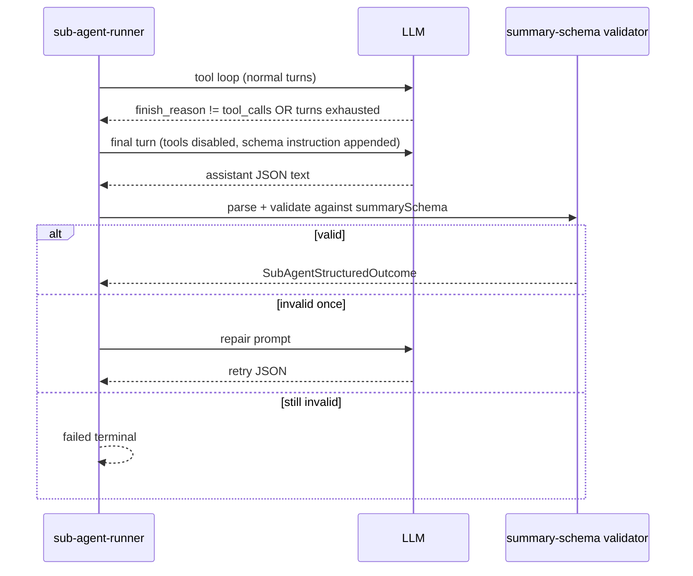

# Feature 07 — Sub-agent budgets and structured summaries

**Audit ref:** [feature-audit-roadmap.md §7](../feature-audit-roadmap.md) · **Context:** [context.md](../../context.md) (Sub-agent orchestration, Step 09) · **Related:** Feature #3 (main-chat `context-budget.ts` — share token estimation, different enforcement surface)

**Primary code today:** [`src/agents/sub-agent-config.ts`](../../../src/agents/sub-agent-config.ts), [`src/ui/sub-agent-drawer.ts`](../../../src/ui/sub-agent-drawer.ts), [`src/agents/sub-agent-runner.ts`](../../../src/agents/sub-agent-runner.ts), [`src/agents/orchestrator.ts`](../../../src/agents/orchestrator.ts)

---

## Summary

Extend sub-agent runs with a **declared input token budget** (`maxInputTokens` + enforcement policy) alongside existing **turn** (`maxToolTurns`) and **time** (`timeoutMs`) caps. Require a **structured final outcome** (`{ summary, findings[], artifacts[] }`) validated against a per-type **`summarySchema`**, and return that shape to the **parent** tool loop (aggregate JSON / status tools). Keep full transcripts in the **drawer** for humans; do not inject child message history into parent `chat.history`.

---

## Todos

```yaml
todos:
  - id: f07-schema-types
    content: Add SubAgentStructuredOutcome, summarySchema, maxInputTokens, contextPolicy to types + defaults merge
    status: pending
  - id: f07-context-budget-module
    content: Implement src/agents/sub-agent-context-budget.ts (estimate, enforce summarize|slide|truncate)
    status: pending
  - id: f07-runner-hook
    content: Wire budget checks into sub-agent-runner before each completion; emit budget events
    status: pending
  - id: f07-structured-final-turn
    content: Final-turn prompt + JSON parse/validate/repair for structured outcome
    status: pending
  - id: f07-orchestrator-aggregate
    content: Persist structured outcome on SubAgentRun; extend AggregateResult + 32KB formatter
    status: pending
  - id: f07-prompts-shipped
    content: Update shipped sub-agent prompts + envelope in sub-agent-prompt.ts for schema contract
    status: pending
  - id: f07-settings-ui
    content: Settings sub-agents section — maxInputTokens, contextPolicy, summarySchema preset per type
    status: pending
  - id: f07-drawer-ui
    content: Drawer — structured summary card (findings/artifacts); transcript behind collapsible debug
    status: pending
  - id: f07-server-validators
    content: normalizeSubAgentsConfig clamps new fields; seed defaults in sub-agents.json
    status: pending
  - id: f07-supervisor-r2
    content: Supervisor empty-summary detector uses structured.summary not raw prose
    status: pending
  - id: f07-tests
    content: Unit tests — budget enforcement, schema validation, aggregate shape, drawer payload
    status: pending
  - id: f07-context-doc
    content: Update documentation/context.md sub-agent section + link this plan
    status: pending
```

---

## Current state

| Area | Behavior | Location |
|------|----------|----------|
| Turn budget | Per-type `maxToolTurns` (default 12; `generalPurpose` 16); exhaustion → `failed` + `terminalReason: max_tool_turns` | [`sub-agent-config.ts`](../../../src/agents/sub-agent-config.ts), [`sub-agent-runner.ts`](../../../src/agents/sub-agent-runner.ts), [`sub-agent-outcome.ts`](../../../src/agents/sub-agent-outcome.ts) |
| Time budget | `timeoutMs` per type + `defaultTimeoutMs`; abort → cancelled/failed | [`orchestrator.ts`](../../../src/agents/orchestrator.ts) |
| Concurrency | `globalMaxConcurrent`, per-type `maxConcurrent` | [`defaults/sub-agents.json`](../../../src/agents/defaults/sub-agents.json) |
| Parent result | `AggregateResult` JSON (~32 KB cap via `formatAggregateResult`): `runId`, `type`, `status`, **`summary` (plain string)**, `toolTurns`, timestamps, `terminalReason` | [`orchestrator.ts`](../../../src/agents/orchestrator.ts) |
| Child transcript | Full `ApiMessage[]` on `run.messages`; live `onMessagesChange` → drawer | [`sub-agent-runner.ts`](../../../src/agents/sub-agent-runner.ts), [`sub-agent-drawer.ts`](../../../src/ui/sub-agent-drawer.ts) |
| Prompt contract | “Return a concise summary for the parent when done.” | [`sub-agent-prompt.ts`](../../../src/agents/sub-agent-prompt.ts), [`shipped-sub-agent-prompts.ts`](../../../src/agents/shipped-sub-agent-prompts.ts) |
| Status polling | `get_sub_agent_status` / cards use `summary` + `lastMessagePreview` from transcript | [`buildSubAgentStatusPayload`](../../../src/agents/orchestrator.ts) |
| Persistence | Terminal runs → `chat.subAgentRuns[]` (messages capped at 50) | [`sub-agent-session-sync.ts`](../../../src/state/sub-agent-session-sync.ts) |
| Main-chat context ring | MIN-13 estimate for **parent** chat only | [`context-usage.ts`](../../../src/chat/context-usage.ts) |

**Not present today:** `maxInputTokens`, context enforcement inside the sub-agent loop, JSON schema for outcomes, `findings` / `artifacts` fields on aggregate or persisted runs, or parent-facing structured payload distinct from free-form `summary` text.

---

## Gap

1. **Token budget:** Sub-agents can grow context without bound (every tool result appended to isolated `messages[]`) until `maxToolTurns` stops the loop — often too late and wasteful for the parent, which only receives a short string anyway.
2. **Unstructured handoff:** Parent sees `summary: "FIXED_SUMMARY"` or prose; Orchestrate supervisor R2 treats **empty `run.summary`** as failure. No machine-readable `findings[]` or `artifacts[]` for board tasks, Reef handoff, or follow-up spawns.
3. **UX mismatch:** Drawer optimizes for **raw transcript** (`renderTranscript`); the summary strip is `lastMessagePreview` or final prose — not structured fields.
4. **Aggregate cap tension:** 32 KB JSON truncation can silently drop information if we add large transcripts to parent results — structured outcome must stay **small by design**.

---

## Goals

1. **Configurable `maxInputTokens`** per sub-agent type (with file-level `defaultMaxInputTokens`), enforced during the child tool loop.
2. **`summarySchema`** per type (preset id + optional JSON Schema override) so the **final** assistant message parses to `SubAgentStructuredOutcome`.
3. **Parent consumption:** `spawn_sub_agent` / `get_sub_agent_status` expose `outcome: { summary, findings, artifacts }` (and keep a short `summary` string alias for backward compatibility during migration).
4. **Human consumption:** Drawer foregrounds structured outcome; transcript remains available as **debug/detail** (collapsed by default when structured data exists).
5. **Observability:** When budget policy fires, record `budgetEvents[]` on the run (for drawer + optional status payload) without leaking full truncated tool bodies to the parent.

---

## Non-goals (v1)

- Project-scoped `.minnow/` overrides (#22) — stay on global `~/.minnow/sub-agents.json`.
- Grammar / `response_format` constrained decoding (#10) — v1 uses prompt + parse/retry; probe later.
- Injecting sub-agent transcripts into parent `chat.history` (unchanged).
- Main-chat `buildApiMessages` budget (#3) — only **reuse** token estimation helpers where practical.

---

## Acceptance criteria

### Config and settings

- [ ] `SubAgentTypeConfig` includes `maxInputTokens: number | null`, `contextPolicy: 'summarize' | 'slide' | 'truncate'`, `summarySchema: string` (preset key).
- [ ] Shipped [`defaults/sub-agents.json`](../../../src/agents/defaults/sub-agents.json) sets sensible defaults per type (e.g. explore: lower tokens + `slide`; shell: higher + `truncate` tool results).
- [ ] `mergeSubAgentConfig` preserves/clamps new fields; `PUT /api/config/sub-agents` accepts them (`normalizeSubAgentsConfig` updated).
- [ ] Settings → Sub-agents: per-type fields for max input tokens, context policy, summary schema preset (dropdown).

### Runtime enforcement

- [ ] Before each sub-agent completion request, estimated input tokens (system + task + messages) are compared to `maxInputTokens` when set.
- [ ] On exceed: apply `contextPolicy` once per turn (documented order: **truncate** tool payloads → **slide** oldest tool pairs → **summarize** via one non-tool completion that replaces older history with a compact bullet summary message).
- [ ] Hitting budget limits without recoverable context sets terminal status `failed`, `terminalReason: context_budget` (new), with structured error string on aggregate.
- [ ] `maxToolTurns` / `timeoutMs` behavior unchanged unless both fire — precedence documented (timeout > turn cap > context budget).

### Structured outcome

- [ ] On successful completion, runner produces `SubAgentStructuredOutcome`:
  ```ts
  interface SubAgentStructuredOutcome {
    summary: string;           // 1–3 sentences for parent
    findings: SubAgentFinding[]; // { id?, title, detail, severity?: 'info'|'warn'|'blocker', paths?: string[] }
    artifacts: SubAgentArtifact[]; // { kind: 'path'|'url'|'reef-widget'|'note', label, ref, mime?: string }
  }
  ```
- [ ] Default schema preset `minnow.sub-agent.v1` matches the above (JSON Schema stored in repo).
- [ ] Invalid JSON on final turn: one repair completion (“return only valid JSON matching schema”); still invalid → `failed` with parse error in `run.error`.
- [ ] `run.summary` remains populated with `outcome.summary` for backward compatibility (cards, supervisor R2, board).

### Parent tools

- [ ] `formatAggregateResult` / `buildAggregateResult` include `outcome` object; `summary` duplicated at top level.
- [ ] Static test fixture updated: aggregate JSON includes `outcome` with empty `findings` / `artifacts` arrays for mock runner.
- [ ] `get_sub_agent_status` returns `outcome` when terminal; live runs return partial `outcome.summary` when streaming final turn detected (optional v1: summary string only until terminal).

### UI

- [ ] Drawer: structured block (summary + findings list + artifact chips/links) above collapsible “Transcript”.
- [ ] Cards: subtitle uses `outcome.summary` or first finding title when present.
- [ ] No regression: persisted `subAgentRuns` after reload open drawer with structured + transcript sections.

### Docs and hygiene

- [ ] [context.md](../../context.md) sub-agent section lists new config keys and parent `outcome` shape.
- [ ] `npx tsc --noEmit` clean; `npm test` — new/updated tests in `test/sub-agents/` pass.

---

## Architecture

### Config model

```ts
// extends SubAgentTypeConfig in src/agents/types.ts
maxInputTokens: number | null;       // null = no token cap (legacy behavior)
contextPolicy: 'summarize' | 'slide' | 'truncate';
summarySchema: string;               // e.g. 'minnow.sub-agent.v1' | future per-type override path
```

```ts
// SubAgentsFile root optional defaults
defaultMaxInputTokens?: number | null;
defaultContextPolicy?: 'summarize' | 'slide' | 'truncate';
defaultSummarySchema?: string;
```

**Preset registry** (`src/agents/sub-agent-summary-schemas.ts`):

| Preset id | Use case |
|-----------|----------|
| `minnow.sub-agent.v1` | Default — summary + findings + artifacts |
| `minnow.sub-agent.lite` | Reef-widget / short tasks — summary + artifacts only, `findings` max 0 |
| `minnow.sub-agent.explore` | Explore — findings-heavy, artifacts optional |

### Token estimation and enforcement

New module **`src/agents/sub-agent-context-budget.ts`** (or shared `src/chat/context-budget.ts` if #3 lands first):

- Reuse `estimateTokensFromText` from [`token-estimate-core.ts`](../../../src/chat/prompts/token-estimate-core.ts).
- `estimateSubAgentInputTokens(messages, toolsDefinitions?)` — system + user seed + assistant/tool pairs (tool **definitions** optional once per run).
- `applyContextPolicy(policy, messages, options)` → mutated `messages` + `budgetEvent` record.

**Policy semantics (v1):**

| Policy | Action |
|--------|--------|
| `truncate` | Replace each tool message `content` over N chars with `[truncated …]` preserving head/tail; count bytes saved |
| `slide` | Drop oldest `{assistant tool_calls, tool…}` groups until under budget (never drop system/user seed) |
| `summarize` | Insert assistant message “Context compressed: …” after a one-shot non-tool completion summarizing dropped tail |

Runner integration point in [`sub-agent-runner.ts`](../../../src/agents/sub-agent-runner.ts): at top of `for (turn …)` loop, after tool results appended:

```text
estimate → if over maxInputTokens → applyContextPolicy → re-estimate → if still over → fail fast
```

### Structured final turn



**Final turn rules:**

1. When the loop would exit with prose summary today, instead call a **finalization** path: `tool_choice: none`, append system suffix from `buildSubAgentFinalizationPrompt(schema)`.
2. Prefer extracting JSON from fenced ` ```json ` block if model wraps it; else parse whole body.
3. Store on run: `structuredOutcome`, mirror `summary = structuredOutcome.summary`.

**Optional later:** if provider supports `response_format: { type: 'json_schema', … }`, gate behind capability probe (#11/#10).

### Parent-facing payload

```ts
interface AggregateResult {
  runId: string;
  type: string;
  status: SubAgentStatus;
  summary: string;                    // alias: outcome.summary
  outcome: SubAgentStructuredOutcome; // required on completed success
  startedAt: string | null;
  endedAt: string | null;
  toolTurns: number;
  cancelled: boolean;
  error?: string;
  terminalReason?: SubAgentTerminalReason; // + 'context_budget'
  contextBudget?: {
    maxInputTokens: number;
    estimatedInputTokens: number;
    policy: string;
    events: string[];                 // short labels, not full text
  };
}
```

**32 KB cap:** `formatAggregateResult` truncates `findings[].detail` and omits large `artifacts` bodies before byte cap; never embed `messages[]` in aggregate.

### Drawer vs parent

| Consumer | Sees |
|----------|------|
| Parent LLM (`spawn_sub_agent` wait) | `AggregateResult.outcome` only (+ metadata) |
| Parent polling (`get_sub_agent_status`) | `outcome` + progress fields; no full transcript |
| Human (drawer) | Structured card + optional full transcript |
| Session disk | `PersistedSubAgentRun` gains `structuredOutcome?`, `budgetEvents?`; messages cap unchanged |

---

## Key files

| Action | Path |
|--------|------|
| **New** | `src/agents/sub-agent-context-budget.ts` |
| **New** | `src/agents/sub-agent-summary-schemas.ts` |
| **New** | `src/agents/sub-agent-structured-outcome.ts` (types, parse, validate, repair) |
| **Edit** | `src/agents/types.ts` — config + run + aggregate types |
| **Edit** | `src/agents/defaults/sub-agents.json` |
| **Edit** | `src/agents/sub-agent-config.ts` — merge defaults |
| **Edit** | `src/agents/sub-agent-runner.ts` — budget + finalization |
| **Edit** | `src/agents/sub-agent-prompt.ts` — schema envelope |
| **Edit** | `src/agents/orchestrator.ts` — settle with structured outcome |
| **Edit** | `src/agents/sub-agent-outcome.ts` — `context_budget` reason |
| **Edit** | `src/types.ts` — `PersistedSubAgentRun.structuredOutcome` |
| **Edit** | `src/state/sub-agent-session-sync.ts` |
| **Edit** | `src/ui/sub-agent-drawer.ts` |
| **Edit** | `src/ui/sub-agent-cards.ts` |
| **Edit** | `src/ui/settings-sections.ts` (sub-agents KV / entity editor) |
| **Edit** | `server/config/validators.js` |
| **Edit** | `src/agents/supervisor/detector.ts` (R2 uses `structuredOutcome.summary`) |
| **Styles** | `src/styles/sub-agent-drawer.css` — findings/artifacts layout |
| **Docs** | `documentation/context.md` |

---

## Implementation phases

### Phase 1 — Schema and config (no runtime change)

1. Add TypeScript types + JSON Schema preset file(s) under `src/agents/schemas/`.
2. Extend `sub-agents.json` defaults and merge function; server validator clamps integers (min 1_000 tokens, max e.g. 200_000).
3. Tests: `sub-agent-config.test.mts` for merge of new fields.

### Phase 2 — Context budget enforcement

1. Implement estimation + three policies with deterministic unit tests (fixed messages, static expected token counts or relative ordering).
2. Hook into runner loop; add `terminalReason: context_budget`.
3. Emit `budgetEvents` on `SubAgentRun` for status payload.

**Dependency:** Prefer extracting shared `estimateMessagesTokens()` into `src/chat/context-budget.ts` if Feature #3 is in flight; otherwise duplicate minimally in `sub-agent-context-budget.ts` and add a TODO comment to dedupe.

### Phase 3 — Structured final outcome

1. `buildSubAgentFinalizationPrompt` + parser/validator + single repair retry.
2. Orchestrator: on success, set `run.structuredOutcome`, `run.summary = outcome.summary`.
3. Extend `AggregateResult` + formatter truncation rules.
4. Update shipped prompts (explore, shell, reef-widget, generalPurpose) to mention JSON outcome format.

### Phase 4 — UI and persistence

1. Drawer structured section + collapsible transcript.
2. Cards + status payload fields.
3. Persist `structuredOutcome` on terminal sync.
4. Settings UI controls.

### Phase 5 — Supervisor and docs

1. R2 empty-summary check: `structuredOutcome.summary` OR legacy `summary`.
2. Update context.md; verification note in `documentation/plans/verification/feature-07.md` (create when shipping).

---

## Dependencies

| Dependency | Relationship |
|------------|----------------|
| **Feature #3** (context budgets per agent) | Share token estimation utilities; sub-agent module may import from `src/chat/context-budget.ts` when it exists. Sub-agent enforcement is **independent** of main-chat `buildApiMessages`. |
| **Feature #10 / #11** (grammar / capabilities) | Optional enhancement for JSON final turn — not blocking v1. |
| **Feature #4** (Reef artifacts) | `artifacts[]` `kind: 'reef-widget'` can reference fence ids; full pipeline is later. v1: `kind: 'note'` + path refs only. |
| **Orchestrate supervisor R2** | Must align empty-summary detection with structured field (Phase 5). |
| **Backend generations** | Sub-agent runner uses `postChatCompletions` headless — no change required if final turn uses same path. |

**Suggested order:** Phase 1–3 can ship without #3; run Phase 2 in parallel with early #3 if the same engineer owns context work.

---

## Tests

| Suite | Focus |
|-------|--------|
| `test/sub-agents/sub-agent-config.test.mts` | Merge `maxInputTokens`, `contextPolicy`, `summarySchema` |
| `test/sub-agents/sub-agent-context-budget.test.mts` | **New** — truncate/slide/summarize with static fixtures |
| `test/sub-agents/sub-agent-structured-outcome.test.mts` | **New** — parse, validate, repair, invalid → fail |
| `test/sub-agents/sub-agent-runner.test.mts` | Mock runner replaced/extended: final JSON turn, budget hook called |
| `test/sub-agents/orchestrator-aggregate.test.mts` | Update `EXPECTED_SHAPE` to include `outcome` object |
| `test/sub-agents/terminal-reason.test.mts` | `context_budget` derivation |
| `test/sub-agents/sub-agent-status-tools.test.mts` | Status payload includes `outcome` when complete |

**Test data rules:** Fixed run id `11111111-…`, static JSON strings for expected aggregates, no `Date.now()` in assertions.

**Manual QA:**

1. `npm start` → spawn `explore` with a task that reads many files → confirm slide/truncate in drawer budget strip.
2. Complete run → parent tool result shows `findings` array; drawer shows structured block.
3. Reload session → drawer restores structured + transcript from `chat.subAgentRuns`.
4. Force invalid JSON (mock runner test-only) → `failed` + parse error.

---

## Risks and mitigations

| Risk | Impact | Mitigation |
|------|--------|------------|
| Local models ignore JSON final turn | Empty or invalid `outcome` | Repair retry; fallback `failed`; optional lite schema; document model requirements in settings copy |
| Token estimate ≠ provider billing | Over/under enforcement | Label budget as estimate in UI; prefer provider `prompt_tokens` on last child turn when available |
| Aggressive `slide` drops needed tool context | Wrong child behavior | Never slide system/user; log dropped turn ids in `budgetEvents`; default explore to `truncate` before `slide` |
| 32 KB aggregate truncation | Parent loses findings | Cap findings count (e.g. 20) and detail length in `buildAggregateResult`; prioritize `summary` + artifact refs |
| Breaking parent prompts expecting prose `summary` | Orchestrate confusion | Keep top-level `summary` string; add `outcome` additively; update orchestrate prompts to prefer `findings` |
| Session file bloat | Large `structuredOutcome` | Keep artifacts as refs only; no embedded file bodies |
| Dual maintenance with Feature #3 | Drift in estimators | Single `estimateTokensFromText` import path; comment in both plans |

---

## Open questions (resolve in Phase 1 kickoff)

1. **Default `maxInputTokens` per type** — derive from model `context_length` fraction (e.g. 60%) or fixed table (explore 32k, shell 48k)?
2. **`findings[].severity`** — required enum or optional v1?
3. **Transcript default** — collapsed when `structuredOutcome` present, or always expanded for power users?
4. **Migration** — existing `chat.subAgentRuns` without `structuredOutcome`: drawer shows prose `summary` only (acceptable)?

---

## Verification command

```bash
npx tsc --noEmit
npm test -- test/sub-agents/
```

---

## Changelog

| Date | Note |
|------|------|
| 2026-05-22 | Initial build plan from feature audit #7 |
