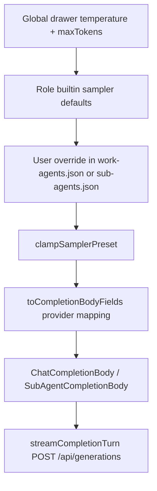

# Feature #9 — Sampler presets per agent

**Roadmap:** [`documentation/plans/feature-audit-roadmap.md`](../feature-audit-roadmap.md) §9 (Local-model-specific)  
**Status:** Missing → build plan  
**Sequencing:** Listed as a **quick win** alongside model-routing UI (#2) and cost panel (#14)

---

## Summary

Today every chat and sub-agent completion reads **one global** `temperature` and `max_tokens` from the settings drawer DOM (`#temperature`, `#maxTokens`). Work agents and sub-agent types already carry **per-agent model routing** (`providerId` / `modelId`) but no sampling profile. This feature adds a shared **`sampler`** object per work agent and sub-agent type, merges it at send time into the OpenAI-compatible completion body used by **`streamCompletionTurn`** (main tool loop) and the sub-agent runner, and exposes editors in Settings next to existing model bindings.

---

## YAML todos

```yaml
todos:
  - id: sampler-types
    content: Add SamplerPreset type, clamps, and toCompletionBody() provider mapping
    status: pending
  - id: resolve-sampler
    content: Implement resolveSamplerPreset() with global → role default → override merge
    status: pending
  - id: work-agent-schema
    content: Extend work-agents.json + PUT /api/work-agents/:id + server merge/validate
    status: pending
  - id: sub-agent-schema
    content: Extend sub-agents.json types + normalizeSubAgentsConfig + client merge
    status: pending
  - id: shipped-defaults
    content: Add builtin role defaults (builder/planner/…) in registry + sub-agents.json
    status: pending
  - id: wire-main-loop
    content: Merge sampler in runChatTurn body before streamCompletionTurn
    status: pending
  - id: wire-sub-agent
    content: Replace hardcoded 0.4/2048 in sub-agent-runner with resolved sampler
    status: pending
  - id: settings-ui
    content: Sampler fields in settings-entity-editor for work agents + sub-agents
    status: pending
  - id: tests
    content: Unit tests for merge, validation, loop body, sub-agent runner, API patch
    status: pending
  - id: context-doc
    content: Update documentation/context.md Work Agents + Sub-agents sections on ship
    status: pending
```

---

## Current state

| Area | Behavior | Pointers |
|------|----------|----------|
| **Main chat send** | `runChatTurn` reads `#temperature` / `#maxTokens` once per turn; every tool round in the loop reuses the same values. | [`src/tools/loop.ts`](../../src/tools/loop.ts) ~537–539, 778–784 |
| **Backend generations** | `streamCompletionTurn` POSTs the **frozen** `body` to `/api/generations`; server stores `requestBody` as JSON and proxies upstream. No sampler logic on server. | [`src/tools/loop.ts`](../../src/tools/loop.ts) 396–413, [`server/generations/store.js`](../../server/generations/store.js) 143–145 |
| **Work agents** | Overrides in `~/.minnow/work-agents.json`: `providerId`, `modelId`, `promptOverride`, `disabled` only. Built-in metadata in `agent.full.md` front matter has no sampler fields. | [`src/agents/work-agent-types.ts`](../../src/agents/work-agent-types.ts), [`server/work-agents/routes.js`](../../server/work-agents/routes.js) 93–97 |
| **Sub-agents** | Per-type config: concurrency, timeout, tools, model; **hardcoded** `temperature = 0.4`, `max_tokens = 2048` in runner. | [`src/agents/sub-agent-runner.ts`](../../src/agents/sub-agent-runner.ts) 124–148, [`src/agents/defaults/sub-agents.json`](../../src/agents/defaults/sub-agents.json) |
| **Other LLM jobs** | Titles: dedicated `config.json` → `meta.titles` (`temperature`, `maxTokens`). Reef widget LLM: `0.4` fixed. Supervisor escalation: `temperature: 0`. UI Designer: model binding only. | [`src/config/titles-meta.ts`](../../src/config/titles-meta.ts), [`src/chat/reef/run-widget-completion.ts`](../../src/chat/reef/run-widget-completion.ts) |
| **Global drawer persistence** | `#temperature` / `#maxTokens` are **not** written to `config.json`; defaults come from [`index.html`](../../index.html) (`0.7`, `32768`). | — |
| **API body type** | `ChatCompletionBody` only declares `temperature` + `max_tokens` (+ tools). No `top_p`, `top_k`, `min_p`, `repetition_penalty`. | [`src/api/chat.ts`](../../src/api/chat.ts) 76–82, duplicate in [`src/tools/loop.ts`](../../src/tools/loop.ts) 183–192 |

**Active work agent resolution (unchanged):** `resolveActiveWorkAgent(chat)` picks pinned vs mode-default agent; `resolveWorkAgentBinding()` resolves provider/model per turn without mutating `chat.modelId`. Sampler should follow the **same agent identity** as model binding for main chat (work agent), and **sub-agent type id** for nested runs.

---

## Gap

1. No `sampler` field on `WorkAgentUserOverride`, built-in work agent definitions, or `SubAgentTypeConfig`.
2. No merge layer: global drawer → role default → user override.
3. `streamCompletionTurn` / `ChatCompletionBody` never receive extended sampling params (LM Studio supports `top_p`, `top_k` / `topKSampling`, `min_p` / `minPSampling`, `repetition_penalty` / `repeatPenalty` on OpenAI-compatible routes).
4. Settings UI edits model binding only; no per-role sampling profile.
5. Secondary callers (Reef widget, titles) remain special-cased — acceptable for v1 if documented as out of scope.

---

## Goals

1. **Per-agent sampler presets** stored in `~/.minnow/work-agents.json` and per-type rows in `~/.minnow/sub-agents.json` (and shipped defaults in repo).
2. **Predictable merge** at completion build time: global UI baseline → built-in role default → user partial override (field-level, not whole-object replace).
3. **Single resolver** used by main loop and sub-agent runner to avoid drift.
4. **Provider-safe wire format:** map internal camelCase `SamplerPreset` to OpenAI/LM Studio JSON keys; omit `undefined` / disabled sentinels so remote providers ignore unsupported fields.
5. **Settings discoverability:** sampler block in expanded work-agent and sub-agent rows (same pattern as provider/model).
6. **Sensible shipped defaults** tuned per role (code vs explore vs shell), documented in plan table below.

### Non-goals (v1)

- Persisting global drawer sampler to `config.json` (optional follow-up).
- Per-expert or per-mode sampler (experts are prompt-only today).
- Titles / Reef / supervisor / UI Designer sampler unification (can adopt resolver later).
- Provider capability matrix (“this model ignores top_k”) — send params optimistically; log once if upstream 400 mentions unknown field.
- Feature #22 project-scoped `.minnow/` overrides (design resolver API so path can be injected later).

---

## Acceptance criteria

- [ ] Each built-in work agent id (`default`, `builder`, `planner`, `reviewer`, `researcher`, `ui-designer`) has a **documented default** `sampler` in shipped metadata; user can override any field in `work-agents.json`.
- [ ] Each built-in sub-agent type in [`sub-agents.json`](../../src/agents/defaults/sub-agents.json) has a default `sampler`; user overrides persist via `PUT /api/config/sub-agents`.
- [ ] Main chat: when a non-passthrough work agent is active, outgoing generation body uses **merged sampler** for that agent; when passthrough/default, only global drawer + global defaults apply.
- [ ] Sub-agent runs use **type config sampler**, not the parent chat drawer temperature.
- [ ] Partial overrides work: e.g. user sets only `temperature` on `builder`; other fields fall through to role default then global.
- [ ] Invalid values are clamped or stripped with warnings (server normalize + client pre-clamp); save never corrupts JSON.
- [ ] Settings UI shows current effective values (or placeholders for inherited defaults) and saves via existing APIs.
- [ ] `npm test` includes new suites; `npx tsc --noEmit` clean.
- [ ] [`documentation/context.md`](../../context.md) updated when feature ships (Work Agents + Sub-agents + Local-model note).

---

## Architecture

### Data model

```ts
/** Partial preset; omitted keys inherit from the next layer down. */
export interface SamplerPreset {
  temperature?: number;       // 0–2 (align with drawer + titles clamp style)
  topP?: number;              // 0–1, 1 = off/nucleus disabled
  topK?: number;              // 0 = off, else positive int (LM Studio topKSampling)
  minP?: number;              // 0–1, 0 = off (LM Studio minPSampling)
  repetitionPenalty?: number; // >= 1, 1 = no penalty (LM Studio repeatPenalty)
}

/** Optional max output tokens per agent (v1: only if we extend sampler or sibling field). */
// maxTokens?: number;  // Defer unless product wants per-agent cap; today max_tokens stays global drawer.
```

**Storage shape (user files):**

```json
// ~/.minnow/work-agents.json
{
  "builder": {
    "providerId": "lm-studio-local",
    "modelId": "my-model",
    "sampler": {
      "temperature": 0.25,
      "topP": 0.9
    }
  }
}
```

```json
// ~/.minnow/sub-agents.json (types.*)
{
  "types": {
    "explore": {
      "sampler": {
        "temperature": 0.5,
        "topK": 40
      }
    }
  }
}
```

**Built-in defaults** live in:

- Work agents: optional `sampler:` block in `agent.full.md` YAML **or** `src/agents/defaults/work-agent-samplers.json` keyed by id (prefer **JSON map** beside registry to avoid editing six markdown files — pick one approach in Phase 1 and stay consistent).
- Sub-agents: inline `sampler` on each type in [`src/agents/defaults/sub-agents.json`](../../src/agents/defaults/sub-agents.json).

### Merge order



| Layer | Main chat source | Sub-agent source |
|-------|------------------|------------------|
| 1 — Global | `#temperature`, `#maxTokens` (max_tokens only here for v1) | N/A (use type defaults, not drawer) |
| 2 — Role default | Builtin map for `resolveActiveWorkAgent(chat)?.id` | `SubAgentTypeConfig` merged defaults |
| 3 — User override | `work-agents.json[id].sampler` | `sub-agents.json` `types[id].sampler` |

**Passthrough work agent** (`default` / null): skip role default layer; global + user override on `default` id only if user explicitly configured it.

### Provider mapping (`toCompletionBody`)

Internal → outbound (OpenAI-compatible + LM Studio extensions):

| Internal | JSON key(s) to send | Notes |
|----------|---------------------|-------|
| `temperature` | `temperature` | Required in body today; always set after merge |
| `topP` | `top_p` | Omit if undefined |
| `topK` | `top_k` | LM Studio also accepts `topKSampling`; start with `top_k` for OAI compat |
| `minP` | `min_p` | Alias `min_p_sampling` if 400 — behind small provider-kind table in resolver |
| `repetitionPenalty` | `repetition_penalty` | Alias `repeat_penalty` for LM Studio if needed |

Only include keys with finite numbers after clamp. Do **not** send `0` for “disabled” unless we define explicit off sentinels; prefer **omit key** for “off” on topK/minP/repetition.

### Resolution API (new module)

**`src/agents/resolve-sampler.ts`** (name tentative):

```ts
export interface ResolveSamplerInput {
  /** Main chat: work agent id or null. Sub-agent: type id. */
  agentKey: string | null;
  kind: 'work-agent' | 'sub-agent';
  global: { temperature: number; maxTokens: number };
}

export function resolveSamplerPreset(input: ResolveSamplerInput): {
  preset: SamplerPreset;
  maxTokens: number;
};
```

`runChatTurn` calls this once per tool round (or once per turn if sampler cannot change mid-turn — cache on `RunChatTurnOptions` scope). Build `body` via `applySamplerToBody(body, preset, maxTokens)`.

### `streamCompletionTurn` integration

No change to streaming mechanics. Contract:

1. Caller builds full `ChatCompletionBody` **including** sampler fields **before** `streamCompletionTurn`.
2. `createGeneration(providerId, body)` serializes body once; resume path reuses same stored body.

```778:789:src/tools/loop.ts
      const body: ChatCompletionBody = {
        model: sendModelId || undefined,
        messages,
        temperature: temp,
        max_tokens: maxTok,
        stream: true,
        stream_options: { include_usage: true },
      };
```

Replace direct `temp` / `maxTok` reads with `resolveSamplerPreset({ kind: 'work-agent', agentKey: activeWorkAgent?.id ?? null, global: { temperature: temp, maxTokens: maxTok } })`.

### Sub-agent runner integration

Replace constants at lines 124–125 with resolver `kind: 'sub-agent'`, `agentKey: input.type`. Pass `maxToolTurns` from config unchanged.

**`workAgentId` on sub-agent type:** v1 does **not** inherit sampler from linked work agent (only model binding uses that link today). Document as future enhancement if product wants “sub-agent uses Builder sampler when `workAgentId: builder`”.

### Server validation

| File | Change |
|------|--------|
| [`server/work-agents/routes.js`](../../server/work-agents/routes.js) | Accept `sampler` in PUT patch; validate via shared normalizer |
| [`server/work-agents/registry.js`](../../server/work-agents/registry.js) | `mergeDefinition` does not need sampler on builtin defs unless stored in markdown — overrides only in JSON |
| [`server/config/validators.js`](../../server/config/validators.js) | `normalizeSamplerPreset()`, extend `normalizeSubAgentsConfig` to clamp `types.*.sampler` |
| New `server/agents/sampler.js` (optional) | Shared clamp between work-agents + sub-agents routes |

---

## Shipped default presets (recommended v1)

Tune during implementation; these are starting points for local code models.

| Agent / type | temperature | topP | topK | minP | repetitionPenalty | Rationale |
|--------------|-------------|------|------|------|-------------------|-----------|
| **builder** | 0.25 | 0.95 | 40 | — | 1.05 | Deterministic edits |
| **planner** | 0.55 | 0.92 | 50 | 0.05 | 1.0 | Balanced planning prose |
| **reviewer** | 0.2 | 0.9 | 30 | — | 1.08 | Strict, low drift |
| **researcher** | 0.65 | 0.95 | 60 | 0.03 | 1.0 | Broader exploration |
| **default** | — | — | — | — | — | Inherit global only |
| **sub: explore** | 0.45 | 0.92 | 40 | — | 1.0 | Search/read focus |
| **sub: shell** | 0.15 | 0.85 | 20 | — | 1.1 | Command accuracy |
| **sub: generalPurpose** | 0.4 | 0.9 | 40 | — | 1.05 | General tasks |
| **sub: reef-widget** | 0.35 | 0.9 | 35 | — | 1.0 | Short widget copy |

---

## Key files

| Action | Path |
|--------|------|
| **New** | `src/agents/sampler-types.ts` — types, clamps, `toCompletionBody` |
| **New** | `src/agents/resolve-sampler.ts` — merge layers |
| **New** | `src/agents/defaults/work-agent-samplers.json` (if not using markdown YAML) |
| **Edit** | `src/agents/work-agent-types.ts` — `sampler?` on override + definition |
| **Edit** | `src/agents/types.ts` — `sampler?` on `SubAgentTypeConfig` |
| **Edit** | `src/agents/defaults/sub-agents.json` — per-type defaults |
| **Edit** | `src/agents/sub-agent-config.ts` — deep-merge `sampler` |
| **Edit** | `src/tools/loop.ts` — `runChatTurn` + `sendMessage` validation |
| **Edit** | `src/agents/sub-agent-runner.ts` — resolved sampler |
| **Edit** | `src/api/chat.ts` — extend `ChatCompletionBody` index signature or explicit optional fields |
| **Edit** | `server/work-agents/routes.js` — PATCH `sampler` |
| **Edit** | `server/config/validators.js` — `normalizeSubAgentsConfig` |
| **Edit** | `src/ui/settings-entity-editor.ts` — numeric inputs + save |
| **Edit** | `src/agents/work-agent-prompt-api.ts` — `patchWorkAgentOverride` payload type |
| **Tests** | `test/agents/sampler-resolve.test.mts`, extend `test/work-agents/*.mjs`, `test/sub-agents/*.mjs` |
| **Docs** | `documentation/context.md` (on ship) |

---

## Implementation phases

### Phase 1 — Types, defaults, resolver (no UI)

1. Add `SamplerPreset` + clamp helpers (mirror titles temperature clamp pattern in [`src/config/titles-meta.ts`](../../src/config/titles-meta.ts)).
2. Add builtin default map for work agents + extend shipped `sub-agents.json`.
3. Implement `resolveSamplerPreset` + `applySamplerToBody`.
4. Unit tests for merge order and clamp edge cases (`NaN`, out-of-range, partial override).

### Phase 2 — Persistence + API

1. Extend `WorkAgentUserOverride` and server PUT handler to read/write `sampler`.
2. Extend `normalizeSubAgentsConfig` for `types.*.sampler`.
3. Client: `mergeSubAgentConfig` copies sampler; `patchWorkAgentOverride` accepts sampler object.
4. API tests: PUT roundtrip, invalid body warnings, unknown type ignored.

### Phase 3 — Wire completions

1. `runChatTurn`: resolve once per send (or per tool round if needed for hot-reload — prefer **per send** for stability).
2. Extend `ChatCompletionBody` typing; spread mapped fields into body before `streamCompletionTurn`.
3. `sub-agent-runner`: use resolver; keep `max_tokens` from merged result (global default 2048 for sub-agents unless type overrides `maxTokens` in sampler sibling field — **optional**: add `maxTokens` to `SamplerPreset` resolution for sub-agents only).
4. Smoke: manual send with Builder vs Researcher and confirm different `temperature` in server generation log / network tab.

### Phase 4 — Settings UI

1. In `mountWorkAgentEditor`: collapsible “Sampler” section (5 number inputs + reset-to-role-default).
2. In sub-agent expanded row (settings-entity-editor or `settings-sections.ts` pattern): same fields bound to `PUT /api/config/sub-agents`.
3. Hint text: “Empty inherits role default; global temperature from drawer applies when field unset.”

### Phase 5 — Polish + documentation

1. Optional: show effective sampler in work-agent dev pill (`?dev=1`) or agent activity panel (#15) — defer if scope tight.
2. Update `context.md` and add `documentation/plans/verification/feature-09.md` checklist.
3. Mark roadmap item #9 **Partial** or **Built** when acceptance criteria pass.

---

## Dependencies

| Dependency | Relationship |
|------------|----------------|
| **#2 Model routing UI** | Complementary; same settings surfaces. Can ship #9 without consolidated routing page. |
| **#10 Constrained decoding** | Independent; same `loop.ts` hook point later. |
| **#11 Model capability detection** | Optional future: hide unsupported sampler fields per model. |
| **#13 Prompt profiles** | Future profiles bundle may include sampler snapshots per agent. |
| **#22 Project-scoped configs** | Resolver should accept `configRoot` parameter later; v1 uses `~/.minnow` only. |
| **Backend-owned generations** | Already shipped; body is opaque JSON — no server change beyond validation if desired. |

---

## Tests

| Suite | Cases |
|-------|--------|
| `test/agents/sampler-resolve.test.mts` | Merge order; passthrough agent; partial override; clamp; omit disabled fields in `toCompletionBody` |
| `test/work-agents/*.mjs` | PUT `sampler` persists; GET registry reflects override; invalid sampler rejected or warned |
| `test/sub-agents/*.mjs` | `normalizeSubAgentsConfig` clamps; merged client config includes defaults |
| `test/tools/loop-sampler.test.mts` (or mock) | Stub `resolveSamplerPreset`; assert body passed to `createGeneration` contains expected `top_p` |
| Manual | Builder 0.25 vs drawer 0.7; sub-agent explore vs shell; LM Studio model with top_k enabled |

**Determinism:** Use fixed numbers in tests; no `Date.now()` or random ids in sampler assertions.

---

## Risks and mitigations

| Risk | Impact | Mitigation |
|------|--------|------------|
| Provider ignores or 400s on unknown sampler keys | Broken send for some providers | Omit undefined keys; provider-kind alias table; catch 400 once and retry without extended fields (logged) |
| LM Studio field naming (`top_k` vs `topKSampling`) | Params silently ignored | Document mapping; add integration test against local LM Studio when available |
| Generations body frozen at POST | Mid-turn settings change has no effect | Expected; document; new tool round builds new body |
| Global `max_tokens` still drawer-only | User expects per-agent output cap | v1 copy: only sampling params per agent; optional `maxTokens` on sub-agent type in Phase 3 note |
| Settings UI clutter | Low adoption | Sensible defaults + “Reset to default” per role |
| Duplicate `ChatCompletionBody` in `loop.ts` vs `chat.ts` | Type drift | Consolidate to single exported type in Phase 3 |
| `workAgentId` on sub-agent without sampler inherit | Confusing binding | Document v1 behavior; add inherit in v2 if requested |

---

## Open questions (align before Phase 4)

1. **Per-agent `maxTokens`:** Include in `sampler` object or separate field? Recommendation: **sub-agent types only** (2048 default), main chat keeps drawer `max_tokens` for v1.
2. **Built-in default storage:** JSON map vs markdown YAML for work agents?
3. **Show effective vs override-only** in Settings inputs?
4. **Reef / titles:** adopt resolver in same PR or fast follow?

---

## Verification checklist (post-ship)

Create [`documentation/plans/verification/feature-09.md`](../verification/feature-09.md) with:

1. `npm test` + `npx tsc --noEmit`
2. Settings → Work agents → Builder: set temperature `0.2`, save, send chat in Build mode → network body `temperature: 0.2`
3. Settings → Sub-agents → Shell: distinct sampler; spawn shell sub-agent → confirm body differs from main chat
4. Partial override: only `topP` on researcher; other fields match defaults
5. Invalid PUT (`temperature: 9`) → clamped or 400 with clear error

---

## Related reading

- [`documentation/context.md`](../../context.md) — Work Agents (Step 08), Sub-agent orchestration (Step 09), Generations / `streamCompletionTurn`
- [`src/agents/resolve-work-agent.ts`](../../src/agents/resolve-work-agent.ts) — active agent selection
- [`src/agents/resolve-work-agent-binding.ts`](../../src/agents/resolve-work-agent-binding.ts) — model routing precedent for per-turn overrides
