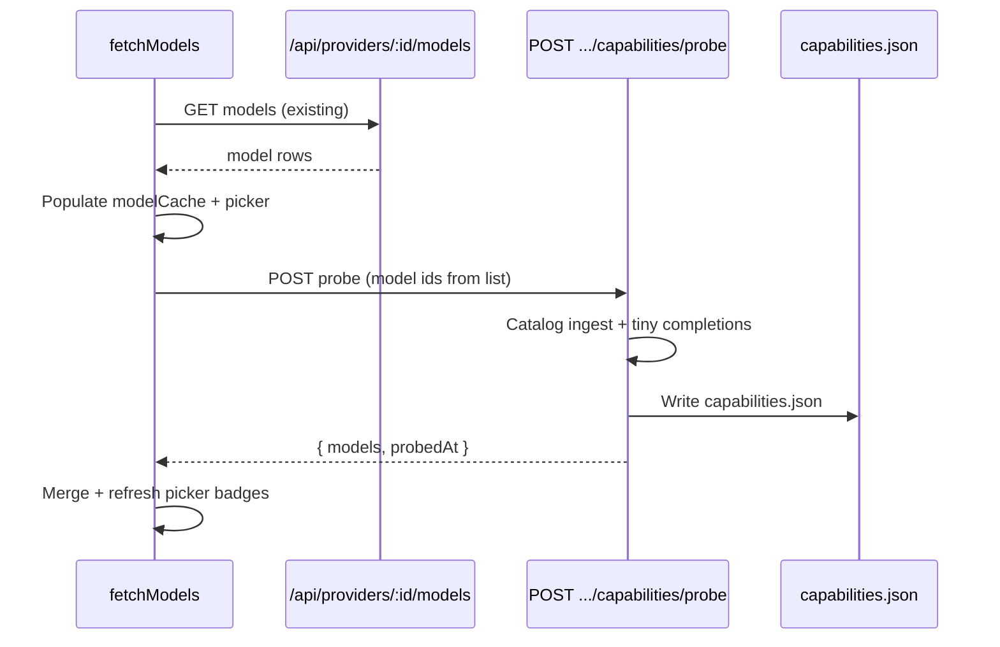

# Feature 11 — Model capability detection

**Roadmap:** [feature-audit-roadmap.md](../feature-audit-roadmap.md) item **#11** (audit backlog; distinct from shipped product backlog features 11–12 “load/unload model”).  
**Related:** Feature **#10** constrained decoding (grammar probe reuses capability flags); attachments/VLM path in [`src/tools/loop.ts`](../../../src/tools/loop.ts).

---

## Current state

### What works today (LM Studio v0 only)

| Signal | Source | Consumer |
|--------|--------|----------|
| `type` (`llm` / `vlm`) | Upstream `GET /api/v0/models` → proxied as `GET /api/providers/:id/models` | [`fetchModelsForProvider`](../../../src/providers/fetch-models.ts) filters `llm`/`vlm`; [`isVlmModel`](../../../src/tools/loop.ts) gates multimodal user content |
| `max_context_length` / `loaded_context_length` | Same models list | [`contextLengthFromModelRow`](../../../src/lib/context-length.ts) → stats strip, context-usage ring, `resolveModelInfo` |
| `state` (loaded / not loaded) | LM Studio models API | Load/unload button, [`model-state-dot`](../../../src/ui/model-state-dot.ts), picker load dots |
| `arch`, `quantization` | Models list | Stats strip via `modelCache` / `resolveModelInfo` |
| Provider load/unload | `apiKind === 'lm-studio-v0'` default | [`providerSupportsModelLoadUnload`](../../../src/providers/capabilities.ts), [`src/api/models.ts`](../../../src/api/models.ts) |

**Model list flow:** [`fetchModels()`](../../../src/api/models.ts) → `getActiveProvider()` → `fetchModelsForProvider()` → `GET /api/providers/:id/models` ([`server/providers/proxy.js`](../../../server/providers/proxy.js)). Cache: `modelCache` in [`app-state.ts`](../../../src/app-state.ts). UI: hidden `#modelSelect` + [`model-select-picker.ts`](../../../src/ui/model-select-picker.ts); refresh via `#btnRefreshModels` → `fetchModels()`.

### OpenAI-compatible providers (`openai-v1`)

[`normalizeModelsResponse`](../../../server/providers/paths.js) maps `/v1/models` to minimal rows: `id`, `type: 'llm'`, `state: 'loaded'`. **No** context length, vision flag, or tool support is inferred. [`normalizeModelsForUi`](../../../src/providers/fetch-models.ts) preserves optional fields if upstream sends them, but most remotes do not.

### Persistence

`~/.minnow/providers/<id>/` holds `profile.json` + `secrets.json` only ([`documentation/context.md`](../../context.md) § Persistence). **No** `capabilities.json`. Provider-level caps are limited to `supportsModelLoadUnload` via [`getProviderCapabilities`](../../../server/providers/paths.js) / [`src/providers/capabilities.ts`](../../../src/providers/capabilities.ts).

### Probes

No `capability-probe` module exists. Feature **#10** roadmap names future `src/providers/capability-probe.ts` for grammar; this feature owns the **shared** probe + persistence layer that #10 will extend.

---

## Gap

1. **No cross-provider capability matrix** — behavior is assumed from `apiKind` or LM Studio catalog shape only.
2. **No active probe** — remote models are treated as generic LLMs; tool calling and vision may fail at runtime instead of in the picker.
3. **No persisted probe results** — refresh does not record what was verified and when.
4. **No UI affordance** — picker shows label + load dot only; users cannot see tools / vision / context / grammar support before sending.

---

## Goals

1. **Detect** per-model capabilities for every registered provider: at minimum `vision`, `tools`, `contextLength`, `streaming`; optional `grammar`, `reasoning` (best-effort).
2. **Persist** results at `~/.minnow/providers/<providerId>/capabilities.json` with schema version and `probedAt`.
3. **Refresh on demand** — run probe pass after **Refresh models** (`fetchModels`) and after **Add provider** (successful create + active).
4. **Display** a compact capability summary next to each model in the top-bar picker (badges + enriched `title` tooltip).
5. **Consume** merged capabilities in send path (VLM/attachments), context budget UI, and future feature #10 grammar gating — without breaking LM Studio catalog-first behavior.

### Non-goals (v1)

- Per-agent capability overrides (feature #2 routing is separate).
- Probing on every chat message or every model switch (only list refresh / provider add / explicit “Re-probe” in settings).
- Guaranteed accuracy for all upstreams (probe results are **best-effort** with `unknown` / `assumed` states).
- Blocking send when capabilities are stale (warn in UI only).

---

## Acceptance criteria

1. **File layout:** After `npm start`, probing a provider writes `~/.minnow/providers/<id>/capabilities.json` atomically (tmp + rename), valid JSON, `schemaVersion: 1`.
2. **Refresh hook:** Clicking **Refresh models** loads the model list, then runs a probe pass for the active provider; status pill shows progress (e.g. “Probing capabilities…”) without blocking list display.
3. **New provider:** Creating a provider in Settings → Providers triggers an initial probe for that id (background OK).
4. **LM Studio:** For `lm-studio-v0`, catalog fields populate `vision` (`type === 'vlm'`), `contextLength` (from row), `loadState` without requiring a chat probe when catalog is complete; probe still runs for `tools` / `streaming` when not declared.
5. **OpenAI-v1:** For providers without rich catalog, probe sets `tools` and `vision` from tiny completions (see Architecture); `contextLength` may be `null` with UI “?” unless upstream exposes it later.
6. **Picker UI:** Each selectable model row shows up to 3 short badges (e.g. `Tools`, `Vision`, `32k`) derived from merged data; full matrix in `title` / tooltip.
7. **Send path:** `isVlmModel()` uses merged `capabilities.vision` when present, falling back to `type === 'vlm'`.
8. **API:** `GET /api/providers/:id/capabilities` returns public matrix (no secrets). `POST /api/providers/:id/capabilities/probe` runs probe (optional body `{ modelIds?: string[] }` for partial).
9. **Tests:** New unit tests cover schema merge, catalog ingest, and picker label formatting; existing model tests keep passing.
10. **Offline:** `npm run dev` — no probe API; client uses last cached capabilities from memory/localStorage mirror optional, or catalog-only fallback without error spam.

---

## Architecture

### Persistence: `~/.minnow/providers/<id>/capabilities.json`

```json
{
  "schemaVersion": 1,
  "providerId": "lm-studio-local",
  "probedAt": "2026-05-22T18:30:00.000Z",
  "apiKind": "lm-studio-v0",
  "models": {
    "qwen/qwen3-8b": {
      "vision": false,
      "tools": true,
      "streaming": true,
      "grammar": null,
      "reasoning": null,
      "contextLength": 32768,
      "loadState": "loaded",
      "sources": {
        "vision": "catalog",
        "tools": "probe",
        "contextLength": "catalog"
      },
      "probeErrors": {}
    }
  }
}
```

| Field | Type | Meaning |
|-------|------|---------|
| `vision` | `boolean \| null` | Multimodal / image input |
| `tools` | `boolean \| null` | Native `tool_calls` in chat completions |
| `streaming` | `boolean \| null` | SSE/streaming completion works |
| `grammar` | `boolean \| null` | Accepts grammar / JSON schema / `response_format` (for #10) |
| `reasoning` | `boolean \| null` | Emits separable reasoning channel (LM Studio-style) |
| `contextLength` | `number \| null` | Effective context window |
| `loadState` | `string \| null` | `loaded` / `not_loaded` / `unknown` |
| `sources.*` | `"catalog" \| "probe" \| "assumed"` | Provenance for debugging |
| `probeErrors` | `Record<string, string>` | Last error per probe kind |

**Merge rule (client):** `effectiveCapabilities(modelId) = { ...catalogFromModelCache, ...capabilitiesJson.models[modelId] }` with catalog winning for fields where `sources.* === 'catalog'` and probe winning when catalog is absent.

### Probe on refresh



**Probe budget (v1 defaults):**

| Control | Value | Rationale |
|---------|-------|-----------|
| Max models probed per refresh | 8 | Protect local GPU / remote rate limits |
| Priority order | Selected model → loaded → rest alphabetical | User-visible models first |
| Concurrency | 1 (serial) | Avoid VRAM spikes on LM Studio |
| Per-probe timeout | 25s | Below generations 120s cap |
| Chat probe payload | `max_tokens: 1`, single user message `"ping"`, `stream: false` | Minimal cost |
| Tool probe | Same + one dummy function `probe_noop` | Detect `tool_calls` in response or finish_reason |
| Vision probe | Skip if catalog `type === 'vlm'`; else optional image URL only when catalog unknown | Avoid false positives on text-only models |

**Server-side execution:** Probes use [`getProviderRuntime`](../../../server/providers/store.js) + direct `fetch` to `chatCompletionsPath` (same as generations upstream), not the full tool loop. Do **not** persist probe generations in the generations store.

### API surface (new)

| Method | Path | Behavior |
|--------|------|----------|
| `GET` | `/api/providers/:id/capabilities` | Read `capabilities.json` or `{ models: {} }` |
| `POST` | `/api/providers/:id/capabilities/probe` | Run probe; body optional `{ modelIds?: string[] }`; returns full file |

Register in [`server/providers/routes.js`](../../../server/providers/routes.js) beside existing models proxy routes.

### Client modules (new / extended)

| Module | Responsibility |
|--------|----------------|
| `server/providers/capabilities-store.js` | Read/write/merge JSON on disk |
| `server/providers/capability-probe.js` | Catalog ingest + probe orchestration |
| `src/providers/model-capabilities.ts` | Types, `mergeModelCapabilities`, `fetchProviderCapabilities`, `runCapabilityProbe` |
| `src/providers/capability-badges.ts` | Format badges for picker (pure functions for tests) |

**Hook point:** At end of [`fetchModels()`](../../../src/api/models.ts), after `modelCache` is populated:

```ts
void runCapabilityProbeForProvider(provider.id, {
  modelIds: prioritizeModelIds(models, sel.value),
  signal, // shared AbortController with models fetch or child
}).then(() => {
  syncModelSelectPicker();
  showCachedModelInfo();
});
```

Use `AbortController` so a rapid double-refresh cancels in-flight probe.

### UI (picker)

Extend [`syncModelSelectPicker`](../../../src/ui/model-select-picker.ts):

- Append `.model-cap-badges` span after option label (tools / vision / context).
- Keep load dot behavior unchanged.
- Enrich `li.title` with multi-line capability summary.

Styles: add rules to [`src/styles/topbar.css`](../../../src/styles/topbar.css) (or `model-select` partial) using existing tokens (`--muted-fg`, `--accent`).

**Settings (optional v1.1):** Provider row “Re-probe capabilities” button; not required for acceptance if top-bar refresh suffices.

---

## Key files

| Area | Path |
|------|------|
| Model list + refresh | [`src/api/models.ts`](../../../src/api/models.ts) |
| Model row types | [`src/types.ts`](../../../src/types.ts) (`LmModelRecord`) |
| Fetch/normalize | [`src/providers/fetch-models.ts`](../../../src/providers/fetch-models.ts) |
| Provider caps (load/unload only today) | [`src/providers/capabilities.ts`](../../../src/providers/capabilities.ts) |
| Endpoints | [`src/providers/resolve.ts`](../../../src/providers/resolve.ts) |
| Models proxy | [`server/providers/proxy.js`](../../../server/providers/proxy.js) |
| Provider registry | [`server/providers/store.js`](../../../server/providers/store.js) |
| Routes | [`server/providers/routes.js`](../../../server/providers/routes.js) |
| Picker UI | [`src/ui/model-select-picker.ts`](../../../src/ui/model-select-picker.ts) |
| VLM gate | [`src/tools/loop.ts`](../../../src/tools/loop.ts) (`isVlmModel`) |
| Context length | [`src/lib/context-length.ts`](../../../src/lib/context-length.ts) |
| Provider settings | [`src/ui/settings-providers.ts`](../../../src/ui/settings-providers.ts) |
| Generations upstream (reference) | [`server/generations/upstream.js`](../../../server/generations/upstream.js) |

---

## Implementation phases

### Phase 1 — Schema + server persistence

- Define `capabilities.schema.json` or inline validator in [`server/config/validators.js`](../../../server/config/validators.js).
- Implement `capabilities-store.js` (read, write, patch per model).
- `GET /api/providers/:id/capabilities`.
- Unit tests: round-trip write, corrupt file recovery, missing file defaults.

### Phase 2 — Probe runner (server)

- `capability-probe.js`: ingest catalog from models list snapshot; run chat + tool probes with timeouts.
- Map LM Studio `type`, `max_context_length`, `loaded_context_length`, `state` → matrix (`sources.catalog`).
- `POST .../capabilities/probe` with model id cap and serial execution.
- Tests: mock upstream with fixed JSON (extend [`test/providers/proxy-mock.test.js`](../../../test/providers/proxy-mock.test.js) pattern).

### Phase 3 — Client merge + fetch hook

- `model-capabilities.ts` + extend `LmModelRecord` with optional `capabilities?: ModelCapabilities`.
- Wire `fetchModels()` probe hook + abort handling.
- `createProvider` success path in `settings-providers.ts` triggers probe.

### Phase 4 — Picker UI + consumers

- Badges + tooltips in `model-select-picker.ts`.
- Update `isVlmModel` to prefer merged `vision`.
- Optional: composer hint when attachments pending but `vision === false` ([`attachments/store.ts`](../../../src/attachments/store.ts) — display-only warning).

### Phase 5 — Documentation + polish

- Update [`documentation/context.md`](../../context.md): `~/.minnow` layout, providers API table, model row behavior.
- Link from [feature-audit-roadmap.md](../feature-audit-roadmap.md) §11 to this plan.
- Manual QA checklist (below).

---

## Dependencies

| Dependency | Relationship |
|------------|----------------|
| **Feature #10** (constrained decoding) | Should read `capabilities.grammar` from this matrix; avoid duplicate probe stores |
| **Feature #14** (cost/usage) | May use `contextLength` for estimates; not blocking |
| **Feature #9** (sampler presets) | Orthogonal |
| **Backend generations** | Probe uses same upstream URL/auth as generations; no schema change to `/api/generations` |
| **`npm start`** | Required for probe API (same as providers registry) |

**Recommended order:** Ship **#11** before **#10** so grammar detection extends the probe runner rather than inventing a parallel one.

---

## Tests

| Suite | Focus |
|-------|--------|
| `test/providers/capabilities-store.test.js` | Atomic write, schema validation, merge by model id |
| `test/providers/capability-probe.test.js` | Mock upstream: tool_calls yes/no, timeout, model cap |
| `test/providers/capabilities-routes.test.js` | GET/POST routes, 404 provider |
| `test/providers/model-capabilities.test.mts` | Client merge: catalog vs probe precedence |
| `test/ui/model-capability-badges.test.mts` | Badge text: `Tools`, `Vision`, `32k`, unknown |
| Extend `test/ui/model-select-picker.test.mts` | DOM contains badges when cache has capabilities |

**Manual QA**

1. `npm start` → LM Studio with one LLM + one VLM → Refresh → `capabilities.json` exists; picker shows Vision on VLM only.
2. Add OpenAI-compatible remote → Refresh → tools/vision badges reflect probe (or `?` on failure).
3. Attach image with non-vision model selected → warning or non-multimodal send path (no silent corrupt request).
4. Rapid double-click Refresh → no duplicate errors; second run aborts or replaces first cleanly.

**CI:** `npx tsc --noEmit` + `npm test` (targeted: `node --test test/providers/capabilities*.test.js`).

---

## Risks and mitigations

| Risk | Impact | Mitigation |
|------|--------|------------|
| Probe load on large model catalogs | Slow refresh, GPU queue | Cap models per pass; probe selected + loaded first; serial probes |
| Remote rate limits / cost | 401/429, billing | Short timeouts; skip probe when `enabled: false`; settings toggle “Probe on refresh” default on, allow off |
| False `tools: true` | Broken tool loop at runtime | Treat probe as hint; keep existing runtime error handling; show “Tools (probed)” in tooltip |
| False `vision: false` | Attachments stripped incorrectly | Catalog `vlm` always wins; vision probe only when unknown |
| Stale capabilities after model swap on disk | Wrong badges | Store `probedAt`; show muted “last probed …” in tooltip; re-probe on refresh |
| Windows file locking | Write fails | Keep tmp+rename pattern from `store.js` |
| Vite-only dev | No server | Skip probe gracefully; document `npm start` requirement (same as providers CRUD) |

---

## Open questions (resolve before Phase 2)

1. **Partial probe on refresh:** Probe all listed models vs cap at 8 — product default assumed **cap at 8**; confirm with user if full catalog is required.
2. **localStorage mirror for `npm run dev`:** Worth caching last `capabilities.json` in browser for UI dev, or accept missing badges offline?
3. **Grammar probe in v1:** Include minimal `response_format: { type: "json_object" }` test, or defer entirely to feature #10 (recommended: **defer**, store `grammar: null`).

---

## Verification doc

When shipped, add [`documentation/plans/verification/feature-11-model-capabilities.md`](../verification/feature-11-model-capabilities.md) with copy-paste QA steps and link from [`documentation/context.md`](../../context.md) product backlog / audit sections.
