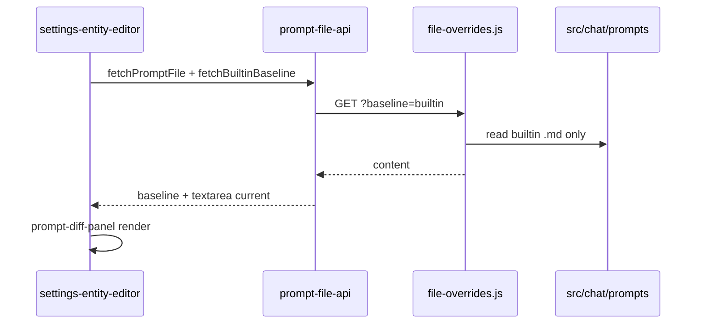

# Feature #12 — Prompt diffing

**Source:** [feature-audit-roadmap.md §12](../feature-audit-roadmap.md) · **Status:** Missing · **Primary UI:** [`src/ui/settings-entity-editor.ts`](../../../src/ui/settings-entity-editor.ts) · **Related:** Feature #13 (prompt profiles / versioning)

---

## Summary

Add a **compare-to-shipped-default** workflow everywhere users edit prompt text in Settings, so overrides are visible before save and reset can target **one part** (custom profile) or **one profile tab** (Full/Lite on entity editors) without guessing what will be lost.

---

## Current state

| Surface | Location | What works today | What’s missing |
|--------|----------|------------------|----------------|
| **Modes / Experts / Sub-agents** | `mountPromptFileEditor()` in [`settings-entity-editor.ts`](../../../src/ui/settings-entity-editor.ts) | Full/Lite tabs; `GET` returns `content` + `source: builtin \| override`; Save / **Reset to built-in** (whole profile, `confirm()`) | No visual diff; reset is all-or-nothing per tab; user cannot see shipped text while editing override |
| **Work agents** | `mountWorkAgentEditor()` — same file | Same prompt UX + model binding rows | Same gaps |
| **Custom prompt profile** | `renderCustomPartEditors()` in [`settings-sections.ts`](../../../src/ui/settings-sections.ts) | Per-part enable + `contentOverride` textarea; `null` override → shipped body at send time ([`prompt-composer.ts`](../../../src/chat/prompts/prompt-composer.ts)) | No diff vs shipped default for that part; no **per-part** “clear override”; only whole-config Save/Delete |
| **Full / Lite profile preview** | `renderPromptPartsPanel()` when profile ≠ custom | Read-only `<pre>` of bundled [`loadPromptById`](../../../src/chat/prompts/prompt-loader.ts) | Not a diff against a dirty editor (no inline edit there) |
| **Server** | [`server/prompts/file-overrides.js`](../../../server/prompts/file-overrides.js), [`server/prompt-configs/middleware.js`](../../../server/prompt-configs/middleware.js) | `readPromptFile()` prefers `~/.minnow/prompts/` then built-in repo file | No `baseline=builtin` (or second field) on GET — client cannot fetch **both** sides in one call when override exists |
| **Dependencies** | [`package.json`](../../../package.json) | `@codemirror/*` already used in file viewer | No text-diff library; no diff UI component |

**Send-time truth:** Built-in bodies live under `src/chat/prompts/` (and `src/agents/prompts/sub-agents/`). User file overrides under `~/.minnow/prompts/`. Custom JSON overrides under `~/.minnow/prompt-configs/<id>.json` (`contentOverride` wins over files in composer).

---

## Gap (from audit)

- **Today:** Custom prompt-config per-part editor; entity prompt editors with source badge only; resetting is **destructive** (confirm → lose local textarea state without preview).
- **Target:** Side-by-side **or** unified diff vs **shipped default** for every editable prompt; **per-part** reset (custom profile) and clear **per-profile** reset UX (entity editors).

---

## Goals

1. **Visibility:** While editing any prompt body, user can open a diff against the **shipped built-in default** for the same logical key (mode id + profile, expert id + profile, part id + active session profile, etc.).
2. **Non-destructive review:** Diff mode is read-only for the baseline; edits stay in the existing textarea (or optional future merge — out of scope v1).
3. **Granular reset:**  
   - **Custom profile:** Reset **one** `PromptPartId` (`contentOverride → null`, `enabled` unchanged unless product says otherwise).  
   - **Entity editors:** Keep existing “Reset to built-in” for current Full/Lite tab; add **Revert in diff** that only applies when viewing an override (same API as today).
4. **Offline-safe messaging:** When `npm start` is down, diff shows bundled builtin via `loadPromptById` where possible; banner when server baseline may be stale vs `~/.minnow` file overrides.
5. **No new product surface outside Settings** — diff is not required in chat composer (v1).

---

## Non-goals (v1)

- Diff vs **another custom profile** or vs **lite/full cross-profile** (only vs shipped builtin for the **same** profile key).
- Three-way merge, hunk-level apply, or inline edit inside the diff pane.
- Diff for **skills** (`SKILL.md`) — separate feature; only composer prompt parts + entity prompt files.
- Version history / profile bundles (Feature #13).

---

## Acceptance criteria

- [ ] **Modes, Experts, Sub-agents, Work agents:** Expand row → toggle **“Compare to shipped default”** shows diff between builtin body and current editor text (including unsaved textarea changes).
- [ ] **Custom prompt configuration:** Each part block (`base`, `mode`, …) has **Compare to default** and **Reset part to default**; reset clears only that part’s `contentOverride` and updates estimate strip.
- [ ] **Default diff layout:** **Unified** diff (single column, add/remove styling) in settings panel width; user can switch to **side-by-side** (persist preference in `localStorage` key `minnow.promptDiffLayout`).
- [ ] **Labels:** Headers show `Shipped default` (left/old in unified) vs `Yours` (override + unsaved edits).
- [ ] **No override:** Diff toggle disabled or shows “Matches shipped default” when strings equal (after normalize trim).
- [ ] **Reset confirm:** Per-part / per-profile reset uses confirm only when textarea has **unsaved** edits differing from last saved override.
- [ ] **API:** With server up, builtin baseline for file-backed prompts matches repo file used by `readPromptFile` fallback (not user override).
- [ ] **Tests:** Unit tests for diff builder + baseline resolver; one DOM test for diff mount; server test for `?baseline=builtin` if added.
- [ ] **Docs:** This plan + [`context.md`](../../context.md) pointer; optional one line in [`feature-audit-roadmap.md`](../feature-audit-roadmap.md) status → Partial when shipped.

---

## Architecture

### Baseline resolution (“shipped default”)

| Editor context | Baseline text | Current text |
|----------------|---------------|--------------|
| Entity `mountPromptFileEditor` | Built-in file only (ignore `~/.minnow` override) | `textarea.value` (live) |
| Work agent prompt | Same | Same |
| Custom part `base` | `loadPromptById('base', 'default', activeMetaProfile)` body | `contentOverride ?? ''` — if empty, current = baseline |
| Custom part `mode` | `loadPromptById('mode', sessionModeId \|\| 'build', profile)` | override or baseline |
| Custom part `expert` | `loadPromptById('expert', sessionExpertId \|\| 'general', profile)` | … |
| Custom part `tool-usage` | `loadPromptById('tool-usage', 'default', profile)` | … |
| Custom part `info` | `loadPromptById('info', sessionInfoPreset \|\| 'general-assistant', profile)` | … |
| Custom part `work-agent` | `loadPromptById('work-agent', sessionWorkAgentId \|\| 'default', profile)` | … |
| `memory` / `skill` | v1: hide diff (resolved at send from session) — hint only |

**Profile for custom parts:** Use `activePromptProfile` from prompt-meta when `full`/`lite`; when global profile is `custom`, use **`full`** bodies for baseline comparison unless the part editor is explicitly tied to lite (document in UI: “Compared against shipped **full** default”).

**Server addition (recommended):**

```http
GET /api/prompts/{family}/{id}/prompt?profile=full&baseline=builtin
GET /api/work-agents/{id}/prompt?profile=full&baseline=builtin
```

Response: `{ content, source: 'builtin' }` always from repo path in [`file-overrides.js`](../../../server/prompts/file-overrides.js) `builtinRelativePath()`.

Implement `readBuiltinPromptFile(projectRoot, family, entityId, profile)` — shared with work-agent reader.

**Client fallback:** Export `resolveBuiltinPromptBaseline(kind, id, profile)` in new `src/chat/prompts/prompt-baseline.ts` wrapping `loadPromptById` (builtin registry only — **exclude** `userRegistry` for baseline; may require `loadBuiltinPromptById` split in [`prompt-loader.ts`](../../../src/chat/prompts/prompt-loader.ts)).

### Diff engine

| Option | Bundle impact | Recommendation |
|--------|---------------|----------------|
| **`@codemirror/merge` MergeView** | Reuse existing CM deps; ~side-by-side native | **Preferred for side-by-side** |
| **`diff` (npm)** | Small; `createTwoFilesPatch` / line arrays | **Preferred for unified** render + tests |
| **diff2html** | Heavier + CSS | Defer unless unified UX insufficient |

**Shipped default for v1:**

- **Unified:** default — `diff` lines → custom DOM in `src/ui/prompt-diff-unified.ts` using existing settings tokens (`--success`, `--danger`, `--muted` backgrounds).
- **Side-by-side:** toggle → `MergeView` with left = baseline (read-only), right = textarea mirror **or** single editable right pane with left read-only snapshot (simplest: keep textarea above/below diff; side-by-side shows baseline | current read-only copies).

### UI composition

New module: **`src/ui/prompt-diff-panel.ts`**

```text
mountPromptDiffPanel(host, {
  baseline: string,
  current: string,
  layout: 'unified' | 'side-by-side',
  onLayoutChange?,
})
```

Wire from:

- [`settings-entity-editor.ts`](../../../src/ui/settings-entity-editor.ts) — toolbar row under meta: `[ ] Compare to shipped default` + layout toggle.
- [`settings-sections.ts`](../../../src/ui/settings-sections.ts) — inside each `renderCustomPartEditors` block.

Styles: [`src/styles/settings.css`](../../../src/styles/settings.css) — `.prompt-diff`, `.prompt-diff__line--add`, `.prompt-diff__line--remove`, `.prompt-diff--side-by-side`.

**Per-part reset (custom):**

```ts
activeCustomConfig.parts[partId] = {
  ...settings,
  contentOverride: null,
};
await savePromptConfig(activeCustomConfig); // or debounced save + status
schedulePromptTokenEstimateRefresh();
```

**Entity reset:** Unchanged API (`DELETE` prompt); after reset, close diff or refresh baseline = current.

### Data flow (mermaid)



---

## Key files

| Action | Path |
|--------|------|
| **Edit** | [`src/ui/settings-entity-editor.ts`](../../../src/ui/settings-entity-editor.ts) |
| **Edit** | [`src/ui/settings-sections.ts`](../../../src/ui/settings-sections.ts) |
| **Add** | `src/ui/prompt-diff-panel.ts`, `src/ui/prompt-diff-unified.ts` |
| **Add** | `src/chat/prompts/prompt-baseline.ts` |
| **Edit** | [`src/chat/prompts/prompt-file-api.ts`](../../../src/chat/prompts/prompt-file-api.ts), [`src/agents/work-agent-prompt-api.ts`](../../../src/agents/work-agent-prompt-api.ts) |
| **Edit** | [`server/prompts/file-overrides.js`](../../../server/prompts/file-overrides.js), [`server/prompt-configs/middleware.js`](../../../server/prompt-configs/middleware.js), [`server/work-agents/routes.js`](../../../server/work-agents/routes.js) |
| **Edit** | [`src/styles/settings.css`](../../../src/styles/settings.css) |
| **Optional dep** | `package.json` — `"diff": "^7.x"` if not using CM for unified |
| **Docs** | [`documentation/context.md`](../../context.md) |

---

## Implementation phases

### Phase 1 — Baseline plumbing

- Server: `readBuiltinPromptFile` + `?baseline=builtin` on prompt GET routes.
- Client: `fetchPromptBuiltinBaseline`, `fetchWorkAgentBuiltinBaseline`.
- `prompt-baseline.ts` for custom part ids (session-aware ids from existing settings meta / defaults).

### Phase 2 — Diff component

- Implement `prompt-diff-panel` (unified default, side-by-side toggle).
- Pure function `buildLineDiff(baseline, current)` in `src/chat/prompts/text-diff.ts` (testable, no DOM).

### Phase 3 — Entity editors

- Integrate toggle + panel in `mountPromptFileEditor` / `mountWorkAgentEditor`.
- Live diff updates on `textarea` `input`.
- Refresh diff on Full/Lite tab change.

### Phase 4 — Custom profile parts

- Per-part Compare + Reset in `renderCustomPartEditors`.
- Persist part reset via existing `savePromptConfig`.

### Phase 5 — Polish & docs

- `localStorage` layout preference; a11y (`aria-expanded` on diff region).
- Update context + audit row.

---

## Dependencies

| Dependency | Notes |
|------------|--------|
| **`npm start`** | File overrides and builtin API parity; Vite-only uses bundled builtins with “server offline” hint |
| **Feature #13** | Independent; profiles export should include overrides — diff baseline remains **shipped**, not “profile at export time” |
| **Feature #22** (project-scoped) | Future: baseline path may gain workspace `.minnow/` layer — plan resolver hook in `readBuiltinPromptFile` when #22 lands |
| **@codemirror/merge** | Optional add-on package if not already installed — verify import path before Phase 2 |

---

## Tests

| Test | Path | Asserts |
|------|------|---------|
| Line diff builder | `test/prompts/text-diff.test.mjs` | Adds/removes unchanged; empty; identical |
| Baseline resolver | `test/prompts/prompt-baseline.test.mjs` | Builtin-only registry; correct kind/id |
| API builtin query | `test/prompts/prompt-builtin-api.test.js` | Temp `MINNOW_HOME`; override on disk; GET `baseline=builtin` ignores override |
| UI mount | `test/ui/prompt-diff-panel.test.mjs` | happy-dom: toggle shows `.prompt-diff` lines |
| Regression | `test/ui/settings-sections.test.mjs` | Still exports `refreshSettingsSection` |

Run: `npm test` subset `test/prompts/*` + `test/ui/prompt-diff*`.

---

## Risks and mitigations

| Risk | Mitigation |
|------|------------|
| **Large prompts** (10k+ lines) block UI | Cap diff render at N lines with “Show full diff”; lazy render hunks |
| **Baseline mismatch** in `npm run dev` (user override on disk, client shows builtin bundle) | Show badge: “Baseline: shipped repo”; when server available, always fetch `?baseline=builtin` |
| **Custom part wrong id** (mode part vs `build` default) | Document in UI; pass active chat mode from session snapshot in settings (read-only hint if no active chat) |
| **Normalization** (CRLF, trailing newline) | Trim trailing whitespace per line before compare; optional “ignore blank lines” toggle later |
| **Extra dependency weight** | Prefer `diff` only; avoid diff2html in v1 |
| **Confirm fatigue** | Only confirm reset when dirty vs last saved |

---

## Open questions (resolve before Phase 4)

1. **Custom profile baseline profile:** Always `full`, or follow global `activePromptProfile` when it is `full`/`lite`?
2. **Side-by-side with active textarea:** Duplicate content in merge view vs hide textarea while diff open?
3. **Work-agent builtin path:** Confirm parity with `readWorkAgentPrompt` builtin branch in server work-agents module.

---

## Todos

```yaml
todos:
  - id: p1-server-builtin
    content: Add readBuiltinPromptFile + ?baseline=builtin on prompt and work-agent GET routes
    status: pending
  - id: p1-client-api
    content: Extend prompt-file-api and work-agent-prompt-api with fetchBuiltinBaseline helpers
    status: pending
  - id: p1-baseline-module
    content: Add prompt-baseline.ts (+ loadBuiltinPromptById if needed) for custom part keys
    status: pending
  - id: p2-text-diff
    content: Add text-diff.ts + prompt-diff-panel.ts (unified default, side-by-side toggle)
    status: pending
  - id: p2-styles
    content: Add settings.css diff tokens and layout preference in localStorage
    status: pending
  - id: p3-entity-editor
    content: Wire compare toggle and live diff into settings-entity-editor mount* functions
    status: pending
  - id: p4-custom-parts
    content: Per-part compare and reset in settings-sections renderCustomPartEditors
    status: pending
  - id: p5-tests
    content: Add text-diff, prompt-baseline, API builtin, and prompt-diff-panel UI tests
    status: pending
  - id: p5-docs
    content: Update context.md and feature-audit-roadmap status when feature ships
    status: pending
```

---

## Verification checklist (manual)

1. `npm start` → Settings → Modes → expand Build → edit override → Compare shows additions vs shipped `build.full.md`.
2. Reset to built-in → diff collapses to “matches default”.
3. Prompting → Custom profile → override `base` only → Reset part clears base, leaves other parts.
4. Toggle side-by-side ↔ unified; reload settings — preference persists.
5. `npm run dev` without server → compare still works with offline banner; save/reset disabled where already disabled.
