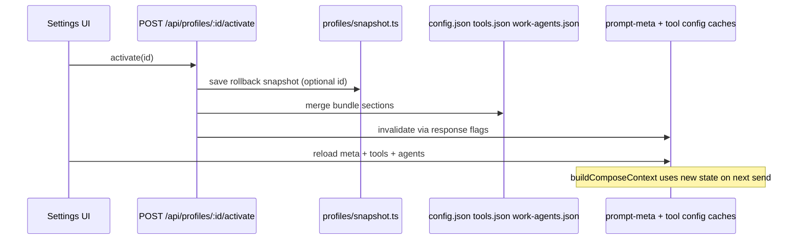

# Feature 13 — Prompt versioning / profiles

**Audit ref:** [feature-audit-roadmap.md](../feature-audit-roadmap.md) item **#13** (Partial).  
**Architecture ref:** [context.md](../../context.md) — programmatic prompts (Step 04), `~/.minnow` layout, Settings → Prompting.  
**Effort:** **L** (multi-store snapshot, migration, UI, workspace binding).  
**Recommended sequencing:** After **#22 project-scoped configs** (roadmap “foundational”); can prototype in global `~/.minnow/` first, then relocate defaults to `.minnow/profiles/` when resolver exists.

---

## Summary

Today Minnow has **three prompt profiles** (`full` | `lite` | `custom`) driven by `config.json` meta (`activePromptProfile`, `activePromptConfigId`). **Custom** configs in `~/.minnow/prompt-configs/<id>.json` only control **composer part toggles and inline overrides** — not work-agent model bindings, sub-agent policies, or the global tool permission matrix.

**Profiles** (this feature) are **named, versioned bundles** that snapshot everything needed to reproduce a “setup” on another machine or project: system prompt composition settings, optional embedded prompt bodies, agent routing overrides, and tool enablement. Users can **export/import** a single JSON file, **activate** a profile to apply it, and set a **per-workspace default** so opening a repo auto-selects the right bundle.

---

## Current state

| Area | What exists | Location |
|------|-------------|----------|
| Global prompt profile | `full` / `lite` / `custom` in `config.json` | `src/config/prompt-meta.ts`, `server/config/home.js` |
| Custom prompt config | Per-part `enabled` + `contentOverride` | `~/.minnow/prompt-configs/<id>.json` |
| Prompt config API | List, GET/PUT/DELETE, duplicate | `server/prompt-configs/`, `src/chat/prompts/prompt-configs.ts` |
| Schema | `prompt-config.schema.json` — parts only | `src/chat/prompts/schema/prompt-config.schema.json` |
| Composition at send | `buildComposeContext()` loads custom config when profile is `custom` | `src/chat/prompts/compose-context.ts` |
| Settings UI | Full/Lite/Custom tabs; custom config toolbar (New/Save/Duplicate/Delete) | `src/ui/settings-sections.ts`, `src/ui/settings-page.ts` |
| Agent prompts (file) | User overrides under `~/.minnow/prompts/{modes,experts,sub-agents,work-agents}/` | `GET/PUT /api/prompts/...` |
| Work agents | Registry + `work-agents.json` overrides (`providerId`, `modelId`, `promptOverride`, `disabled`) | `src/agents/work-agent-registry.ts`, `~/.minnow/work-agents.json` |
| Sub-agents | Defaults + `sub-agents.json` (concurrency, per-type model, tool allow/deny) | `src/agents/sub-agent-config.ts` |
| Tools | `tools.json` — `permissions` + mirrored `enabled` | `src/tools/config.ts` |
| Rules / skills / memory | Separate files (`rules.json`, `skills.json`, memory index) | Not in prompt-config today |
| Workspace | Path + recent list in `config.json`; chats scoped by workspace | No profile binding per workspace |
| Sub-agent prompt profile | Uses `lite` or `full` only — **ignores custom** | `src/agents/sub-agent-prompt.ts` |

**Terminology clash:** Terminal **shell profiles** (`GET /api/terminal/shell-profiles`) are unrelated. UI copy should say **“Setup profile”** or **“Minnow profile”** in Prompting settings to avoid confusion.

---

## Gap

1. **No portable bundle** — Cannot share “how I run Minnow for backend work” as one artifact; prompt-configs omit agents and tools.
2. **No versioning** — `prompt-configs` have `meta.updatedAt` but no schema version, changelog, or diff against defaults (see #12).
3. **No activate/export/import** — Duplicate prompt-config only copies JSON within `prompt-configs/`; no file picker export.
4. **No per-project default** — Opening workspace A vs B does not auto-apply different setups (blocked on #22 for git-friendly `.minnow/`, but workspace-keyed map in `config.json` is acceptable v1).
5. **Custom profile incomplete for sub-agents** — Sub-agent system prompts never read `custom` part overrides.
6. **Activation is manual** — User must flip three settings areas (Prompting, Tools, Work agents) independently.

---

## Goals

1. **Single-file portability** — Export/import `*.minnow-profile.json` (or raw bundle JSON) shareable across machines and teammates.
2. **One-click activation** — Applying profile `backend-strict` updates prompt meta, tools, and agent overrides atomically (with explicit confirm + rollback snapshot).
3. **Backward compatibility** — Existing `prompt-configs/` and `activePromptConfigId` keep working; optional migration path into profiles.
4. **Per-workspace default** — When workspace path changes, optionally auto-activate mapped profile (user-toggleable).
5. **Foundation for headless** — Stable `profileId` for `minnow run --profile` (#18) without redesign.

**Non-goals (v1)**

- Full git sync of `~/.minnow/prompts/**/*.md` inside the bundle (optional `promptFiles` appendix in v2).
- MCP server definitions, LSP servers, provider secrets (security + size).
- Automatic profile switching mid-chat (only on workspace open / manual apply).
- Replacing **full/lite** global modes — profiles **wrap** them via `prompt.promptProfile` field.

---

## Acceptance criteria

### Bundle & storage

- [ ] New directory `~/.minnow/profiles/` created on `npm start` (`ensureMinnowLayout`).
- [ ] Each profile persisted as `~/.minnow/profiles/<id>.json` validated against `profile.schema.json`.
- [ ] Bundle includes at minimum: `id`, `label`, `schemaVersion`, `prompt`, `agents`, `tools` (see Architecture).
- [ ] `schemaVersion` bump policy documented; unknown future fields ignored on read (forward compatible).

### CRUD & API

- [ ] `GET /api/profiles` — list `{ id, label, updatedAt }`.
- [ ] `GET /api/profiles/:id` — full bundle.
- [ ] `PUT /api/profiles/:id` — create/update (validated).
- [ ] `DELETE /api/profiles/:id` — forbidden if profile is active global or workspace default (clear first).
- [ ] `POST /api/profiles/:id/duplicate` — `{ newId, newLabel? }`.
- [ ] `POST /api/profiles/capture` — snapshot **current** live settings into new or existing id (server-side gather).
- [ ] `POST /api/profiles/:id/activate` — apply bundle; returns `{ ok, appliedAt, previousSnapshotId? }`.
- [ ] `POST /api/profiles/import` — body = bundle JSON or `{ bundle, mode: 'create'|'replace' }`; rejects unsafe ids/secrets.
- [ ] `GET /api/profiles/:id/export` — `Content-Disposition: attachment` for download.

### Activation behavior

- [ ] After activate, `config.json` reflects bundle `prompt` section (`activePromptProfile`, `activePromptConfigId`, `activeInfoPresetId`, `planGranularity`).
- [ ] `tools.json` permissions match bundle `tools` section (built-in ids + known MCP ids only).
- [ ] `work-agents.json` and `sub-agents.json` receive bundle `agents` patches (merge, not wipe unrelated types).
- [ ] Client caches (`loadPromptMetaSettings`, `loadToolConfig`, work/sub-agent init) invalidate and reload.
- [ ] Next chat send uses composed prompt consistent with activated profile (token estimate panel updates).

### Workspace default

- [ ] `config.json` gains `workspaceProfiles: Record<normalizedWorkspacePath, profileId | null>` (or nested under `workspace`).
- [ ] Settings → Prompting: “Use as default for this workspace” when a workspace path is set.
- [ ] On workspace switch (`setWorkspacePath`), if mapping exists and auto-apply enabled, call activate (with toast, no silent overwrite without opt-in).

### UI

- [ ] Settings → **Prompting**: profile dropdown separate from custom config dropdown; actions **Apply**, **Save current as…**, **Export**, **Import**, **Duplicate**, **Delete**.
- [ ] Active profile indicated in header or Prompting section (label + id).
- [ ] Import file input accepts `.json`; shows validation errors inline.
- [ ] Destructive activate shows confirm listing affected areas (prompts, tools, N work agents, M sub-agent types).

### Migration & compatibility

- [ ] `POST /api/profiles/migrate-from-prompt-configs` (or automatic on first start) imports each `prompt-configs/*.json` into `profiles/<id>.json` with `prompt.parts` populated.
- [ ] `activePromptConfigId` continues to work when profile uses `prompt.source: 'prompt-config'` reference mode.

### Tests

- [ ] `test/profiles/profiles-api.test.mjs` — CRUD, import invalid bundle, delete active blocked.
- [ ] `test/profiles/activate.test.mjs` — round-trip capture → mutate tools → activate → assert `tools.json`.
- [ ] `test/profiles/workspace-default.test.mjs` — map path → switch workspace triggers activate (mocked path).
- [ ] `npm test` and `npx tsc --noEmit` clean.

### Documentation

- [ ] [context.md](../../context.md) updated: `profiles/` layout, API table, activation semantics, distinction from prompt-configs and shell profiles.

---

## Architecture

### Bundle shape (`~/.minnow/profiles/<id>.json`)

```json
{
  "id": "backend-strict",
  "label": "Backend — strict tools",
  "schemaVersion": 1,
  "meta": {
    "description": "Optional user blurb",
    "createdAt": "2026-05-22T12:00:00.000Z",
    "updatedAt": "2026-05-22T12:00:00.000Z",
    "minnowVersion": "0.x.y"
  },
  "prompt": {
    "promptProfile": "custom",
    "activePromptConfigId": null,
    "activeInfoPresetId": "general-assistant",
    "planGranularity": "medium",
    "parts": {},
    "source": "embedded"
  },
  "agents": {
    "workAgents": {
      "builder": { "providerId": "lm-studio-local", "modelId": "...", "disabled": false, "promptOverride": null }
    },
    "subAgents": {
      "globalMaxConcurrent": 3,
      "types": {
        "explore": { "providerId": "...", "modelId": "...", "allowedTools": ["read_file"], "deniedTools": [] }
      }
    },
    "promptOverrides": {
      "modes": { "build": { "full": "# optional inline md", "lite": null } },
      "experts": {},
      "subAgents": {}
    }
  },
  "tools": {
    "permissions": { "execute_command": "ask", "save_file": "full" },
    "keys": { "braveApiKey": "" }
  },
  "rules": { "enabled": true, "text": "optional global rules snapshot" },
  "skills": { "enabled": { "impeccable": true } }
}
```

**`prompt` section rules**

| `prompt.source` | Behavior |
|-----------------|----------|
| `embedded` | `parts` object same shape as today’s `PromptConfig.parts` (authoritative on activate). |
| `prompt-config` | `activePromptConfigId` points at existing `prompt-configs/<id>.json`; activate ensures that file exists or embeds copy. |
| `full` / `lite` | No `parts`; only meta fields; uses shipped templates. |

**`agents` section**

- **`workAgents`**: same keys as `work-agents.json` overrides (subset allowed).
- **`subAgents`**: partial `SubAgentsFile` — only listed `types` keys merge; globals optional.
- **`promptOverrides`**: optional inline markdown per entity; on activate, write `~/.minnow/prompts/...` files (v1) or hold in bundle only (v2 file export).

**`tools` section**

- Snapshot `permissions` for all built-in tools present in bundle; **do not** export unknown MCP tools unless user opts in “Include MCP tools” (checkbox, off by default).
- Never export `secrets.json` or provider API keys.

### Activation pipeline



**Merge policy (fail-safe)**

1. Validate bundle.
2. Write `config.json` prompt-related keys via existing `mergeConfigMeta`.
3. Replace-or-merge `tools.json` permissions for ids in bundle only; leave other MCP ids untouched unless `tools.replaceAll: true` (advanced, default false).
4. Deep-merge `work-agents.json` / `sub-agents.json` patches.
5. If `prompt.source === 'embedded'`, upsert `prompt-configs/<id>.json` mirror so existing composer path unchanged.
6. Emit `profile-activated` event for UI token estimate + status toast.

**Rollback (v1.1 nice-to-have)**

- Store last pre-activate snapshot at `~/.minnow/profiles/_rollback/<timestamp>.json`; “Undo last apply” in UI.

### Per-project default

**v1 (before #22):** In `config.json`:

```json
{
  "workspace": { "path": "/abs/project", "recentPaths": [] },
  "workspaceProfiles": {
    "/abs/project": "backend-strict"
  },
  "workspaceProfileAutoApply": true
}
```

Normalize paths with `normalizeWorkspacePath()` (same as chat scoping).

**v2 (with #22):** Default profile id in `<workspace>/.minnow/profile.json` pointing at bundled file or `profileId` name; resolver order: workspace `.minnow/` → user `~/.minnow/profiles/` → built-in.

### Relationship to `prompt-configs`

| Concept | Role after Feature 13 |
|---------|------------------------|
| `prompt-configs/<id>.json` | Low-level **custom composer** storage; can be referenced or duplicated into profile |
| `profiles/<id>.json` | **User-facing setup** — superset, versioned, exportable |
| `activePromptProfile` | Still in `config.json`; set by activate |

Avoid deleting `prompt-configs` API in v1; deprecate UI duplication later in favor of profiles-only toolbar.

---

## Key files (planned)

| Layer | Path | Action |
|-------|------|--------|
| Schema | `src/config/schema/profile.schema.json` | **New** |
| Types | `src/config/profile-types.ts` | **New** |
| Client API | `src/config/profiles-client.ts` | **New** |
| Resolver | `src/config/profile-resolver.ts` | **New** — capture + apply |
| Server handlers | `server/profiles/handlers.js` | **New** |
| Server validate | `server/profiles/validate.js` | **New** |
| Server middleware | `server/profiles/middleware.js` | **New** — wire in `server.js` |
| Home layout | `server/config/home.js` | Add `profiles/` dir |
| Meta merge | `server/config/validators.js` | `workspaceProfiles`, activate hooks |
| Workspace hook | `src/state/workspace.ts` | Auto-apply on path change |
| Settings UI | `src/ui/settings-profiles.ts` or extend `settings-sections.ts` | Profile picker + import/export |
| HTML | `index.html` | Prompting section controls |
| Tests | `test/profiles/*.test.mjs` | API + activate |
| Docs | `documentation/context.md` | Layout + API |

**Existing files to reuse (read-only patterns)**

- `server/prompt-configs/handlers.js` — atomic write tmp/rename
- `src/config/prompt-meta.ts` — fields activated from bundle
- `src/chat/prompts/prompt-configs.ts` — client CRUD pattern
- `src/ui/settings-sections.ts` — Prompting section mount
- `src/agents/sub-agent-config.ts` — `mergeSubAgentConfig`

---

## Implementation phases

### Phase 0 — Design lock (0.5 d)

- [ ] Finalize bundle schema `schemaVersion: 1`
- [ ] Decide: embed `rules` / `skills` in v1 or defer to v1.1
- [ ] Confirm sequencing with #22 (workspace resolver stub interface)

### Phase 1 — Server storage + API (1.5 d)

- [ ] Schema + validate + `profiles/` CRUD
- [ ] `capture` and `activate` handlers with merge helpers
- [ ] `import` / `export` endpoints
- [ ] Tests against `MINNOW_HOME` temp dir

### Phase 2 — Client resolver + cache invalidation (1 d)

- [ ] `profiles-client.ts` fetch wrappers
- [ ] `profile-resolver.ts` mirror server merge for offline preview (optional)
- [ ] Invalidate `cachedMeta`, `cachedConfig`, work/sub-agent caches on activate
- [ ] Fix `sub-agent-prompt.ts` to respect `custom` when profile embeds parts (or force `full` with embedded overrides)

### Phase 3 — Settings UI (1.5 d)

- [ ] Profile dropdown + action buttons
- [ ] File import/export UX
- [ ] “Save current settings as profile” → `capture`
- [ ] Workspace default checkbox + path display

### Phase 4 — Migration + workspace auto-apply (1 d)

- [ ] `migrate-from-prompt-configs` one-shot
- [ ] `workspaceProfiles` map + hook on workspace switch
- [ ] Feature flag in `config.json` `features.profiles` if needed for gradual rollout

### Phase 5 — Docs + polish (0.5 d)

- [ ] context.md, verification doc `documentation/plans/verification/feature-13.md`
- [ ] Manual QA checklist (below)

---

## Dependencies

| Dependency | Why |
|------------|-----|
| **#22 Project-scoped configs** | Per-project defaults should ultimately live in `.minnow/`; building v1 global map first is OK but plan resolver interface now |
| **Step 04 prompt system** | `composeSystemPrompt`, `prompt-configs` schema |
| **Step 08/09 agents** | `work-agents.json`, `sub-agents.json` merge semantics |
| **Step 20 Settings** | Prompting section host |
| **#12 Prompt diffing** | Complementary — diff per-part vs defaults after profile embeds overrides |
| **#18 Headless** | Consumes `profileId` — define stable id format early |
| **#2 Model routing UI** | Profiles store bindings; consolidated UI can edit same snapshot later |

**Blocks:** None for MVP in global `~/.minnow/`.  
**Blocked by (soft):** Git-committed team profiles (#22).

---

## Tests

| Suite | Focus |
|-------|--------|
| `test/profiles/profiles-api.test.mjs` | CRUD, duplicate, 404, invalid schema |
| `test/profiles/import-export.test.mjs` | Round-trip file bytes stable; reject `../` ids |
| `test/profiles/activate.test.mjs` | Capture → change `tools.json` → activate → restored permissions |
| `test/profiles/migrate-prompt-configs.test.mjs` | Fixture `prompt-configs/` → profile with matching `parts` |
| `test/profiles/workspace-default.test.mjs` | Normalized path key, auto-apply flag |
| Regression | `test/prompts/prompt-configs-api.test.js` still passes |
| Typecheck | `npx tsc --noEmit` |

**Manual QA**

1. Create profile from current settings; export JSON; delete local profile; import file; activate.
2. Switch workspace with different defaults; confirm prompt meta + tool drawer match without restart.
3. Custom profile with `contentOverride` on `tool-usage`; send chat — verify composed system message.
4. `npm run dev` (no server) — graceful degrade: profiles UI disabled with offline hint (match prompt-configs pattern).

---

## Risks and mitigations

| Risk | Impact | Mitigation |
|------|--------|------------|
| **Overwrite user globals** on activate | High — anger/data loss | Confirm dialog; optional rollback snapshot; never touch `providers/*/secrets.json` |
| **Bundle/schema drift** | Medium — import fails | `schemaVersion`, ignore unknown keys, strict validation on required sections |
| **Large bundles** (inline prompt bodies) | Medium — slow import | Size cap (e.g. 512 KB); prefer `prompt-config` reference mode |
| **MCP tool ids** in shared profiles | Medium — missing tools on other machine | Default exclude MCP; document opt-in |
| **Terminology collision** with shell profiles | Low — UX confusion | Label “Setup profile” in UI |
| **Custom profile + sub-agents** | Medium — inconsistent behavior | Apply embedded parts to sub-agent compose or document “full only” until fixed |
| **Race: activate during streaming** | Medium — odd mid-turn state | Disable activate while `chat.streaming`; queue or warn |
| **#22 rework** | Medium — relocate storage | Abstract `getProfilesDir(workspace)` early |

---

## Open questions (resolve in Phase 0)

1. Should v1 bundles include **`rules.json`** and **`skills.json`** snapshots, or only prompts/agents/tools?
2. On activate, **`tools.replaceAll`** default false — is partial merge sufficient for shared team profiles?
3. Should **`promptOverrides`** write files under `~/.minnow/prompts/` or stay embedded-only until #22?
4. Auto-apply on workspace switch: **opt-in default off** or on for power users?
5. Rename UI **“Custom configuration”** → **“Prompt parts preset”** when profiles ship to reduce overlap?

---

## Verification doc (create when shipping)

`documentation/plans/verification/feature-13.md` — checklist mirroring Acceptance criteria + screenshots of Import/Export and workspace default.

---

## Manual QA script (post-ship)

```bash
# CI
npx tsc --noEmit
npm test

# Local
MINNOW_HOME=/tmp/minnow-profile-qa npm start
# Settings → Prompting → Save current as profile → Export → Import → Apply
# Change workspace path → confirm default profile applies (if enabled)
curl -s http://localhost:5173/api/profiles | jq .
```

---

## Related roadmap items

- **#12 Prompt diffing** — After profiles, diff embedded `parts` vs shipped defaults in `settings-entity-editor.ts`.
- **#22 Project-scoped everything** — Move `workspaceProfiles` to `<repo>/.minnow/profile.json`.
- **#18 Headless** — `minnow run --profile <id>` loads same bundle via server activate endpoint.
