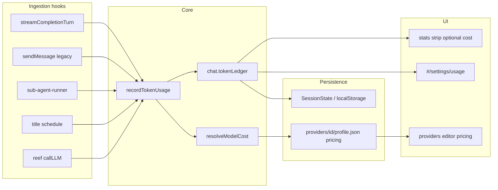

# Feature #14 — Cost / token observability

**Roadmap:** [`feature-audit-roadmap.md`](../feature-audit-roadmap.md) item **#14** (Partial → Built)  
**Status:** Plan (not started)  
**Suggested sequencing:** Quick win (roadmap “Quick wins” bucket, alongside #2 / #6 / #9)

---

## Summary

Minnow already surfaces **per-turn** inference metrics (tok/s, TTFT, prompt/completion split) and **pre-send context estimates**, but there is no durable **ledger**, no **per-agent attribution**, no **per-chat rollups**, and no **dollar cost** for paid APIs. This feature adds provider pricing tables, a persisted `chat.tokenLedger`, ingestion from every LLM call site, and a **Settings → Usage** panel at `#/settings/usage`.

---

## Current state

| Area | What exists | Location |
|------|-------------|----------|
| Last-turn metrics strip | tok/s, TTFT, generation time, prompt/completion bars, model arch/quant/ctx | [`src/ui/stats.ts`](../../../src/ui/stats.ts), `#statsStrip` in [`index.html`](../../../index.html) |
| Sidebar chat preview | Last turn: tok/s · TTFT · total tok | `formatSidebarStatsPreview()` in `stats.ts`, `chat.lastStats` |
| Per-message chips | tok/s, TTFT, gen time, total tokens on assistant bubbles | `appendStats()` in [`src/ui/messages.ts`](../../../src/ui/messages.ts) |
| Provider `usage` in stream | `stream_options: { include_usage: true }`; merge in `mergeStreamMeta` / `finalizeResponseMeta` | [`src/api/chat.ts`](../../../src/api/chat.ts), [`src/tools/loop.ts`](../../../src/tools/loop.ts) |
| History persistence | `AssistantMessage.stats` / `.usage` on completed turns | [`src/types.ts`](../../../src/types.ts), [`src/state/sessions.ts`](../../../src/state/sessions.ts) |
| Context fill (distinct) | Estimated **next-send** fill vs limit; optional `lastTurnPromptTokens` from provider | [`src/chat/context-usage.ts`](../../../src/chat/context-usage.ts), `#contextUsageRing` |
| Settings prompt estimate (F25) | Heuristic `chars ÷ 4` for **outbound** size — not billing, not provider usage | [`src/ui/settings-prompt-estimate.ts`](../../../src/ui/settings-prompt-estimate.ts), [`src/chat/prompts/token-estimate.ts`](../../../src/chat/prompts/token-estimate.ts) |
| Provider registry | `~/.minnow/providers/<id>/profile.json` — no pricing fields | [`server/providers/store.js`](../../../server/providers/store.js) |

**Ingestion today (main chat only):** Each tool-loop completion calls `finalizeResponseMeta` → updates `chat.lastStats`, `updateStrip`, and attaches `stats`/`usage` to the assistant history row. **Not recorded:** sub-agent turns ([`src/agents/sub-agent-runner.ts`](../../../src/agents/sub-agent-runner.ts) accumulates `streamMeta` but never finalizes usage), title jobs, Reef `callLLM`, work-agent-only paths that bypass the main loop, or cumulative chat/session totals.

---

## Gap

1. **No `chat.tokenLedger`** — cannot answer “how much did this chat cost?” after reload.
2. **No per-agent rollup** — main mode/work-agent, sub-agent type, title, Reef widget LLM, Orchestrate board LLM are invisible in aggregate.
3. **No pricing / USD** — remote providers (OpenAI-compatible) have no `inputPer1M` / `outputPer1M` table on the provider profile.
4. **No global usage settings** — no `#/settings/usage`; pricing editing would require hand-editing `profile.json`.
5. **Sub-agent / auxiliary completions** — usage often never extracted from `streamMeta` even when the upstream sends it.

---

## Goals

1. **Record every LLM completion** with `providerId`, `modelId`, `usage`, optional `stats`, and **attribution** (`source`).
2. **Persist per-chat ledger** on the session blob (`chat.tokenLedger`) with running totals and breakdown by source key.
3. **Optional USD cost** when `pricing` is configured on the provider (default **$0** for local / missing table).
4. **Settings → Usage** (`#/settings/usage`): active-chat summary, all-chats rollup (current workspace session), per-agent table, link to configure pricing under Providers.
5. **Keep existing UX** — stats strip and context ring stay; add non-intrusive cost hints where data exists (no regression when usage is missing).

**Non-goals (v1):**

- Invoice-grade billing, tax, or multi-currency conversion beyond a single display currency.
- Replacing Feature 25 prompt estimate (orthogonal; label clearly as “estimate” vs “billed tokens”).
- Server-side aggregation across machines (client/session scope only unless later `~/.minnow/usage.json` is added).
- Automatic fetching of public API list prices from the internet.

---

## Acceptance criteria

- [ ] After a main-chat turn with provider `usage`, `chat.tokenLedger.totals` increases and survives `scheduleSaveSessions` / reload.
- [ ] Sub-agent run that returns `usage` in SSE increments the **parent chat** ledger under `source.kind === 'sub-agent'` with the correct `subAgentType`.
- [ ] Title generation completion (when enabled) records under `source.kind === 'title'`.
- [ ] Provider `profile.json` may include `pricing`; PUT `/api/providers/:id` persists it; GET returns it on the public provider object (no secrets).
- [ ] With `pricing.models["gpt-4o"]` (or wildcard), ledger entries show `costUsd` and Usage panel shows chat total USD (4 decimal places or “< $0.01”).
- [ ] Local LM Studio provider with no `pricing` block: tokens recorded, `costUsd` null / $0.00 display.
- [ ] `#/settings/usage` nav item renders; hash `#/settings/usage` activates panel; offline (`npm run dev`) shows banner + session-only data.
- [ ] Clearing chat history resets or archives ledger per product decision (see Phase 2 — default: **reset ledger with history**).
- [ ] `npm test` includes new unit tests for cost math and ledger merge; no regressions in `test/ui/stats-split-layout.test.mjs`.
- [ ] [`documentation/context.md`](../../context.md) updated when feature ships (Usage panel, `tokenLedger`, provider `pricing`).

---

## Architecture



### 1. `pricing` block on provider (`profile.json`)

Stored server-side; exposed on `ProviderPublic` (client types extended).

```json
{
  "pricing": {
    "currency": "USD",
    "default": { "inputPer1M": 0, "outputPer1M": 0 },
    "models": {
      "gpt-4o-mini": { "inputPer1M": 0.15, "outputPer1M": 0.6 },
      "*": { "inputPer1M": 1, "outputPer1M": 3 }
    }
  }
}
```

| Field | Meaning |
|-------|---------|
| `currency` | ISO 4217 for display only (v1: USD) |
| `default` | Fallback when model id not in `models` |
| `models` | Keys are **exact** `modelId` strings Minnow sends in completions; `"*"` wildcard after exact match fails |

**Resolution order:** `models[modelId]` → `models["*"]` → `default` → `{ inputPer1M: 0, outputPer1M: 0 }`.

**Cost formula:**

```
costUsd = (prompt_tokens / 1_000_000) * inputPer1M + (completion_tokens / 1_000_000) * outputPer1M
```

If `usage` lacks `prompt_tokens` / `completion_tokens`, fall back to `total_tokens` attributed 100% to completion (document in UI as approximate).

**Local providers:** Omit `pricing` or set zeros — UI copy: “Local inference — no API cost configured.”

### 2. `chat.tokenLedger`

Add to [`Chat`](../../../src/types.ts) (optional field; default empty on load).

```typescript
/** Who initiated the completion (for rollups). */
export type TokenLedgerSource =
  | { kind: 'main'; modeId: string; workAgentId?: string | null }
  | { kind: 'sub-agent'; subAgentType: string; runId: string }
  | { kind: 'title' }
  | { kind: 'reef-widget' }
  | { kind: 'orchestrate-board' }
  | { kind: 'work-agent'; workAgentId: string };

export interface TokenLedgerEntry {
  id: string;
  at: number;
  source: TokenLedgerSource;
  providerId: string;
  modelId: string;
  usage: Usage;
  stats?: Stats;
  costUsd: number | null;
}

export interface TokenLedgerTotals {
  promptTokens: number;
  completionTokens: number;
  totalTokens: number;
  costUsd: number;
  completionCount: number;
}

/** Keys: stable string from source, e.g. "main:build", "sub-agent:explore", "title". */
export type TokenLedgerBySource = Record<string, TokenLedgerTotals>;

export interface ChatTokenLedger {
  entries: TokenLedgerEntry[];
  totals: TokenLedgerTotals;
  bySource: TokenLedgerBySource;
}
```

**Caps:** Keep last **N** entries (recommend **200**) to bound session JSON; totals/bySource always accumulate (never truncated).

**Session schema:** Prefer **optional field without `SESSION_SCHEMA_VERSION` bump** — missing `tokenLedger` treated as empty in `sessions.ts` load path. If blob size becomes an issue, follow-up v3 migration can externalize entries to `~/.minnow/chats/<id>/ledger.json` (out of v1 scope).

**Global rollup (v1.1 optional):** `~/.minnow/usage-summary.json` updated on save for cross-session Settings totals; not required for acceptance.

### 3. `#/settings/usage` panel

| Section | Content |
|---------|---------|
| Header | “Usage & cost” — clarify tokens are **provider-reported** when available |
| Active chat | Totals + by-source table + last 10 entries (time, source label, model, tokens, cost) |
| All chats (session) | Sum `tokenLedger.totals` across `getSessions().chats` for current workspace filter |
| Pricing hint | Link/button → `#/settings/providers` + doc link for `pricing` JSON shape |
| Empty state | No completions yet / Vite-only offline |

**Nav:** Add `usage` to `SettingsSectionId` and `SECTIONS` in [`src/ui/settings-page.ts`](../../../src/ui/settings-page.ts); `<button data-settings-nav="usage">` + `<section id="settingsSection-usage">` in [`index.html`](../../../index.html). Renderer: new [`src/ui/settings-usage.ts`](../../../src/ui/settings-usage.ts), wired from [`src/ui/settings-sections.ts`](../../../src/ui/settings-sections.ts).

**Providers editor:** Extend [`src/ui/settings-providers.ts`](../../../src/ui/settings-providers.ts) — collapsible “Model pricing (optional)” with default in/out per 1M tokens + JSON textarea for per-model overrides (validated client-side, saved via PUT).

---

## Key files

| Action | File |
|--------|------|
| **New** | `src/usage/token-ledger.ts` — `recordTokenUsage`, `mergeTotals`, `sourceKey`, `emptyLedger` |
| **New** | `src/usage/pricing.ts` — `resolveModelPricing`, `computeCostUsd` |
| **New** | `src/usage/types.ts` — ledger types (or colocate in `types.ts`) |
| **New** | `src/ui/settings-usage.ts` — Usage panel |
| **New** | `test/usage/token-ledger.test.mjs`, `test/usage/pricing.test.mjs` |
| **Edit** | `src/types.ts` — `Chat.tokenLedger`, `TokenLedger*` |
| **Edit** | `src/state/sessions.ts` — ensure/default ledger on load; reset on `clearChat` |
| **Edit** | `src/tools/loop.ts` — record after each `finalizeResponseMeta` |
| **Edit** | `src/api/chat.ts` — `sendMessage` path (if still used for non-tool sends) |
| **Edit** | `src/agents/sub-agent-runner.ts` — `finalizeResponseMeta` + record on parent `chatId` |
| **Edit** | `src/chat/titles/schedule.ts` (or runner) — record title completion |
| **Edit** | Reef widget LLM caller — record with `reef-widget` source |
| **Edit** | `server/providers/store.js` — read/write `pricing`; `toProviderPublic` |
| **Edit** | `server/providers/validate.js` — validate pricing shape |
| **Edit** | `src/providers/types.ts` — `ProviderPublic.pricing?` |
| **Edit** | `src/ui/settings-page.ts`, `index.html`, `settings-sections.ts` |
| **Edit** | `src/ui/stats.ts` — optional compact cost in strip when `lastStats` + ledger last entry align |
| **Edit** | `documentation/context.md` — ship note |

---

## Implementation phases

### Phase 0 — Types and pure functions

- Define ledger + pricing types.
- Implement `computeCostUsd`, `sourceKey`, `recordTokenUsage(chat, entry)` with caps and rollup math.
- Unit tests with **fixed** usage numbers and static pricing tables (no `Date.now()` in assertions).

### Phase 1 — Provider `pricing`

- Server: validate and persist `pricing` on create/update provider.
- Client: types + settings providers UI for default + per-model rates.
- `GET /api/providers` includes `pricing` on each row.

### Phase 2 — `chat.tokenLedger` persistence

- Hook `recordTokenUsage` from main tool loop (every completion round, including tool-call rounds).
- Session load: `ensureTokenLedger(chat)`; `clearChat` clears ledger.
- Sub-agent: pass `parentChatId`, resolve provider/model from sub-agent config; finalize usage from `streamMeta` in `streamSubAgentTurn`.
- Title + Reef: single-shot record calls after completion.

### Phase 3 — `#/settings/usage` UI

- Nav + section mount; active chat + session aggregate tables.
- Formatting helpers: `formatUsd`, `formatSourceLabel(source)`.
- Debounced refresh on `sessions` save and settings open (mirror F25 pattern).

### Phase 4 — Surface in chat chrome (optional polish)

- Sidebar row subtitle: optional total tokens or cost for chat.
- Stats strip: small “~$0.02” when last turn had cost (don’t clutter when null).
- Message chips: optional cost chip when `usage` present on message (read from history row, not recompute).

### Phase 5 — Docs and verification

- Update `context.md`.
- Add `documentation/plans/verification/feature-14.md` checklist (manual QA).
- Run full `npm test` + `npx tsc --noEmit`.

---

## YAML todos

```yaml
todos:
  - id: f14-types-pricing
    content: Add TokenLedger types and pricing.ts (computeCostUsd, resolveModelPricing) with unit tests
    status: pending
  - id: f14-provider-pricing-api
    content: Persist pricing on provider profile.json; validate in server/providers; expose on ProviderPublic
    status: pending
  - id: f14-token-ledger-core
    content: Implement token-ledger.ts (recordTokenUsage, caps, bySource rollups) with unit tests
    status: pending
  - id: f14-hook-main-loop
    content: Record usage from streamCompletionTurn and legacy sendMessage after finalizeResponseMeta
    status: pending
  - id: f14-hook-aux-agents
    content: Record usage from sub-agent-runner, title job, and Reef callLLM paths
    status: pending
  - id: f14-session-persistence
    content: Ensure tokenLedger on session load/save; reset on clearChat; optional entry cap
    status: pending
  - id: f14-settings-providers-pricing
    content: Providers settings UI for default and per-model pricing fields
    status: pending
  - id: f14-settings-usage-panel
    content: Add #/settings/usage section (nav, HTML, settings-usage.ts, session aggregates)
    status: pending
  - id: f14-stats-strip-polish
    content: Optional cost hint in stats strip / sidebar when ledger has priced entries
    status: pending
  - id: f14-docs-verification
    content: Update context.md and add verification/feature-14.md manual QA checklist
    status: pending
```

---

## Dependencies

| Dependency | Relationship |
|------------|----------------|
| **Feature 25** (prompt token estimate) | Independent — estimate stays heuristic; Usage panel must not imply estimate = billed tokens |
| **MIN-13** (context usage ring) | Complementary — ring = next-send budget; ledger = completed turns |
| **Backend-owned generations** | Main loop already uses `finalizeResponseMeta`; record on terminal chunk, not on every SSE delta |
| **#22 Project-scoped configs** | Future — pricing could move to `.minnow/providers/`; v1 stays global `~/.minnow/providers/` |
| **#2 Model routing UI** | Nice-to-have for labeling agents in Usage table |
| **#15 Agent activity view** | Could later link “running” agents to live token burn (out of v1) |

---

## Tests

| Suite | Focus |
|-------|--------|
| `test/usage/pricing.test.mjs` | Wildcard vs exact model; zero pricing; missing tokens fallback |
| `test/usage/token-ledger.test.mjs` | Rollup totals, bySource keys, entry cap eviction, `clearChat` reset |
| `test/state/sessions-ledger.test.mjs` (optional) | Load chat without `tokenLedger` → empty ledger |
| Extend `test/ui/stats-split-layout.test.mjs` | Only if strip DOM gains cost element — keep collapse behavior |
| Manual | [`documentation/plans/verification/feature-14.md`](../verification/feature-14.md) — remote provider with pricing, local LM Studio, sub-agent spawn, reload session |

**Test data rules:** Fixed UUIDs for entry ids in tests; static `usage` objects; no live provider calls.

---

## Risks and mitigations

| Risk | Impact | Mitigation |
|------|--------|------------|
| Provider omits `usage` in stream (known LM Studio quirks) | Missing ledger rows | Show “—” in UI; optional client estimate **off** by default; document `stream_options.include_usage` |
| Tool loop records **multiple** completions per user send | Totals higher than “one reply” | Expected — label as “completions”; Usage panel groups by round or shows count |
| Session JSON bloat from `entries[]` | Slow save/load | Cap entries at 200; totals-only for old chats |
| Wrong `modelId` key in pricing table | $0 cost silently | Settings warning: “No price for model X”; wildcard `*` |
| Double record on resume/replay | Inflated totals | Record only on **new** `finalizeResponseMeta` after fresh generation; skip replay attach |
| Vite-only (`npm run dev`) | No provider PUT | Ledger still works; pricing edit disabled with banner |
| User confuses F25 estimate with cost | Trust issue | Distinct labels: “Next send (estimate)” vs “Recorded usage” |
| Sub-agent parent chat not in scope | Lost attribution | Thread `chatId` through `SubAgentRunnerInput` |

---

## Open questions (resolve before Phase 2)

1. **Clear history:** Reset ledger entirely vs keep totals with cleared messages? (Recommend **reset with history** for clarity.)
2. **Orchestrate board LLM:** Separate `orchestrate-board` source vs fold into `main`?
3. **Entry cap:** 200 vs 500 — measure typical session size after dogfood.
4. **Global `usage-summary.json`:** In v1 or defer to v1.1?

---

## References

- Roadmap item: [`documentation/plans/feature-audit-roadmap.md`](../feature-audit-roadmap.md) §14
- Architecture: [`documentation/context.md`](../../context.md) — API usage, stats strip, F25, MIN-13
- Metrics UI: [`src/ui/stats.ts`](../../../src/ui/stats.ts)
- Prompt estimate UI: [`src/ui/settings-prompt-estimate.ts`](../../../src/ui/settings-prompt-estimate.ts)
