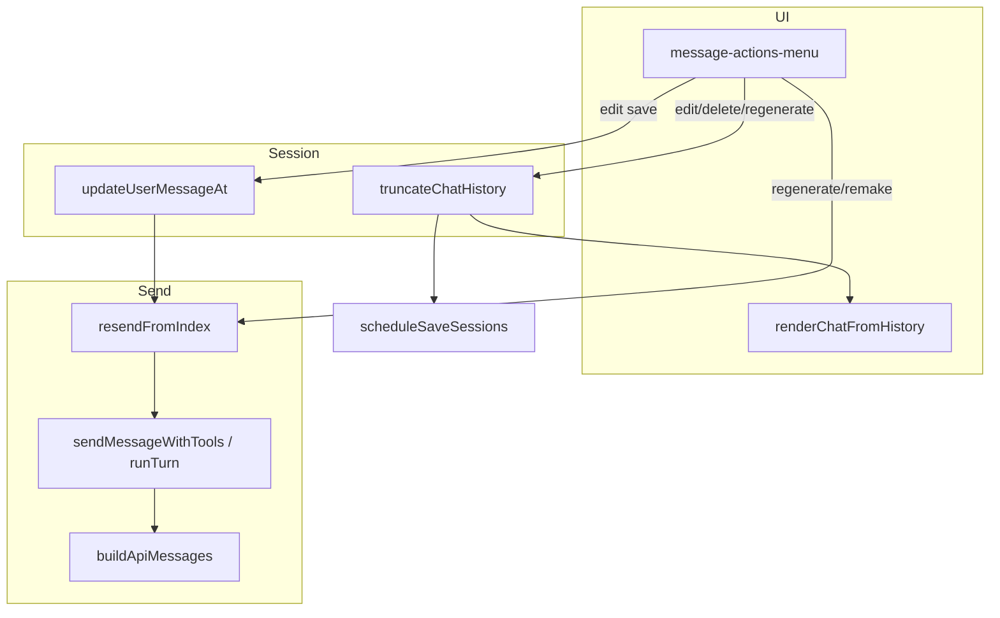

# Feature 15–17 — Cursor-like message actions (C2)

| Field | Value |
|-------|-------|
| **ID** | `feature-15-16-17-message-actions` |
| **Epic** | C — Chat UX and control |
| **Wave** | 2 (with C1 stop, C3 scroll, C5 stream persistence) |
| **Size** | L |
| **Depends on** | C1 [`feature-14-stop-generation`](feature-14-stop-generation.md) (stop + stable abort before resend/regenerate) |
| **Source backlog** | [`documentation/plans/product_backlog_agents_48a41af9.plan.md`](../product_backlog_agents_48a41af9.plan.md) § C2 |
| **Not** | C3 [`feature-17-chat-scroll-during-stream`](feature-17-chat-scroll-during-stream.md) — different `feature-17` slug; IDs 15–17 here are capability splits only |

**Scope map (backlog IDs):**

| ID | Capability |
|----|------------|
| **15** | Per-message ⋮ menu UI, positioning, copy, streaming guards |
| **16** | `truncateChatHistory`, edit user message, delete message + after |
| **17** | Regenerate from here, remake assistant turn, `resendFromIndex` + tool-chain-safe API replay |

---

## Summary

Add a **⋮ message actions menu** on each rendered user and assistant block (and grouped tool-call UI), matching Cursor-style flows: **Edit**, **Regenerate from here**, **Delete message**, **Copy**, and **Remake**. History mutations go through a single **`truncateChatHistory`** API that keeps **assistant + `tool_calls` + `tool` results** as atomic units so `buildApiMessages` and `renderChatFromHistory` never see orphaned tool rows. **Regenerate / remake** truncate then call **`resendFromIndex`** to replay the last user turn without duplicating the user row in `chat.history`.

---

## Goals

1. **Discoverable actions** — Hover/focus ⋮ on each message row; menu does not fight chat scroll (C3 is separate).
2. **Correct history surgery** — Truncation updates `chat.history`, `~/.minnow/sessions/state.json` (debounced), and DOM via full or incremental re-render.
3. **Tool-chain integrity** — Never leave `assistant.tool_calls` without matching `tool` rows, or stray `tool` rows without a parent assistant call.
4. **Resend without duplicate user** — `resendFromIndex` reuses the last user message in history and runs the existing tool loop (`sendMessageWithTools` core).
5. **Safe during stream** — All destructive/edit actions blocked while `streaming`; copy allowed.
6. **v1 scope** — No undo stack; attachment re-hydration on edit/resend is best-effort (placeholders in history only).

---

## Acceptance criteria

| # | Criterion |
|---|-----------|
| AC1 | Each user bubble and each assistant “turn” (prose and/or tool group) shows a ⋮ control with keyboard access (`aria-haspopup="menu"`). |
| AC2 | **Copy** puts message text on the clipboard; tool-only internal rows are not individually menu-targeted. |
| AC3 | **Edit** (user only): truncates all messages after the edited user row, opens composer with editable text (skill tag stripped for editing), send replaces that user row and runs a new assistant reply. |
| AC4 | **Delete message**: removes the selected logical turn and **all** following history; UI and persistence match. |
| AC5 | **Regenerate from here** (user row): truncates after that user message (inclusive keep), immediately resends that user content (no second user row). |
| AC6 | **Regenerate / Remake** (assistant row): truncates the assistant turn (and following messages), resends from the **preceding** user message without duplicating it. |
| AC7 | Truncating an `assistant` row with `tool_calls` also removes its `tool` result rows; truncating mid-chain is impossible from the menu (atomic block). |
| AC8 | After regenerate, `buildApiMessages` matches what `renderChatFromHistory` shows; tool bubbles in UI align with history indices. |
| AC9 | Actions disabled while `streaming` (status hint); after C1, user can **Stop** then regenerate. |
| AC10 | `npm run build` and `npm test` pass; new unit tests cover truncation edge cases and resend entry. |

---

## Current state (research)

### `src/ui/messages.ts`

- **`renderChatFromHistory(chat)`** — Full `chatArea` wipe + rebuild from `chat.history`. Builds `toolResultMap` from all `role: 'tool'` rows, then walks history skipping standalone tools.
- **`appendBubble`** — Creates `.msg.user` / `.msg.assistant` with label + bubble; no `data-history-index`, no action menu.
- **`clearChat`** — Blocks when `streaming`; sets `history = []`; good pattern for guards.
- **Tool rendering** — For `AssistantToolCallMessage`, renders optional prose bubble, then one DOM block per `tool_calls` entry via `renderToolCall` / `renderToolResult` (siblings in `#chatArea`, not nested under `.msg.assistant`).
- **Gap:** No mapping from DOM nodes → `history` indices; regenerate cannot target a row without refactoring render to stamp indices or maintain a parallel map.

### `src/state/sessions.ts`

- **`Chat.history: Message[]`** — Validated on load via `ensureMessageEntry` / `ensureChatShape`.
- **Mutations today** — Only append (`loop.ts`, `api/chat.ts`) and `clearChat` (`history = []`). No `truncateChatHistory`, no in-place user edit helper.
- **Persistence** — `scheduleSaveSessions()` debounced; server mode `putSessions(sessionState)`.
- **Guards** — `getActiveChat()`, `touchChat()`, `findChatById(chatId)`.

### `src/tools/loop.ts`

- **`buildApiMessages(chat, sysPrompt, options?)`** — Walks `chat.history` in order: `user` → string or multimodal for last user + pending attachments; `tool` → API tool results; `assistant` with/without `tool_calls`.
- **`sendMessageWithTools()`** — Always **pushes** a new user row (`chat.history.push({ role: 'user', … })`) then streams. No “replay from existing history” entry point.
- **Tool loop persistence** — On `finish_reason: tool_calls`: pushes `AssistantToolCallMessage`, then one `ToolResultMessage` per call, then continues SSE. Final prose → `AssistantMessage` with optional `thinking`, `stats`, `usage`.
- **`indexOfLastUserMessage`** — Private helper; reuse for resend / edit validation.
- **Gap:** Resend needs extracted `runAssistantTurnFromHistory(chat, { skipUserPush: true })` or equivalent.

### Tool history truncation (conceptual)

History is a **flat array**, not nested turns:

```text
[user₀, asst₁+tool_calls, tool₁, tool₂, asst₃ prose, user₄, …]
```

| UI block | History indices | Menu target |
|----------|-----------------|-------------|
| User bubble | `[i]` | `i` |
| Assistant prose only | `[i]` | `i` |
| Assistant + tools | `[i]` + `[i+1…i+k]` tools | **`i` only** (atomic) |
| Orphan `tool` row | — | Never exposed |

**Truncation invariant:** After any truncate, walk from the end and remove incomplete tails:

1. Trailing `tool` without a preceding `assistant.tool_calls` → drop.
2. Trailing `assistant` with `tool_calls` where some `id` lacks a `tool` row → drop assistant **and** any partial tool tail.
3. `buildApiMessages` must never emit tool results without their calling assistant message above them in the array.

### `src/chat/messaging.ts`

- Re-exports `sendMessageWithTools` as `sendMessage` — resend should export a sibling from `loop.ts` or thin wrapper here.

### Related

- **`src/api/chat.ts`** — `sendMessagePlain` also pushes user + assistant; optional parity for plain path (lower priority than tool loop).
- **C1 stop** — Regenerate while streaming requires stop first; plan assumes `streaming` guard + `stopGeneration()` exist.
- **Skills** — User history may include `[skill: id]` footer via `formatHistoryWithSkillTag`; edit UI should show user-visible text without breaking slash/skill semantics (see § UX).

---

## Architecture



### Proposed modules

| Module | Responsibility |
|--------|----------------|
| `src/chat/history-truncate.ts` | `truncateChatHistory`, `normalizeHistoryTail`, `getLogicalTurnAt`, `expandAtomicRange` |
| `src/chat/resend-from-index.ts` | `resendFromIndex(chatId, userIndex)` — guards, truncate if needed, call loop |
| `src/ui/message-actions.ts` | Menu open/close, action handlers, clipboard |
| `src/styles/message-actions.css` | ⋮ button, dropdown, z-index |
| `src/ui/messages.ts` | Stamp `data-history-index` / `data-turn-kind`; wire menu on render |
| `src/tools/loop.ts` | Extract `executeSendTurn({ pushUser?: false, userText?, … })` for resend |

---

## UX decisions (confirm before implementation)

| Topic | Recommendation | Alternative |
|-------|----------------|-------------|
| Menu trigger | ⋮ on hover (desktop) + always visible on focus-within | Right-click context menu only |
| Tool turn targeting | One menu on assistant-tool **group** (prose + tool cards) | Per-tool-card menus |
| Edit attachments | v1: text-only edit in composer; `[image: …]` / `<file>` blocks stay in string | Re-open attachment picker |
| Skill tag on edit | Strip `[skill: x]` from composer; on send re-apply skill if user re-types `/skill` | Preserve hidden skill id on row |
| Delete confirm | Confirm when deleting **>0** assistant tokens or any tool run | No confirm |
| Regenerate on user | Immediate resend (no extra click) | Truncate only, user clicks Send |
| Active chat only | Actions only on `getActiveChat()` | Cross-chat from sidebar |
| Plain send path | Tool loop only for v1 | Mirror in `sendMessagePlain` |

**Default for v1:** grouped tool menu, confirm delete if history length after truncate &lt; before by more than one row, text-only edit, tool-loop resend only.

---

## Schema / API changes

| Area | Change |
|------|--------|
| **Session blob** | No schema version bump; `chat.history` shape unchanged. Mutations are in-place array truncation + optional user `content` edit. |
| **New fields** | None required on `Message` types for v1. |
| **Public API** | `truncateChatHistory`, `updateUserMessageAt`, `resendFromIndex` — implement in `src/chat/` (see below); optional thin re-exports from `src/state/sessions.ts` for backlog parity. |
| **Server** | None — history lives in client session state only. |

Backlog § C2 names `sessions.ts` + `loop.ts`; this plan places truncate/resend orchestration in **`src/chat/history-truncate.ts`** and **`src/chat/resend-from-index.ts`**, with **`loop.ts`** owning `runChatTurn` / `buildApiMessages`. Re-export from `sessions.ts` if callers should import from one place.

---

## API design

### `truncateChatHistory(chatId: string, cutIndex: number, mode: 'inclusive' | 'exclusive'): TruncateResult`

```ts
export interface TruncateResult {
  ok: boolean;
  error?: 'not_found' | 'streaming' | 'invalid_index' | 'invalid_target';
  removedCount?: number;
  chat?: Chat;
}
```

**Semantics:**

- Resolve `chat` by `chatId`; reject if `streaming`.
- Map `cutIndex` through `expandAtomicRange(history, cutIndex)`:
  - If index is `tool` → resolve to parent `assistant` index.
  - If index is `assistant` with `tool_calls` → end index = last matching `tool` row for those ids.
- **`inclusive`:** keep `history[0 .. endIndex]` (used for “regenerate from user” / edit before resend).
- **`exclusive`:** keep `history[0 .. cutIndex - 1]` after atomic expansion (used for “delete this message and after” — clarify in UI copy).
- Run `normalizeHistoryTail(history)` on the result.
- `touchChat`, `scheduleSaveSessions`.

### `updateUserMessageAt(chatId, userIndex, newContent): boolean`

- Validates `history[userIndex].role === 'user'`.
- `truncateChatHistory(chatId, userIndex, 'inclusive')` then set `content`.
- Does not send until caller invokes resend.

### `resendFromIndex(chatId: string, userHistoryIndex: number): Promise<void>`

- Guards: not `streaming`, valid user index, user row exists at index.
- Ensures `history` ends at that user row (truncate after if caller did not).
- Does **not** push user; calls loop with `pendingUserText` from `history[userIndex].content`, `pushUser: false`.
- Clears composer attachments for resend v1 (document in UI).

### Index stamping (render contract)

Each rendered block carries:

```html
<div class="msg user" data-history-index="4" data-turn-kind="user">…</div>
<div class="msg assistant" data-history-index="5" data-turn-kind="assistant-tools">…</div>
<!-- tool cards: data-history-index="5" data-turn-kind="tool-group" (same anchor index) -->
```

`renderChatFromHistory` loop index `i` must match these attributes for menu handlers.

---

## Implementation plan

### Phase 0 — Prerequisite check (C1)

- [ ] **0.1** Confirm `feature-14-stop-generation` shipped: `stopGeneration()`, composer stop mode, partial abort finalize.
- [ ] **0.2** Message actions use `if (streaming) { setStatus(...); return; }` consistent with `clearChat`.

### Phase 1 — History truncation core (Feature 16)

- [ ] **1.1** Add `src/chat/history-truncate.ts`:
  - `findToolResultRange(history, assistantIndex): { start, end }`
  - `expandAtomicRange(history, index): { start, end }`
  - `normalizeHistoryTail(history): void` (mutates in place)
  - `truncateChatHistory(chatId, cutIndex, mode)`
- [ ] **1.2** Export helpers from `src/chat/history-truncate.ts` for tests.
- [ ] **1.3** Unit tests `test/chat/history-truncate.test.mts`:
  - Truncate after assistant+2 tools removes tools only when assistant kept.
  - Truncate at tool index snaps to assistant.
  - Tail incomplete tool chain stripped.
  - `inclusive` vs `exclusive` lengths.

### Phase 2 — Resend entry (Feature 17)

- [ ] **2.1** Refactor `sendMessageWithTools` in `loop.ts`:
  - Extract `runChatTurn(options: { pushUser: boolean; userText: string; rawText?: string; skillId?: string | null; … })`.
  - Existing send path: parse composer → `pushUser: true`.
- [ ] **2.2** Add `src/chat/resend-from-index.ts`:
  - `resendFromIndex(chatId, userHistoryIndex)` → `truncate` inclusive → `runChatTurn({ pushUser: false, userText: history[i].content })`.
  - Parse slash from stored content if `[skill:]` tag present (reuse `parseSlashCommand` / strip tag helpers).
- [ ] **2.3** Wire `window` / `messaging.ts` export if needed for tests.
- [ ] **2.4** Tests `test/chat/resend-from-index.test.mts` (mock provider or stub `runChatTurn`):
  - `pushUser: false` does not append a second user row.
  - Invalid index / `streaming` guard rejects resend.
  - Stored `[skill:]` content still parses on resend.

### Phase 3 — Render index map + menu UI (Feature 15)

- [ ] **3.1** Update `renderChatFromHistory` / `appendBubble` to accept optional `historyIndex` + `turnKind` and set `dataset`.
- [ ] **3.2** For tool groups, wrap prose + tool DOM in a container **or** stamp the same `data-history-index` on assistant prose and each tool card (minimum change: shared index on siblings).
- [ ] **3.3** Add `src/ui/message-actions.ts`:
  - `attachMessageActions(wrap, { chatId, historyIndex, role, turnKind })`
  - Dropdown: Copy, Edit (user), Delete, Regenerate, Remake (assistant)
  - Click-outside / Escape close; single open menu globally
- [ ] **3.4** `src/styles/message-actions.css` — import from `main.ts` / `global.css`
- [ ] **3.5** `appendBubble` used by live send still works (index optional until history push completes — live rows get index on next full render or immediate stamp after push).

### Phase 4 — Action handlers

- [ ] **4.1** **Copy** — `navigator.clipboard.writeText`; for assistant-tools, concatenate prose + summarized tool names (v1: prose only).
- [ ] **4.2** **Edit** — `truncateChatHistory(id, index, 'inclusive')`; strip skill tag for composer; focus `#msgInput`; on send call `updateUserMessageAt` + `resendFromIndex` (or replace then single send).
- [ ] **4.3** **Delete** — confirm → `truncateChatHistory(id, index, 'exclusive')` with atomic expansion → `renderChatFromHistory`.
- [ ] **4.4** **Regenerate from here** (user) — truncate inclusive at user index → `resendFromIndex`.
- [ ] **4.5** **Remake** (assistant) — find `indexOfLastUserMessage` before assistant atomic block → truncate to user inclusive → `resendFromIndex`.
- [ ] **4.6** After every mutation: `renderChatFromHistory(getActiveChat())`, `renderStatsForChat`, `renderSidebar` if needed.

### Phase 5 — Integration and edge cases

- [ ] **5.1** Title job: regenerating first user message should not re-fire title if name not placeholder (`schedule.ts` already guards).
- [ ] **5.2** Sub-agents: resend creates new `parentTurnId`; prior sub-agent runs orphaned (acceptable v1).
- [ ] **5.3** UI Designer / work-agent one-turn pin: resend uses current chat settings (document).
- [ ] **5.4** Terminal history: v1 does not truncate `chat.terminalHistory` on message delete (note in context.md as follow-up).
- [ ] **5.5** Tool approval: block menu actions if approval queue pending (optional, match `clearChat`).

### Phase 6 — Build and test

- [ ] **6.1** `npm run build` — no TS errors.
- [ ] **6.2** `npm test` — all existing + new suites.
- [ ] **6.3** `test/ui/message-actions.test.mjs` (happy-dom): menu opens, copy called, streaming guard disables button.
- [ ] **6.4** Manual QA checklist (below).

### Phase 7 — Documentation

- [ ] **7.1** Update `documentation/context.md` § Persisted message types / Multi-chat with message actions + truncation rules.
- [ ] **7.2** Mark C2 done in product backlog when shipped.
- [ ] **7.3** Fill [`documentation/plans/verification/feature-15-16-17.md`](../verification/feature-15-16-17.md) implementation sign-off (PASS/FAIL).

---

## Files to touch

| File | Change |
|------|--------|
| `src/chat/history-truncate.ts` | **New** — truncate + normalize |
| `src/chat/resend-from-index.ts` | **New** — resend orchestration |
| `src/tools/loop.ts` | Extract `runChatTurn`, resend path |
| `src/chat/messaging.ts` | Export `resendFromIndex` if public |
| `src/state/sessions.ts` | Optional thin wrappers re-exporting truncate (or keep in chat/) |
| `src/ui/messages.ts` | Index datasets, hook menu, call truncate/render |
| `src/ui/message-actions.ts` | **New** — menu + handlers |
| `src/styles/message-actions.css` | **New** |
| `src/main.ts` | Import CSS |
| `test/chat/history-truncate.test.mts` | **New** |
| `test/chat/resend-from-index.test.mts` | **New** |
| `test/ui/message-actions.test.mjs` | **New** |
| `documentation/context.md` | Ship note |
| `documentation/plans/verification/feature-15-16-17.md` | Sign-off checklist + PASS/FAIL on ship |

**No server changes** — history lives in client session blob only.

---

## Backlog traceability (C2)

| Backlog field | Plan coverage |
|---------------|---------------|
| Per-message ⋮: Edit, Regenerate from here, Delete, Copy, Remake | Goals 1–5; Phase 3–4; AC1–AC6 |
| `truncateChatHistory(chatId, index)` | § API design (+ `mode` for inclusive/exclusive delete vs regenerate) |
| `resendFromIndex()` in `loop.ts` (+ optional `sessions.ts` re-export) | Phase 2; `resend-from-index.ts` + `runChatTurn({ pushUser: false })` |
| Tool rows truncate atomically | AC7–AC8; `expandAtomicRange`, `normalizeHistoryTail` |
| Regenerate removes subsequent UI + persistence | AC4–AC6, manual tests 3–5 |
| Tool-call chains stay consistent | AC7–AC8, manual test 6 |
| Undo not required v1 | Goals § v1 scope |
| Depends on C1 | Phase 0; AC9 |

---

## Verification artifact

After implementation, complete [`documentation/plans/verification/feature-15-16-17.md`](../verification/feature-15-16-17.md): automated commands, manual U1–U9, and backlog AC1–AC10. Report **PASS** only when build/tests green and all manual checks are checked.

## Verification record

| Date | Result | Notes |
|------|--------|-------|
| 2026-05-20 | **PASS** (plan review) | Aligned to backlog § C2 + per-agent template; see verification doc § Plan review |
| 2026-05-20 | **PASS** (shipped) | Implementation sign-off — see verification doc |

---

## Manual test plan

1. **Copy** — User and assistant messages copy full text; toast/status “Copied”.
2. **Edit user** — Change text, send → single user row updated, new assistant reply, messages below gone.
3. **Delete user** — Confirm → user + all following removed from sidebar persistence (reload page).
4. **Regenerate user** — Mid-thread user message → later messages disappear, new assistant streams.
5. **Remake assistant** — After tool run, remake → tools + assistant gone, same user prompt re-run, tools execute again.
6. **Tool atomicity** — Open menu on tool card area → same index as parent assistant; delete removes entire tool chain.
7. **Streaming** — Menu disabled or click shows “Finish or stop current reply”; after stop, regenerate works.
8. **buildApiMessages** — After regenerate, network payload has no orphan `tool` messages (devtools / debug log).
9. **Multi-chat** — Switch chat → actions apply only to active chat history.

---

## Risk register

| Risk | Mitigation |
|------|------------|
| DOM index drift during live stream | Do not attach menus to in-flight streaming rows; only history-backed render |
| Incomplete tool chain after stop (C1) | `normalizeHistoryTail` on truncate and before `buildApiMessages` |
| Large history re-render perf | Accept full rebuild v1; incremental render is follow-up |
| Skill tag parse on resend | Centralize strip/format helpers with `formatHistoryWithSkillTag` |

---

## Todos (execution checklist)

- [x] C1 stop generation merged (streaming guard; stop via `finalizeStoppedTurn`)
- [x] `history-truncate.ts` + tests
- [x] `loop.ts` refactor + `resendFromIndex` + tests
- [x] Render `data-history-index` + message menu UI
- [x] Wire all five actions + streaming guards
- [x] `npm run build` + targeted tests (full `npm test` has pre-existing xterm import failures in other suites)
- [x] Update `documentation/context.md`

---

## References

- [`src/ui/messages.ts`](../../../src/ui/messages.ts) — `renderChatFromHistory`, `appendBubble`, `clearChat`
- [`src/state/sessions.ts`](../../../src/state/sessions.ts) — persistence, `ensureMessageEntry`
- [`src/tools/loop.ts`](../../../src/tools/loop.ts) — `buildApiMessages`, tool loop pushes
- [`documentation/context.md`](../../context.md) — § Persisted message types
- [`feature-14-stop-generation.md`](feature-14-stop-generation.md) — dependency
