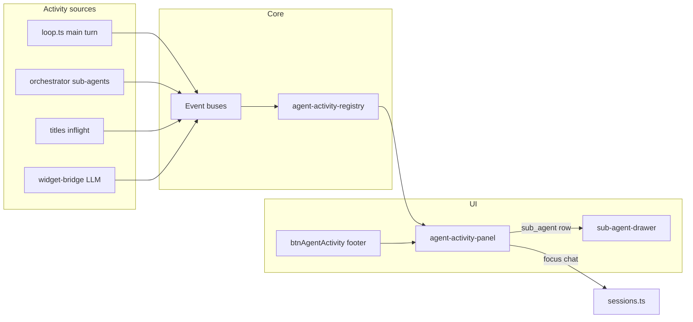

# Feature #15 — Agent activity view

**Roadmap:** [`feature-audit-roadmap.md`](../feature-audit-roadmap.md) §15 (Partial)  
**Status:** Shipped  
**Primary deliverable:** Global “all agents right now” panel — not per-chat cards only.

---

## Summary

Minnow already surfaces agent work in several places (sub-agent cards, drawer, Orchestrate board, top-bar status pill), but nothing answers: *“What is every agent doing across all chats, right now?”* This plan adds a consolidated **Agent activity** panel fed by existing orchestration signals plus small, explicit live-state hooks where data is missing today (main-turn tool name, title jobs, Reef widget LLM).

---

## YAML todos

```yaml
todos:
  - id: f15-01-registry
    content: "Define AgentActivityRow types + snapshot builder (registry module)"
    status: pending
  - id: f15-02-main-turn-events
    content: "Emit main-turn activity from loop.ts (phase, tool name, model, chat id)"
    status: pending
  - id: f15-03-sub-agent-surface
    content: "Expose sub-agent live tool + model in orchestrator/status payload"
    status: pending
  - id: f15-04-title-reef-events
    content: "Add title-job and Reef widget LLM activity event buses"
    status: pending
  - id: f15-05-panel-shell
    content: "Mount agent-activity-panel (toggle, list, empty state) in app shell"
    status: pending
  - id: f15-06-row-actions
    content: "Row click → focus chat, open drawer, or scroll to anchor"
    status: pending
  - id: f15-07-context-elapsed
    content: "Show elapsed + context fill per row (best-effort estimates)"
    status: pending
  - id: f15-08-styles-a11y
    content: "agent-activity-panel.css + keyboard/ARIA + responsive layout"
    status: pending
  - id: f15-09-tests
    content: "Unit tests for registry snapshot + panel render helpers"
    status: pending
  - id: f15-10-docs
    content: "Update documentation/context.md + roadmap item when shipped"
    status: pending
```

---

## Current state

| Surface | What it shows | Scope | Key files |
|--------|----------------|-------|-----------|
| **Sub-agent cards** | Type, status, task preview, nested tool count | Active chat only; hidden in Orchestrate **board** view | [`src/ui/sub-agent-cards.ts`](../../../src/ui/sub-agent-cards.ts) |
| **Sub-agent drawer** | Full transcript, cancel, live refresh | One run; open on card click | [`src/ui/sub-agent-drawer.ts`](../../../src/ui/sub-agent-drawer.ts) |
| **Sub-agent events** | Pub/sub on run updates | Process-wide listeners | [`src/agents/sub-agent-events.ts`](../../../src/agents/sub-agent-events.ts) |
| **Orchestrate board** | Per-task agent badge, active run count, board elapsed | Current chat + board store | [`src/ui/orchestrate-board.ts`](../../../src/ui/orchestrate-board.ts) |
| **Status pill** | Single line: “Generating reply (Builder)…”, “Running tools…” | Visible chat’s main turn only (`isStreamDomVisible`) | [`src/ui/status.ts`](../../../src/ui/status.ts), [`src/tools/loop.ts`](../../../src/tools/loop.ts) |
| **Sidebar chat dot** | Thinking indicator | One `streamingChatId` at a time | [`src/ui/chat-item-dot.ts`](../../../src/ui/chat-item-dot.ts), [`src/app-state.ts`](../../../src/app-state.ts) |
| **Context usage ring** | Main chat context % | Active chat composer | [`src/ui/context-usage-ring.ts`](../../../src/ui/context-usage-ring.ts) |
| **Generations** | Backend stream persistence | Per-chat `currentGenerationId` | [`src/api/generations.ts`](../../../src/api/generations.ts), [`src/chat/generation-resume.ts`](../../../src/chat/generation-resume.ts) |
| **Title jobs** | Async rename on first message | Per-chat inflight map (no UI) | [`src/chat/titles/inflight.ts`](../../../src/chat/titles/inflight.ts), [`src/chat/titles/schedule.ts`](../../../src/chat/titles/schedule.ts) |
| **Reef widget LLM** | `callLLM` in iframe (max 2 concurrent) | Active chat; count private in bridge | [`src/chat/reef/widget-bridge.ts`](../../../src/chat/reef/widget-bridge.ts) |

**Existing global APIs useful for the panel:**

- `listActiveSubAgentRuns()` — all queued/running sub-agents ([`src/agents/orchestrator.ts`](../../../src/agents/orchestrator.ts))
- `subscribeSubAgentRuns()` — live updates ([`src/agents/sub-agent-events.ts`](../../../src/agents/sub-agent-events.ts))
- `listChatsWithGenerationId()` — chats with persisted in-flight generations ([`src/chat/generation-resume.ts`](../../../src/chat/generation-resume.ts))
- `hasTitleJobInflight(chatId)` — title job registry ([`src/chat/titles/inflight.ts`](../../../src/chat/titles/inflight.ts))

**Orchestrator internals (not yet on `SubAgentRun`):** per-run `toolCallLog[]` with `{ name, args }` updated on each nested tool call — suitable for “current tool” without parsing `messages`.

---

## Gap

1. **No single pane** listing every in-flight worker (main turn, sub-agents, title job, Reef widget LLM) across **all chats**.
2. **Main turn** status is one global pill string; no structured row (model, phase, which tool, elapsed, context %).
3. **Background streams:** `streaming` / `streamingChatId` track one “owner” chat; other chats can still hold `currentGenerationId` after resume — invisible except sidebar dot on owner only.
4. **Sub-agent “current tool”** not on the public run type; cards show `liveNestedToolCalls` / `toolTurns` only.
5. **Title + Reef LLM** have no pub/sub; UI cannot list them without new events.
6. **Context fill** for sub-agents is not computed (feature #3); main chat ring is per active chat only.

---

## Goals

1. **Global visibility:** One panel shows all active agent-like work, regardless of which chat is selected.
2. **At-a-glance fields per row:** Agent kind, label, chat name, **model** (provider/model id or display label), **phase** (generating / running tools / queued / title / widget LLM), **current tool** when applicable, **elapsed**, **context fill** when computable.
3. **Low coupling:** Prefer subscribing to existing buses; add thin event modules only where state is private.
4. **Actionable rows:** Click focuses the owning chat; sub-agent rows open the existing drawer (reuse `openSubAgentDrawer`).
5. **Performance:** Coalesce UI refresh (e.g. 100–200 ms) on high-frequency sub-agent transcript emits (`LIVE_TRANSCRIPT_EMIT_MS` is 80 ms today).

### Non-goals (v1)

- Full transcript in the panel (drawer remains the deep view).
- Historical timeline / trace replay (feature #1).
- Dollar cost or token ledger rollups (feature #14).
- Replacing Orchestrate board task UI or sub-agent inline cards.

---

## Acceptance criteria

- [ ] **Toggle** in chat sidebar footer (next to inference metrics / terminal) opens/closes the panel; state persisted in `localStorage` (same pattern as stats strip).
- [ ] Panel lists **zero-state** copy when nothing is running.
- [ ] **Main chat turn:** Row appears when `isChatStreaming(chatId)` **or** `chat.currentGenerationId` is set and generation not settled; shows work-agent/mode label, resolved model, phase (`generating` | `running_tools` | `thinking`), optional tool id, elapsed since turn start.
- [ ] **Sub-agent:** Row for each `listActiveSubAgentRuns()` entry across all parent chats; model from type config; current tool from last `toolCallLog` entry or new `liveCurrentToolName`; tool round `toolTurns` / `maxToolTurns`; click opens drawer.
- [ ] **Title job:** Row when `hasTitleJobInflight(chatId)`; label “Naming chat”; model from schedule context or titles config; no tool line.
- [ ] **Reef widget LLM:** Row per in-flight widget request (widget id + model); cap reflected (max 2); only in Reef mode or when count &gt; 0.
- [ ] **Cross-chat:** Starting a stream in chat A, switching to chat B, panel still shows A’s main turn until complete.
- [ ] **Elapsed** updates at least every second while panel is open (no per-subscriber 80 ms DOM thrash).
- [ ] **Context fill:** Main rows use `getContextBudget({ chat })`; sub-agent rows show “—” or approximate message-token estimate until feature #3; document limitation in UI tooltip.
- [ ] **a11y:** `role="dialog"` or `role="region"` with `aria-label="Agent activity"`; list `role="list"` / rows `role="listitem"`; Escape closes panel.
- [ ] **Tests:** Registry snapshot tests with fixed ids/timestamps; no live DOM in registry tests.

---

## Architecture

### Unified activity model

New module (recommended): [`src/state/agent-activity-registry.ts`](../../../src/state/agent-activity-registry.ts)

```ts
/** Discriminated union — one row per concurrent worker */
type AgentActivityKind =
  | 'main_turn'
  | 'sub_agent'
  | 'title_job'
  | 'reef_widget_llm';

interface AgentActivityRow {
  id: string;              // stable key for DOM reconcile
  kind: AgentActivityKind;
  chatId: string;
  chatTitle: string;       // snapshot for list label
  label: string;           // e.g. "Builder", "explore", "Naming chat"
  status: 'queued' | 'running' | 'generating' | 'tools';
  modelDisplay: string;    // human label
  providerId?: string;
  modelId?: string;
  currentTool?: string | null;
  toolTurns?: number;
  maxToolTurns?: number;
  contextPercent: number | null;
  contextIsEstimate: boolean;
  startedAtMs: number;
  elapsedMs: number;
  /** sub-agent only */
  runId?: string;
  parentToolCallId?: string | null;
}
```

**Snapshot builder** `buildAgentActivitySnapshot(nowMs, deps)` merges:

| Kind | Source |
|------|--------|
| `main_turn` | `sessionState.chats` + `isChatStreaming` / `currentGenerationId` + new `main-turn-activity` store |
| `sub_agent` | `listActiveSubAgentRuns()` + config model + `liveCurrentToolName` |
| `title_job` | inflight map + `scheduleContextByChatId` (expose read-only helper) |
| `reef_widget_llm` | widget bridge registry + abort map keys |

**UI module:** [`src/ui/agent-activity-panel.ts`](../../../src/ui/agent-activity-panel.ts)

- `initAgentActivityPanel()` from [`src/main.ts`](../../../src/main.ts) after `initSubAgentUi()`
- Subscribes: `subscribeSubAgentRuns`, main-turn emitter, title/reef emitters, optional `hashchange` / chat switch for chat titles
- `requestAnimationFrame` or 150 ms throttle for full list rebuild
- 1 s `setInterval` for elapsed only while panel open

### Event buses (new / extended)

| Bus | File | Emit points |
|-----|------|-------------|
| Main turn | `src/chat/main-turn-activity.ts` (new) | `loop.ts`: stream start, tool batch start (per tool name), stream end, stop |
| Title | `src/chat/titles/activity-events.ts` (new) | `schedule.ts` register/release; pass model from context |
| Reef LLM | `src/chat/reef/activity-events.ts` (new) | `widget-bridge.ts` on request start/complete/error |
| Sub-agent | existing | Extend `emitSubAgentRunUpdated` payload via orchestrator fields |

### Sub-agent live tool + model

In [`src/agents/orchestrator.ts`](../../../src/agents/orchestrator.ts):

- On tool invoke: set `run.liveCurrentToolName = name` (clear on tool round complete / settle).
- Optional: `getSubAgentTypeBinding(type)` → `providerId` / `modelId` for row display (from [`sub-agent-config.ts`](../../../src/agents/sub-agent-config.ts)).

Expose in `buildSubAgentStatusPayload` for parity with parent tools.

### Main turn tracking

[`src/tools/loop.ts`](../../../src/tools/loop.ts) today sets generic `setStatus('spin', 'Running tools…')` without naming tools. Add:

```ts
emitMainTurnActivity({
  chatId,
  phase: 'tools',
  currentTool: tc.function.name,
  workAgentLabel,
  modelId,
  providerId,
  startedAtMs,
});
```

Store per-chat map (supports multiple `currentGenerationId` chats via generation resume).

### Panel placement (global)



**Markup** ([`index.html`](../../../index.html)):

- `#btnAgentActivity` in `.chat-sidebar-footer` (with `#btnStats`, `#btnTerminal`)
- `#agentActivityPanel` — slide-over from left edge of main column or drop-up strip above stats (match stats strip ergonomics); `aria-controls` on button

**Styles:** [`src/styles/agent-activity-panel.css`](../../../src/styles/agent-activity-panel.css) — import in `main.ts`

### Row interactions

| Kind | Primary click |
|------|----------------|
| `main_turn` | `switchChat(chatId)`; if board view blocking stream DOM, optional toast |
| `sub_agent` | `switchChat` + `openSubAgentDrawer(runId, chatId)` |
| `title_job` | `switchChat` only |
| `reef_widget_llm` | `switchChat` + scroll to `[data-reef-widget-id]` if present |

Reuse [`findChatById`](../../../src/state/sessions.ts) for titles; truncate long task text like cards (120 chars).

---

## Key files

| Action | Path |
|--------|------|
| **New** | `src/state/agent-activity-registry.ts` |
| **New** | `src/ui/agent-activity-panel.ts` |
| **New** | `src/styles/agent-activity-panel.css` |
| **New** | `src/chat/main-turn-activity.ts` |
| **New** | `src/chat/titles/activity-events.ts` |
| **New** | `src/chat/reef/activity-events.ts` |
| **Edit** | `src/agents/orchestrator.ts` — `liveCurrentToolName`, model on run |
| **Edit** | `src/agents/types.ts` — optional fields on `SubAgentRun` |
| **Edit** | `src/tools/loop.ts` — emit main-turn activity |
| **Edit** | `src/chat/titles/schedule.ts` / `inflight.ts` — title activity emit |
| **Edit** | `src/chat/reef/widget-bridge.ts` — reef LLM activity emit |
| **Edit** | `src/main.ts` — init + CSS import |
| **Edit** | `index.html` — button + panel host |
| **Read-only** | `src/ui/sub-agent-cards.ts`, `src/agents/sub-agent-events.ts` |
| **Read-only** | `src/chat/context-usage.ts`, `src/agents/sub-agent-config.ts` |
| **Docs** | `documentation/context.md` (when implemented) |

---

## Implementation phases

### Phase 1 — Registry + sub-agents (MVP)

- Implement `AgentActivityRow` + snapshot from `listActiveSubAgentRuns()` only.
- Add `liveCurrentToolName` on orchestrator emit path.
- Panel toggle + list rendering; row → drawer.
- **Done when:** All running sub-agents visible cross-chat with type, status, task, tool name, elapsed.

### Phase 2 — Main chat turns

- `main-turn-activity` store + loop hooks.
- Include chats with `currentGenerationId` not covered by `streamingChatId`.
- Rows show work-agent label + model from `resolveWorkAgentBinding` snapshot at turn start.
- **Done when:** Background chat stream appears in panel while user views another chat.

### Phase 3 — Title + Reef LLM

- Title/reef event modules; wire schedule + widget-bridge.
- Distinct row styling (muted badge: “Background”).
- **Done when:** First-message title job and active `callLLM` show as separate rows.

### Phase 4 — Context + polish

- Main row context ring mini-bar via `getContextBudget`.
- Sub-agent rough token estimate from `run.messages` length (or wait for #3).
- Persist open state; mobile: full-width sheet.
- Update `context.md` + verification doc `documentation/plans/verification/feature-15-agent-activity.md`.

---

## Dependencies

| Dependency | Relationship |
|------------|----------------|
| **Sub-agent events (shipped)** | Required — primary live feed |
| **Orchestrator `listActiveSubAgentRuns` (shipped)** | Required |
| **Backend generations / `currentGenerationId` (shipped)** | Required for resume + background main rows |
| **Feature #3 — Context budgets** | Optional — accurate sub-agent %; v1 can show estimate or “—” |
| **Feature #14 — Cost/token observability** | Optional — future column for tokens/cost |
| **Feature #2 — Model routing UI** | None blocking — display uses existing bindings |
| **Orchestrate board** | Complementary — board stays task-centric; panel is process-centric |

---

## Tests

| File | Focus |
|------|--------|
| `test/state/agent-activity-registry.test.mts` | Snapshot merges fixed runs/chats; stable sort; elapsed math with injected `nowMs` |
| `test/ui/agent-activity-panel.test.mts` | Row label/format helpers; empty vs populated HTML strings (happy-dom + tsx loader) |
| `test/agents/orchestrator-live-tool.test.mts` | `liveCurrentToolName` set/cleared on tool round (extend existing orchestrator tests if present) |

**Manual test plan**

1. Build mode: send message with tool calls → panel shows main row with tool names updating.
2. Spawn `explore` sub-agent → row appears; switch chat → row remains; click → drawer opens.
3. Orchestrate board view: sub-agent still listed in panel even when cards hidden in chat.
4. Reef widget with `callLLM` → up to two widget rows; third request errors per bridge.
5. New chat first message → title row briefly visible.
6. Reload mid-generation (`currentGenerationId`) → main row resumes after boot.

---

## Risks and mitigations

| Risk | Impact | Mitigation |
|------|--------|------------|
| High-frequency `emitSubAgentRunUpdated` | UI jank | Throttle panel refresh; separate 1 s elapsed timer |
| Multiple main-turn rows vs single `streamingChatId` | Missing background chat | Key main rows on `chatId` + `currentGenerationId`, not only `streamingChatId` |
| Sub-agent context % wrong | Misleading UX | Mark estimate; tooltip links to #3; hide bar when unknown |
| `toolCallLog` not on public API | Leaky abstraction | Add `liveCurrentToolName` on `SubAgentRun` only |
| Panel overlaps stats/terminal | Layout clutter | z-index + exclusive collapse optional; phone: one bottom sheet |
| Chat deleted while run active | Stale row | Filter snapshot with `findChatById`; orchestrator settle removes sub-agent rows |
| Orchestrate + 10 sub-agents | Long list | Group by chat optional v2; v1 sort: main first, then by `startedAtMs` |

---

## Open questions (align before Phase 2)

1. **Panel geometry:** Left slide-over (like sub-agent drawer) vs bottom sheet above `#statsStrip`?
2. **Main turn in UI Designer mode:** Separate row label “UI Designer” (mirror status pill)?
3. **Supervisor / watchdog:** Include supervisor tick as an activity row, or out of scope?
4. **Badge on footer button:** Show count of active rows when panel collapsed?

---

## Documentation updates (on ship)

- [`documentation/context.md`](../../context.md): Settings/UX table row for Agent activity panel; link under feature gap audit.
- [`documentation/plans/feature-audit-roadmap.md`](../feature-audit-roadmap.md): Mark §15 **Built** with file pointers.
- Add [`documentation/plans/verification/feature-15-agent-activity.md`](../verification/feature-15-agent-activity.md) checklist mirroring acceptance criteria above.
